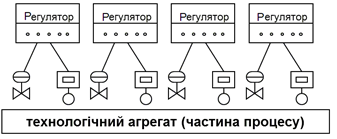
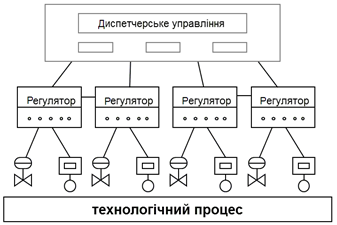
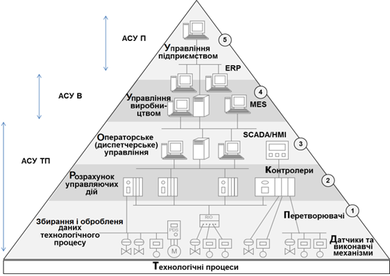

[1.1](1_1.md). Основні поняття і визначення <--- [Зміст](README.md) --> [1.3](1_3.md). Види забезпечень сучасних систем автоматизації

## 1.2. Принципи побудови сучасних систем автоматизації

Сучасна АСУТП являє собою багаторівневу людино-машинну систему управління. Створення АСУ складними технологічними процесами здійснюється з використанням автоматичних інформаційних систем збирання даних і обчислювальних комплексів, які постійно, в міру еволюції технічних засобів і програмного забезпечення, вдосконалюються.

Безперервну в часі картину розвитку АСУТП можна поділити на три етапи, зумовлені появою якісно нових наукових ідей і технічних засобів. У ході історії змінюється характер об'єктів і методів управління, засобів автоматизації й інших компонентів, що становлять зміст сучасної системи управління.

Рис. 1.1. Приклад структури САР

Перший етап відбиває впровадження систем автоматичного регулювання (САР). Об'єктами управління на цьому етапі є окремі технологічні змінні (параметри), установки, агрегати (рис.1.1). Рішення завдань стабілізації, програмного управління, спостереження переходить від людини до САР. У людини з'являються функції розрахунку завдання й параметрів настроювання регуляторів. САР реалізуються як окремі локальні регулятори, пов’язані з об’єктом через датчики та виконавчі механізми. Зв’язок з оператором відбувається через вбудовані в регулятори засоби індикації та управління.

Другий етап – автоматизація технологічних процесів. Об'єктом управління стає розосереджена в просторі система (рис.1.2). 

Рис. 1.2. Приклад структури САУ

За допомогою систем автоматичного управління (САУ) реалізуються усе складніші закони управління, вирішуються завдання оптимального й адаптивного управління, проводиться ідентифікація об'єкта й стану системи. Характерною рисою цього етапу є впровадження систем телемеханіки в управління технологічними процесами. Людина все більше віддаляється від об'єкта управління, між об'єктом і диспетчером вибудовується цілий ряд вимірювальних систем, виконавчих механізмів, засобів телемеханіки, мнемосхем та інших засобів відображення інформації (ЗВІ).

Третій етап – автоматизація систем управління технологічними процесами – характеризується впровадженням у процес управління технологічними процесами обчислювальної техніки. Спочатку – застосування мікропроцесорів, використання на окремих фазах управління обчислювальних систем, потім – активний розвиток людино-машинних систем управління, інженерної психології, методів і моделей дослідження операцій і, нарешті, – диспетчерське управління на основі автоматичних інформаційних систем збирання даних і сучасних обчислювальних комплексів.

Від етапу до етапу змінюються й функції людини (оператора-технолога), покликаного забезпечити регламентне функціонування технологічного процесу. Розширюється коло завдань, розв'язуваних нею на рівні керування. Обмежений можливостями керування технологічним процесом, набір завдань управління поповнюється якісно новими завданнями, що раніше мали допоміжний характер або призначались для іншого рівня управління.

Диспетчер у багаторівневій автоматизованій системі керування технологічними процесами одержує інформацію з монітора ЕОМ або з електронної системи відображення інформації та впливає на об'єкти, що перебувають від нього на значній відстані, за допомогою телекомунікаційних систем, контролерів, інтелектуальних виконавчих механізмів.

Основною, необхідною, умовою ефективної реалізації диспетчерського керування, що має яскраво виражений динамічний характер, стає робота з інформацією, тобто процес збирання, передачі, оброблення, відображення, подання інформації.

Від оператора-технолога вже потрібно не тільки професійне знання технологічного процесу, основ управління, й досвід роботи в інформаційних системах, уміння приймати рішення
 (в діалозі з ЕОМ) у позаштатних і аварійних ситуаціях і багато чого іншого. Оператор стає головною діючою особою в управлінні технологічним процесом.

Говорячи про участь людини в системі управління, не можна не торкнутися проблеми технологічного ризику. Технологічні процеси в окремих видах харчової промисловості, енергетиці, нафтогазовій галузі та інших є потенційно небезпечними й при виникненні аварій призводять до людських жертв, а також до значного матеріального й екологічному збитку.

Статистика говорить, що за останні тридцять років кількість врахованих аварій подвоювалося приблизно кожні десять років. В результаті аналізу більшості аварій і подій на всіх видах транспорту, у промисловості й енергетиці було отримано вражаючі дані. Якщо в 60-х роках помилка людини була первісною причиною аварій лише в 20 % випадків, то зараз  частка «людського фактора» стала наближатися до 80 %. Одна з причин цієї тенденції – старий, традиційний підхід до побудови складних систем керування, тобто орієнтація на застосування новітніх технічних і технологічних досягнень і недооцінка необхідності побудови ефективного людино-машинного інтерфейсу, орієнтованого на людину (оператора). Таким чином, вимога підвищення надійності систем диспетчерського керування є однією з передумов появи нового підходу при розробленні таких систем. Основа сучасного підходу – орієнтація на оператора-технолога і його завдання.

Саме тому активно впроваджуються інтелектуальні підсистеми прийняття рішення, які повинні підвищити ефективність і своєчасність прийняття відповідних управлінських рішень оператором-технологом.

Сучасні системи автоматизації є інтегрованими, оскільки включають у себе взаємопов’язані різні за функціями та рівнями управління підсистеми (рис.1.3). На нижньому (першому) рівні управління в основному збираються та обробляються дані та реалізується управління технологічним процесом. Найпростіші функції автоматичного управління, які раніше виконувалися в САР, також можуть бути реалізовані вже на цьому рівні в інтелектуальних засобах автоматизації. Тим не менше, на основі отриманої інформації, автоматичний розрахунок управляючих дій для технологічного процесу проводиться на другому рівні управління. Контроль за станом технологічного процесу людиною проводиться на рівні диспетчерського управління.

Рис. 1.3. Приклад архітектури сучасної інтегрованої автоматизованої системи управління підприємством (ІАСУ)

Функції перших трьох рівнів реалізовуються системами АСУТП і забезпечують оптимальне протікання технологічного процесу. Однак для ефективної роботи всього виробництва необхідна узгоджена робота всіх ділянок технологічного процесу, що можливо тільки при скоординованій роботі всіх АСУТП. Для цього використовуються системи управління виробництвом (АСУВ), які також слугують зв’язувальною ланкою між АСУТП та АСУП.

Крім активного розвитку автоматизованих систем управління технологічними процесами, активно впроваджувались **а*втоматизовані системи управління підприємством (АСУП),*** які орієнтовані на вирішення завдань автоматизації управлінською і фінансово-господарською діяльністю, а також на планування ресурсів підприємства.

[1.1](1_1.md). Основні поняття і визначення <--- [Зміст](README.md) --> [1.3](1_3.md). Види забезпечень сучасних систем автоматизації
