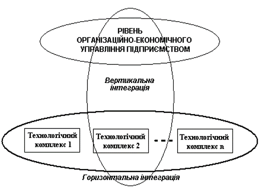
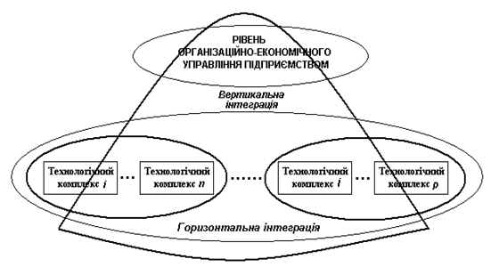

[1.3](1_3.md). Види забезпечень сучасних систем автоматизації <--- [Зміст](README.md) --> [Розділ 2](2.md) Автоматизований контроль технологічних параметрів 

## 1.4. Інтегровані автоматизовані системи управління

Однією з ознак початку нового етапу розвитку систем автоматизації промислових підприємств є пошук шляхів інтеграції двох систем автоматизації – АСУП і АСУТП, які до останнього часу розвивались відокремлено і незалежно одна від одної. Це призвело до появи ***інтегрованих автоматизованих систем управління (ІАСУ).***

Головною метою інтеграції різних підсистем на виробництві є створення єдиного інформаційного простору підприємства для об’єктивної і оперативної оцінки стану підприємства, оперативного прийняття своєчасних і ефективних управлінських рішень, а також ліквідації інформаційних та організаційних перешкод між управлінським та технологічним рівнями.

Економічною основою інтеграції є прагнення керівників підприємств шукати реальні додаткові джерела підвищення економічної ефективності діяльності підприємства. На кожному підприємстві такі джерела існують, треба тільки вміти їх знайти, а для цього необхідно забезпечити збирання, оброблення і аналіз інформації оперативних даних з усіх технологічних і виробничих ділянок виробництва. Саме оперативної, а не в кінці зміни, робочого дня або місяця. Для того щоб керувати собівартістю продукції, треба, поряд з інформацією про вартість сировини і робочої сили, знати, скільки сировини, електроенергії, пари, води і палива витрачено на виготовлення кінцевої продукції. Для харчової промисловості це дуже важливо, тому що частка вартості сировини в собівартості продукції є досить високою, а основні технологічні процеси потребують використання великої кількості енергоресурсів. Інтеграція АСУП і АСУТП може дозволити реалізувати поточне та оперативне планування витрат і собівартості, а також забезпечувати їх розрахунок у реальному часі одночасно зі змінами темпу виробництва, миттєво реагуючи на відхилення від заданого рівня. На базі поточної інформації із АСУТП можна реалізувати цільове управління з такими показниками:

- якість продукції і підтримання необхідних споживчих властивостей продукції;

- енергозбереження та економія ресурсів;

- підтримання заданої продуктивності.

Технічною передумовою інтеграції систем управління є широке впровадження на виробництві комп’ютерної і мікропроцесорної техніки, а також сучасних інформаційних технологій. Проте не завжди ці процеси реалізовувалися в межах чітко визначеної стратегії розвитку систем управління. Частіше ці завдання вирішувалися локально, тому при пошуку шляхів їхньої інтеграції можуть виникнути певні труднощі. Саме тому процес інтеграції систем управління може відбуватися або в умовах, коли на підприємстві вже функціонують окремі системи автоматизованого управління і необхідно визначити шляхи їхньої взаємодії, або в умовах, коли вирішення цього завдання тільки планується. І в тому і в іншому випадку при вирішенні питання практичної реалізації інтегрованої системи управління конкретним виробництвом необхідно чітко визначити мету інтеграції, а також проаналізувати сучасний стан організаційного, функціонального, технічного та програмного забезпечення існуючих на виробництві АСУП і АСУТП. 
 Це дасть можливість визначити чітку стратегію розвитку систем управління виробництвом і уникнути невиправданих матеріальних втрат від прийняття необґрунтованих і неузгоджених рішень.

Є два типи інтеграції – горизонтальна і вертикальна.

Однією з основних функцій ***горизонтальної інтеграції*** є забезпечення інформаційної взаємодії між існуючими автономними підсистемами технологічного рівня. З технічної точки зору, горизонтальна інтеграція передбачає об’єднання між собою всіх автономних систем автоматизації технологічних і виробничих процесів, а також адміністративних відділень цехового рівня в єдину інформаційну мережу. Це забезпечує необхідний обмін даними в реальному масштабі часу між усіма підрозділами основного і додаткового виробництва. З виробничої точки зору, це означає облік кожного кроку виробничого процесу від прибуття сировини до отримання готової продукції. Завдяки цьому можна координувати роботу окремих технологічних ділянок з метою поліпшення ритмічності виробництва, зменшення втрат, підвищення якості готової продукції та зменшення собівартості.

Але вирішення завдань горизонтальної інтеграції не означає, що в кожний момент часу вся виробнича система функціонуватиме з максимальною ефективністю. Це завдання повинна вирішити вертикальна інтеграція.

***Вертикальна інтеграція*** призначена для передачі технологічних даних на рівень бізнес-додатків і ґрунтується на організації потоків інформації від нижнього рівня (датчиків і контролерів технологічного обладнання) у внутрішні і зовнішні комп’ютерні мережі підприємства і через них – в адміністративні мережі. Крім того, й на рівні організаційно-економічного управління також необхідно передбачити горизонтальну інтеграцію між автономними підсистемами цього рівня. Це можуть бути задачі постачання сировиною і необхідними матеріалами основного виробництва, планування збуту, рівномірного завантаження різних ділянок виробництва, планування проведення поточного ремонту та ін. Наприклад, при цеховій структурі виробництва, коли кожен з цехів працює на одній основній сировині (наприклад, молокозавод), узгоджувати роботу окремих цехів слід не тільки на основі технологічних можливостей виробництва, а й з урахуванням прогнозованих економічних показників. А для того щоб їх прорахувати, необхідна інформація з різних підрозділів організаційно-економічного рівня управління.

При цьому ступінь важливості того чи іншого виду інтеграції може залежати від типу виробництва. Наприклад, для цукрових заводів ми маємо неперервний технологічний процес, який умовно (для полегшення оперативного управління) поділений на ряд технологічних відділень. Кожне технологічне відділення має свою систему управління технологічним процесом. Задача координації (горизонтальна інтеграція) вирішує в основному задачу стабілізації матеріальних потоків, щоб забезпечити ритмічність роботи всього технологічного комплексу заводу, зменшити втрати та зекономити енергоресурси.

Для такого типу виробництва це є головним типом інтеграції (рис.1.4), яка визначає ефективність роботи підприємства в цілому. Вертикальна інтеграція в основному забезпечує подання невеликої кількості технологічної інформації, необхідних для розрахунку економічних показників. Зворотній зв’язок підсистеми планування на рівень технологічного управління невеликий і здійснюється в основному в момент виникнення критичних ситуацій, наприклад, при необхідності скоригувати продуктивність заводу залежно від запасів сировини або допоміжних матеріалів.

Рис. 1.4. Організаційна структура інтегрованої системи управління для  виробництв з єдиною підсистемою горизонтальної інтеграції

Іншим може бути навантаження на різні типи інтеграції на харчових виробництвах, які використовують одну основну сировину, але мають широку номенклатуру готової продукції, перелік якої може постійно змінюватися. Це, наприклад, молокозаводи, хлібокомбінати, м’ясопереробні заводи та ін. Для цих типів виробництв характерною ознакою є те, що готова продукція має обмежений термін використання, а її кількість і номенклатура повинні відповідати замовленню торговельної мережі. У цьому випадку завдання горизонтальної інтеграції можуть складатися з окремих підсистем (рис.1.5) у яких рівень узгодження між окремими системами управління технологічними комплексами, які входять до неї, досить високий, а рівень координації між роботою окремих цехів на технологічному рівні обмежений. При цьому важливість вертикальної інтеграції значно зростає. Це пояснюється тим, що, виходячи зі стратегічних завдань виробництва, для прийняття ефективних управлінських рішень технологічної інформації необхідно широко використовувати прогнозовані економічні показники від прийнятих рішень.

Рис. 1.5. Організаційна структура інтегрованої системи управління для виробництв з розподіленою підсистемою горизонтальної інтеграції

Основним завданням інтегрованих систем є узгодженість рішень на різних рівнях управління, для чого необхідно визначити та сформувати комплекс завдань управління як завдань оптимізації за деяким загальним для системи критерієм ефективності функціонування з використанням економіко-математичних моделей управління.

Дані, які надходять з технологічного рівня, відрізняються тим, що вони дуже швидко змінюються в часі (порівняно з бізнес-параметрами) і тому їх обсяг, який ми отримуємо за одиницю часу дуже великий. З цього випливає те, що підсистема, яка інтегрує технологічні дані, повинна забезпечити швидкісне збирання даних, їх стискування і підготовку до передачі на рівень бізнес-додатків або **ERP**-систем (Enterprise Recourse Planning) (див. рис.1.3).

Оскільки основною метою вертикальної інтеграції є передача технологічної інформації на рівень бізнес-додатків, то на цьому рівні забезпечується зберігання технологічної інформації, достатньої для формування даних, які відображають динаміку і послідовність технологічного процесу виробництва продукту із сировини. Програмне забезпечення, орієнтоване на вирішення таких завдань, належить до класу **MES** (Manufacturing Executive Systems), або систем управління виробництвом (див. рис.1.3). Крім того, вирішуються завдання з формування даних, які відображають структуру і стан активів (фондів) виробництва, за допомогою яких реалізується технологічний процес. Програмне забезпечення, яке орієнтоване на відслідковування і супровід основних фондів виробництва, належить до класу **EAM** (Enterprise Assets Management) систем.

Таким чином, сучасні системи автоматизованого управління виробництвом переходять на технологічно і технічно новий рівень, що потребує від усіх учасників виробництва уміння працювати в цих умовах. При цьому значно зростають вимоги до рівня обізнаності в сучасних можливостях автоматизованих систем управління технологів, які повинні вміти формувати вимоги до організаційного, інформаційного і технічного забезпечення всіх рівнів управління. Саме від правильної постановки завдань на розроблення систем управління, вибору відповідних критеріїв управління залежить ефективність цих систем і отримання високої якості готової продукції та зменшення її собівартості за рахунок економної витрати сировини і енергоресурсів.

[1.3](1_3.md). Види забезпечень сучасних систем автоматизації <--- [Зміст](README.md) --> [Розділ 2](2.md) Автоматизований контроль технологічних параметрів 