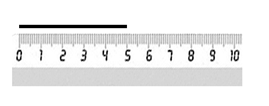
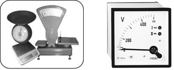

[Розділ 2](2.md) Автоматизований контроль технологічних параметрів  <--- [Зміст](README.md) --> [2.2](2_2.md). Засоби вимірювання

## 2.1. Основи метрології 

Вимірювання в житті людини відіграє важливе значення і є одним із шляхів пізнання природи. Воно дає як якісні, так і кількісні характеристики навколишнього світу, явищ і розкриває людині діючі в природі закономірності. 

Вимірювання – це процес порівняння практичним шляхом вимірюваної величини з іншою, подібною до неї, прийнятою за одиницю. При будь-якому вимірюванні за допомогою експерименту фізична величина визначається у вигляді деякого числа, прийнятного для неї, за одиницю.

Галузь науки, яка вивчає вимірювання, називається метрологією. Слово “метрологія” утворено з двох грецьких слів: **метрон** - міра і **логос** - наука. Дослівний переклад слова метрологія – наука про міри.

Тривалий час метрологія залишалася наукою, яка описувала міри та співвідношення між ними. Проте з розвитком науки і техніки метрологія одержала суттєвий розвиток, оскільки час потребує забезпечення єдності і точності вимірювань.

***Метрологія*** в її сьогоднішньому розумінні - наука про вимірювання, методи і засоби забезпечення їхньої єдності, а також способи досягнення необхідної точності.

***Єдність вимірювань*** - такий стан вимірювань, при якому їхні результати вираженні в узаконених одиницях, а похибки вимірювань відомі з заданою ймовірністю. Єдність вимірювань необхідна для того, щоб можна було порівняти результати вимірювань, які проведені в різних місцях, у різний час, різними методами і засобами вимірювань.

***Точність вимірювань*** характеризується близькістю їхніх результатів до істинного значення вимірюваної величини.

Таким чином, головним завданням метрології є забезпечення єдності і необхідної точності вимірювання. У більшості держав світу заходи по забезпеченню цього завдання встановлені законодавством. 

Вимірювання є важливим поняттям у метрології. Це організована дія людини, при якій пізнаються кількісні властивості фізичного об’єкта шляхом визначення певних фізичних величин.

***Вимірюванням*** називається визначення значення фізичної величини дослідним шляхом за допомогою спеціальних технічних засобів. Вимірювання будь-якої фізичної величини полягає в порівнянні її з іншою однорідною величиною, умовно прийнятою за одиницю вимірювання. Отже, результат вимірювання *q* показує числове співвідношення між вимірюваною величиною *Q* і одиницею вимірювання *U*:

*Q = q* *×* *U*                     (2.1)

Рівняння (2.1) є основним рівнянням вимірювання, права частина якого називається результатом вимірювання у відповідних одиницях вимірюваної фізичної величини. 

Фізична величина - загальна властивість для різних фізичних об’єктів, але в кількісному відношенні вона індивідуальна. Так, температура, тиск і рівень як фізичні величини в якісному відношенні загальні, проте в кількісному - для різних об’єктів різні. Наприклад, температура та тиск для різних корпусів випарної установки - різні.

За способом одержання результатів вимірювання поділяються на прямі, опосередковані, сукупні та сумісні.

***Прямі*** - це вимірювання, при яких шукана вимірювана величина знаходиться безпосередньо з експериментальних даних. Наприклад: вимірювання довжини – метром, тиску - манометром, температури - термометром (рис. 2.1).

***Опосередковані*** - це вимірювання, при яких шукана величина визначається за допомогою відомих залежностей між цією величиною і величинами, які визначаються прямими вимірюваннями. Наприклад: визначення густини тіла при прямих вимірах маси і об’єму (r ***=*** *m **/*** u); об’єму резервуара – за прямими вимірами висоти і площі основи резервуара (u *= h* *×* *s*).

***Сукупні*** - такі вимірювання, коли одночасно проводяться прямі вимірювання декількох однойменних величин, а шукана величина знаходиться рішенням системи рівнянь. Наприклад, визначення коефіцієнта лінійного розширення.

Рис. 2.1. Пряме вимірювання довжини за допомогою лінійки 

***Сумісні*** - такі вимірювання, коли одночасно проводиться вимірювання кількох неоднорідних величин для встановлення залежності між ними. Наприклад, залежність термоелектрорушійної сили (**ТЕРС)** термопари від температури ($E = f ( t )$ ).

**Методи вимірювання.** В основу будь-якого вимірювання фізичної величини покладено певний спосіб, принцип і засіб вимірювання. Загальне використання способів, принципів і засобів вимірювання при вимірюванні багатьох фізичних величин називаються **методами** вимірювання.

***Принцип вимірювання*** - це фізичне явище або ж сукупність фізичних явищ, які покладені в основу вимірювання. Наприклад, вимірювання температури – за допомогою термоелектричного ефекту або зміни опору електричного термометра; вимірювання тиску – за допомогою пружних деформацій та ін..

Найбільше використовуються такі методи вимірювання: безпосереднього вимірювання, порівняння з мірою, протиставлення, нульовий (компенсаційний), диференційний, заміщення та ін.

Найпростішим методом є ***метод безпосереднього вимірювання***, який полягає в тому, що визначення вимірюваної величини проводиться безпосередньо по шкалі вимірювального приладу прямої дії. Наприклад, зважування на циферблатних вагах, вимірювання напруги за шкалою вольтметра (рис. 2.2).

Рис. 2.2. Приклади безпосереднього методу вимірювання

***Нульовий*** **(*компенсаційний***) метод полягає в тому, що на вимірювальний прилад одночасно подається вимірювана величина і зрівноважуюча однорідна величина, а результуючий ефект доводиться до нуля. Наприклад, зважування на гирьових вагах. Компенсаційний метод використовується в автоматичних потенціометрах та мостах. Метод дає високу точність вимірювання і не залежить від зовнішніх умов (рис. 2.3).

Рис. 2.3. Приклад нульового (компенсаційного методу вимірювання)

***Диференційний*** метод полягає в тому, що на вимірювальний прилад подається безпосередньо різниця між вимірюваною величиною і відомою величиною, відтвореної мірою. Цей метод використовується в тих випадках, коли просто і точно реалізується операція віднімання величин, наприклад, різниця тисків.

**Міжнародна система одиниць (СІ).** Наявність великої кількості систем одиниць фізичних величин, а також значної кількості позасистемних одиниць призвело до значних незручностей при переході з однієї системи одиниць на іншу. Все це потребувало     якнайшвидшої уніфікації одиниць вимірювання.

Виникла необхідність у єдиній системі одиниць фізичних величин, яка була б зручною для практичних вимірювань і охоплювала б різні сфери вимірювання.

У 1954 р. Х Генеральна конференція з мір і ваги установила шість основних одиниць (метр, кілограм, секунда, ампер, градус Кельвіна і кандела) практичної системи одиниць для міжнародних відношень. На цей час членами Метричної конвенції стали близько 40 найбільш розвинутих держав. Одночасно Міжнародний комітет мір і ваги утворив комісію по розробленню єдиної Міжнародної системи одиниць. Система одержала назву Міжнародної системи одиниць, скорочено СІ (SI - початкові літери від французької назви Systeme International).

У 1954 р. Х Генеральна конференція з мір і ваги затвердила основні одиниці Міжнародної системи одиниць, які повинні охопити всі сфери науки і техніки, скласти основу для утворення похідних одиниць, бути зручними для практичних вимірювань і відтворюватися за допомогою установок і еталонів з найбільшою точністю.

У 1971 р. XIV Генеральна конференція з мір і ваги прийняла сьому основну одиницю СІ - одиницю кількості речовини - моль.

Основні та додаткові одиниці СІ зі скороченими позначеннями українською та латинською буквами наведені в табл. 2.1.

Таблиця 2.1 Основні одиниці СІ

**Похибки вимірювання фізичних величин.** При вимірюванні фізичних величин слід чітко розмежовувати два поняття: істинні значення фізичних величин та їхні емпіричні прояви - результати вимірювань.

***Істинне значення фізичної величини Q*** - це значення, яке ідеально відображає властивості об’єкта як у кількісному, так і якісному відношеннях. Істинні значення не залежать від засобів нашого пізнання і являють собою ту абсолютну істину, до якої наближається спостерігач, намагаючись виразити їх у вигляді числового значення. 

***Результат вимірювання Х*** є продуктом пізнання спостерігачем властивостей об’єкта і являє собою приблизну оцінку значення вимірюваної величини. Результати залежать від методів вимірювання, технічних засобів, властивостей органів чуття спостерігача та самих фізичних величин.

Причинами виникнення похибок вимірювання можуть бути недосконалість методів вимірювання, технічних засобів, органів чуття спостерігача, зміна умов проведення експерименту та зовнішнього середовища. Так, зміна умов проведення експерименту впливає на фізичну величину, технічні засоби і спостерігача.

Кожна з наведених причин виникнення похибок є джерелом численних чинників, під впливом яких формується загальна похибка вимірювань. Їх можна об’єднати в дві великі групи.

1) Чинники, які з’являються нерегулярно і несподівано зникають або проявляються з непередбачуваною інтенсивністю. До них належать технічні несправності приладів, зміна зовнішніх умов і середовища, зміна уваги спостерігача тощо. Похибки вимірювань, які виникають під дією цих чинників, називається ***випадковими*.**

Проте деякі з них настільки сильно проявляються, що похибка виходить за допустимі межі. Наприклад, зміна напруги в мережі електроживлення. Такі похибки в складі випадкових похибок називаються ***грубими***. До них приєднуються і ***промахи*** - похибки, які залежать від спостерігача, його стану, помилок підрахунку по шкалі приладу та запису результатів вимірювань. 

2) Чинники постійні або які закономірно змінюються в процесі вимірювань фізичної величини. До них належать методичні похибки, припущені спостерігачем при вимірюванні, а також зміна характеристик вимірювального приладу, наприклад зміщення стрілки приладу, зміна характеристик пружних елементів засобу вимірювання і т. ін. Складові сумарної похибки, які з’являються під дією чинників другої групи, називаються ***систематичними*** похибками вимірювань. Їхня особливість полягає в тому, що вони або постійні за величиною, або ж закономірно змінюються при повторних вимірюваннях однієї й тієї самої величини.

Таким чином, у процесі вимірювання фізичної величини під дією численних чинників проявляються як випадкові d, так і систематичні θ похибки вимірювань, які дають похибку вимірювання *Δ*:

Δ *=* d + θ                   (2.2)

Для одержання точних результатів вимірювань, які  мінімально відрізнялися б від істинного значення, необхідно провести численні вимірювання з наступним математичним обробленням експериментальних даних.

Систематичні похибки θ, як правило, визначають і виключають з результатів вимірювання; як результат – отримують відкориговані результати вимірювань $\overline X$  Випадкова похибка при цьому дорівнює різниці між відкоригованим результатом вимірювання та істинним значенням вимірюваної величини.

$$
\delta = \overline X - Q \tag {2.3}
$$

При виключенні систематичної похибки результат вимірювання складається з відкоригованого значення вимірюваної величини і випадкової похибки, а сам результат стає випадковою величиною.

[Розділ 2](2.md) Автоматизований контроль технологічних параметрів  <--- [Зміст](README.md) --> [2.2](2_2.md). Засоби вимірювання