[2.3](2_3.md). Державна система приладів та засобів автоматизації <--- [Зміст](README.md) --> [2.5](2_5.md). Методи та засоби вимірювання температури.

## 2.4. Методи та засоби вимірювання тиску. 

### 2.4.1. Загальні положення

Тиск є одним із найважливіших параметрів технологічних і теплових процесів, який характеризує внутрішню енергію середовища та стан обладнання. Від величини тиску суттєво залежать режим і якість протікання технологічного процесу, тому виникає необхідність своєчасно контролювати і регулювати величину цього параметра.

Тиском називається сила, яка рівномірно й нормально діє на площу. За одиницю тиску в Міжнародній системі одиниць СІ прийнято Паскаль (Па) – тиск, за якого рівномірно й нормально діє сила в 1 Ньютон на площу 1 м2.

Окрім того, на практиці використовуються і позасистемні одиниці:

- технічна атмосфера (**ат**), 1 ат = 1 кгс/см2 = 98066,5 Па (≈ 100 кПа);

- міліметр ртутного стовпа (**мм. рт. ст.**), 760 мм рт. ст. ≈ 1 кгс/см2;

- метр водяного стовпа (**м. в. ст.**), 10 м. в. ст. Н2О ≈ 1 кгс/см2;

- **бар**, 1 бар ≈ 1 ат ≈ 1 кгс/см2 ≈ 100 кПа.

Позначення **кгс (**кілограм-сила, позасистемна одиниця вимірювання сили (не входить в СІ))– це сила, яка надає тілу масою 1 кг прискорення вільного падіння.

На практиці тиск можуть вимірювати відносно двох різних точок: абсолютного нуля (вакууму), або атмосферного (барометричного) тиску (рис. 2.4).

 Рис. 2.4. Види вимірюваних тисків

**Абсолютним тиском Ра** називають повний тиск, який створює рідина чи газ, виміряний відносно абсолютного нуля (повного вакууму).

**Барометричним (атмосферним) тиском Рб** називають абсолютний тиск, який створює маса повітряного стовпа атмосфери. Значення вимірюваного атмосферного тиску залежить від природних умов та висоти над рівнем моря.

**Надлишковим тиском Рн** називають різницю між абсолютним тиском, який вищий від атмосферного, і барометричним тиском:

*Р*н = *Р*а – *Р*б .                 (2.8)

**Вакуумметричним Рв** **тиском** називають різницю між барометричним і абсолютним тиском, який є меншим за атмосферний:

*Р*в = *Р*б – *Р*а.                                   (2.9) 

Надлишковий і вакуумметричний тиск вимірюється відносно атмосферного тиску.

Якщо вимірюється різниця тисків, один з яких не є атмосферним, то кажуть про ***диференціальний тиск*** (див. рис. 2.4) 

*Р*д = *Р*2 – *Р*1.                 (2.10)

За видом вимірюваної величини прилади для вимірювання тиску класифікують як:

- ***манометри*** – для вимірювання абсолютного і надлишкового тиску (0,06 – 1000 МПа);

- ***вакуумметри*** – для вимірювання вакуумметричного тиску (розрідження) (до мінус 100 кПа);

- ***мановакуумметри*** – для вимірювання надлишкового і вакуумметричного тиску;

- ***тягоміри*** – для вимірювання малого вакуумметричного тиску (до мінус 40 кПа);

- ***напороміри*** – для вимірювання малого надлишкового тиску (до 40 кПа);

- ***тягонапороміри*** – для вимірювання малого вакуумметрич-ного і надлишкового тиску (до ± 20 кПа);

- ***барометри*** – для вимірювання барометричного тиску атмосферного повітря;

- ***диференційні манометри*** – для вимірювання різниці двох тисків.

За принципом дії розрізняють рідинні, деформаційні та електричні прилади. 

### 2.4.2. Рідинні прилади вимірювання тиску 

Принцип дії рідинних приладів ґрунтується на зрівноваженні вимірюваного тиску або різниці тисків стовпом рідини. Залежно від величини вимірюваного тиску чи вакууму застосовують такі рідини, як вода, спирт, ртуть і мінеральні масла.

На рис. 2.5 наведений рідинний манометр, який складається з U-подібної скляної трубки *1* діаметром 5–10 мм, заповненої до половини висоти робочою рідиною *3,* і шкали *2*. При вимірюванні надлишкового тиску система знаходиться в рівновазі, коли гідростатичний тиск зв’язаного з атмосферою коліна (*P*б) зрівноважить вимірюваний (*Р*а), що діє на друге коліно трубки приладу:

$$
P_a = P_б + rgH \tag{2.11}
$$

де  *H* –  різниця рівнів рідини в трубках, м;  r – густина рідини, $кг/м^3$; *g* – прискорення вільного падіння, м/с

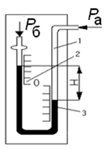

Рис. 2.5. Двотрубні прилади тиску

Таким чином, надлишковий тиск пропорційний різниці висот гідростатичних стовпів рідини у двотрубному манометрі:

$$
\Delta P= P_а-P_б = \rho g H \tag{2.12}
$$

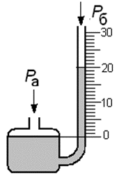

Рис. 2.6.Чашкові манометри

Для вимірювання диференціального тиску обидві трубки підключають до вимірюваного середовища.

Недоліком двотрубних приладів є подвійна похибка підрахунку за шкалою. Усунути цей недолік можна використовуючи конструкцію рідинного манометра з чашкою (рис. 2.6). Оскільки переріз чашки значно більший за переріз трубки, деякою зміною рівня в чашці можна знехтувати.

Перевага рідинних приладів полягає в їхній простоті, низькій вартості, високій точності, надійності та наочності. Одним з недоліків рідинних манометрів є складність передачі результатів вимірювання на відстань.

Рідинні манометри використовують в основному в лабораторних умовах для вимірювання невеликих тисків.

### 2.4.3. Деформаційні манометри

Принцип дії деформаційних манометрів полягає у вимірюванні тиску за величиною деформації пружних елементів або за силою, яку вони розвивають.

Вони прості й компактні за конструкцією, надійні в роботі, мають широкий діапазон вимірювання тиску – 0,1¸160 МПа при достатній точності. Деформаційні манометри найбільш поширені в промисловості.

Розрізняють такі чутливі елементи (рис. 2.7): одновиткові (*а*) й багатовиткові трубчасті пружини (*б*), мембрани (*в*), сильфони (*с*).

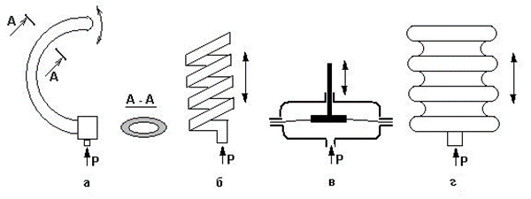

 Рис. 2.7. Чутливі елементи деформаційних манометрів

Трубчасті одновиткові пружини (трубки Бурдона) виготовляють у вигляді С-подібної трубки овального або еліптичного перерізу із зовнішнім (більшим) і внутрішнім (меншим) радіусами, кінці яких співпадають з віссю стрілки приладу (рис.2.8). Площа верхньої внутрішньої поверхні трубки більша від нижньої. Під впливом надлишкового тиску сила, що діє на верхню частину трубки, перевищуватиме силу, що діє на нижню частину. Це приводить до того, що вільний кінець трубчастої пружини змінює своє положення (трубка «розкручується»). На рис. 2.8 показано структуру манометричного термометра і його вигляд усередині манометра.

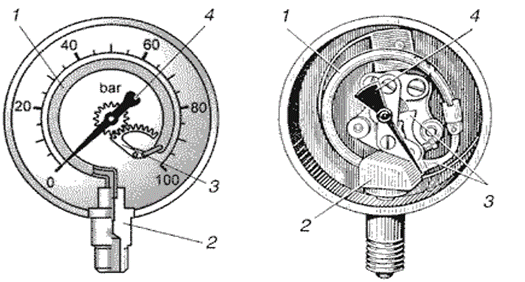

Рис. 2.8. Схема і внутрішній вигляд деформаційного манометра з одновитковою трубчастою пружиною

Конструктивно верхній (вільний) кінець латунної трубки Бурдона *1* запаяний, а нижній (відкритий) – припаяний до штуцера *2*, через який манометр під’єднується до об’єкта, де буде вимірюватися тиск. При збільшенні тиску сила, що діє на верхню частину сплюснутої трубки, збільшується, під дією чого відбувається розкручення пружини. Через важільний механізм *3* переміщення вільного кінця передається на стрілку *4*, яка розташована по центру приладу.

Пружинні манометри широко використовуються в різних сферах вимірювання тиску. Загальний вигляд манометрів показаний на рис. 2.9.

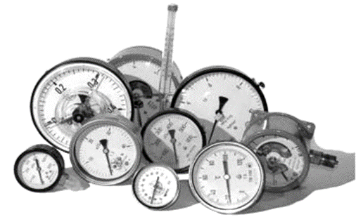

Рис. 2.9. Загальний вигляд деформаційних манометрів  з трубкою Бурдона

Багатовиткова (гелікоїдальна) трубчаста пружина (рис. 2.10) являє собою сукупність великої кількості одновиткових і під дією тиску має сумарний кут розкручення. Тому цей деформаційний елемент  більш чутливий. При зміні тиску пружина розкручується і її переміщення передається на показувальну стрілку.

 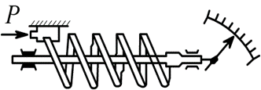

Рис. 2.10. Схема манометра з багатовитковою пружиною

У сильфонних манометрах пружним чутливим елементом є сильфон (рис. 2.11), який являє собою циліндричну тонкостінну судину з кільцевими складками (гофрами). Під дією тиску сильфон стискається або розтягується. Ці зміни передаються на показувальну стрілку.

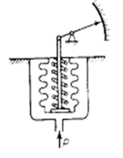

Рис. 2.11. Схема манометра з сильфоном

З мембранних пружних чутливих елементів найбільше значення мають плоскі мембрани з центральним диском і штоком. На рис. 2.12 наведено схему диференціального манометра, чутливим елементом якого є мембранний блок, який складається з двох мембранних коробок *7* і *9*, з’єднаних між собою каналом і розміщених у різних камерах *1* і *2*. Мембранні коробки заповнені дистильованою водою. В нижню камеру через трубку *3* підводиться більший тиск , а у верхню через трубку *8* – нижчий . З центром мембрани верхньої коробки *3* жорстко з’єднане осердя *6* диференціально-трансформаторного перетворювача *4*, що знаходиться під кришкою *5*. Осердя розміщене в середині роздільної трубки з нержавіючої сталі. При підведенні до приладу перепаду тиску  рідина з нижньої мембранної коробки *9*, яка деформується під дією тиску, з’єднувальним каналом видавлюється у верхню коробку *7*, в результаті чого її об’єм збільшиться, верхня мембрана деформується (зміститься вгору) і перемістить плунжер *6*. Диференціально-трансформаторний перетворювач формує електричний сигнал, пропорційний положенню осердя в ньому.

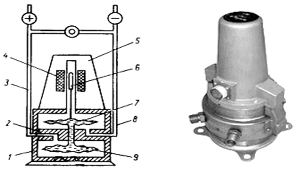

Рис. 2.12. Схема і загальний вигляд мембранного дифманометра 

### 2.4.4. Електричні манометри

Останнім часом все більшої популярності серед приладів для вимірювання тиску набули електричні прилади. Це пояснюється впровадженням нових матеріалів і конструкцій, які дали змогу значно розширити діапазон вимірювання тиску (особливо малих значень) і підвищення їхніх метрологічних характеристик.

Принцип дії електричних пристроїв для вимірювання тиску ґрунтується на перетворенні тиску чи вакууму на електричний параметр, який функціонально пов’язаний з тиском. До цієї групи належать манометри опору, п’єзоелектричні, тензоелектричні та ємнісні пристрої.

**Манометри опору**. Принцип роботи таких приладів ґрунтується на зміні електричного опору провідників під дією зовнішнього надлишкового тиску. Найширше використовують манганін, температурний коефіцієнт опору якого дуже низький. Недоліком його є малий приріст опору на одиницю тиску. Тому за його допомогою вимірюють високий і надвисокий тиск (до 3000 МПа). Для вимірювання опору чутливого елемента використовують мостові схеми.

**П’єзоелектричні манометри**. Принцип дії ґрунтується на властивостях кристалічних речовин накопичувати електричні заряди на поверхні під дією механічної сили (тиску). Це явище називається п’єзоефектом, яке характерне для кристалів кварцу, турмаліну, сегнетової солі, титану, барію та ін. Схему п’єзоелектричного манометра наведено на рис. 2.13.

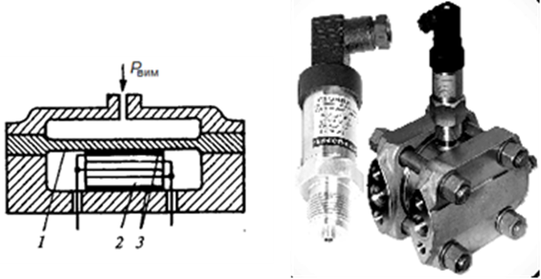

 Рис. 2.13. Схема і загальний вигляд п’єзо-електричних манометра і диференціального манометра

Вимірюваний тиск за допомогою мембрани *1* перетворюється на зусилля, яке стискає кварцові пластинки *2*. Електричний заряд, який виникає на металізованих площинах *3*, відповідає зусиллю *F* з боку мембрани.

Для виготовлення п’єзокристалічних датчиків найбільше використовують кварц, який має безінерційний п’єзоефект, механічну міцність, добрі ізоляційні властивості і не гігроскопічний.
 Його п’єзоефект не залежить від температури до +500 °C.

**Тензорезисторні перетворювачі тиску.** Тензорезисторні чутливі елементи являють собою металеву і (або) діелектричну вимірювальну мембрану *1* (рис. 2.14), на якій розміщуються тензорезистори, з’єднані у схему врівноваженого моста *3* з контактними площинами для підключення до внутрішньої або зовнішньої вимірюваної схеми.

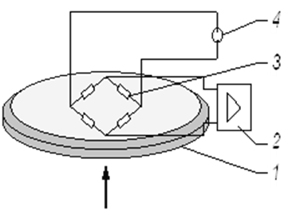

Рис. 2.14. Тензоелектричний перетворювач тиску

Міст живиться від джерела живлення *4*. Деформація мембрани під впливом зовнішнього тиску призводить до деформації і розбалансу тензорезисторного моста, який вимірюється електронним блоком *2*.

Першими електричними приладами для вимірювання тиску були манометри з напівпровідниковими  тензоперетворювачами типу “Кристал”. Поява гетероепіксіальних структур “кремній на сапфірі” КНС дала можливість розробити й впровадити у серійне виробництво тензорезисторні перетворювачі з високими метрологічними властивостями. Промисловістю освоєно випуск приладів із тензоперетворювачами “Сапфір-22” (рис. 2.15) для вимірювання тиску, в яких тиск перетворювався на електричний сигнал (0–5, 4–20, 0–20 мА). Чутливий елемент *1* розміщений у металевому корпусі *2*. Через ніпель *5* підводиться тиск через роздільну мембрану *4* та кремнійорганічну рідину до другої металевої мембрани чутливого елемента. На поверхню пружної мембрани нанесено сапфіровий ізоляційний шар, а на нього – кремнієві тензорезистори *1* із вихідними провідниками до вимірювального блока *3*. Основними позитивними якостями перетворювачів “Сапфір-22” є використання малих деформацій чутливих елементів, надійність, безінерційність, стабільність характеристик, компактність, вібро- та термостійкість. Похибку вимірювання можна знизити до 0,1%.

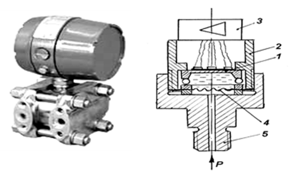

Рис. 2.15. Загальний вигляд і схема тензоперетворювача типу «Сапфір-22»

 **Ємнісні перетворювачі тиску** використовують конструкцію, в якій як чутливий елемент використовується металева мембрана *2* (рис. 2.16), яка створює одну пластину конденсатора і переміщується відносно іншої нерухомої пластини конденсатора *1*, закріпленої на ізоляторі *3*. Коли змінюється тиск, то змінюється положення металевої мембрани *2* і, відповідно, – електрична ємність штучно створеного конденсатора.

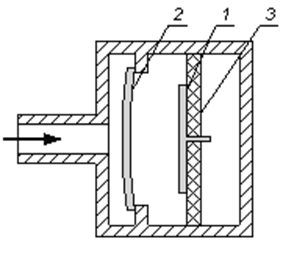

Рис. 2.16. Ємнісний перетворювач тиску

[2.3](2_3.md). Державна система приладів та засобів автоматизації <--- [Зміст](README.md) --> [2.5](2_5.md). Методи та засоби вимірювання температури.