[2.4](2_4.md). Методи та засоби вимірювання тиску. <--- [Зміст](README.md) --> [2.6](2_6.md). Методи та засоби вимірювання кількості та витрати.

## 2.5. Методи та засоби вимірювання температури.

### 2.5.1. Загальні положення 

Температура є одним із основних показників, які визначають стан протікання технологічного процесу і якість продукції. Температура характеризує ступінь нагрітості тіла і визначається кількістю внутрішньої кінетичної енергії теплового руху молекул. При контакті двох тіл теплота від більш нагрітого переходить до менш нагрітого тіла і в результаті теплообміну проходить вирівнювання температури. Виміряти температуру безпосередньо неможливо, тому визначаються певні властивості термометричного тіла, якими можуть бути: об'єм, лінійні розміри, електричний опір, терморушійна сила та ін.

Залежно від принципу дії промислові засоби вимірювання температури розділяються на такі групи з відповідними межами вимірювання (рис. 2.17): термометри розширення (від -200 до +600 °С); манометричні термометри (від -200 до +1000 °С); термометри опору ( від -260 до +1000 °С), термоелектричні термометри (від -270 до +2800 °С), пірометри (від -50 до +3500 °С).

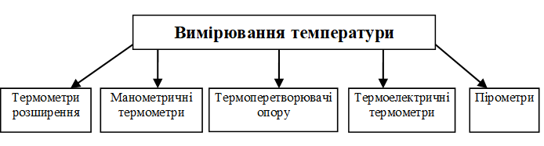

Рис. 2.17. Класифікація приладів для вимірювання температури за принципом дії 

### 2.5.2. Термометри розширення

Принцип дії **термометрів розширення** ґрунтується на розширенні рідин і твердих тіл під впливом температури. Розрізняють рідинні, дилатометричні та біметалеві термометри.

Принцип дії **скляних рідинних термометрів** ґрунтується на тепловому розширенні термометричної рідини, розміщеної в скляному резервуарі, під впливом температури. У скляних термометрах за термометричні рідини використовують ртуть, етиловий спирт, толуол, пентан, гас та інші речовини. 

Основними елементами скляного термометра (рис. 2.18) є скляна оболонка *1*, у якій розташований термобалон з термометричною рідиною *2*, капіляром *3* і пластинкою з нанесеною на неї шкалою *4*. Для захисту від руйнування рідинні термометри розміщують у захисні гільзи. Рідинні скляні термометри розширення завдяки простоті конструкції, малій вартості і досить високій точності вимірювання використовуються в лабораторіях і на виробництві. Основний їх недолік: неможливість передачі показань на відстань, хрупкість, неширокий діапазон вимірювань.

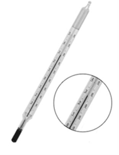

Рис.2.18. Загальний вигляд скляного термометра

За призначенням скляні термометри поділяються на такі групи: зразкові, лабораторні та технічні. Для встановлення скляних термометрів на виробничому обладнанні використовуються спеціальні захисні гільзи.

Принцип дії **біметалевих** **та дилатометричних** термометрів ґрунтується на зміні їхніх лінійних розмірів під впливом температури:

$$
l_t=l_0 \cdot [1+\alpha \cdot (t-t_0) ] \tag {2.13}
$$

де $l_0$ i  $l_t$ - лінійні розміри чутливого елемента при температурі 20 °С та $t$, м; a - середній коефіцієнт лінійного розширення твердого тіла, °С-1; $t_0$ i $t$ - температура градуювання (20 °С) та температура вимірювання, °С.

Чутливий елемент біметалевого термометра (рис. 2.19.) являє собою пружину, яка складається з двох металевих пластин з різним коефіцієнтом лінійного розширення. Оскільки внутрішня пластина *2* має більший коефіцієнт лінійного розширення, ніж зовнішня *1*, при нагріванні така пластина буде випрямлятися. Її переміщення передається на стрілку *3*. Перевагою таких термометрів є простота та надійність. До недоліків можна віднести неможливість передачі показань на відстань.

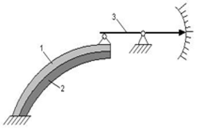

Рис. 2.19. Спрощена схема біметалевого термометра

На рис. 2.20 показано загальний вигляд біметалевого термометра, а на рис. 2.21 - принцип його дії. У термометрі з біметалевою пластиною є закручена по спіралі металева смужка, яка розкручується при нагріванні і обертає стрілку за шкалою, що калібрується. Один з металів (зазвичай це мідь) при нагріванні розширюється сильніше, ніж інший (зазвичай інвар), тому й відбувається розкручування спіралі. Інвар — це сплав заліза і нікелю, що має низький коефіцієнт теплового розширення.

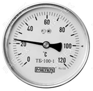

 Рис. 2.20. Загальний вигляд біметалевого термометра

 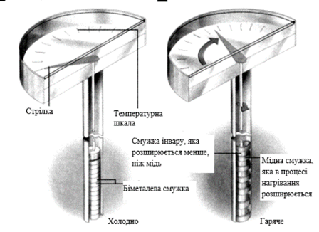

 Рис. 2.21. Принцип роботи біметалевого показуючого термометра

Спрощену схему **дилатометричного термометра** наведено на рис. 2.22. Трубка *1* виготовляється з матеріалу з малим коефіцієнтом лінійного розширення (інвар, кварц), а осердя *2* - з великим (латунь, мідь, алюміній та ін.). Внаслідок різниці коефіцієнтів лінійного розширення при зміні температури осердя переміщується відносно трубки. Переміщення осердя передається на стрілку приладу *3*. Найчастіше дилатометричні термометри використовуються як електроконтактні пристрої в системах управління.

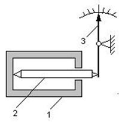

Рис. 2.22. Спрощена схема дилатометричного термометра

Принцип дії **манометричних** **термометрів** ґрунтується на розширенні газів, рідин і парорідинних сумішей від температури. Але це розширення відбувається в замкненому об’ємі, що призводить до зміни тиску в цьому середовищі.

Манометричний термометр (рис. 2.23) складається з термобалона *1*, капілярної трубки *2*, манометричної трубчастої пружини *3*, стрілки приладу *4*, поводка *8*, зубчастого сектора *7*, зубчастого колеса 6 та шкали приладу *5*. 

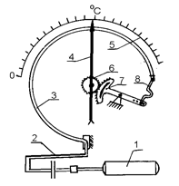

Рис. 2.23. Манометричний термометр

Під впливом температури тиск робочої речовини у термобалоні збільшується і капіляром *2* передається манометричній трубчастій пружині *3*, яка під дією тиску розкручується, вільний її кінець через поводок *8* і зубчасту передачу *6* і *7* переміщує стрілку *4* чи перо приладу по його шкалі *5*. Термобалон виготовляється з корозійностійкої сталі, а капіляр - із сталевої чи мідної трубки Æ 0,15 - 0,5 мм. Загальний вигляд манометричного термометра показано на рис. 2.24. 

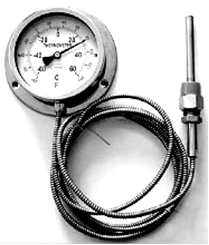

Рис. 2.24. Загальний вигляд манометричного термометра

Замість манометричної трубчастої пружини в деформаційних манометрах використовуються інші чутливі елементи (див. § 2.3). 

Залежно від термометричної речовини манометричні термометри поділяють на газові, рідинні та конденсаційні для різних меж вимірювання температури. Газові та рідинні термометри мають рівномірну шкалу, а конденсаційні - нерівномірну.

Манометричні термометри використовуються для вимірювання температури в інтервалі від -260 до +600 °С. Довжина капілярної трубки замовляється в межах такого ряду: 1;1,6; 2,5; 4; 6; 10; 16; 25 і 40 м.

Манометричні термометри прості, дешеві й надійні в роботі. Їх можна використовувати в пожежонебезпечних приміщеннях. Недоліки: велика інерційність (1,5 - 2 хв.), обмежена дистанційність, великі розміри термобалону, мала ремонтоздатність.

### 2.5.3. Термоелектричні термометри

В основу вимірювання температури **термомоелектричними перетворювачами** (**термопарами**) покладено термоелектричний ефект. Суть його полягає в тому, що в замкненому електричному колі з двох провідників виникає термоелектрорушійна сила (ТЕРС) термопари, яка залежить лише від різниці температур спайок провідників (рис. 2.25).

Термоелектричний ефект пояснюється наявністю вільних електронів у металах електродів, кількість яких в одиниці об'єму для різних металів різна.

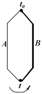

Рис. 2.25. Термопара                

Припустимо, що два провідники *А* і *В* з’єднані між собою у двох спаях. Провідники *А* і *В* називаються термоелектродами. Якщо в провіднику *А* більша кількість вільних електронів, електрони з металу *А* дифундують у метал *В* у більшій кількості, ніж у зворотному напрямі. Електричне поле, яке виникає в місці з'єднання (спайці) двох металів, перешкоджає цій дифузії. При такому стані між провідниками *А* і *В* у місці спаю виникає потенціал, величина якого залежить від температури спаю. Якщо обидва спаї будуть знаходитись при однакових температурах, то різниця потенціалів між ними дорівнюватиме нулю. Якщо температура в них різна, то різниця потенціалів і, відповідно, ТЕРС буде пропорційна різниці температур спаїв. Якщо температуру одного спаю, який будемо називати холодним, підтримувати на рівні 0 оС, то за величиною ТЕРС можна визначити температуру робочого (гарячого) спаю термопари. Таким чином, вимірювана температура визначається безпосередньо по градуювальній таблиці відповідного термоелектричного термометра.

Найбільш поширені два способи підключення термопари до вимірювальних перетворювачів: простий і диференціальний (рис. 2.26). У першому випадку вимірювальний перетворювач підключається безпосередньо до двох термоелектродів. У другому випадку використовуються два провідники з різними коефіцієнтами ТЕРС, спаяні в двох кінцях, а вимірювальний перетворювач включається в розрив одного з провідників.

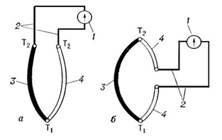

Рис. 2.26. Схеми підключення термопар: *1* – вимірювальний прилад, *2* – з’єднувальні дроти, *3*, *4* – термоелектрони; $Т_1$ і $Т_2$ – температури «гарячого» і «холодного» спаїв

Для дистанційного підключення термопар використовуються подовжувальні або компенсаційні дроти. Подовжувальні дроти виготовляються з того самого матеріалу, що й термоелектроди, але вони можуть мати інший діаметр. Компенсаційні дроти використовуються в основному з термопарами з благородних металів і мають склад, відмінний від складу термоелектродів.

Відповідно до державних стандартів найбільше практичне використання одержали стандартні термоелектричні перетворювачі, термоелектроди яких виготовлені як із чистих матеріалів, так і сплавів: ХК - хромель-копель, ХА - хромель-алюмель, ПП - платинородій-платина та ін.

Статичні характеристики стандартних термоелектричних перетворювачів наведені на рис. 2.27. Різні термоперетворювачі розвивають різні ТЕРС при одній і тій самій температурі і їх градуювальні характеристики індивідуальні для кожного типу. Тому при вимірюванні температури за допомогою термоелектричних перетворювачів необхідно додержуватись відповідних градуювань як для термоперетворювача, так і для вимірювального приладу.

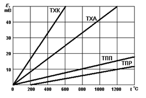

Рис. 2.27. Статичні характеристики стандартних термоелектричних термоперетворювачів

Термопари можуть підключатись до спеціалізованих вторинних приладів: **автоматичного потенціометра** (рис. 2.28) і **магнітоелектричного пірометричного мілівольтметра** (рис. 2.29), шкали яких проградуйовані в °С, або до **нормуючих перетворювачів**, які перетворюють величину ТЕРС в уніфікований електричний сигнал. Крім того, вони можуть бути підключені безпосередньо до спеціалізованих модулів промислових контролерів.

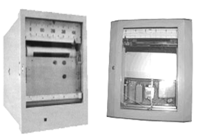

Рис. 2.28. Самописні автоматичні потенціометри

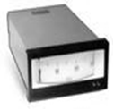

Рис. 2.29. Пірометричний мілівольтметр

Переваги термоелектричних перетворювачів: можливість вимірювати високі значення температури, надійність, широкий діапазон вимірювань, висока точність, можливість передачі сигналу на відстань. 

Основний недолік - суттєвий вплив зміни температури навколишнього середовища, де знаходяться вільні кінці (холодний спай), на точність вимірювання. У зв’язку з цим необхідно виконувати поправку або використовувати для підключення спеціальні компенсувальні проводи. Крім того, слід пам’ятати, що неможливо передавати сигнал ТЕРС на велику відстань за рахунок падіння напруги. У цьому випадку необхідно використовувати нормувальні перетворювачі.

### 2.5.4. Термоперетворювачі опору

Принцип дії **термоперетворювачів** (**термометрів опору**) ґрунтується на зміні електричного опору провідників або напівпровідників під впливом температури й описується рівняннями:

для провідників:   

$$
R_t=R_0(1+\alpha \cdot t) \tag{2.14}
$$

для напівпровідників:   

$$
R_t = K \cdot e^{\beta/t} \tag{2.15}
$$

де $\alpha$ і $\beta$ - коефіцієнти питомого електричного опору провідників і напівпровідників; *К* - константа.

Таким чином, знаючи цю залежність, можна, вимірюючи електричний опір провідників або напівпровідників, судити про температурні умови, в яких вони знаходяться, тобто вимірювати температуру непрямим методом.

Характер залежності $R_t=f(t)$ у провідників та напівпровідників різний: у металів $R_t$ із збільшенням температури зростає, а в напівпровідників - зменшується.

Незважаючи на те, що чутливість напівпровідникових термометрів у 5–10 разів вища, ніж у металевих, вони застосовуються значно рідше. Це зумовлено тим, що їхні характеристики $R_t=f(t)$ істотно нелінійні та мають погане відтворення параметрів. Це ускладнює їхню взаємозамінність.

Найбільше використовують у промисловості металеві термометри опору.

При виборі з великої кількості відомих металів та матеріалів, придатних для виготовлення термометрів опору, керуються такими вимогами.

Матеріали повинні характеризуватись:

- лінійною або близькою до неї залежністю *Rt*=*f*(*t*);

- інертністю до середовища, в якому виконується вимірювання;

- добрим відтворенням властивостей.

Найповніше цим вимогам відповідає мідь і платина. Мідні термометри опору використовуються для вимірювання температур у межах від -50  до +100 °С, платинові - від -250 до +650 °С.

Конструктивно термометри опору являють собою відповідно мідний (діаметром 0,1 мм) або платиновий (діаметром 0,07 мм) дріт (рис.2.30), намотаний на осердя або пластину з ізоляційного матеріалу й поміщений у захисну арматуру. Чутливий елемент *1* розміщений у пористому керамічному циліндрі *2*, заповненому керамічним порошком *3*, який знаходиться в зовнішній захисній трубці-чохлі *4* з нержавіючої сталі. До верхніх кінців спіралі чутливого елемента *1* припаяні виводи *5*, які виходять у головку *7* приладу, де виводи *5* закінчуються клемами *8*, до яких під’єднується кабель, що передає сигнал до вимірювального приладу.

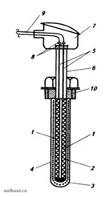

Рис. 2.30. Конструкція термометра опору

Термометр опору закріплюється на об’єкті з використанням різьбової втулки *10*.

У промисловості використовують декілька градуювань (номінальних статичних характеристик НСХ) термометрів опору, в основу яких покладено електричний опір термометра при 0 °С, зокрема:

- для платини: 50П, Pt50, 100П, Pt100, 500П, Pt500, 1000П, Pt1000;

- для міді: 50М, Cu50, 100М, Cu100, 500М, Cu500, 1000M, Cu1000;

- для нікелю: Ni100, Ni1000.

Число в позначенні градуювання (НСХ) вказує на опір термометра при 0 °С, а літери - на матеріал чутливого елемента.

Загальний вигляд термометрів опору показано на рис. 2.31.

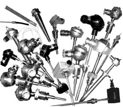

Рис. 2.31.Загальний вигляд термометрів опору

Для відображення та реєстрації значень температури термометри опору працюють у комплекті зі зрівноваженими і неврівноваженими мостами, логометрами та цифровими приладами (рис. 2.32; 2.33). Необхідно пам’ятати, що термометр відповідного градуювання може бути підключений до вторинного приладу тільки того самого градуювання, яке зазначене на його шкалі.

Рис. 2.34. Перетворювач на уніфікований сигнал

Термометри опору можуть мати у своєму складі нормуючий перетворювач, який установлюється в головку термометра опору (рис. 2.34) і перетворює величину опору на уніфікований електричний сигнал. У цьому випадку вони можуть бути підключені до цифрових показувальних і управляючих пристроїв різного призначення: цифрові індикатори, мікропроцесорні регулятори та ін.

Оскільки ці прилади можуть бути використані для підключення всіх  датчиків, які мають уніфікований сигнал, то вони є універсальними (детальніше див. у розділі 5). Термометри опору можуть також під’єднуватись безпосередньо до спеціалізованих модулів промислових контролерів.

Переваги термометрів опору: надійність, широкий діапазон вимірювань, висока точність, можливість передачі сигналу на відстань, простота в роботі.

Недоліки: зміни температури навколишнього середовища на опір лінії зв’язку, які спотворюють значення вимірювального сигналу У зв’язку з цим необхідно виконувати три- і чотирипровідні схеми підключення термометрів опору до вимірювальних схем для врахування опору провідників або використання додаткового джерела живлення датчика, яке вбудоване у показувальні прилади та модулі промислових контролерів.

### 2.5.5. Пірометри випромінювання

***Пірометри*** - це засіб вимірювання температури, в основу роботи якого покладено вимірювання потужності теплового випромінювання об’єкта переважно в діапазонах інфрачервоного спектра і видимого світла. Перевагою пірометрів є безконтактність вимірювання. Але на результати вимірювання впливають багато факторів, які стримують використання пірометрів. Пірометри використовуються для вимірювання великих значень температури і в тих випадках, якщо неможливо використовувати контактних методів вимірювання температури.

Зараз широко використовуються пірометри, дія яких ґрунтується на залежності енергетичної яскравості нагрітого тіла від температури: пірометри повного випромінювання, квазімонохроматичні пірометри, пірометри спектрального відношення та ін.      

Пірометри повного випромінювання (радіаційні пірометри) використовують закон Стефана–Больцмана для абсолютно чорного тіла. Первинний перетворювач пірометра (рис. 2.35) являє собою термочутливий елемент *2*, на який за допомогою спеціальної оптичної системи *1* концентрується променева енергія тіла, температура якого визначається. Як термочутливі елементи широко використовуються мініатюрні батареї, які складаються з послідовно з’єднаних термопар (від 10 до 300). Великого розповсюдження набули інфрачервоневі пірометри (рис.2. 36), принцип дії яких ґрунтується на вимірюванні абсолютного значення амплітуди електромагнітного випромінювання від об’єкта в інфрачервоній частині спектра і наступним перетворенням вимірюваного значення на температуру. 

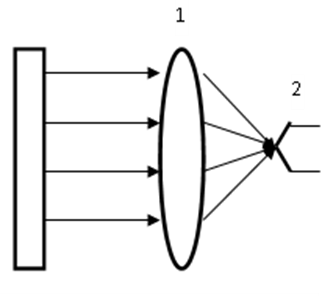

Рис. 2.35. Радіаційний пірометр

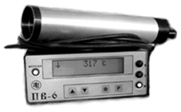

Рис. 2.36. Стаціонарний інфрачервоний пірометр          

У квазімонохроматичних (оптичних) пірометрах мірою температури є енергетична яскравість об’єкта, яка визначається візуально або за допомогою фотоелектричних пристроїв. У цьому пірометрі (рис. 2.37) потік випромінювання нагрітого тіла збирається об’єктивом *1* і проектується на площину нитки розжарювання, яскравість якої можна змінювати реостатом *R*. Відбувається візуальне порівняння кольору нагрітого тіла з кольором нитки розжарювання (еталоном). Вибирають таке положення реостата, при якому яскравість нагрітого тіла і нитки розжарювання стануть однаковими, тобто нитку розжарювання не буде видно (середнє положення).

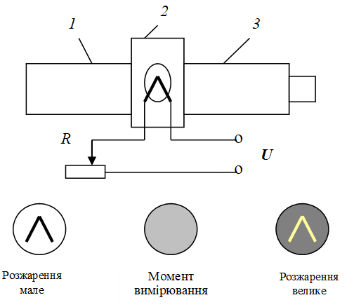

Рис. 2.37. Оптичний пірометр

У пірометрах спектрального відношення температура оцінюється по відношенню яскравостей розжареного тіла в двох вибраних ділянках спектра, наприклад, червоної і синьої. Зі зміною температури змінюватиметься співвідношення яскравості цих випромінювань. У пірометрах спектрального відношення випромінювання від об’єкта вимірювання через об’єктив подається на фотоелемент, перед яким установлений диск, який обертається і в якому встановлені два світофільтри - червоний і синій. Тобто фотоелемент почергово освітлюється або червоним або синім світлом. Імпульси обробляються електронною схемою і перетворюються на значення, яке відповідає значенню температури.

Великої популярності в технологів та теплотехніків набули **портативні пірометри**, які, на відміну від стаціонарних, призначені для вимірювання температури в будь-якій точці (рис. 2.38). Достатньо людині навести вказівник пірометра в потрібну точку вимірювання і на дисплеї висвічується поточна температура. Такі пірометри значно спрощують процес дослідження об’єкта та полегшують налагодження системи.

Переваги пірометрів: вимірювання надвисоких температур, безконтактний метод, можливість вимірювати на відстані.

Недоліки: низька точність, висока ціна, складність, мала ремонтоздатність.

[2.4](2_4.md). Методи та засоби вимірювання тиску. <--- [Зміст](README.md) --> [2.6](2_6.md). Методи та засоби вимірювання кількості та витрати.