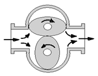
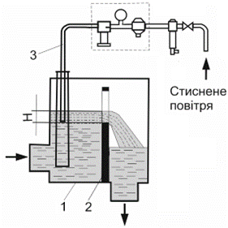
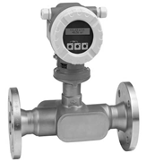

[2.5](2_5.md). Методи та засоби вимірювання температури. <--- [Зміст](README.md) --> [2.7](2_7.md). Методи та прилади вимірювання рівня. 

## 2.6. Методи та засоби вимірювання кількості та витрати.

### 2.6.1. Загальні положення

Вимірювання кількості та витрати рідин, газів, сипучих речовин у харчових виробництвах має важливе значення як для контролю технологічних режимів, так і для управління технологічними процесами.

***Витрата речовини*** **–** це миттєве значення маси або об’єму речовини, які протікають через поперечний переріз транспортного каналу за одиницю часу. Під транспортним каналом розуміють не тільки трубопровід (для рідин і газів), а й стрічку транспортера, шнек або відкритий канал гідротранспортера, який переміщує речовину.

Об’ємна витрата (*Qo*) вимірюється в м3/с, а масова (*Q***м**) – у кг/с. На виробництві допускається користуватися технічними одиницями вимірювання: м3/год, кг/год, т/год.

***Кількість речовини*** – це сумарна маса або об’єм речовини, які пройшли через поперечний переріз транспортного каналу за визначений проміжок часу (за хвилини, години, доби тощо). Кількість речовини виражають в одиницях об’єму (м3) або маси (кг).

Для вимірювання витрати і кількості застосовуються витратоміри і лічильники.

***Витратомір*** **–** це засіб для вимірювання витрати. Конструктивно витратомір може включати комплекс технічних пристроїв, які об’єднані в єдине ціле з чутливим елементом первинного вимірювального перетворювача***,*** який безпосередньо сприймає зміни витрати речовини. При цьому можуть використовуватись як контактні, так і безконтактні методи вимірювання.

За принципом дії розрізняють:

– витратоміри змінного перепаду тиску;

– витратоміри постійного перепаду тиску;

– електромагнітні витратоміри;

– ультразвукові витратоміри;

– витратоміри змінного рівня;

– вихрові витратоміри;

– масові (коріолісові) витратоміри;

– теплові витратоміри.

***Лічильник*** **–** засіб вимірювання, який призначений для вимірювання кількості і який безпосередньо контактує з вимірювальним середовищем.

Якщо технічний засіб для вимірювання витрати створює інформаційний сигнал, пропорційний інтегралу, зазвичай за часом, від вхідного сигналу, то його називають ***інтегратором*.**

У деяких випадках лічильник вбудовується у витратомір і конструктивно з ним пов’язаний.

За принципом дії розрізняють:

– швидкісні лічильники;

– об’ємні лічильники.

### 2.6.2. Лічильники

Вимірювання кількості та витрати рідин і газів у харчових виробництвах має важливе значення як для контролю результатів роботи виробництв, так і для управління технологічними процесами.

Для вимірювання кількості рідин і газів використовуються об'ємні та швидкісні лічильники.

Принцип дії ***швидкісних лічильників*** ґрунтується на залежності швидкості обертання робочого органу від середньої швидкості потоку речовини, що рухається, а значить, і кількості речовини, що протікає за певний проміжок часу.

За формою робочого органу лічильники поділяються на прилади з гвинтовою вертушкою й крильчаткою. Перші розміщуються перпендикулярно вимірюваному потоку, інші – паралельно йому. На рис. 2.39 наведено принципові схеми лічильників, а на рис. 2.40 – їхній зовнішній вигляд.

 Рис. 2.39. Схеми лічильників з гвинтовою вертушкою й крильчаткою.*1*– робочий орган лічильника; *2* – корпус, лічильний механізм; *3* – цифровий показчик

Рис. 2.40. Зовнішній вигляд швидкісних лічильників 

Принцип дії ***об‘ємних лічильників*** ґрунтується на періодичному або безперервному відліку постійних об'ємних порцій рідкої, газоподібної або сипкої речовини, що проходить через прилад та підсумовуванні результатів вимірювання.

Розрізняють об’ємні лічильники з овальними шестернями (рис. 2.41), ковшові лічильники, поршневі, дискові, ротаційні (рис. 2. 42) та ін. 

Рис. 2.41. Лічильник з овальними шестернями 

Рис. 2.42. Ротаційний лічильник

Швидкісні та об’ємні лічильники розраховані на робочий тиск рідини до 1 МПа і температуру до 40 °С. Похибка лічильників становить ±2,5–3%.

Крім лічильників, для визначення кількості речовини досить часто використовуються дозатори та вагові пристрої: механічні, автоматичні, неперервної та періодичної дії.

 

### 2.6.3. Витратоміри змінного перепаду тиску

Принцип дії ***витратомірів змінного перепаду тиску*** ґрунтується на залежності перепаду тисків, яке створюється яким-небудь звужувальним пристроєм, установленим у трубопроводі на шляху руху речовини, від її витрати в результаті часткового переходу потенціальної енергії потоку в кінетичну.

Принцип дії пояснюється законом збереження енергії, згідно з яким повна енергія речовини, яка протікає по трубопроводу, являє собою суму потенціальної (статичний напір) і кінетичної (швидкісний напір) енергії і є величиною постійною в будь-якій точці трубопроводу.

Якщо в трубопроводі, по якому протікає рідина або газ, змінюється переріз, то, відповідно до рівняння Бернуллі (2.16), відбувається перерозподіл між потенційною і кінетичною енергією за умови збереження їх постійної суми:

$$
\frac{P_1}{\rho}+\frac{V^2_1}{2}=\frac{P_2}{\rho}+\frac{V_2^2}{2}= \frac{P_3}{\rho}+\frac{V^2_3}{2}=\frac{P_4}{\rho}+\frac{V^2_4}{2} \tag{2.16}
$$

Це пояснюється тим, що, відповідно до принципу нерозривності струменя, у повністю заповненому трубопроводі, витрата речовини в будь-якому перерізі трубопроводу є величиною постійною. Тобто

$$
Q_0=V \cdot F = const \tag{2.17}
$$

де $V$ – швидкість речовини в даному перерізі; $F$ – площа перерізу.

Тому, якщо змінюється площа перерізу трубопроводу $F$, то в цьому місці трубопроводу повинна змінитися швидкість речовини і як наслідок цього змінитись кінетична енергія. Це, згідно із законом збереження енергії, призведе до зміни потенційної складової, тобто статичного тиску.

Таким чином, якщо в трубопроводі, по якому протікає рідина або газ, установити звужувальний пристрій, наприклад діафрагму, яка являє собою тонкий металевий диск із центральним отвором круглого перерізу, то в цьому місці створиться місцеве звуження потоку. Це призведе до збільшення швидкості потоку в цьому місці. Відповідно зміниться і тиск.

На рис. 2.43 показано характер зміни потоку *а*, графіки зміни середньої швидкості *б* і тиску *в* при проходженні потоку речовини через звужувальний пристрій – ***діафрагму***, який являє собою тонкий диск, установлений у трубопроводі таким чином, щоб його отвір був концентричним внутрішньому перерізу трубопроводу.

Рис. 2.43. Зміни тиску при проходженні рідини через звужувальний пристрій

Графік зміни середньої швидкості характеризується різким її збільшенням під час проходження через звужувальний пристрій і поступовим зниженням до попереднього значення. Звуження потоку починається перед звужувальною діафрагмою і завдяки інерції
 (залежно від швидкості потоку і густини речовини) продовжується за діафрагмою до мінімального перерізу. Відповідно тиск потоку вздовж трубопроводу зменшується до мінімального значення в місці найменшого перерізу трубопроводу і в подальшому у зв’язку зі зменшенням швидкості потоку збільшується, але свого попереднього значення не досягне внаслідок втрат енергії на тертя і завихрення перед і після звужувального пристрою.

При цьому різниця тисків до і після звужувального пристрою буде тим більша, чим більшою буде витрата речовини. Внаслідок цього цю різницю тисків можна вважати мірою витрати.

Вирішуючи одночасно рівняння Бернуллі і рівняння нерозривності струменя, можна отримати залежності значень витрати речовини від перепаду тисків, яке створюється звужувальним пристроєм.

Об’ємна витрата:

$$
Q_0=\alpha \cdot S_0 \sqrt{\frac{2(P_1-P_2)}{\rho}} \tag{2.18}
$$

масова витрата:

$$
Q_m = \alpha \cdot S_0 \sqrt {2\cdot\rho\cdot(P_1-P_2)} \tag{2.19}
$$

де $S_0$ – площа перерізу отвору звужувального пристрою; $\rho$ – густина середовища, $кг/м^3$; $Р_1$, $Р_2$ – тиск до і після звужувального пристрою, Па; $α$ - коефіцієнт витрати, який залежить від геометричної форми звужуючого пристрою і фізичних властивостей вимірюваного середовища. 

Окрім діафрагми (поз.*1* на рис. 2.44,*а*), для зменшення втрат тиску $∆Р$ можна використовувати складніші звужувальні пристрої: ***сопла*** (рис. 2.44,*б*) і ***трубки Вентурі*** (рис. 2.44,*в*), які завдяки своїй конструкції створюють менші перешкоди руху речовини.

Існують спеціальні методи розрахунку звужувальних пристроїв залежно від властивостей речовини, швидкості руху речовини та діапазону зміни витрат. При цьому треба пам’ятати, що залежність між витратою і перепадом тиску – нелінійна, тому до диференційного манометра необхідно підключати вторинні прилади з нелінійною шкалою або спеціальні пристрої добування кореня чи використовувати спеціальні алгоритми оброблення інформації при підключенні дифманометрів безпосередньо до мікропроцесорних управляючих засобів. Тому в загальному вигляді, до складу вимірювального комплекту вимірювання витрати методом змінного перепаду тиску входять (рис. 2.45): звужувальний пристрій, імпульсні трубки, диференційний манометр, блок вилучення кореня (може бути зроблено програмним шляхом) і показувальний прилад.

 Рис. 2.44. Типи звужувальних пристроїв: а – діафрагма, б – сопло, в – трубка Вентурі

Рис. 2.45. Комплект витратоміра змінного перепаду тиску

### 2.6.4. Витратоміри постійного перепаду тиску

Принцип дії ***витратомірів постійного перепаду тиску*** ґрунтується на зміні висоти положення чутливого елемента – поплавка, який знаходиться всередині конічної трубки, залежно від витрати речовини за рахунок зміни прохідного перерізу потоку для досягнення постійного значення перепаду тисків до і після звуження потоку речовини.

В основу принципу дії покладено ті самі закони і рівняння, що й для витратомірів змінного перепаду тиску, які описують залежності, що виникають при зміні перерізу трубопроводу, яким проходить рідина або газ і для якого справедливе рівняння (2.16).

Відмінність полягає в тому, що для витратомірів ***змінного перепаду тиску*** витрата визначається шляхом вимірювання різниці тисків до і після звужувального пристрою ($Р_1–Р_2$) за умови, що площа перерізу отвору звужувального пристрою $Ѕ_0=const$, а для витратомірів ***постійного перепаду*** ***тиску*** використовують принцип підтримання постійного значення перепаду тисків ($Р_1 – Р_2 = const$) за рахунок зміни площини перерізу $Ѕ_0$, через який буде проходити рідина або газ. Такі витратоміри мають назву ***ротаметри***.

Ротаметр складається з вертикальної конічної трубки, яка розширюється догори, і поплавка, який має спеціальну форму (знизу – конус, угорі – невеликий обідок з косими пазами) і може вільно в ній рухатись. Густина матеріалу поплавка повинна трохи перевищувати густину середовища (газу, рідини), витрата якого вимірюється (рис. 2.46).

Рис. 2.46. Принцип дії ротаметра

Поплавок усередині трубки створює звуження для потоку, але, на відміну від витратомірів змінного перепаду тиску, не всередині потоку, а у вигляді кільцеподібного зазору між ободком поплавка і стінками трубки. Тому на поплавок діє різниця тисків – під ($Р_1$) і над ($Р_2$) ним. Оскільки тиск над поплавком (внаслідок звуження потоку) завжди буде меншим, ніж тиск під ним, то результуюча (виштовхувальна) сила, яка діє на нього за рахунок різниці тисків,  дорівнюватиме:

$$
F_1=(P_1-P_2)S_п\tag{2.20}
$$

де $S_п$ – площа поперечного перерізу поплавка.

Ця сила буде направлена вгору. Крім того, на поплавок діятиме сила ваги, яка з урахуванням виштовхувальної сили може визначатись як:

$$
G=V_п(\rho_п-\rho)\tag{2.21}
$$

де $V_п$ – об’єм поплавка; $\rho_п$ – густина матеріалу поплавка; $\rho$ – густина речовини.

Ця сила буде величиною постійною (для вимірювання конкретної речовини) і направлена донизу. При рівновазі сил, що діють на поплавок (нехтуючи тертям між поплавком і середовищем), отримуємо:

$$
F_1=G;\ (P_1-P_2)S_п=V_п(\rho_п-\rho) \tag{2.22}
$$

Звідки    

$$
(P_1-P_2) = V_п(\rho_п-\rho)/S_п \tag{2.23}
$$

Це й пояснює назву витратоміра – постійного перепаду тиску.

За незмінності витрати перепад тиску $Р_1–Р_2$ в ротаметрі постійний. Якщо витрата змінюється, наприклад зростає, то збільшується й перепад тиску $Р_1–Р_2$. Починається підйом поплавка. При цьому збільшується кільцеподібний зазор між ним і стінкою конусоподібної трубки (рис. 2.47). Внаслідок цього перепад тиску зменшується. Як тільки рівновага $F_1=G$ відновиться,  то піднімання поплавка припиниться. Отже кожному значенню витрати *Q*o відповідатиме певна висота підйому поплавка

Рис. 2.47 Зміна перерізу навколо поплавка

Бувають ротаметри скляні, для візуального спостереження за витратою речовини за допомогою шкали, нанесеної на конічну трубку, та металеві, в яких використовуються спеціальні пристрої для перетворення положення поплавка на уніфікований електричний або пневматичний сигнал (рис. 2.48).

 Рис. 2.48. Загальний вигляд ротаметрів

### 2.6.5. Витратоміри змінного рівня **(щілинні витратоміри)**

Принцип дії ***витратомірів змінного рівня*** (***щілинних витратомірів***) ґрунтується на залежності висоти рівня рідини в посудині, яка вільно витікає з нього через щілинний отвір у її боковій стінці, від витрати рідини, яка поступає в посудину.

Ці витратоміри використовуються для виміру витрати дуже забруднених рідин і таких, що швидко кристалізуються (наприклад, вапняне молоко, сусло і т. ін.), а також пульсуючих потоків рідини і рідин, змішаних з газом.

Принцип дії можна пояснити так. Уявимо, що в посудину (рис. 2.49), яка має в боковій стінці щілину, надходить рідина з витратою *Q*пр. Ця рідина витікає з посудини через щілинний отвір з витратою:

Рис. 2.49. Щілинний витратомір 

$$
Q_{ст}=V_{ст}F_щ=V_{ст}(H\cdot B) \tag{2.24}
$$

де $V_{ст}$ – швидкість витоку рідини через щілину; $F_щ$ – площа перерізу щілини, яку заповнює рідина, що вільно витікає через неї. 

У момент рівноваги $Q_{пр1}= Q_{ст1}$ рівень в посудині буде постійний, якому буде відповідати певна площа щілини $F_{щ1}$, через яку витікає рідина. Коли змінюється $Q_{пр}$ – баланс порушується. Наприклад, якщо $Q_{пр2}$ збільшилось, а витрата $Q_{ст1}$ залишилась на попередньому рівні, починає збільшуватись рівень у посудині. При цьому починає збільшуватись площа перерізу щілини *F*щ, через яку витікатиме рідина, що призводить до збільшення $Q_{ст}$. Збільшення рівня буде продовжуватись до значення, яке відповідає досягненню нового стану рівноваги $Q_{пр2} = Q_{ст2}$, якому буде відповідати нове значення $F_{щ2}$. Таким чином, рівень рідини в посудині може бути показником витрати рідини, яка поступає в посудину.

На перший погляд здається, що прямокутна форма щілини забезпечує лінійну залежність витрати *Q*ст від висоти заповнення посудини $Н$, якій відповідає площина перерізу $F_щ = Н\cdotВ$ (рис. 2.49). Але це не так. Річ у тому, що зі зміною рівня в посудині змінюється швидкість витікання рідини $V_{ст}$. Це відбувається за рахунок зміни гідростатичного тиску. При цьому ця залежність не буде прямо пропорційною, оскільки різні шари рідини, яка витікає через щілину,  матимуть різну швидкість. Так, нижні шари, на які діє більший гідростатичний тиск, будуть мати більшу швидкість, а верхні – мінімальну. Тобто залежність узагальненої швидкості рідини від її рівня при витіканні через щілину нелінійна. З цього випливає, що для того, щоб залежність витрати речовини від її рівня мала прямо пропорційний вигляд, траєкторія зміни перерізу щілини повинна також бути нерівномірною, щоб компенсувати нерівномірність зміни швидкості.

Саме тому важливо вибрати такий профіль щілини, щоб залежність рівня рідини $Н$ у посудині від витрати $Q_{ст}$ була прямопропорційною – тобто мала рівномірну шкалу. Цій вимозі відповідає форма щілини, вказаної на рис. 2.50, розрахованою за спеціальною методикою, в якій враховуються: $Q_{max}$ – максимальне значення витрати, яка буде вимірюватись, *H*max – максимальна висота щілини (конструктивне значення, яке залежить від висоти посудини, де встановлюється щілина), а також густина рідини – $ρ$. У зв’язку з тим, що одержати повністю рівномірну шкалу на всьому діапазоні висоти неможливо, початкова ділянка профілю отвору виконується прямокутної форми шириною $X_1$ і висотою, яка дорівнює, як правило, 5 мм, оскільки при $H_0$<5 мм значення $X_1$, стає дуже великим, що приводить до різкого збільшення розмірів ємності.

Рис. 2.50. Форма щілини

Конструктивно (рис. 2.51) щілинний витратомір містить у собі приймальну ємність *1*, у якій установлена перегородка з щілиною *2*. Витрата рідини визначається висотою її рівня над нижньою кромкою щілинного отвору $Н$. Рівень визначається (причому практично завжди через високий ступінь забрудненості вимірюваної рідини) тільки п’єзометричним методом (більш детально у розділі 2.7.3), при цьому тиск у п’єзометричній трубці *3* однозначно пов'язаний із густиною й висотою стовпа рідини, а отже, й з масовою витратою.

Рис. 2.51. Конструкція щілинного витратоміра

### 2.6.6. Електромагнітні витратоміри

Принцип дії ***електромагнітного витратоміра*** ґрунтується на явищі електромагнітної індукції і полягає у вимірюванні електрорушійної сили (ЕРС) яка наводиться в “рідинному” провіднику, який переміщується в магнітному полі. Використовується для вимірювання об’ємної витрати електропровідних рідин, розчинів і пульп.

Електромагнітний перетворювач (рис. 2.52) схематично являє собою частину трубопроводу *1*, виготовленого з немагнітного матеріалу і покритого всередині електричним ізоляційним шаром *2*, який міститься між полюсами магніту *3*. Напрямок силових ліній магнітного поля перпендикулярний осі трубопроводу.

Для знімання сигналу ЕРС через стінки труби вводяться два електроди *4*, з’єднані  з вимірювальним приладом *5*.

Рис. 2.52. Схема і зовнішній вигляд індукційного витратоміра 

Роль провідника, який рухається в магнітному полі відіграє електропровідна рідина, яка протікає через електромагнітний перетворювач витрати. Різниця потенціалів *U*, яка виникає на електродах, визначається електромагнітною індукцією $В$, середньою швидкістю перетинання провідником магнітного поля, тобто швидкістю руху рідини *V*серед, і довжиною провідника, тобто розміром внутрішнього діаметру трубопроводу $Dy$:

$$
U=B \cdot V_{серед}D_у \tag{2.25}
$$

Враховуючи, що об’ємну витрату можна записати як $Q_0=V_{серед}\pi \frac{D^2_у}{4}$ отримаємо:

$$
Q_0=(\pi \frac{D_у}{4}B),\ або \ Q_0=kU \tag {2.26}
$$
Головною перевагою електромагнітних витратомірів є їхня висока точність і широкий діапазон вимірювання витрати – від 0,032 до 25000 $м^3/год$ з можливістю встановлення на трубопроводах діаметром від 3 до 1000 мм.

### 2.6.7. Витратоміри Коріоліса

***Витратоміри Коріоліса*** використовують для вимірювання масової витрати речовин з використанням ефекту Коріоліса, який пояснюється появою сил інерції під час руху тіла в напрямку під кутом до осі обертання. Коріолісовий масовий витратомір вимірює масову витрату робочого середовища, яке виникає в момент її проходження через U-подібну вимірювальну трубку, яка вібрує.

Вимірюване середовище, що надходить у датчик, розділяється на рівні половини, що протікають через дві сенсорні трубки. Рух задавальної котушки приводить до того, що трубки коливаються вгору-вниз у протилежних напрямках. Збірки магнітів і котушок-соленоїдів, які називаються детекторами, встановлені на сенсорних трубках (рис. 2.53). Котушки змонтовані на одній трубі, магніти – на іншій. Кожна котушка рухається крізь однорідне магнітне поле постійного магніту. Генерована напруга від кожної котушки детектора має форму синусоїдальної хвилі. Ці сигнали є рухом однієї трубки відносно іншої.

Рис. 2.53. Принципи дії коріолісового витратоміра

При русі вимірюваного середовища через датчик виявляється фізичне явище, відоме як ефект Коріоліса. Поступальний рух середовища в обертальному русі сенсорної трубки приводить до виникнення коріолісового прискорення, яке, в свою чергу, приводить до появи коріолісової сили. Ця сила спрямована проти руху трубки, наданого їй задавальною котушкою. Коли трубка рухається вгору під час половини її власного циклу, то для рідини, що надходить усередину, сила Коріоліса направлена вниз. Як тільки рідина проходить вигин трубки, напрямок сили змінюється на протилежний. Таким чином, у вхідній половині трубки сила, що діє з боку рідини, 

перешкоджає зсуву трубки, а у вихідний – сприяє. Це приводить до вигину трубки. Коли в другій фазі вібраційного циклу трубка рухається вниз,  то напрям вигину змінюється на протилежний. Сила Коріоліса і, отже, величина вигину сенсорної трубки, прямо пропорційні масовій витраті рідини. Детектори вимірюють фазове зрушення при русі протилежних сторін сенсорної трубки. 

 Як результат вигину сенсорних трубок – сигнали, що генеруються детекторами, не збігаються за фазою. Так, сигнал від вхідної сторони запізнюється по відношенню до сигналу з вихідного боку. Різниця в часі ∆*Т* між сигналами вимірюється в мікросекундах і прямо пропорційна масовій витраті. Чим більше зрушення фаз між сигналами, тим більша масова витрата.

Перевагами цих витратомірів є дуже висока точність виміру, стабільність показань, невисока чутливість до забруднення середовища. Серед недоліків – малі діаметри трубопроводів, залежність показань від відкладень шлаків у трубопроводах.

Крім того, враховуючи, що маса вимірюваного середовища в трубках залежить від густини середовища і внутрішнього об’єму трубок, а об’єм трубок є постійним, тому за показаннями цього витратоміра можна визначити густину середовища. Тому, як правило, при використанні цього приладу можна отримати інформацію про витрату і густину розчину. У ньому вбудовано датчик температури. Загальний вигляд витратоміра Коріоліса показано на рис. 2.54.

 Рис. 2.54. Загальний вигляд витратоміра Коріоліса

### 2.6.8. Вихрові витратоміри

В основі принципу дії будь-якого ***вихрового витратоміра*** лежить широко відоме природне явище – утворення вихорів за перешкодою, що стоїть на шляху потоку. При швидкостях середовища вище від певної межі вихори утворюють регулярну доріжку – «доріжку Кармана» з ім’ям фон Кармана, що описав це явище в 1912 р.. Частота утворення вихорів при цьому прямо пропорційна швидкості потоку.

Рис. 2.55. Доріжка Кармана: *1*– трубопровід; *2*– тіло обтікання; *3*– вихори

У вихрових витратомірах з тілом обтікання потік, огинаючи тіло, змінює напрям руху оточуючих струменів і збільшує їхню швидкість, при цьому відповідно зменшується тиск. Далі за перетином тіла відбувається зменшення швидкості і збільшення тиску. Одночасно на передній стороні тіла утворюється підвищений тиск, а на задній стороні тіла – знижений тиск. Пограничний шар, пройшовши перетин тіла, відривається від нього і під впливом зниженого тиску, який утворюється за тілом, змінює напрям, створюючи вихор. Це відбувається і у верхніх, і в нижніх частинах тіла обтікання.

Утворення вихорів з обох боків відбувається по черзі, оскільки вихор з одного боку заважає виникненню вихору з іншою. При цьому за тілом обтікання утворюється вихрова доріжка Кармана. Робочі кромки тіла обтікання є такими, що самоочищуються за рахунок утворення вихорів, і залишаються чистими в умовах сильно забруднених середовищ. Забруднення датчика вихорів не веде до зміни метрологічних характеристик вихрового витратоміру, оскільки корисну інформацію несе частота, а не амплітуда сигналу.

Найчастіше у вихрових витратомірах застосовують призматичні тіла прямокутної, трикутної або трапецеїдальної (дельтоподібної) форм. Такі тіла, не дивлячись на невелику втрату тиску, утворюють сильні і регулярні вихрові коливання. Крім того, вони зручні для перетворення частоти на вихідний сигнал. У деяких вихрових витратомірах для збільшення вихідного сигналу застосовують два обтічні тіла, розташованих на певній відстані один від одного.

Конструктивно прилад являє собою моноблок (рис. 2.56), який складається з корпусу проточної частини 1 і електричного блоку *2*. Типова схема вихрового витратоміра (рис. 2.57) включає проточну частину витратоміра, встановлену за допомогою фланців у трубопроводі і містить тіло обтікання *1*, за яким попарно встановлені п'єзоелектричні датчики тиску *2*. Пульсації тиску, що виникають у потоці внаслідок вихороутворення, реєструється датчиками, а частота процесу – пропорційна швидкості потоку. Парне розміщення датчиків дає змогу підсилити корисний сигнал і мінімізувати вібраційні та акустичні перешкоди, оскільки один із сигналів інвертується і підсумовується із сигналом іншого датчика в пристрої, а сигнал перешкоди віднімається на суматорі. Перед тілом обтікання встановлено перетворювач надлишкового тиску *3*. Термоперетворювач опору платиновий *4* розташований усередині тіла обтікання. Для забезпечення безпосереднього контакту термометра опору і вимірювального середовища в тілі обтікання виконані отвори *5*. Плата цифрової обробки *6* оброблює сигнали і передає  їх на обчислювач *7*.

Рис. 2.56 Загальний вигляд вихрового витратоміра

Рис. 2.57. Типова схема вихрового витратоміра

Обчислювач забезпечує оцифрування інформаційного сигналу, розрахунок сумарної кількості рідини або газу, що пройшли через напірну трубу за проміжок часу, індикацію миттєвої і сумарної витрати, самодіагностику приладу, зберігання інформації в незалежній пам'яті і передачу її на комп'ютер верхнього рівня систем вимірювання і управління.

**Технічні характеристики:**

- діаметр умовного проходу трубопроводу: 15...300 мм;

- діапазон вимірювання витрати: 0,4...1395 м3/ч (для води);

- робочий надлишковий тиск у трубопроводі: до 15,8 МПа;

- температура навколишнього середовища: -40...+85 °С;

- вихідний сигнал: 4–20 мА;

- границі основної відносної похибки вимірювання масової і об’ємної витрати рідин ±0,65%; газів (пари) ±1,35%.

### 2.6.9. Ультразвукові витратоміри

Переваги ***ультразвукових витратомірів***: мала або повна відсутність гідравлічного опору, надійність (оскільки немає рухливих механічних елементів), висока точність, швидкодія, перешкодозахищеність – визначили їхнє велике поширення.

У сучасних ультразвукових витратомірах використовуються два методи, які ґрунтуються на двох різних принципах вимірювання швидкості потоку речовини.

У першому методі вимірюється інтервал часу затримки розповсюдження ультразвукового сигналу в середовищі, яке рухається (рис.2. 58). Ця затримка залежить від напрямку і швидкості руху середовища (потоку).

 Рис. 2.58. Схема встановлення ультразвукових датчиків

На трубу встановлюють два датчики-приймачі, які почергово виступають у ролі випромінювача і приймача. Сигнал з частотою 0,1 – 1 МГц, який випромінюється лівим датчиком проходить через середовище в напрямку руху потоку, досягає приймача правого датчика через менший час затримки, ніж сигнал, який іде від правого датчика – назустріч потоку (проти потоку), який доходить до приймача через більший час затримки (рис. 2.59). За різницею цих інтервалів затримки можна оцінити швидкість руху, а знаючи внутрішній переріз трубопроводу – визначити витрату. Цей метод можна добре використовувати для чистих речовин.

Рис. 2.59. Схема поширення ультразвукового сигналу

Загальний вигляд ультразвукового витратоміра показано на рис. 2.60

Рис. 2.60. Загальний вигляд ультразвукового витратоміра

Другий метод (рис.2.61) ґрунтується на добре відомому методі Допплера – ефекті вимірювання частоти сигналу, відбитого від об’єкта, який рухається. Сигнал відомої частоти поширюється в рідкому середовищі, відбивається від твердих частинок і бульбашок повітря, які містяться в рідині і рухаються разом з нею. Відбитий від частинок, які рухаються, ультразвуковий сигнал за допомогою швидкого перетворення Фур’є переводиться з часового в частотний вигляд. Спектр відбитого сигналу досить широкий, тому знаходиться усереднена частота. Далі обчислюється різниця між частотою вихідного сигналу (сигналу передатчика) і усередненої частоти відбитих сигналів. Ця різниця частот використовується для визначення швидкості руху потоку і потім – для обчислення витрати.

Рис.2. 61. Метод Допплера

Для цього методу вимірювання чим брудніша рідина – тим більша точність вимірювання.

### 2.6.10. Теплові витратоміри

Робота ***теплового витратоміра*** ґрунтується на такому принципі (рис. 2.62). У трубопроводі встановлюється два датчики температури *А* і *В* і один нагрівальний елемент *С*. Причому відстань *АС*>*ВС*. Якщо середовище в трубопроводі нерухоме, то датчик *В* нагрівається швидше, оскільки він розміщений ближче до нагрівального елемента, ніж датчик *А*. Якщо середовище в трубопроводі починає рухатись, то температура *Т*1 у зоні датчика *А* впаде до початкової температури середовища в трубопроводі, а температура *Т*2 в зоні *В* буде вища залежно від швидкості руху речовини у трубопроводі. Таким чином, вимірюючи різницю температур між датчиками *А* і *В*, можна визначити витрату речовини. Такі витратоміри використовуються, як правило, для рідин, які мають великі значення густини.

 Рис. 2.62. Схема теплового витратоміра

### 2.6.11. Автоматичні терези, дозатори, **лічильники готової продукції**

 ***Автоматичні терези*** використовуються для обліку сировини, допоміжних матеріал і готової продукції. Розрізняють автоматичні терези періодичної й безперервної дії. Принцип роботи терезів періодичної дії ґрунтується на зважуванні заданих порцій речовини, яка надходить у спеціальний прийомний ківш з автоматичним його розвантаженням при досягненні заданої маси. Дозатор містить лічильник кількості порцій, що визначають зважену порцію (рис. 2.63). Межі зважування терезів – від 40 до 80 кг. Клас точності 0,1.

Рис. 2.63. Ваговий дозатор

Принцип роботи автоматичних терезів (рис. 2.64) безперервної дії ґрунтується на безперервному зважуванні матеріалу, який рухається на конвеєрній стрічці (на певній її ділянці). У процесі роботи товщина шару матеріалу, що рухається на стрічці конвеєра, регулюється.

Рис. 2.64. Стрічкові ваги 

При управлінні об'єктами харчової промисловості для стабілізації матеріальних потоків використовують різні дозувальні прилади, які вимірюють і видають задану кількість речовини.  Залежно від роду дозованих речовин розрізняють дозатори рідин, сипучих матеріалів та газів.

Для обліку штучної продукції або продукції, яка міститься в стандартній тарі або упаковці, розроблені і використовуються різні системи обліку. З них найбільшу цікавість становлять системи, в основі яких лежать безконтактні методи контролю, такі як електроіндуктивні, фотоелектричні та радіоактивні (рис. 2.65).

Рис. 2.65. Облік готової продукції

Електроіндуктивні лічильники використовуються для обліку продукції, упакованої в металеву тару або скляну з металевою кришкою. Принцип їх дії ґрунтується на зміні індуктивності або зриву генерації контуру коливання, в зону дії якого потрапляє метал.

Фотоелектричні лічильники призначені для автоматичного підрахунку непрозорої штучної продукції. Принцип їхньої роботи ґрунтується на уловлюванні переривання потоку світла, який іде від випромінювача або відбивається від виробу, що рухається по транспортеру.

У деяких випадках можуть використовуватись радіоактивні лічильники, принцип дії яких ґрунтується на поглинанні радіоактивного випромінювання предметом, що підлягає рахуванню.

 

[2.5](2_5.md). Методи та засоби вимірювання температури. <--- [Зміст](README.md) --> [2.7](2_7.md). Методи та прилади вимірювання рівня. 