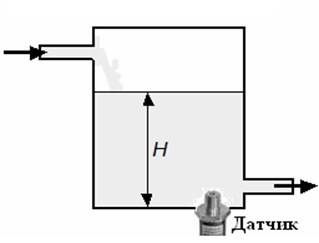
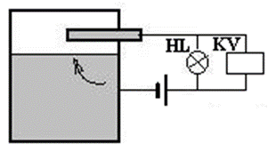

[2.6](2_6.md). Методи та засоби вимірювання кількості та витрати. <--- [Зміст](README.md) --> [2.8](2_8.md). Визначення властивостей та складу рідин і газів.

## 2.7. Методи та прилади вимірювання рівня. 

### 2.7.1. Загальні положення

Майже в усіх технологічних процесах харчових виробництв виникає необхідність у вимірюванні рівня рідин та сипких матеріалів, а також сигналізації мінімально чи максимально припустимих рівнів у резервуарах, апаратах. Сучасні прилади рівня поділяються на дві основні групи: рівнеміри (дають конкретне значення рівня) та сигналізатори рівня (спрацьовують при пороговому значенні рівня). За принципом дії рівнеміри є: механічні, гідростатичні, кондуктометричні, ємнісні, радіоізотопні, акустичні, ультразвукові та ін.

### 2.7.2. Поплавкові рівнеміри 

Принцип дії поплавкових рівнемірів ґрунтується на законі Архімеда: на занурене в рідину тіло діє виштовхувальна сила, яка чисельно дорівнює вазі рідини, витісненої зануреної в неї тілом, і прикладена до центру мас об’єму зануреної частини тіла.

Існує два типи поплавкових перетворювачів. У рівнемірі з плаваючим поплавком вико­ристовується поплавок, який плаває на поверхні рідини і має постійну глибину занурення. Рівень рідини визначається вимірю­ванням переміщення поплавка. Існує велика різноманітність типів і конструкцій. Застосовуються для неагресивних речовин і рідин, що не кристалізуються. Прилади такого типу не можна застосовувати в резервуарах, що перебувають під надлишковим тиском.

На рис.2.66 наведено найпростіший рівнемір із плаваючим поплавком: *1* – поплавок; *2* – ролик; *3* – противага з покажчиком; *4* – шкала. При зміні рівня переміщується поплавок, що в свою чергу, приводить до зміни покажчика рівня.

Рис. 2.66. Поплавковий рівнемір

Переміщення поплавка може також передаватись на перетворювач для перетворення переміщення у вихідний сигнал. До таких перетворювачів можна віднести магнітострикційні, магнітні та байпасні.

Для неперервного високоточного вимірювання рівня чистих рідин може бути використаний магнітострикційний перетворювач (рис. 2.67), який складається з поплавка з магнітним диском, що переміщується по трубці або гнучкій направляючій, усередині якої розміщується магнітострикційний провід. Імпульс, який виробляється електронними пристроями, проходить по магнітострикційному проводу. Коли імпульс досягає магнітного поля поплавка, виникає обертовий момент. Відбиваючись від точки обертання, імпульс створює акустичну хвилю, яка повертається в зворотному напрямку. Вихід перетворювача 4…20 мА пропорційний часу, який проминув від моменту збудження до моменту визначення. Такі датчики можуть використовуватись для виміру рівня в ємностях до 18 м з точністю до 1 мм.

Рис. 2.67. Магнітострикційний рівнемір: *1* – рухомий магніт; *2* – трубка; 3 – гнучка направляюча; *4* – електронний блок

Якщо така висока точність не потрібна, може використовуватися магнітний рівнемір (рис. 2.68), який складається з поплавка з магнітом *2*, який рухається (залежно від рівня) трубкою *1*. На відміну від магнітострикційного рівнеміра, всередині трубки знаходиться не магнітострикційний провід, а лінійка герконових реле, які спрацьовують під дією магніту поплавка. До різних контактів герконових реле підключені різні резистори. Тобто при зміні положення поплавка змінюється опір датчика. Згідно з цим змінюється значення аналогового уніфікованого сигналу на виході датчика.

Рис. 2.68. Магнітний рівнемір *1* – рухомий магніт; *2* – трубка

Така сама конструкція може бути використана для сигналізації досягнення певного рівня в ємності шляхом підключення до певних контактів герконових реле із запам’ятовуванням свого стану і які спрацьовують, коли біля нього проходить магніт. Таким чином, можна сигналізувати про досягнення рівня значенням відповідно до розміщення магнітів сигнальної апаратури.

Можна також використовувати байпасні датчики рівня рідини з візуальним відображенням рівня (рис. 2.69). Часто байпасний рівнемір нагадує колонку для візуального спостереження рівня, яка розміщується біля ємності. Але ці прилади є багатофункціональними пристроями не тільки для візуального контролю, а й використовуються для точного вимірювання рівня рідини в резервуарі з точністю до 0,5 мм. Вони можуть бути обладнаними додатковими перемикачами граничних значень рівня і магнітострикційними перетворювачами рівня. Діапазон вимірювання – 500 – 3500 мм.

Рис. 2.69. Підключення байпасного рівнеміра

Широко використовуються поплавкові сигналізатори рівня, які розрізняються конструкцією і розміщенням поплавка (рис. 2.70). 

Рис. 2.70. Різноманітні конструкції поплавків-сигналізаторів

На рис. 2.71 показано конструкцію поплавкового сигналізатора рівня, в якому поплавок *1* закріплюється на рухомому важелі *2* і має магнітний зв'язок з установленим зовні мікроперемикачем.

Рис. 2.71. Магнітний сигналізатор з рухомим поплавком

У буйкових рівнемірах (рис. 2.72) використовується нерухомий, занурений у рідину буйок *1*. Принцип дії буйкових рівнемірів ґрунтується на тому, що на занурений буйок з боку рідини діє виштовхуючи сила F. За законом Архімеда, ця сила дорівнює вазі рідини, яка виштовхується буйком. Але, як видно з рис. 2.72, кількість рідини, яка виштовхується, залежить від глибини занурення буйка, тобто від рівня рідини в ємності Н. Таким чином, у буйкових рівнемірах рівень *Н*, який вимірюється, перетворюється на виштовхувальну силу. Тому залежність виштовхувальної сили від рівня рідини – лінійна. У буйкових рівнемірах буйок передає зусилля на важіль *2* проміжного перетворювача *3*, в якому зусилля *F* перетворюється на уніфікований сигнал. Існують два типа перетворювачів. Одні перетворюють зусилля на уніфікований пневматичний сигнал, а інші – на електричний уніфікований сигнал.

Рис. 2.72. Схема буйкового рівнеміра

Маса буйка вибирається такою, щоб він не спливав при повному його зануренні.

Недоліком буйкових рівнемірів є залежність їхніх показань від густини рідини. 

На рис. 2.73 показано загальний вигляд і конструкцію буйкового рівнеміра.

Рис. 2.73. Загальний вигляд буйкового рівнеміра 

### 2.7.3. Гідростатичні рівнеміри

Принцип дії гідростатичних приладів ґрунтується на вимірюванні тиску, який створює стовп рідини:

$$
P_{ст}=\rho g H \tag{2.27}
$$

де $r$ – густина рідини; $g$ – прискорення вільного падіння.

За способом вимірювання цього тиску гідростатичні рівнеміри поділяються на прилади з безперервним продуванням повітря або іншого газу (п'єзометричні рівнеміри) і з безпосереднім вимірюванням тиску стовпа рідини. У п'єзометричному рівнемірі (рис. 2.74) стиснуте повітря або газ через дросель *5* та ротаметр *4* подається у відкриту з одного кінця п'єзометричну трубку *1*, занурену в резервуар *2*. Тиск повітря в п'єзометричній трубці зумовлюється протитиском стовпа рідини й дорівнює йому. Тому тиск повітря, що вимірюється манометром *3* характеризує рівень рідини в резервуарі. При цьому досить важливо правильно вибрати тиск повітря, яке подається в п’єзометричну трубку. Візуально воно вибирається таким чином, щоб можна було рахувати окремі бульбашки, тобто приблизно одну бульбашку за одну секунду.

Рис. 2.74. П’єзометричний рівнемір

При вимірюванні рівня рідини шляхом вимірювання гідростатичного тиску можна використати досить просту конструкцію і просто вимірювати гідростатичний тиск, створений стовпом рідини (рис. 2.75).

Рис. 2.75. Гідростатичний рівнемір

Але треба пам’ятати, що цей тиск залежатиме не тільки від рівня рідини, а й від її густини і температури.

У випадку, коли ємність, у якій необхідно вимірювати рівень встановлена на великій висоті, може бути запропонована схема підключення з використанням зрівнювальної посудини. На рис. 2.76 наведено схему вимірювання рідини у відкритих посудинах.

Рис. 2.76. Гідростатичний рівнемір зі зрівнювальною посудиною

У розглянутому способі вимірювання про зміну рівня судять за величиною різниць тисків, які створюються стовпами рідини в збірнику або резервуарі й зрівнювальній посудині. При цьому рівень рідини в зрівнювальній посудині вибирається таким чином, щоб перепад тиску характеризував зміну рівня тільки в об’єкті, який контролюється:

$$
\Delta_{ст}=rgH_1-rgH_2=rg(H_1-H_2)=rgH_3\tag{2.28}
$$

У ролі технічного засобу для вимірювання різниці тисків використовується диференціальний манометр.

Якщо б просто вимірювати гідростатичний тиск, то поряд з рівнем у збірнику до нього додавався б рівень, який зумовлений висотою встановлення збірника. Цей тиск був би постійним і заважав би вимірюванню тиску в збірнику.

### 2.7.4. Ємнісні рівнеміри та сигналізатори рівня

 Ємнісні вимірювачі рівня використовуються для вимірювання рівня рідин та сипких матеріалів. Принцип їхньої дії ґрунтується на перетворенні величин рівня на електричну ємність датчика – штучно створеного електричного конденсатора.

Схема вимірювання рівня ємнісними рівнемірами показана на рис. 2.77. У посудині *1*, у якій необхідно вимірювати рівень, розміщується металевий електрод *2*. 

Рис. 2.77 Ємнісний рівнемір

Якщо стінка посудини металева, то разом з електродом вона утворює циліндричний конденсатор, ємність якого змінюється пропорційно величині рівня рідини або сипучого матеріалу, яка знаходиться в посудині:

$$
C=K \cdot H \tag {2.29}
$$

При цьому треба розуміти, що загальна ємність конденсатора складається з двох ємностей: $С_1$ – ємність у середині рідини або сипкої речовини і $С_2$ – ємність конденсатора в повітрі. Тому при зміні рівня речовини змінюються як розміри обкладинок штучного конденсатора, так і властивості діелектрика всередині конденсатора.

Електроди можуть бути голими металевими стрижнями (для середовищ – діелектриків), пластинчастими (для сипких матеріалів), а також покритими ізоляцією (для електропровідних середовищ).

Величина зміни ємності перетворюється спеціальними електронними схемами в показання приладу.

У випадку використання ємнісних датчиків для сигналізації досягнення рівня в збірнику заданого значення металеві стрижні встановлюються на відповідних рівнях. У момент досягнення рівня вимірюваного середовища в ємності різко змінюється ємність конденсатора, яка буде відслідкована електронною схемою. На рис. 2.78 зображено встановлення датчика для сигналізації верхнього рівня.

 Рис. 2.78. Схема ємнісного сигналізатора рівня

### 2.7.5. Кондуктометричні сигналізатори рівня

Принцип дії кондуктометричних сигналізаторів рівня ґрунтується на замиканні електричного ланцюга електропровідним середовищем. За конструкцією кондуктометричний датчик (рис. 2.79) подібний до ємнісного. До його складу також входять два або більше електродів, одним з яких може бути металева стінка посудини, а інші – металеві стрижні (електроди).

Рис. 2.79. Схема кондуктометричного сигналізатора рівня

Як і для ємнісних сигналізаторів, електроди встановлюються на відповідному рівні, досягнення якого потрібно сигналізувати. Однак, якщо в ємнісних сигналізаторах рівня при дотику електрода поверхні рідини в посудині змінюється електрична ємність конденсатора, то в кондуктометричних сигналізаторах дотик електропровідної рідини електрода приводить до замикання електричного ланцюга між стінкою посудини та електродом, що приводить до спрацювання включеного в це коло релейного блоку. Сигналізатор простий, має високу точність контролю заданих положень рівня (± 2 мм). Однак наявність безпосереднього електричного контакту з контролюючим середовищем приводить до корозії і забруднення електродів, що знижує надійність роботи приладу.

### 2.7.6.Ультразвукові рівнеміри

Принцип дії ультразвукового рівнеміра ґрунтується на залежності часу проходження ультразвукових коливань (40…70 кГц) від межі розділу двох середовищ з різною густиною або діалектичною проникністю.

Розрізняють рівнеміри, в яких використовується принцип відбивання з боку рідини (датчик встановлюється в дні резервуара на максимальній глибині, а також рівнеміри, в яких використовується розповсюдження ультразвукових коливань у повітрі до межі розділу з рідиною або твердою речовиною, які називають акустичними рівнемірами (рис. 2.80).

 Рис. 2.80 Ультразвуковий рівнемір

Ультразвуковий рівнемір складається з випромінювача *1*, приймача *2* і електронного блока, в якому міститься перетворювач, генератор і мікропроцесор *3* для оброблення сигналів.

При розміщенні датчика на дні резервуару рівень рідини визначається за часовим проміжком часу $\Delta \tau$, виходячи із співвідношення висоти стовпа рідини *h* і швидкості розповсюдження звуку в середовищі *с*:

$$
\Delta \tau = 2h/c \tag {2.30}
$$

де $\Delta \tau$ – проміжок часу, який визначається різницею фаз переданого і відбитого сигналів.

При знаходженні випромінювача над поверхнею розділу фаз на висоті $H$ інтервал часу визначається як:

$$
\Delta \tau = 2(H-h)/c \tag{2.31}
$$

Чим більший діапазон вимірювання, тим більша потужність випромінювача й тим нижча частота випромінювання.

На точність ультразвукового рівнеміра впливає ряд факторів середовища, серед яких: ступінь поглинання коливань у рідині або твердому середовищі, густина, температура, наявність пилу, диму та ін.

Для зменшення додаткової похибки від температури в сенсорі встановлюється датчик температури. Для акустичних рівнемірів на точність вимірювання впливає форма поверхні (особливо для сипких продуктів) або наявність піни і хвиль на поверхні рідкого середовища.

Використовують також контактні сенсори, які являють собою трос або штир, уздовж якого розповсюджуються ультразвукові коливання. До переваг контактного рівнеміра відносять великий діапазон вимірювання, незалежність від стану поверхні, вимірювання рівня з малою діелектричною проникністю. Недоліки – механічний вплив на контактний сенсор, корозія і налипання на поверхню сенсора.

### 2.7.7. Радарні (мікрохвильові) рівнеміри

Принцип дії радарних рівнемірів подібний до ультразвукових, але в них використовують мікрохвильові імпульси високої частоти (від 6 до 26 ГГц), які поступають через штирову, рупорну (рис.2.81 або хвильову антену у вимірюване середовище. Діапазон вимірювання до 20 м і більше, похибка до ±0,15%. 

Рис. 2.81. Радарний рівнемір та один із способів його монтажу

На показання рівнеміра не впливають склад, температура і тиск рідини, а в окремих випадках і діелектрична проникність матеріалу. Діапазон вимірювання залежить від частоти коливань, розмірів антени, стану поверхні і діалектичної постійної середовища (ε). Чим вище ε, тим більша величина відбитого імпульсу. Оскільки при високій частоті швидкість розповсюдження електромагнітних коливань у різних газах у повітрі відрізняється мало, то точність вимірювання рівня радарним рівнеміром не залежить від вмісту пари або диму. Крім того, внаслідок малої довжини хвилі радарні рівнеміри характеризуються більш високою роздільною здатністю вимірювання, а рівнеміри з рупорною антеною – малими габаритами. При порівнянні радарних рівнемірів з частотою випромінювання 6 і 24 ГГц необхідно враховувати, що низькочастотні радари мають великі габарити, але менш чутливі до наявності на поверхні піни або хвиль, а також наявності конденсату на антені.

За аналогією з ультразвуковими рівнемірами, існують також контактні радарні рівнеміри з частотою 0,2…1,5 ГГц, у яких випромінювач закріплюється на кінці троса, завдяки чому можна вимірювати рівень незалежно від стану поверхні.

### 2.7.8. Вібраційні сигналізатори рівня

Вібраційний сигналізатор рівня може використовуватися для сигналізації рівня заповнення, звільнення або проміжного рівня в ємностях із сипкою або рідкою речовиною. Установлюються вертикально, горизонтально або під кутом (рис. 2.82).

Рис. 2.82. Загальний вигляд вібраційних сигналізаторів рівня та приклади їхнього монтажу

Датчик рекомендується використовувати для роботи з дрібнозернистими пилоподібними матеріалами зі вмістом від 60 г/л, при температурі від –40  до +150  °С.

Конструктивно вібраційний датчик для визначення максимально припустимого рівня виконаний у формі камертона (вилки), одна із половин якого є джерелом коливань, які генеруються п’єзокристалом, а інша – приймачем. Принцип роботи ґрунтується на спрацьовуванні датчика в момент дотику з матеріалом, який з’являється між пластинами.

Сенсорні вилки датчиків для визначення максимального рівня рідин налаштовані на вібрацію на резонансній частоті в повітрі за допомого п’єзоелектричного елемента. Частота коливань змінюється при зануренні сенсорних вилок у рідину, конвертується в частотно-імпульсний сигнал і подається на трансмітер. Вбудований мікропроцесор обробляє отриманий сигнал. При досягненні максимального рівня відбувається замкнення або розімкнення вихідного контакту.

[2.6](2_6.md). Методи та засоби вимірювання кількості та витрати. <--- [Зміст](README.md) --> [2.8](2_8.md). Визначення властивостей та складу рідин і газів.