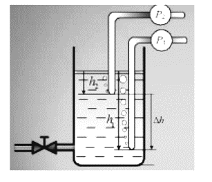
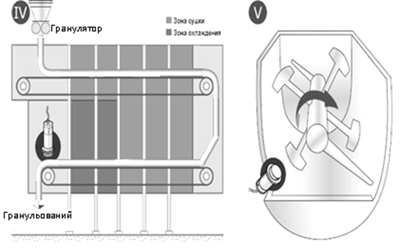
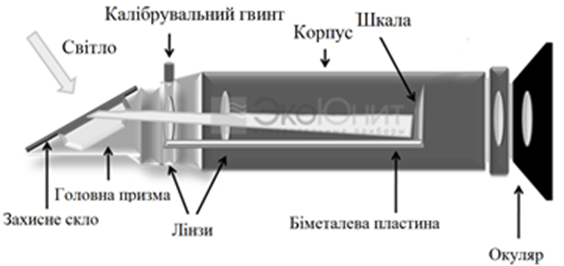
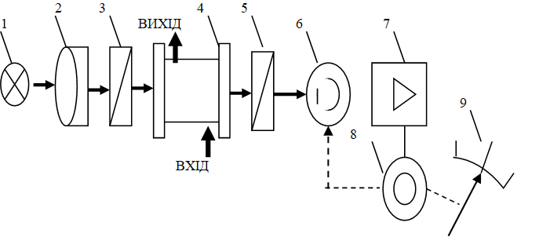

[2.7](2_7.md). Методи та прилади вимірювання рівня. <--- [Зміст](README.md) --> [2.9](2_9.md). Безконтактні датчики положення. 

## 2.8. Визначення властивостей та складу рідин і газів.

### 2.8.1. Загальні положення

Засоби визначення складу та фізико-хімічних властивостей (якості) харчової продукції називаються ***аналізаторами***, а загальні методи контролю якості продукції – ***методами кваліметрії***.

Методи аналізу складу i властивостей продукції та сировини можна розподілити на дві основні групи: вибіркові та інтегральні. Вибіркові методи – прості, надійні, визначають окремі властивості речовини i описуються залежністю

$$
Y_i=f_k(C_i) \tag {2.32}
$$

де $Y_і$ – значення фізичного параметра, що характеризує якість продукції; $f_к$ – функціональна залежність; $С_і$ – властивість продукції.

Цими методами користуються при визначенні якості продукції щодо питомої електропровідності, густини за виштовхувальною силою та iн. Тобто якісний показник продукції є прямою функцією від однієї фізичної величини.

Інтегральні методи застосовуються ширше, характеризуються залежністю результатів вимірювання показників якості продукції від численних її властивостей та складу і описуються залежністю:

$$
X_i = f_k(C_1;C_2;t;n;p;M) \tag {2.33}
$$

де $Х_і$ – показник якості продукції; $f_k$ – функціональна залежність; $С_1$, $С_2$ – концентрація окремих компонентів; $t$, $р$ – температура, тиск; $n$ – коефіцієнт заломлення; $М$ – вологість.

Приміром, якість хліба складається з багатьох показників: якості борошна, компонентів, температурних режимів приготування тіста, зовнішнього вигляду, геометричних розмірів хліба та ін.

 

### 2.8.2. Прилади для вимірювання густини

Густина рідини є однією з основних характеристик окремих технологічних процесів у харчовій промисловості (наприклад, густини соку, отримуваного на випарній станції) i готовності продукції (спирт, молоко). 

Густина – відношення одиниці маси $m$ до одиниці об’єму $V$:

$$
r=m/V \ (кг/м^3) \tag{2.34}
$$

Рис. 2.83. Поплавковий густиномір

За принципом дії густиноміри бувають поплавкові, гідростатичні, вагові, акустичні, ультразвукові, paдioiзотoпнi тощо.

***Поплавкові густиноміри*** – прилади, найбільш поширені для визначення густини рідин, сиропів i пульп.

В основу роботи поплавкових густиномірів покладено закон Архімеда. Принцип їх дії полягає в тому, що на занурений в рідину поплавець діє виштовхувальна сила.

У густиномірах з плаваючим поплавцем мірою густини рідини є глибина занурення поплавця певної форми та сталої маси. За таким принципом працюють скляні ареометри.

У густиномірах ***буйкового типу*** використовується той самий принцип, що й у буйкових рівнемірах (рис. 2.83). Але якщо в рівнемірах густина рідини не змінюється, а змінюється рівень і, відповідно, виштовхуювальна сила, то в буйкових густиномірах глибина занурення практично стала, змінюється лише виштовхувальна сила внаслідок зміни густини рідини. Тому в цих густиномірах використовується компенсувальна сила пружини, за рахунок якої відбувається зміщення зануреного поплавця. 
 У густиномірах з плаваючим поплавцем сила ваги зрівноважується виштовхувальною силою, а в густиномірах буйкового типу сила ваги зрівноважується виштовхувальною силою i компенсувальною силою пружини. 

***Гідростатичні густиноміри*** можуть бути різні за конструкцією, проте принцип їх дії загальний i ґрунтується на зміні гідростатичного тиску рідини *Р* при зміні її густини $\rho$:

$$
P=\rho gH \tag{2.35}
$$

Якщо в гідростатичних рівнемірах густина є величиною постійною $\rho = const$ і гідростатичний тиск залежить від рівня рідини $H$, то в гідростатичних густиномірах постійним підтримується рівень $H = const$, а гідростатичний тиск $Р$ залежить від величини густини $\rho$. Як і в гідростатичних рівнемірах, може бути запропонована конструкція з установленим у нижній частині резервуара датчика тиску (рис.2. 84).

Рис. 2.84. Гідростатичний густиномір з датчиком тиску

У гідростатичних густиномірах тиск стовпа рідини може вимірюватися шля­хом продування iнepтнoгo газу або ж повітря через шар рідини, тиск якого пропорційний висоті стовпа рідини та його густині (рис. 2.85). Стала висота стовпа рідини забезпечується використанням двох трубок, які встановлені на різній висоті і через які продувається повітря або інертний газ. При сталій висоті $Н$ перепад тиску $\Delta P$ пропорційний зростанню густини $D_r$, тому початок шкали приладу відповідає початковій густині $\rho_0$, а
 кінець — $\rho_0+D_{rmax}$.

Рис. 2.85. Диференціальний гідростатичний густиномір 

В основу роботи ***вагових густиномірів*** покладено безперервні автоматичні зважування рідини постійного об’єму, що протікає по трубній петлі приладу:

$$
m=V\rho \tag{2.36}
$$

де $m$ – маса, кг; $V$ – об’єм трубної петлі, $м^3$; $\rho$ – густина, $кг/м^3$.

При дотриманні *V*=const маса буде пропорційною густині.

Схема вагового густиноміра наведена на рис. 2.86. По петлеподібній трубці *1*, приєднаній за допомогою гнучких гумових патрубків *5* до об’єкта вимірювання, безпосередньо протікає контрольована рідина. Оскільки об’єм *V*-подібної трубки постійний, то при зміні густини рідини пропорційно змінюється маса трубки з рідиною, що в ній знаходиться. Вільний кінець трубки відповідно опускається або піднімається, що приводить до переміщення 

Рис.2.86. Ваговий густиномір 

заслінки пневмоперетворювача *2*. Наприклад, густина рідини збільшилася. Трубка опустилася і зазор зменшився. Через сопло *3* постійно продувається повітря. Коли заслінка наблизилася і зазор зменшився, опір повітрю, що виходить через сопло, збільшився і, відповідно, збільшився його тиск. Збільшення тиску повітря діє на сильфон зворотного зв’язку *4*, який повертає заслінку в попередній стан. Система приходить у новий рівноважний стан. Тиск повітря на виході системи пропорційний величині густини, що вимірюється. Ці густиноміри можуть використовуватись для суспензій і пульп.

***Вібраційний густиномір*** являє собою трубчатий камертонний резонатор, через який протікає рідина. Частота коливань камертонного резонатора визначається розмірами трубки камертона, частотою коливань, матеріалом трубки (титан, сталь) і густиною рідини (рис. 2.87). Залежно від густини і вимірюваної рідини змінюється частота коливань камертона. Вимірюючи частоту коливань і враховуючи температурну компенсацію, можна визначити густину рідини.

Рис. 2.87. Загальний вигляд вібраційного густиноміра

Відомі також ***радіоізотопні густиноміри***, які ґрунтується на послабленні потоку γ-випромінювання після проходження середовища з визначеною густиною.

При вимірюванні густини треба пам’ятати, що вона дуже залежить від температури. Тому в усіх густиномірах повинна бути передбачена температурна компенсація.

### 2.8.3. Прилади для вимірювання вологості

***Вологоміри*** використовуються для вимірювання абсолютної або відносної вологості. ***Абсолютна вологість газу***  (г/м3, кг/м3) дорівнює масі водяної пари, яка міститься в одиниці об’єму пароводяної суміші. ***Відносна вологість газу*** (%) – це відношення фактичної абсолютної вологості до максимально можливої вологості за даної температури. Прилади для вимірювання вологості називаються вологомірами i поділяються на дві великі групи: ***вологоміри газів*** та ***вологоміри твердих i сипких матеріалів***. Вологоміри газів, у свою чергу, за принципом дії розподіляються на психрометричні, конденсаційні, сорбційні, електрометричні, кулонометричні, ємнісні та ін.

Вологоміри твердих i сипких матеріалів поділяються на вагові, кондуктометричні, ємнісні, нейтронні, радіоізотопні, ядерно-магнетичного резонансу, адсорбційні та ін.

Одним з найпоширених вологомірів відносної вологості газів i повітря є ***психрометр***. Принцип дії психрометрів ґрунтується на залежності швидкості випаровування вологи від вологості навколишнього середовища, або психрометричного ефекту. Вимірювання цього ефекту здійснюється двома термометрами. Один із них («мокрий») розміщується в постійно змочуваному чохлі. Його температура залежить від інтенсивності випаровування вологи з поверхні чохла, тобто від вологості і температури вимірюваного середовища. Чим менша вологість середовища, тим інтенсивнішим буде випаровування вологи з чохла «мокрого» термометра і тим меншим будуть його показання. За різницею температур між «сухим» і «мокрим» термометрами, яку називають психрометричною, з урахуванням температури «сухого» термометра можна визначити величину відносної вологості. На рис. 2.88 показано загальний вигляд лабораторного психрометра. Поруч із «сухим» і «мокрим» термометрами розташована психрометрична таблиця, за допомогою якої визначається вологість повітря.

 Рис. 2.88. Лабораторний психрометр

Комплект приладів для автоматичного вимірювання вологості складається з датчика і вимірювального приладу. На рис. 2.89. наведено один з багатьох можливих варіантів комплектів. Він складається з датчика вологості, в якому встановлені два термометри опору, і електронна вимірювальна схема, на виході якої формується уніфікований електричний сигнал, пропорційний величині вологості. Для підвищення швидкодії і точності вимірювання «мокрий» термометр постійно обдувається повітрям зі швидкістю 3–4 м/с. Перевагою цього вологоміра є точність і швидкодія, недолік – збільшення похибки вимірювання при низьких температурах. У точках зі змінним або слабким потоком повітря рекомендується використовувати **аспіраційні** датчики вологості. Це психрометричний датчик, до складу якого входить додатковий електричний вентилятор, який створює нормований потік повітря на «мокрий» термометр. Завдяки такій конструкції він має похибку вимірювання до 1 % для вимірювання високої відносної вологості повітря.

Рис. 2.89. Комплект приладів для вимірювання вологості (датчик ДВТ-3 і цифровий індикатор фірми ТЕРА)

Принцип дії ***гігрометрів*** ґрунтується на методі вимірювання точки роси, тобто на визначенні температури, до якої необхідно охолодити ненасичений газ, щоб він став насиченим.

В автоматичних приладах поява точки роси визначається по початку конденсації водяної пари на дзеркальній поверхні за допомогою фотоприймача по ослабленню відбитого світового потоку. Структурна схема приладу наведена на рис. 2.90.

Повітря, яке аналізується, безперервно продувається через камеру *1*, у якій розміщено дзеркало *2*. Воно відбиває світло від випромінювача *3* на фотоприймач *4*. Дзеркало обдувається холодним повітрям, що надходить по трубці 5. Як тільки температура досягає точку роси, на дзеркалі починають з’являтися краплинки, і промінь світла, заломлюючись від них, розсіюється, що зменшує струм на виході фотоприймача. При появі точки роси сигнал від фотоприймача подається в схему управління (СУ), яка підключає мілівольтметр до термоперетворювача *7*, впаяного в дзеркало *2*, й вимірюється температура точки роси (й, відповідно, вологість). Одночасно включається нагрівач *8*, й на дзеркало подається тепле повітря доти, поки дзеркало не стане ясним. Далі цикл вимірювання повторюється.

 Рис. 2.90. Автоматичний гігрометр

 Останнім часом широкої популярності набули ємнісні й резистивні датчики вологості. У найпростішому випадку ***ємнісні вологоміри*** (рис. 2.91) – це просто звичайні конденсатори з повітряним зазором. Діелектрична проникність повітря залежить від вологості, і її зміна приводить до зміни ємкості. У складнішому випадку повітряний зазор може бути замінений діелектриком, діелектрична проникність якого сильно змінюється під дією вологості. Такий підхід дає змогу поліпшити якість датчика. Крім того, цей підхід можна використати для вимірювання вмісту вологи в твердих речовинах. Між обкладинками конденсатора розміщується вимірюваний об’єкт, наприклад пігулка. Конденсатор підключається до коливального контуру (паралельно з’єднані котушка та конденсатор, які живляться змінним струмом) генератора, і лічильник вимірює частоту контуру. За цією частототою можна оцінювати значення вологості. Цей метод має деякі недоліки: при вологості нижчий за 0,5% він неточний і також потребує очищення зразка від часток з високою діелектричною проникністю.

Рис. 2.91. Схема ємнісного вологоміра

У ємнісних вологомірах може використовуватись тонкоплівковий датчик. Він складається з підкладки, на яку нанесено два електроди, що мають гребінчасту форму (рис. 2.92). Ці два електроди й відіграють роль обкладинок конденсатора. Для додаткової термокомпенсації у вологомір такого типу вводять два датчики температури.

Рис. 2.92. Конструкція датчика тонкоплівкового ємнісного вологоміра

***Резистивний датчик вологості*** (рис. 2.93) складається з двох електродів, нанесених на підкладку, а зверху цих електродів наноситься шар матеріалу з досить низьким опором, але це опір дуже сильно залежить від вологості. Таким матеріалом може бути оксид алюмінію. Цей матеріал добре поглинає воду з навколишнього середовища, тому змінюється його питомий опір. У результаті загальний опір цього датчика залежатиме від вологості, а за величиною струму, що протікає датчиком, судять про рівень вологості. Головна перевага цих датчиків – їхня мала вартість.

 Рис. 2.93. Схема і загальний вигляд датчика резистивного вологоміра

На особливу увагу в системах автоматичного контролю технологічних процесів харчових виробництв заслуговує визначення вологості сипких матеріалів. Пропонуються різні методи вимірювання вологості сипких матеріалів: ваговий, кондуктометричний, СВЧ та ін.

Принцип дії ***вагового вологоміра*** полягає в зважуванні проби до і після висушування до постійної маси. Метод дуже точний, але потребує значного часу. На рис. 2.94 показано один із сучасних аналізаторів вологості, який замінює класичний метод визначення вологості (сушильна шафа + ваги). Його особливістю є суттєве зменшення часу вимірювання до 5–20 хв (залежно від матеріалу).

Рис. 2.94. Сучасний ваговий вологомір

В основу принципу дії кондуктометричного вологоміра покладено залежність електричного опору від вмісту вологи. Чутливим елементом вологомірів є два електроди, конструктивно виконані у вигляді пластин, циліндричних трубок, роликів тощо, а вимірювальним приладом – автоматичний електронний міст опору.

Розглянемо принцип роботи одного з датчиків вологості сипких матеріалів, який призначений для дискретних або неперервних вимірювань вологості порошків, пилу, грануляторів та інших сипких матеріалів у режимі реального часу (рис. 2.95).

Рис. 2.95. Схема встановлення вимірювача вологості сипучих речовин

Метод вимірювання вологості, який використовується в цьому датчику, використовує принцип поглинання мікрохвильового випромінювання матеріалом. Чим більша вологість, тим більше енергії мікрохвиль поглинається і перетворюється на тепло і, відповідно, тим менше повертається на чутливий елемент датчика вимірювання вологості. Відбите високочастотне поле перетворюється й обробляється у цифрову форму, що забезпечує високу роздільну здатність вимірювача вологості. Структура матеріалу і рівномірність зволоження впливають на результати вимірювання, внаслідок чого вимірювана вологість приводиться до середнього значення через об’ємну густину контрольованого матеріалу. Для усунення цього впливу проводиться попередня калібровка приладу, в процесі якої в датчик вводяться опорні дані вологості сировини. Крім того, випадкові виміри вологості, які спричинені неоднорідністю матеріалу, відсікаються програмним шляхом.

Рекомендується встановлювати датчики на шнековому конвеєрі, стрічковому транспортері та в бункерах (рис. 2.96).

Рис. 2.96. Установлення датчиків вологості сипких речовин

Установлення датчика вологості на шнековий конвеєр сприятливе для якісного вимірювання вологості, оскільки матеріал рухається перед чутливим елементом через однакові інтервали часу і з приблизно однаковою об’ємною густиною.

Неперервний моніторинг вологості сипких матеріалів на стрічці конвеєра дає змогу оперативно реагувати на відхилення значень вологості від установлених значень. Завдяки цьому можна своєчасно зупинити технологічний процес для усунення причин відхилення і тим самим уникнути браку продукції. 

У бункерах рекомендується встановлювати датчики в точках розвантаження бункера, тому що об’ємна густина матеріалу на виході з бункера, як правило, незмінна, завдяки чому можна уникнути можливих похибок вимірювання вологості матеріалу. Використання проточного датчика вологості запобігає використанню матеріалу з підвищеною вологістю на наступних технологічних процесах або в процесі пакування продукції.

Також датчики вологості можна використовувати для контролю сушіння і в міксері (рис. 2.97).

Рис. 2.97. Установка датчика вологості для контролю технологічного процесу 

  Матеріал, який переміщується на стрічці конвеєра, проходить через сушильну камеру і потрапляє в приймальний бункер шнекового конвеєра, який переміщує матеріал до наступної технологічної операції. Оператор контролює залишкову вологість матеріалу, який виходить з сушарки, а точніше – правильність вибору швидкості конвеєра і температури в сушарці.

Результати вимірювання вологості в міксері впливають на вибір часу процесу і дозування матеріалу в міксер.

### 2.8.4. Прилади для вимірювання величини рН рідин

Потенціометричний метод аналізу рідин досить поширений i має важливе значення під час визначання якості продукції. Цей метод використовується для визначення активності іонів водню в розчинах**,** який характеризує їхні кислі, нейтральні чи лужні властивості.

Молекула води є досить стійкою хімічною сполукою. 
 Її дисоціація на іони водню i гідроксилу порівняно з концентрацією її недисоційованих молекул настільки мала, що коефіцієнт дисоціації ) $K_{H_2 O}= 1,0 ×10^{-14}$ при температурі 22 °C. 

Для зручності вираження концентрації іонів водню данський хімік Зеренс ввів поняття рН (р – початкова буква данського слова міра, ступінь; Н – водень). Відповідно до цього водневий показник рН – десятковий логарифм концентрації іонів водню з від’ємним знаком: рН = -lg[H+]; аналогічно для іонів гідроксилу: рОН =-lg[OH-].

Для чистої води за температури 22 °С рН *=* 7. Для нейтрального середовища значення рН дорівнює 7, кислого — менше 7, лужного – більше 7. Для дуже кислих середовищ значення рН менше від нуля
 (-1¸-2) i для лужних – більше ніж  14 (15¸16).

*Таблиця 2.3* **Шкала рН водного розчину при 25 °С**

 

***Потенціометричний метод вимірювання рН*** ґрунтується на вимірюванні електричного потенціалу при розміщенні спеціальної електродної системи в аналізованому розчині. ЕРС (електрорушійна сила) електродної системи пов’язана з активністю іонів водню в розчині та температурою. Електродна система (рис. 2.98) складається з двох електродів: вимірювального, потенціал якого залежить від активності (концентрації) іонів водню в розчині, i порівняльного (допоміжного), потенціал якого під час вимірювання залишається сталим i розміщується він у насиченому розчині хлористого калію (*КСl*).

Рис. 2.98. Електродна система рН-метра

Найчастіше рН poзчинів вимірюється електродами, виготовленими зі спеціального електродного скла з домішками одновалентних металів: літію, калію, натрію. Скляні електроди малоінерційні, мають стабільні характеристики. Корпус *2* скляного електрода виготовляється з каліброваної трубки, виготовленої зі звичайного скла, до кінця якої приварена мембрана *1*, вироблена зі спеціального скла. Мембрана може мати будь-яку форму (кулі, конуса, площини) залежно від її призначення. Внутрішня частина електрода заповнена децинормальним розчином соляної кислоти *3* з невеликою кількістю кристалів хлористого срібла. У розчині кислоти розміщений контактний електрод *4*, який через пробку *5* i гумовий ковпачок *6* кабельним наконечником *7* підключається до вимірювального приладу (ВП).

Рис. 2.99. Загальний вигляд: *а* – датчика рН-метра; *б* – портативного рН-метра; *в* – вимірювального блока промислового рН-метра

Порівняльним електродом може бути хлористо-срібний або ж каломельний електрод. Внутрішня частина хлористо-срібного електрода заповнена насиченим розчином хлористого калію. Контактний срібний електрод *8*, покритий малорозчинною сіллю хлористого срібла, заведений у розчин, а другий його кінець через трубку *5* i гумовий ковпачок *6* кабельним наконечником *7* підведений до вимірювального приладу (ВП). Контакт вимірюваного розчину з розчином хлористого калію відбувається через пористу перегородку *9*.

Взаємодія розчину зі скляною поверхнею приводить до появи різниці потенціалів *Ех* , зумовленої активністю іонів водню в розчині:

$$
E_x=E_o + (2.3RT/F)\lg{a_H} \tag {2.37}
$$

де $Е_0$ – нормальний потенціал; $R$ – універсальна газова стала; $Т$ – температура; $F$ – число Фарадея; $а_H$ – активність водневих іонів у розчині.

Таким чином, вимірюючи потенціал скляного електрода, можна знайти рН розчину. Загальна ЕРС комірки дорівнює алгебричній сумі контактних ЕРС:

$$
\Sigma E = E_K+E_{ВН}+E_x+E_Д+E_П \tag{2.38}
$$

де $Е_K$ – контактна ЕРС між електродом i розчином соляної кислоти; $Е_{ВН}$ – контактна ЕРС внутрішньої поверхні скляного електрода; $Е_Д$ – дифузійний потенціал на межі контрольованого розчину i розчину *КСl*; $Е_X$ – контактна ЕРС між скляним електродом i контрольованим розчином; $Е_П$ – різниця потенціалів на межі срібний електрод – розчин *КСl*.

Уci названі ЕРС – сталі, а сумарна ЕРС вимірювальної комірки пропорційна контактній ЕРС зовнішньої мембрани скляного електрода $Е_X$ .

За принципом дії рН-метри поділяються на такі основні групи приладів: безпосереднього відліку та зі статичною та астатичною компенсаціями. Метод безпосереднього відліку використовується в лабораторних рН-метрах, точність вимірювання яких становить
 ± 0,05 рН. Компенсаційні схеми найчастіше використовуються в автоматичних рН-метрах з динамічною та статичною компенсаціями. Промисловість випускає датчики погружного та проточного типу.

Крім визначення величини рН, для контролю параметрів рідини використовуються прилади для вимірювання розчиненого кисню, редокс-потенціалу (ORP – окислювально-відновного потенціалу та ін.

### 2.8.5. Кондуктивнометричні концентратоміри

Кондуктивнометричні методи широко використовуються для вимірювання складу та показників якості продукції завдяки високій чутливості, простоті та надійності в роботі. За допомогою кондуктометричних аналізаторів вимірюють концетрації електролітів солей, лугів та кислот у загальній суміші за електропровідністю. Тому їх доцільно застосовувати під час аналізу однокомпонентних розчинів. За наявності інших дисоційованих елементів результати вимірювань будуть хибними.

Водні розчини електролітів являють собою провідники другого роду, в яких електричні заряди переносяться іонами розчину. Електропровідність речовини s є обернена величина електричного опору:

$$
s = 1/R[См] \tag{2.39}
$$
а за одиницю електропровідності прийнято ***Сіменс*** як обернену величину електричного опору (1 См = 1/Ом).

У кондуктометричних аналізаторах рідин частіше використовується ***питома електропровідність*** як обернена величина питомого опору:

$$
æ = 1/r = 1/R \times l/S = сs [См/м], \text{ або } [См/см]\tag{2.40}
$$
 де *с* – постійна кондуктометричної комірки, с = l/S, 1/см; *ℓ* *–* відстань між електродами, см; *S* – площа електрода, см2.

За одиницю вимірювань частіше використовується одиниця питомої електропровідності 1/Ом×см = См/см, або ж мільйонна її частина: мкСм/см.

Електропровідність розчинів залежить від концентрації розчиненої речовини, розчинника, xiмiчної природи речовини, її дисоціації, температури та інших чинників. Залежність питомої електропровідності від концентрації та хімічної природи наведена на рис. 2.100.

Рис. 2.100. Графік залежності питомої електропровідності розчинів від концентрації розчинених речовин

Для вимірювання питомої електропровідності розчину використовуються двоелектродні вимірювальні комірки (рис.2.101). Вимірювальна комірка характеризується своєю постійною кондуктометричною сталою комірки з  електричним опором:

$$
R=l/æ \times l/S= c/æ \tag{2.41}
$$

Рис. 2.101. Двоелектродна вимірювальна комірка

Для вимірювання електропровідності використовується змінний струм з метою позбавлення поляризації електродів i пов’язаної з нею похибки вимірювання.

Під час проходження крізь електроди постійного струму змінюються їхні потенціали, а сам процес називається поляризацією. Для зниження поляризації та пов'язаних із нею похибок вимірювань використовуються одночасно різні методи: застосування змінного струму, використання електродів з розвиненою поверхнею з хімічно стійких матеріалів (платина, графіт), зниження сили струму та підвищення частоти струму від 50 до 3000 Гц i вище. Для вимірювання електропровідності використовуються мостові схеми змінного струму.

 Рис. 2.102. Загальний вигляд комплекту кондуктометричного концентратоміра

### 2.8.6. Автоматичні рефрактометри 

Суть ***рефрактометричного методу*** визначення концентрації розчинів полягає у вимірюванні величини показника заломлення світла при переході його з одного середовища в інше, яке відрізняється оптичною густиною. 

Показник заломлення розчинів однакової природи залежить від концентрації, причому при малих значеннях ця залежність прямо пропорційна. Отже, концентрацію розчину можна визначити за показником заломлення, використовуючи ***рефрактометр***.

При поданні світла на межу розподілу двох фаз, які характеризуються різними значеннями показників заломлення (*n*1≠*n*2) воно частково відбивається і частково заломлюється (рис. 2.103). Відповідно до закону відбивання кут відбиття світлової хвилі γ рівний за абсолютною величиною кута падіння α. Таке відбивання називається дзеркальним і можливе при ідеальній плоскій межі розподілу двох фаз.

Рис. 2.103. Проходження світла через межу розподілу середовищ

Кут заломлення β залежить від співвідношення показників заломлення середовищ відповідно до закону заломлення:

$$
\frac {\sin α}{\sin β} = \frac {n_1}{n_2} = n_{2,1}
$$

де $n_{2,1}$ – відносний показник заломлення середовища, в якому розповсюджується заломлене світло відносно середовища, в якому розповсюджується падаюче світло.

У свою чергу, значення *n*1 і *n*2 пропорційні концентраціям середовищ. Таким чином, при постійному середовищі *1* концентрацію в середовищі *2* можна визначити за величиною кута β.

Одним із методів визначення показника заломлення є широко розповсюджений метод, що грунтується на використанні повного внутрішнього відбиття, який ще називають методом граничного кута. Якщо світлова хвиля з більш густого оптичного середовища *1* потрапляє на межу розподілу із середовищем із меншою оптичною густиною *2* (*n*2,1 < 1; *n*2 < *n*1; β > α ), то при певному значення кута αгранич < π/2, величина кута β стає рівною 90°. Заломлена хвиля в такому випадку відсутня. Світло повністю відбивається від межі розподілу середовищ (або ковзає нею) й вже зовсім не потрапляє в середовище з меншим показником заломлення. Такому значенню αгранич відповідає положення світла і тіні, по якому здійснюється вимірювання коефіцієнта заломлення і, відповідно, концентрації розчину.

В автоматичному рефрактометрі повного внутрішнього відбиття (рис. 2.104) світло від джерела випромінювання *1* після проходження через конденсуючу лінзу *2* збіжним пучком направляється на вимірювальний призматичний елемент *3*, робоча поверхня якого знаходиться в контакті з досліджуваною рідиною *4*. Фотоелектрична схема реєстрації положення світла і тіні побудована з двох фотоелементів – *5* і *6*. При цьому на фотоелемент *5* проектується повністю освітлена зона поля зору, а на фотоелемент *6* – межа світла й тіні. Для вирівнювання світлових потоків фотоелемент *5* частково діафрагмований.

Рис. 2.104. Схема рефрактометра повного внутрішнього відбиття

Зміщення межі світла і тіні, зумовлене зміною показників заломлення аналізованої рідини, веде до зміни сигналу фотоелемента *6* при незмінному сигналі фотоелемента *5*. Таким чином, різниця фотоелектричних сигналів буде пропорційна зміщенню межі світла й тіні, отже, – і вимірюваній зміні показника заломлення, який залежить від концентрації розчину. Ця різниця подається на підсилювач *7*, а звідти – до вимірювального приладу *8*.

Перевагою таких рефрактометрів є можливість їх використання для аналізу непрозорих рідин. Подібні схеми забезпечують вимірювання концентрації з похибкою ±1%.

Серед сучасних рефрактометрів є промислові, лабораторні і портативні (ручні) (рис. 2.105).

Рис. 2.105. Загальний вигляд рефрактометрів

Схема ручного рефрактометра наведена на рис.2.106. Основним оптичним елементом рефрактометра є головна призма, на яку наноситься  досліджувана речовина. Головна призма виконується з матеріалу з високим показником заломлення. Завдяки цьому світло, що падає, проходячи через речовину і призму, заломлюється під чималим кутом. Далі, через систему оптичних лінз, світло потрапляє на шкалу рефрактометра (проградуйоване коло). Залежно від кута заломлення промінь світла виявляється вищим або нижчим на шкалі приладу. Освітлена частина шкали при цьому буде світлою; та частина, на яку промінь світла не потрапить, виявиться темною. Величина кута заломлення світла залежить від складу розчину і його концентрації. Таким чином, за положенням межі розділу між світлом і тінню можна однозначно визначити коефіцієнт заломлення, або оптичну щільність досліджуваного розчину.

Рис. 2.106. Схема ручного рефрактометра 

Проте потрібно враховувати, що показник заломлення речовини також залежить від температури. Деякі моделі ручних рефрактометрів враховують вплив температури за допомогою функції ATC (Automatic Temperature Compensation System – система автоматичної компенсації температури). Усередині їх корпусу знаходиться біметалічна пластина. Вона стискується або розтягується залежно від перепадів температури. Біметалева пластина сполучена з оптичною системою рефрактометра, плавно пересуваючи її при змінах температури. Величина зрушень розрахована так, що вплив температури на коефіцієнт заломлення речовини повністю компенсується. 

### 2.8.7. Автоматичні поляриметри

Принцип дії ***поляриметрів*** ґрунтується на тому, що для розчинів, які вміщують оптично активні речовини (сахарозу, глюкозу, фруктозу, більшість ефірних мастил і т. ін.), кут обертання площини поляризації поляризованого світла пропорційний їхній концентрації.

Таким чином, вимірюючи кут обертання, можливо визначити концентрацію речовини у контрольованому розчині.

На рис. 2.107 наведено одну зі структурних схем автоматичного поляризаційного аналізатора рідини. Світловий потік від джерела світла *1* формується конденсатором *2* у паралельний пучок і надходить на поляризатор *3*, яким він перетворюється на лінійно поляризоване у відповідній площині випромінювання. Далі це випромінювання проходить через аналізоване середовище, яке протікає через вимірювальну комірку *4*. Світловий потік після вимірювальної комірки подається на аналізатор *5*, який також є поляризатором, але який поляризує світло під кутом 90° до середнього положення площини поляризатора *3*. Отже, якщо в аналізованому середовищі немає оптично активної речовини, то світловий потік, який пройшов через це середовище, буде повністю погашений на аналізаторі-поляризаторі *5*. На фотоприймачі *6* сигналу розбалансування не буде. Коли в розчині з’являється оптично активне середовище, площина поляризації світла, яке пройде через нього, повертається на деякий кут, який пропорційний концентрації цієї речовини в рідині. При цьому на фотоприймач *6* буде потрапляти деяка частина світлового потоку, яка пропорційна куту обертання площини поляризації. Цей сигнал розбалансування подається на підсилювач *7*, до якого підключений реверсивний двигун *8*, який змінює положення поляризатора *5*, обертаючи його в напрямку ліквідації сигналу розбалансування. Одночасно може змінюватись положення покажчика приладу, шкала якого проградуйована в одиницях концентрації речовини, яка аналізується.

Рис. 2.107. Структурна схема автоматичного поляризаційного аналізатора рідини 

### 2.8.8. Автоматичні віскозиметри

***В’язкістю*** називають властивість рідин або газів, які характеризують супротив зсуву або ковзанню при переміщенні суміжних шарів потоку один відносно іншого. Відповідно до формулі Ньютона, сила зсуву *F* дорівнює:

$$
F = µS(dV/dn) \tag{2.42}
$$

де µ – динамічна в’язкість; $S$ – площина внутрішнього зсуву; $V$ – швидкість течії одного шару відносно іншого; $n$ – товщина шару, що рухається ($dV/dn$ – градієнт швидкості).

Із наведеної формули, ***динамічна в’язкість*** µ – це величина, яка дорівнює відношенню внутрішнього тертя *F*, що діє на поверхню шару рідини, до площі його шару $S$ і градієнта швидкості руху $dV/dn$.

Рідини, в’язкість яких не залежить від зрушуючої напруги, називаються ***ньютонівськими рідинами***. В’язкість багатьох матеріалів (синтетичні смоли, змащувальні матеріали, розплави скла та ін.) залежить від зрушуючої напруги. Такі рідини називаються ***неньютонівськими***.

Відношення динамічної в'язкості до густини речовини називається ***кінематичною в’язкістю***.

Динамічна в’язкість вимірюється у Па·с, а кінематична – у м2/с. У харчовій промисловості кінематична в’язкість вимірюється також в умовних одиницях – градусах Енглера, які являють собою відношення часу витікання визначеного об’єму аналізованої рідини до часу витікання того ж самого об’єму дистильованої води.

Для вимірювання в’язкості застосовують ***віскозиметри***, які залежно від принципу дії поділяються на капілярні, шарикові, ротаційні та вібраційні. 

Принцип дії ***капілярних віскозиметрів*** ґрунтується на залежності часу протікання відомої кількості рідини через вузькі трубки від її в’язкості. При цьому параметри потоку рідини (витрата, перепад тиску) залежать від динамічної в’язкості.

Отже, вимірювання в’язкості зводиться до вимірювання різниці тиску між кінцями трубки.

Принцип дії ***кулькового віскозиметра*** ґрунтується на залежності швидкості падіння кульки у рідині від її в’язкості. При цьому автоматично вимірюється час проходження падаючою кулькою відстані між позначками на трубці.

Принцип дії ***ротаційного віскозиметра*** заснований на визначенні протидіючого обертового моменту, що виникає при крутінні тіла у в’язкій рідині. У ролі тіл, що обертаються, використовуються диски, кулі, циліндри, лопасті та ін.

Структурна схема одного з віскозиметрів, на якій добре зрозуміла його робота, наведена на рис. 2.108. Два паралельних диски *2* і *3* занурені в посудину з рідиною, що аналізується. Диск *2* приводиться у рівномірний рух від електродвигуна *1*. Завдяки в’язким властивостям аналізованої рідини на диск *3* передається обертовий момент, котрий урівноважується, а тим самим вимірюється за допомогою зв’язаної з відліковим пристроєм тарованої пружини або будь-яким іншим способом. Більшість лабораторних ротаційних віскозиметрів складаються з робочого органу, який під’єднується до двигуна постійного струму і занурюється в аналізовану рідину. Чим більша в’язкість, тим більша протидія обертання робочому тілу. У віскозиметрі використовується двигун постійного струму, в якому струм якоря пропорційний крутному моменту на валу. Показання зі струму якоря обробляються мікроконтролером і передаються на монітор. 

Рис. 2.108. Принцип дії ротаційного віскозиметра

Загальний вигляд ротаційного віскозиметра наведено на рис. 2.109.

Рис. 2.109. Загальний вигляд ротаційного віскозиметра

Принцип дії ***вібраційних віскозиметрів*** заснований на використанні ефекту, який виникає при взаємодії контрольованої рідини з пружним тілом-вібратором, що коливається в рідині. В автоматичних віскозиметрах, як правило, вимірюються параметри затухання вільних коливань або амплітуда вимушених коливань пластини, зануреної в контрольовану рідину. Вібраційні віскозиметри ґрунтуються на поглинанні звукових (ультразвукових) коливань при проходженні через середовище від його в’язкості.

Вимірюючи інтенсивність коливань *J*, можна визначити в’язкість середовища. Вібраційні віскозиметри використовуються для вимірювання ньютонівських рідин.

У промисловості також використовуються ***ультразвукові віскозиметри*** з магнітострикційним ефектом. У таких віскозиметрах вимірюється затухання вільних коливань пластини з магнітострикційного матеріалу, який знаходиться у вимірюваному середовищі.

### 2.8.9. Автоматичні газоаналізатори

***Автоматичні газоаналізатори*** призначені для неперервного автоматичного вимірювання об’ємного відсоткового вмісту визначуваного компоненту в газовій суміші. Газоаналізатори використовуються в ycix галузях промисловості. У харчовій промисловості газоаналізатори застосовуються для аналізу газів, одержуваних при спалюванні палива; контролю складу газових середовищ у пекарних та сушильних камерах; концентрації водню, сірчистого та інших газів у масложировому, виноробному, цукровому, кукурудзяно-крохмальному виробництвах, а також для контролю концентрації граничних значень у вибухо- й пожежонебезпечних приміщеннях, де можливе накопичення (скупчення) газів, шкідливих для здоров’я обслуговуючого персоналу.

За принципом дії газоаналізатори поділяються на хімічні, теплові, оптичні, електрохімічні, магнітні, звукові, іoнiзaцiйнi; за функціональним призначенням – на лабораторні та промислові; за режимом роботи – на періодичні й безперервні.

У ***хімічних газоаналізаторах*** одна частина суміші поглинається будь-якою речовиною, що утворює хімічну сполуку з аналізованим компонентом. Вміст визначуваного компоненту знаходять за різницею об’ємів аналізованої суміші до і після поглинання.

До ***теплових газоаналізаторів*** належать термокондуктометричні та термохімічні прилади, що забезпечують безперервність контролю, точність, надійність за мінімальної кількості газу для аналізу. Принцип дії термокондуктометричного газоаналізатора ґрунтується на різних теплопровідностях компонентів газової суміші, яка визначається електричним шляхом. Нижче наведено відносну теплопровідність різних компонентів димових газів у відсотках по відношенню до повітря при температурі 0 °С:

| Повітря | Пара | СО2  | СО   | О2   | N2   | SО2  | СН4  | Н2   |
| ------- | ---- | ---- | ---- | ---- | ---- | ---- | ---- | ---- |
| 100     | 97   | 61   | 96   | 102  | 100  | 34   | 132  | 713  |

Теплопровідність вуглекислого газу майже в два рази менша за теплопровідність повітря, пари, кисню, азоту, тому в кондуктометричному газоаналізаторі на СО2 використовується досить складна схема підготовки проби: мexaнiчні очищення від пилу, вилучення сірчаного газу, спалювання метану та водню, охолодження i вимірювання вмісту СО2 в димових газах.

 Рис. 2.110. Термокондуктометричний газоаналізатор                

Для вимірювання вмісту СО2 використовується схема незрівноваженого моста (рис.2.110) підвищеної чутливості, за допомогою якого  визначають вміст газу з високою точністю. Резистори *R*1, *R*2, *R*3 i *R*4, що виготовлені з платинового дроту й мають однаковий опір, розміщені в чотирьох циліндричних камерах. Резистори *R*1 i *R*3 розміщені в камерах, заповнених чистим повітрям, а резистори *R*2 i *R*4 – у проточних камерах, якими проходить контрольований димовий газ.

Струм нагріває *R*1, *R*2, *R*3 i *R*4 до 100 °С. Якщо через усі плечі проходить повітря, то їх температура однакова й мілівольтметр показує нуль. Якщо до камер *R*2 і *R*4 надходить СО2, то теплопровідність у них зменшується, а нагрівання їх збільшується, отже,  й опір їх збільшується. Рівновага мостової схеми внаслідок цього порушується й мілівольтметр, який увімкнений у діагональ *с*–*д*, показує величину, пропорційну концентрації СО2.

***Магнітні газоаналізатори*** широко використовуються для вимірювання вмісту кисню в різних газових сумішах. Принцип дії магнітних газоаналізаторів ґрунтується на парамагнітних властивостях кисню, який під дією зовнішнього магнітного поля проявляє власні магнітні властивості. Магнітні властивості газів оцінюються об’ємною магнітною схильністю *X*. За магнітними властивостями гази діляться на парамагнетики (*X* > 0) i діамагнетики (*X* < 0). Парамагнітні гази втягуються в магнітне поле, підсилюють його, але з підвищенням температури втрачають магнітні властивості. Найбільша магнітна схильність властива кисню i значно менша – окису азоту та повітрю.

Безпосереднє вимірювання об'ємної магнітної схильності досить складне, тому прийнятним є непрямий термомагнітний метод, в основу якого покладено явище магнітотермічної конвекції. Суть цього явища полягає в тому, що кисень, потрапляючи в магнітне поле, втягується ним i підсилює його, але з підвищенням температури кисню його парамагнітні властивості падають, а менш нагрітий кисень витісняє його в зону з меншою магнітною напруженістю. Таке переміщення кисню називається магнітотермічною конвекцією.

У вимірювальному перетворювачі ***термомагнітного газоаналізатора*** (рис. 2.111) контрольований газ проходить кiльцeпoдiбнoю камерою з горизонтальною тонкою перемичкою, в якій розміщені два резистори з платино­вого дроту *R*1 i *R*2.

Рис. 2.111. Принципова вимірювальна схема термомагнітного газоаналізатора

Резистори *R*1 i *R*2 нагріваються електричним струмом від джерела *Е* до температури 100 – 150 °С. Крім того, резистор *R*1 перебуває в магнітному полі *NS*. Платинові резистори ввімкнені в мостову вимipювaльнy схему, до складу якої також входять манганінові постійні й рівні резистори *R*3 i *R*4. У вимірювальну діагональ *а-b* мосту ввімкнений вимірювальний прилад, струм якого пропорційний вмісту кисню в контрольованій суміші*.*

За відсутності кисню опір резисторів *R*1 i *R*2 однаковий, у вимірювальній діагоналі струму немає i покази приладу відсутні. 
 За наявності конвективного потоку резистор *R*1, віддаючи своє тепло кисню, охолоджується i опір зменшується. Нагрітий конвективний потік кисню передає своє тепло резистору *R*2, i його опір зростає. 
 У вимірювальній діагоналі *а-b* з'явиться сигнал небалансу, пропорційний вмісту кисню в суміші. У промислових автоматичних магнітних киснемірах МН для підвищення чутливості й зменшення похибок вимірювань використовується подвійний компенсаційний міст.

***Оптико-адсорбційний метод*** спектрального аналізу ґрунтується на властивостях молекулярних, різноатомарних газів вибірково поглинати інфрачервоне випромінювання під час його проходження через контрольовану cyміш. Спектри поглинання (рис. 2.112) різних газів – різні. Поглинання інфрачервоного спектра зумовлене коливальним рухом атомів в середині молекул газів.

Рис. 2.112. Спектри інфрачервоного поглинання молекулярними газами

Адсорбційний спектр поглинання газами (О2, Н2 та ін.) в ультрафіолетовому діапазоні зумовлено поглинанням енергії зовнішніми електронами.

Специфічність спектра поглинання дає змогу якісно визначити склад газових сумішей, а інтенсивність поглинання енергії адсорбційного спектра пов'язана з кількістю певного газу в суміші. Кількісне cпiввiднoшeння концентрації певного компонента i зміни інтенсивності поглинання цим компонентом визначається законом Бугера – Ламберта – Бера. 

Робота оптико-акустичного газоаналізатора ґрунтується на поглинанні інфрачервоного спектра молекулярними різноатомними газами.

### 2.8.10. Вимірювання каламутності

У пивоварній, молочній та інших галузях харчової промисловості необхідно вимірювати такий технологічний параметр як ***каламутність***. При вимірюванні каламутності розчинів з включенням твердих частинок або суспензій використовується ***нефелометричний метод вимірювання***, що ґрунтується на вимірюванні інтенсивності світлового потоку, розсіяного твердими частинками розчину.

Рис. 2.113. Загальний вигляд приладу для вимірювання каламутності

Показник розсіювання визначається співвідношенням розмірів і кількістю часток, а також довжиною хвилі світлового потоку. 
 При довжині хвилі λ меншій, ніж розмір частки, частина світлового потоку заломлюється на межі розділу твердої і рідкої фаз, а частина – відбивається частками. Якщо довжина хвилі світлового потоку більша від розміру часток, виникає дифракція світлової хвилі, тобто огинання світловою хвилею перепони у вигляді твердих частинок.

Таким чином, інтенсивність розсіяного випромінювання, що вимірюється в напрямку, перпендикулярному напрямку основного світлового потоку, характеризує концентрацію завислих часток, тобто каламутність розчину. За векторною діаграмою розсіяного світла в різних напрямках (індикатриса розсіювання) судять про розмір і форму частинок. Формула Релея пов'язує інтенсивність розсіяного випромінювання *J*р з інтенсивністю падаючого випромінювання J, об’ємом і щільністю частинки, концентрацією часток, довжиною хвилі і показниками заломлення твердих частинок і розчину. Враховуючи, що всі величини, крім концентрації, є постійними, можна судити про концентрацію завислих часток за інтенсивністю розсіяного випромінювання.

Одна зі схем нефелометрії являє собою джерело випромінювання, світловий потік якого проходить через вікна вимірювальної камери і потрапляє на напівпрозоре дзеркало, на яке падає також розсіяний світловий потік, що виходить під прямим кутом через бокове вікно камери. Попередньо обидва світлових потоки почергово перериваються за допомогою обтюратора. Компенсаційна заслінка (або оптичний клин) слугує для вирівнювання (компенсації) світлових потоків. Її положення визначається величиною сигналу фотоприймача і фазочутливістю підсилювача.

Наприклад, нефелометр KRS – це оптичний датчик, який встановлюється безпосередньо у технологічних трубопроводах. Датчик випромінює інфрачервоний промінь і вимірює зворотне розсіювання, яке викликане твердими частками в середовищі. Результуюче поглинання реєструється високочутливим інфрачервоним приймачем. Далі сигнали, які генеруються приймачем, обробляються мікропроцесором. Результати виводяться в діапазоні від 4 до 20 мА.

[2.7](2_7.md). Методи та прилади вимірювання рівня. <--- [Зміст](README.md) --> [2.9](2_9.md). Безконтактні датчики положення. 