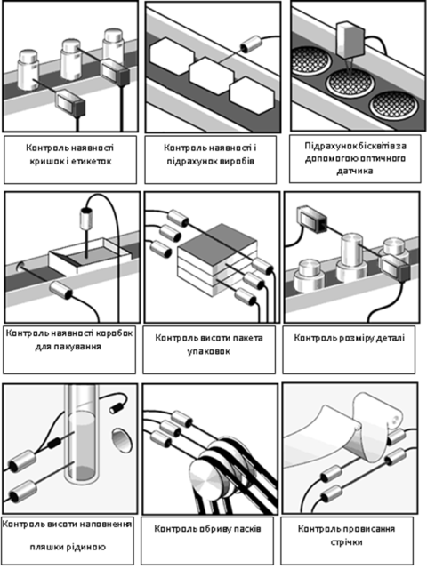

[2.8](2_8.md). Визначення властивостей та складу рідин і газів. <--- [Зміст](README.md) --> [Розділ 3](3.md). Автоматизовані системи регулювання 

## 2.9. Безконтактні датчики положення. 

### 2.9.1. Загальні положення

***Безконтактні датчики положення*** *(датчики наближення, безконтактні перемикачі, кінцеві вимикачі) – це готові рішення у сфері сенсорів для промислової автоматики і автоматизації технологічних процесів практично в будь-яких галузях виробничої діяльності.* Відстань до об’єкта та його матеріалу, на які реагує датчик, залежить від різновиду датчика. Безконтактний спосіб розпізнавання об'єкта дає змогу істотно підвищити надійність роботи установок внаслідок відсутності рухомих деталей, що зношуються.

Безконтактні датчики використовуються для виявлення положення об'єкта, підрахунку, позиціювання і сортування предметів на конвеєрах, контролю переміщення і швидкості, виявлення поломок механізмів, визначення кута повороту, виміру перекосу та ін. Саме тому їх використовують у найрізноманітніших галузях: від металооброблення до харчового виробництва, як елемент автоматизації транспорту і для контролю у верстатобудуванні, для управління водо-, газо-, нафтозабезпеченням і на морських нафтопереробних платформах. Щоб підібрати відповідний датчик, варто ознайомитися з їхньою класифікацією за принципом дії. Розрізняють оптичні, індуктивні, ємнісні й магніточутливі безконтактні датчики положення.

### 2.9.2. Оптичні датчики положення

***Оптичні датчики*** призначені для безконтактного визначення наявності (відсутності) об'єкта в контрольованому просторі з використанням світлочутливих елементів. Використовуються для автоматизації будь-яких промислових процесів, у робототехніці, системах контролю, оброблення і монтажу, упаковки продукції. Фотоелектричний датчик може бути використаний для виявлення об'єктів на відстані від 0 до декількох десятків (сотень) метрів. Реєстрація будь-яких об'єктів і велика дальність дії відрізняє фотодатчик від подібного типу пристроїв.

Оптичний датчик складається з джерела (випромінювача) і приймача оптичного випромінювання, які можуть міститися в одному корпусі (моноблочні датчики) або в різних корпусах (двоблокові датчики). Джерело датчика створює оптичне випромінювання в заданому просторі, приймач реагує на відбитий від об'єкта світловий потік або на переривання його.

Типи датчиків: бар'єрні (тип *Т*); ретрорефлекторні (тип *R*) і дифузійні (тип *D*). Випромінювач і приймач ***бар’єрного оптичного датчика (тип Т)*** розташовані в різних корпусах і мають бути розміщені на одній осі (рис. 2.114). Світловий потік випромінювача спрямований на приймач. Приймач спрацьовує при перериванні оптичного променя об'єктом контролю. Призначення цього датчика – виявлення непрозорих і дзеркальних об'єктів. Дальність дії для цього датчика досягає 150 м, а висока надійність і перешкодозахищеність роблять можливою експлуатацію датчиків на відкритих просторах і в умовах забруднення. Випромінювач і приймач датчика мають різні позначення і замовляються як окремі вироби. Датчики бар'єрного типу успішно застосовуються для контролю за виробничими і пакувальними лініями, для вимірювання рівня заповнення прозорих ємностей, у системах проходу і зонах підвищеного ризику.

Рис. 2.114. Бар’єрний оптичний датчик 

Випромінювач і приймач ***рефлекторного оптичного датчика (тип R)*** розташовані в одному корпусі. Світло випромінювача відбивається від рефлектора (світловідби-вача) і потрапляє в приймач (рис. 2.115). Датчик спрацьо-вує при перериванні світла об'єктом. Область призна-чення датчика – виявлення непрозорих і напівпрозорих об'єктів, дальність дії його досягає 8 метрів. Оптичні датчики рефлекторного типу активно застосовуються на конвеєрах для підрахунку виробів.

Рис. 2.115 Рефлекторний  оптичний датчик

Випромінювач і приймач ***дифузійного оптичного датчика***
 ***(тип D)*** розміщені в одному корпусі. Приймач сприймає світло випромінювача, дифузно відбите від контрольованого об'єкта (рис. 2.116). Датчик спрацьовує за наявності контрольованого предмету в зоні дії датчика. Дальність дії датчика залежить від відбивних властивостей об'єкта. При використанні стандартної мішені дальність дії датчика досягає 2 метрів.

Рис. 2.116. Дифузійний оптичний датчик

На рис. 2.117 наведені приклади використання оптичних датчиків, а на рис. 2.118 їх загальний вигляд.

Рис. 2.117. Приклади використання оптичних датчиків положення

Рис. 2.118. Загальний вигляд оптичних датчиків положення

### 2.9.3. Індуктивні датчики положення

***Індуктивні датчики положення*** використовуються як у системах автоматизації технологічних процесів, так і в системах безпеки й контролю. Спектр використання індуктивних безконтактних вимикачів широкий і включає практично всі галузі промисловості, де необхідна автоматизація процесів. Індуктивні датчики з успіхом застосовуються в машинобудуванні, харчовій промисловості, металургії, верстатобудуванні, деревообробці і т.д. 

Вони реагують на металеві, магнітні, феромагнітні або аморфні матеріали потрібних розмірів. Ефект досягається за рахунок зміни амплітуди коливань генератора при потраплянні об'єкта в чутливу зону датчика.

Загальний вигляд індуктивних датчиків положення показано на рис. 2.119, а нижче (рис. 2.120) наведені приклади їх використання.

Рис. 2.119.  Загальний вигляд індуктивних датчиків

Рис. 2.120. Приклади використання індуктивних датчиків положення

Особливості вживання індуктивних датчиків:

- спрацьовування лише на метал і абсолютна нечутливість до інших матеріалів (наприклад, на відміну від ємнісних датчиків);

- можливість розпізнавання різних груп металів;

- довговічність завдяки відсутності механічної дії і зносу. 

### 2.9.4. Ємнісні датчики положення

Ємнісні датчики виявляють як металеві, так і діелектричні об'єкти. Принцип дії датчика ґрунтується на зміні ємності конденсатора, що виконує роль чутливого елемента, при внесенні до чутливої зони об'єктів. Ємнісні датчики використовуються в системах управління технологічними процесами в багатьох галузях промисловості. Датчики застосовують для виявлення, підрахунку і позиціювання металевих і неметалевих об'єктів, а також для контролю рівня рідини і сипких речовин у резервуарах. 

Принцип дії ємнісних датчиків базується на тому, що між довкіллям і датчиком існує електростатичне поле, при зміні ємності в даному полі (при потраплянні в поле будь-якого об'єкта) спрацьовує датчик. Датчик має чутливу поверхню, утворену двома електродами конденсатора, включеного в ланцюг зворотного зв'язку високочастотного генератора. Наближення об'єкта з металу або діелектрика до чутливої поверхні змінює ємність між електродами конденсатора і викликає зміну амплітуди коливань генератора. При досягненні амплітудою генератора порогового значення схема управління формує вихідний сигнал електронного ключа датчика, який використовується для комутації електричних ланок і сигналізації.

Датчик налаштований на номінальний зазор при спрацьовуванні від металевої пластини. При використанні об'єкта дії з діелектричних матеріалів робочий зазор зміниться і залежатиме від діелектричної проникності матеріалу об'єкта.

На рис. 2.121 наведено приклади використання оптичних датчиків, а на рис. 2.122 – їхній загальний вигляд.

Рис. 2.121. Приклади використання ємнісних датчиків положення

Рис. 2.122. Загальний вигляд ємнісних датчиків положення

Порівняно з індуктивними датчиками ємнісні безконтактні датчики положення мають такі переваги:

- реагують на електропровідні і неелектропровідні матеріали в твердому, порошкоподібному або рідкому стані: скло, кераміку, пластмасу, деревину, папір, картон, масло, воду, хімічні речовини;

- працюють через неметалеві матеріали (наприклад, пластмасу або скло) при контролі рівня наповнення резервуару.

[2.8](2_8.md). Визначення властивостей та складу рідин і газів. <--- [Зміст](README.md) --> [Розділ 3](3.md). Автоматизовані системи регулювання 