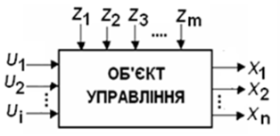
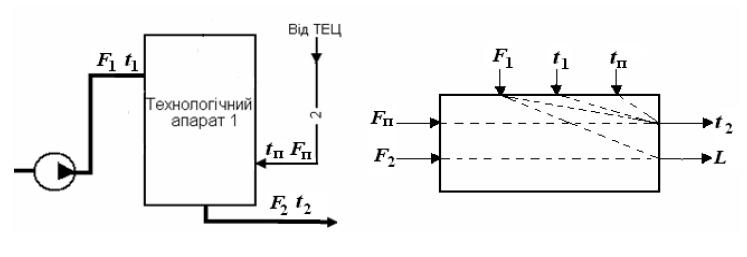

[Розділ 3](3.md). Автоматизовані системи регулювання  <--- [Зміст](README.md) --> [3.2](3_2.md). Основні принципи регулювання

## 3.1. Загальні положення

Автоматика – технічна наука, що вивчає процеси, які відбуваються в автоматичних та автоматизованих системах управління, з метою їх аналізу та розроблення (синтезу) нових систем.

Автоматизація – процес упровадження технічних засобів, що заміняють працю людини з управління.

В автоматичній системі процес управління відбувається без участі людини. В автоматизованій системі, поряд з технічними засобами, в управлінні бере участь людина.

Однією з найбільш розповсюджених систем управління є ***автоматичні системи регулювання (АСР),*** призначенням яких є підтримання технологічних параметрів об’єкта на заданому рівні.

Будь-яку систему управління, узагальнюючи, можна розглядати як сукупність двох основних взаємодіючих елементів: ***об′єкта управління*** та управляючого пристрою, в якості якого в АСР використовується ***автоматичний регулятор***.

Об’єкт управління досить повно можна характеризувати за допомогою параметричних схем (рис. 3.1).

Рис. 3.1. Параметрична схема

В об‘єкті управління  виділяють три типи змінних: регульовані, управляючі та збурення.

***Регульовані (керовані, вихідні)  змінні***  *(Х)* – це змінні, значення яких треба підтримувати на заданому значенні (*Х*) або змінювати за відповідними алгоритмами.

***Збурення*** *(Z) –* це зовнішні дії, які призводять до небажаних змін в об’єкті регулювання, тобто сприяють відхиленню регульованих змінних від заданих значень.

***Управляючі (регулювальні, керувальні) змінні*** *(U)* виробляються регулюючим пристроєм і подаються на об’єкт управління з метою компенсації впливу збурень і ліквідації відхилення регульованої змінної від заданого значення. 

На рис. 3.2 показано фрагмент технологічної схеми і варіант параметричної схеми як завдання для розроблення схеми автоматизації. 

Рис. 3.2. Фрагмент технологічної і параметричної схем

З наведеної технологічної схеми виходить, що у цьому апараті необхідно підтримувати рівень *L* і температуру *t*2 на виході з апарата. Температуру пропонується підтримувати шляхом зміни витрати пари *F*п з ТЕЦ, а рівень в апараті – шляхом зміни витрати середовища на виході з апарата *F*2. При цьому показано, що в цьому варіанті збурювальними факторами, які впливають на температуру *t*2, є
 температура *t*1 і витрата *F*1 рідини на вході, а також температура
 пари *t*п. В якості збурення, що впливає на рівень *L*, показане значення витрати продукту на вході – *F*1. Хоча можливі і інші варіанти, наприклад, температуру на виході *t*2 можна регулювати шляхом зміни витрати *F*1.

До складання параметричних схем, які можуть бути використані для розроблення системи автоматизації, доцільно широко залучати технологів і обслуговуючий персонал. 

Для загальної характеристики автоматичних систем регулювання і управління використовують ряд ознак, які дають змогу виділити один клас складних систем. Так, можна виділити ***одно***- та ***багатовимірні*** системи відповідно з однією або багатьма вихідними (регульованими) величинами. Зрозуміло, що системи автоматичного чи автоматизованого управління складними об'єктами є багатовимірними. У свою чергу, останні можуть бути системами ***непов'язаного*** і ***пов***'***язаного*** управління. У першому випадку кілька технологічних параметрів не пов’язані між собою і для кожного з них використовується окремий регулятор, який працює незалежно від інших (автономно). У другому випадку регульовані параметри пов'язані між собою спільними матеріальними та енергетичними потоками, процесами, що відбуваються в об′єкті, і незалежне регулювання їх неефективне, а то й просто неможливе. Тому в системах зв'язаного управління вводяться додаткові зв'язки для забезпечення (за необхідності) незалежності одного регульованого параметра від іншого – ***автономні системи***. У рамках багатовимірних систем реалізуються також ***інваріантні системи*** на основі компенсації основних збурень. Слід зазначити, що реальні об'єкти, як правило, багатовимірні, але при технічній реалізації АСР у кожному конкретному випадку потрібно встановити доцільність створення багатовимірних систем на підставі оцінки щільності зв'язку між параметрами та інтенсивністю збурень.

При оцінюванні АСР важливою ознакою є також характер перетворень сигналів окремих елементів чи в системі в цілому. Так, системи називають ***лінійними***, якщо вони досить точно можуть описуватися лінійними залежностями. Це певна ідеалізація, тому що більшість реальних систем є ***нелінійними***. Оскільки для лінійних систем розроблено загальні, наочні та прості методи аналізу і синтезу, тому й намагаються, якщо це можливо, нелінійні системи приводити до лінійних, тобто здійснювати їхню ***лінеаризацію***. 

Визначальною ознакою лінійних систем є можливість застосування до них принципу ***суперпозиції***, згідно з яким реакція системи на будь-яку комбінацію дій визначається як сума реакцій на кожну з них. Це дає змогу застосовувати ефективний прийом у процесі аналізу та синтезу АСР: вивчати поведінку системи при кожній дії окремо, нехтуючи іншими, а потім одержати загальний результат як суму частинних. 

При тривалій роботі системи управління відбуваються певні зміни її характеристик, передусім об'єкта управління. Тому в загальному випадку всі системи умовно поділяють на ***стаціонарні*** та ***нестаціонарні***. Для перших приймаються припущення, що параметри системи не змінюються протягом певного проміжку часу або ними можна знехтувати. Для інших – зміни параметрів набувають суттєвого значення і їх необхідно враховувати. Це зумовлює створення ***адаптивних*** систем, призначенням яких є забезпечення можливості урахування змінюваних у часі характеристик і умов роботи системи управління. Системи в такому разі ускладнюються, але при суттєвій нестаціонарності об’єкта забезпечують високі техніко-економічні показники роботи.

За характеристиками сигналів усі системи поділяють на ***неперервні*** (в літературі вживається термін “аналогові”) та ***дискретні***. У неперервних системах усі сигнали – це неперервні функції часу. В дискретних системах є елементи, вихідні сигнали яких змінюються стрибкоподібно при плавній зміні вхідних і являють собою імпульси певної величини й тривалості. До дискретних систем належать позиційні (релейні), імпульсні та цифрові. Останні мають найбільше значення у зв’язку із використанням у системах управління мікропроцесорних пристроїв та ЕОМ.

Використання в системах управління мікропроцесорних засобів та ЕОМ дають можливість реалізувати складні, досконалі методи та алгоритми. Зокрема, створюються ***екстремальні*** й ***оптимальні*** системи. Перші дають змогу підтримувати роботу об'єкта навколо точки, яка відповідає екстремуму його статичної характеристики. Наприклад, у теплогенераторах це точка з максимальним тепловиділенням, що відповідає певному співвідношенню палива й повітря. Оптимальні системи передбачають формування деякого узагальненого показника (критерію оптимальності), за яким можна оцінити процес функціонування в існуючих умовах (обмеженнях) та при наявних ресурсах. У цих системах критерій оптимальності завжди набуває екстремального характеру (min чи max). Наприклад, максимальний випуск продукції чи мінімальні витрати ресурсів при існуючих обмеженнях на якість продукції, значення технологічних параметрів та ін. Останнім часом широкого розповсюдження набувають інтелектуальні системи управління з використання методів підтримки прийняття рішень.

 

[Розділ 3](3.md). Автоматизовані системи регулювання  <--- [Зміст](README.md) --> [3.2](3_2.md). Основні принципи регулювання