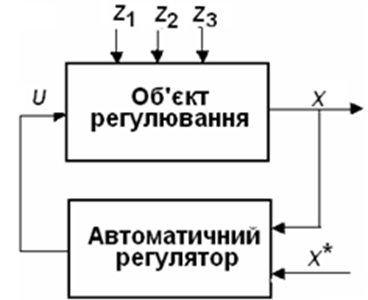
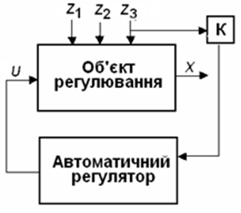
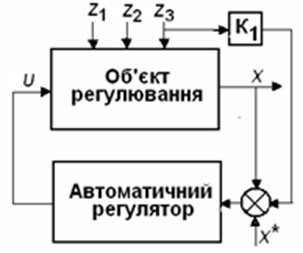
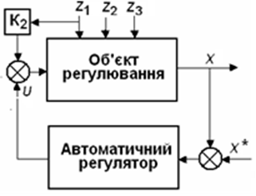
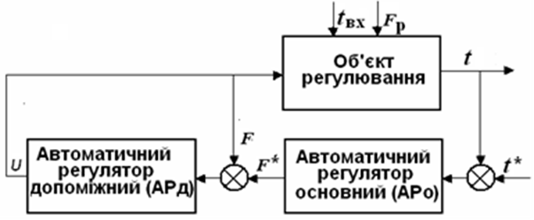

[3.1](3_1.md). Загальні положення <--- [Зміст](README.md) --> [3.3](3_3.md). Стабілізувальне, програмне та слідкувальне регулювання

## 3.2. Основні принципи регулювання

Автоматичні системи виконують різні функції, але практикою автоматизації вироблено деякі загальні методи їх побудови. 
 За допомогою останніх вибирається структура системи, процес формування управлінь, точки одержання та шляхи передачі інформації. Це  ***принципи регулювання*** (управління).

Практично всі АСР галузі побудовані на базі використання двох основних принципів регулювання: ***за відхиленням*** та ***за збуренням***, причому АСР за відхиленням є найбільш поширеною. 

В АСР за відхиленням (рис. 3.3) на автоматичний регулятор (АР) надходить сигнал регульованої змінної від об'єкта регулювання (*Х*) і задане її значення (Х\*). Тобто на вхід регулятора поступає “відхилення (розузгодження)” (∆*Х*=*Х*–Х\*) регульованої змінної від за­даного значення. Автоматичний регулятор (АР) виробляє управляючу дію (*U*), яка поступає на вхід об‘єкта регулювання (ОР) з метою ліквідації цього відхилення.

Рис. 3.3. АСР за відхиленням

Перевага такої АСР у тому, що для регулювання не потрібно вимірювати жодного збурення, бо відхилення є наслідком дії їх усіх. Ця система також має назву замкненої АСР, або АСР із зворотним зв'язком.

Недоліком системи є те, що процес регулювання починається лише після виникнення розузгодження ∆*Х*. Для інерційних об'єктів це може призвести до неприпустимих по технології відхилень. 

В АСР за збуренням (рис. 3.4) на АР передається інформація про збурення, що виникло на вході в ОР.

Рис. 3.4. АСР за збуренням

Для більшості систем інерційністю автоматичного регулятора можна знехтувати порівняно з інерційністю об'єкта. В такому випадку сигнал *U* з'являється практично в той самий момент, що й виміряне *Z*3, тому управління може встигнути компенсувати дію збурення, тобто відхилення ∆*Х* внаслідок дії такого збурення може дорівнювати нулю. Це, безумовно, є перевагою цієї системи. 
 Але суттєвим недоліком такої АСР є те, що вона реагує лише на те збурення, сигнал якого подається на АР. На ОР в умовах виробництва діє значна кількість збурень, деякі з них неможливо контролювати. Під дією цих збурень вихідна змінна X відхиляється від заданого значення, а система не реагує на ці відхилення.

У галузі найбільш поширені АСР за відхиленням. Зважаючи на основний недолік, АСР за збуренням застосовується лише в тих випадках, коли відсутні автоматичні датчики регульо-ваних змінних *X* або якщо ці датчики мають дуже велику інерційність, а з численних збурень на ОР можна виділити основне, дія якого буде компенсуватися АР. Наприклад, за такою схемою відбувається регулювання вмісту сухих речовин в дифузійному соці цукрового виробництва. Основним збуренням на об'єкт є зміна витрат бурякової стружки в дифузійний апарат. Цей сигнал надходить на регулятор співвідношення "стружка – вода". При зміні цього сигналу регулятор змінює приток води в апарат таким чином, щоб співвідношення двох витрат, а тим самим і концентрація сухих речовин, лишалися незмінними. Але ця система не реагує на інші збурення: зміну якості бурякової стружки, або температури екстракції, дія яких також впливає на концентрацію. Сигнал за збуренням обробляється спеціальним пристроєм – компенсатором (К), а система в цілому є розімкненою.

У разі, якщо застосування розглянутих принципів регулювання не забезпечує отримання бажаних результатів, застосовується більш складна багатоконтурна АСР, наприклад, ***комбінована система***, яка поєднує принципи побудови АСР за збуренням і відхиленням.

Комбіновані АСР використовуються для автоматизації об'єктів, у яких можна виділити збурення, які найбільш впливають на регульовану змінну. Існують два типи комбінованих АСР:

- системи з компенсатором, підключеним до об'єкта (рис. 3.5);

- системи з компенсатором, підключеним на вхід регулятора (рис. 3.6).

Рис. 3.5. Комбінована АСР з компенсатором, підключеним до об'єкта

Рис. 3.6. Комбінована АСР з компенсатором, підключеним на вхід регулятора

Як видно зі структурних схем, обидві системи мають два канали впливу на регульовану змінну і використовують два контури регулювання. Один, розімкнений і менш інерційний, забезпечує реакцію системи на найбільш впливове збурення, а другий, замкнутий, забезпечує ліквідацію відхилення регульованої змінної від заданого значення, викликаного дією всіх інших збурень.

У випадках, коли одноконтурні системи автоматизації не дають змоги досягти високої якості регулювання, використовують більш складні АСР, наприклад ***каскадні АСР*.**

В каскадних системах виділяють основну і допоміжну регульовану змінну, для кожної з яких створюється свій «основний» і «допоміжний» контур регулювання. На рис. 3.7 наведено структурну схему каскадної системи стабілізації температури рідини на виході з теплообмінника, в якій допоміжним контуром є АСР витрати гріючої пари *F*. При зміні збурення по тиску пари цей регулятор АРд змінює ступінь відкриття регулюючого клапана, встановленого на трубопроводі подачі пари таким чином, щоб підтримати задану витрату пари. Але при порушенні теплового балансу за рахунок зміни температури на вході *t*вх у теплообмінник або витрати рідини *F*р вихідна температура *t* починає змінюватись. Починає працювати основний регулятор АРо, який коригує задане значення регулятора витрати F\*.

Рис. 3.7. Каскадна АСР

Використання каскадних схем ефективно у тому випадку, коли запізнення у контурі регулювання основної величини суттєво більше, ніж у контурі регулювання допоміжної величини.

[3.1](3_1.md). Загальні положення <--- [Зміст](README.md) --> [3.3](3_3.md). Стабілізувальне, програмне та слідкувальне регулювання