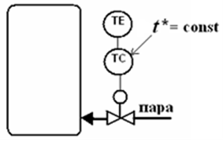
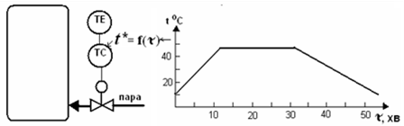
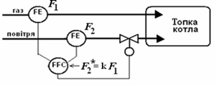

[3.2](3_2.md). Основні принципи регулювання <--- [Зміст](README.md) --> [3.4](3_4.md). Стійкість і якість процесів регулювання

## 3.3. Стабілізувальне, програмне та слідкувальне регулювання

АСР мають різні види алгоритмів функціонування, але визначальною ознакою є характер зміни заданого значення. 

За законом зміни завдання, під час регулювання розрізняють стабілізувальне, програмне та слідкувальне регулювання**.**

Для більшості апаратів безперервної дії потрібно підтримувати на постійному рівні значення регульованих змінних – вирішувати завдання стабілізації. З цією метою при ***стабілізувальному регулюванні*** потрібно підтримувати постійне значення Х=const. Це, наприклад, системи стабілізації рівня по корпусах випарної установки, стабілізації тиску та температури в спиртовій колоні та ін. 

Задане значення у цьому випадку може змінювати тільки оператор. На рис. 3.8 показано регулятор температури *ТС*, на який подається сигнал від датчика температури *ТЕ* і задане значення t\*. Регулятор керує регулюючим органом, змінюючи подачу пари, щоб підтримати температуру на заданому значенні.

Рис. 3.8. Стабілізувальне регулювання

У багатьох апаратах періодичної дії потрібно змінювати регульовану величину за деякою наперед відомою залежністю (наприклад, температуру в сусловарочному котлі або подачу субстрату в ферментер періодичної дії). Ця залежність і є програмою зміни завдання з плином
 часу Х\*=f(t). Такі системи називаються **системами програмного регулювання**.

У наведеному прикладі функція зміни температури задана у вигляді графіка, який повинен реалізувати програматор (рис. 3.9).

Рис. 3.9. Програмне регулювання

У системах ***слідкувального регулювання*** завдання також є змінним і залежить від зміни іншої змінної, тобто Х= f(Х1) (рис. 3.10). До таких систем, наприклад, відносяться всі системи регулювання співвідношення двох витрат, коли при зміні значення однієї витрати повинна змінитись витрата іншого параметра, зберігаючи задане співвідношення між ними.

 

Рис. 3.10. Слідкувальне регулювання 

[3.2](3_2.md). Основні принципи регулювання <--- [Зміст](README.md) --> [3.4](3_4.md). Стійкість і якість процесів регулювання

