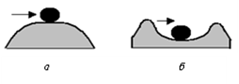
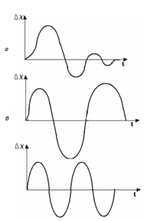
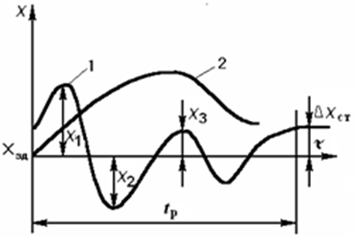

[3.3](3_3.md). Стабілізувальне, програмне та слідкувальне регулювання <--- [Зміст](README.md) --> [3.5](3_5.md). Основні властивості об'єктів регулювання

## 3.4. Стійкість і якість процесів регулювання

Технологічні процеси, які відбуваються в об'єктах регулювання, перебувають під дією різного роду збурень. Збурення порушують нормальний перебіг технологічного процесу, тому основним призначенням АСР є або підтримання заданого постійного значення регульованого параметра, або зміна його за визначеним законом.

На автоматичну систему регулювання можуть діяти два види збурень – за навантаженням і за зміною завдання. Збурення за навантаженням – це зміна кількості речовини або енергії, які витрачаються при виконанні технологічного процесу і діє на об’єкт. Збурення за завданням – це зміна заданого значення регульованої змінної, яке діє на регулятор. Обидва види збурень призводять до виникнення перехідного процесу**.**

Властивість автоматичної системи регулювання відновлювати стан рівноваги, з якого вона була виведена під впливом тих чи інших впливів, називається ***стійкістю***. Стійкість – найважливіша умова працездатності автоматичної системи регулювання. Якщо система не має стійкості, то вона не може мати практичного використання.

На рис. 3.11 проілюстровано поняття стійкості. На рис. 3.11, *б* пояснює функціонування стійкої АСР. Тобто, якщо штовхнути кульку з відповідними зусиллям, то кулька повернеться у вихідний стан. Але якщо зусилля буде значним, то кулька може вийти за відповідні межі (межі стійкості) і не повернеться у вихідний стан. Як видно на рис. 3.11, *а*, у нестійкій системі, якщо на кульку  діятиме сила – кулька вже не повернеться у вихідний стан. Існують спеціальні аналітичні і експериментальні методи визначення стійкості АСР.

Рис. 3.11. Ілюстрація стійкості АСР: *а* – нестійка АСР; *б* – стійка АСР

Внаслідок зміни дії збурення на об'єкт або зміни завдання на регулятор, в АСР виникає ***перехідний процес*** – перехід під попереднього до наступного станів рівноваги.

Якщо система регулю-вання після нанесення збурення повертається в заданий стан рівноваги (коли ∆*Х* = 0), то така АСР називається стійкою, а перехідний процес переходу від одного стану рівноваги до іншого має збіжний характер (рис. 3.112, а). 

Рис. 3.12.  Перехідні процеси в системі: *а* - стійкій; *б* – нестійкій; *в* – на межі стійкості (незатухаючі коливання)    

Якщо система регулювання після порушення рівноваги, викликаної збу-ренням, з часом віддаляється від стану рівноваги (коли ∆*Х* > 0), то така система називається нестійкою, а перехідний процес в ній – розбіжним (рис. 3.12, *б*).

Якщо система регулювання після порушення рівноваги, викликаної збуренням, здійснює періодичні коливання, що не затухають, то така АСР знаходиться на межі стійкості, а її перехідний процес – незатухаючий коливальний (рис. 3.12, *в*).

Стійкість автоматичної системи регулювання є основною, але недостатньою умовою, яка визначає її працездатність. Система автоматичного регулювання повинна відповідати певним показникам якості процесу регулювання. Вимоги до показників якості процесів регулювання задаються, виходячи насамперед з технологічних вимог до конкретного процесу. Як правило, ці вимоги припускають деякі коливання технологічних параметрів у визначених межах.

Точність дотримання технологічних параметрів суттєво впливає на якість готової продукції, ефективність використання сировини і матеріальних ресурсів, тобто на якість і собівартість продукції. Але необґрунтоване завищення вимог до якісних показників АСР не завжди виправдовується, оскільки потребує використання більш складних схем автоматизації, відповідних високоточних приладів, тобто потребує більших витрат.            

Для оцінювання якості регулювання використо-вують прямі та непрямі показники. До прямих належать ті, які можна одержати безпосередньо на графіку перехідного процесу (рис. 3.13). На рисунку зображено коливальний *1* та аперіодичний *2* збіжні перехідні процеси. Максимальне відхилення $X_1$ (перша амплітуда) називають ***динамічною похибкою***, а відхилення по закінченні перехідного процесу $\Delta X_{СТ}$ – ***статичною***.

Рис. 3.13. Показники якості перехідних процесів

Важливим показником є ***час регулювання*** $t_р$. Його визначають до моменту, коли можна чітко встановити, що $\Delta X = const$ (або $\Delta X_{СТ}=0$ в астатичній системі), чи коли $Х(t)$ не перевищує значення $0,05Х_1$. На основі вимірів амплітуд коливань $Х_1, Х_2, Х_3$ відносно нового усталеного значення *X* розраховуються показники, які характеризують стійкість АСР і є показниками якості перехідного процесу. Такими показниками є ***перерегулювання***  $\frac{X_2}{X_1}\cdot 100\%$та ***ступінь затухання***:

$$
\Psi = \frac{X_1-X_3}{X_1} \tag {3.1}
$$

Наприклад, у найбільш стійкій АСР виникає аперіодичний (без коливань) процес, тобто ψ = 1. Якщо в системі виникли автоколивання ($Х_3 = Х_1$), то ψ = 0. Такий перехідний процес характерний лише для систем з позиційними регуляторами і неприпустимий для інших. Якщо кожна наступна амплітуда коливань перевищує попередню (\|ψ\|>1), система є нестійкою, що неприпустимо. Таким чином, стійкою є АСР, що приходить до нового стану рівноваги. Перехідні процеси в ній бажано мати $0,75<ψ≤1,0$.

Виникає запитання: яким значенням показників якості повинна відповідати система? Це розв'язується в кожному конкретному випадку і визначається технологічними вимогами до системи – особливостями технологічного режиму та регламенту. Так, за технологічним регламентом завжди встановлюються допустимі відхилення від заданого режиму, тобто повинно бути $Х_1 \leq X_{доп}$ (допустиме значення). Часто в процесі роботи необхідно, щоб регульований параметр не змінював знаку відносно $Х_{зд}$, і тоді в системі потрібно забезпечити аперіодичні процеси. Слід відзначити, що технологічні вимоги до АСР, які працюють зі складними об'єктами, досить жорсткі.

Якщо треба одержати узагальнену оцінку процесу регулювання, то використовують непрямі показники – критерії якості, наприклад, лінійний ***інтегральний***:

$$
I_1=\int_0^{t_p}\Delta X{d}t \tag{3.2}
$$
Цей критерій має чіткий фізичний зміст: необхідно забезпечити мінімум площі під кривою перехідного процесу $I_1 \to min$, що відповідало б зменшенню відхилення $Х_1$ та скороченню $t_p$. Для оцінювання якості аперіодичних перехідних процесів зручно використовувати інтегральний критерій, а для коливальних – ***квадратичний інтегральний***:

$$
I_2=\int_0^{t_p}\Delta X^2 {d}t \tag{3.2}
$$

Оскільки система автоматизації складається з об'єкта регулювання та регулятора, то на її властивості і показники якості перехідних процесів впливають як властивості об'єкта регулювання, так і властивості регулятора.

[3.3](3_3.md). Стабілізувальне, програмне та слідкувальне регулювання <--- [Зміст](README.md) --> [3.5](3_5.md). Основні властивості об'єктів регулювання