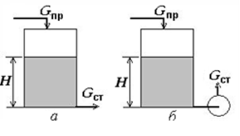
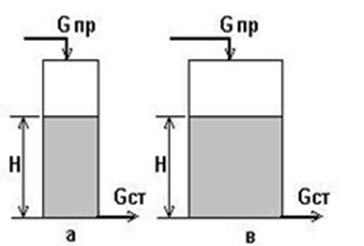
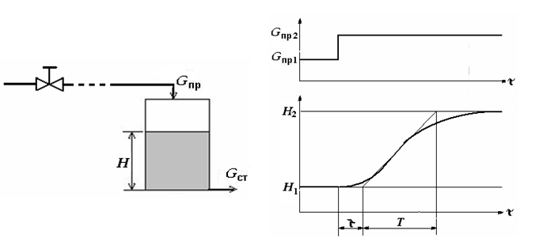

[3.4](3_4.md). Стійкість і якість процесів регулювання <--- [Зміст](README.md) --> [3.6](3_6.md). Автоматичні регулятори

## 3.5. Основні властивості об'єктів регулювання

Об'єкт регулювання є основною складовою частиною автоматичної системи і визначає її характер. Деякі властивості об’єкта сприяють якісному процесу регулювання, інші заважають, тому визначення характеристик і властивостей об’єкта регулювання є дуже важливим завданням. 

Незважаючи на широку різноманітність об'єктів регулювання, всі вони мають ряд загальних властивостей: самовирівнювання, ємність, інерційність і запізнення.

***Самовирівнювання*** – здатність об‘єкта самостійно надходити до нового стану рівноваги після нанесення на нього збурення. Розглянемо цю властивість на прикладі резервуара, вхідними діями на який є зміна притоку та стоку рідини в ємність, а вихідною величиною, яка характеризує стан об’єкта, є зміна рівня в ньому (рис. 3.14).

Рис. 3.14. Гідравлічні об'єкти

Якщо, наприклад, збільшився приток в об'єкт (рис. 3.14, *а*), то це приводить до збільшення рівня рідини. Внаслідок цього зростає гідростатичний тиск, що призводить до збільшення стоку. Різниця між притоком і стоком зменшується, тобто зменшується швидкість зростання рівня. При достатній зміні рівня приток і сток зрівнюються й настає новий стан рівноваги.

Збільшення притоку в об’єкт (рис.3.14, *б*) також спричинює зростання рівня та гідростатичного тиску. Але збільшення останнього не призводить до збільшення стоку і досягнення нового стану рівноваги, оскільки на стоці встановлено насос, який має певну продуктивність. Тому різниця між притоком і стоком залишається незмінною і рівень зростає з постійною швидкістю. Отже наявність самовирівнювання існує, коли зміна вихідної величини певним чином впливає на зміну вхідної дії, що дає змогу об’єкту самостійно переходить до нового стану рівноваги. 

Об‘єкти, які мають властивість самовирівнювання, називаються статичними, а без самовирівнювання – астатичними.

Наявність самовирівнювання полегшує автоматичне регулювання, збільшує стійкість АСР у цілому. Більше 95 % об‘єктів галузі мають цю властивість.

***Ємність*** об‘єкта показує кількість речовини або енергії, що акумулюється в об'єкті при даному значенні вихідної величини. Наприклад, при однаковій температурі в різних об'єктах міститься різна кількість теплової енергії, що залежить від їх теплоємності. Вплив ємності на якість регулювання розглянемо також на прикладі гідравлічних об’єктів (рис. 3.15).

Рис. 3.15. Об‘єкти з меншою (а)  і більшою (б) ємністю

Очевидно, що при дії однакового збурення рівень буде змінюватися з більшою швидкістю в тому об'єкті, ємність якого  менша. Але краще піддаються процесу автоматичного регулювання об’єкти, які мають більшу ємність.

Ще однією властивістю об'єкта регулювання є ***запізнення*,** показником якого є час запізнення. Під ним розуміють різницю часу між моментами нанесення збурення або зміною вхідної величини та початком зміни вихідної змінної. Розрізняють запізнення перехідне і транспортне. ***Перехідне (ємнісне) запізнення***, яке також називається інерційністю, характерне для багатоємнісних об'єктів. Величина цього запізнення зростає зі збільшенням кількості ємностей і виникає під час подолання потоком речовини або енергії опору, які розділяють гідравлічні, теплові та інші ємності об'єкта. 

***Транспортне (чисте) запізнення*** – час, необхідний для того, щоб потік речовини або енергії, який має певну швидкість, пройшов відстань від місця внесення збурення до місця, де вимірюється значення регульованого параметра. 

Загальне запізнення складається з суми окремих запізнень. Запізнення завжди негативно впливає на якість регулювання, тому необхідно намагатися його зменшити. 

Властивості об'єкта регулювання впливають на показники якості процесу регулювання.

Розглядають статичні і динамічні характеристики об'єкта управління.

***Статичною характеристикою об'єкта*** називають залежність його вихідної величини від вхідної в усталеному режимі. Статичні характеристики об'єкта показують його властивості тільки в рівноважному стані і визначаються експериментальним або аналітичним шляхом. Більшість реальних об’єктів нелінійні. Розрахунок таких систем дуже складний, тому використовуються методи лінеаризації. Для характеристики об'єкта в інших станах необхідно знати його динамічні властивості.

***Динамічною характеристикою об'єкта*** називається зміна вихідної (регульованої) величини в часі у перехідному режимі. Найбільш розповсюдженим експериментальним методом визначення динамічних характеристик є побудова кривої розгону, яка визначає зміну регульованої величини при нанесенні на вхід об'єкта миттєвого стрибкоподібного збурення. За допомогою кривої розгону визначають такі динамічні характеристики: ***запізнення ($\tau$)*, *постійну часу (Т)*** і ***коефіцієнт передачі ($К_{об}$)***. На рис. 3.16 показано криву розгону, яка отримана для об’єкта, наведеного на рис. 3.14, і властивості якого розглянуті вище при описі властивості самовирівнювання. На рисунку показано, що клапан притоку знаходиться на певній відстані від об’єкта. Це створює транспортне запізнення, оскільки повинен пройти деякий час після того, як клапан відкриється і рідина потрапить у збірник.

Рис. 3.16. Крива розгону

В усталеному режимі стік $G_{ст1}$ дорівнював притоку $G_{пр1}$ і рівень в ємності був постійним зі значенням $Н_1$. В деякий момент часу при відкриванні клапана стрибкоподібно збільшився приток і став дорівнювати *G*пр2.  Оскільки  $G_{пр2}> G_{ст1}$, то рівень в ємності починає збільшуватись. Однак внаслідок збільшення гідростатичного тику поступово починає збільшуватися стік до моменту, поки нове значення $G_{ст2}$ не стане дорівнювати притоку $G_{пр2}$. Виникне новий зрівноважений стан, при якому в об’єкті встановиться новий рівень $Н_2$. По кривій розгону можна визначити динамічні характеристики об'єкта. Для визначення часу запізнення τ і постійної часу $Т$ до кривої розгону проводиться дотична. Графічне визначення $\tau$ і $Т$ показано на рис. 3.16. Коефіцієнт передачі $К_{об}$ визначається як відношення зміни вихідної величини $Н$ між двома станами рівноваги до величини стрибкоподібного збурення, яке викликало цю змінну:

$$
K_{ОБ}=(H_2-H_1)/(G_{пр2}-G_{пр1}) \tag{3.4}
$$

Динамічні характеристики та параметри об'єктів регулювання використовують для вибору регуляторів та їх настоювання. 

[3.4](3_4.md). Стійкість і якість процесів регулювання <--- [Зміст](README.md) --> [3.6](3_6.md). Автоматичні регулятори