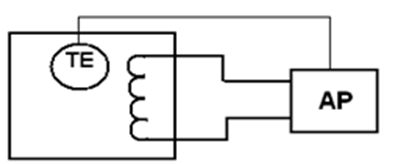

[3.5](3_5.md). Основні властивості об'єктів регулювання <--- [Зміст](README.md) --> [Розділ 4](4.md). Виконавчі механізми і регулюючі органи 

## 3.6. Автоматичні регулятори

Як вже було показано раніше, основним елементом АСР є автоматичний регулятор – керувальний пристрій для вироблення управляючого сигналу на об'єкт управління з метою підтримання технологічних змінних на заданому рівні. На вхід автоматичного регулятора поступає розузгодження $∆Х$, яке являє собою різницю між поточним значенням регульованої змінної $X$ і його заданим значенням Х\*, тобто ∆Х= Х–Х\*. Регулятор повинен виробити управляючу дію $U_р$, яка повинна ліквідувати розузгодження. Залежність $U_р=f(∆Х)$ називається законом регулювання. 

За способом дії автоматичні регулятори розподіляються на регулятори прямої та непрямої дії.

У регуляторах прямої дії для переміщення регулюючого органу використовується безпосередньо енергія регульованої величини. Вони застосовуються у випадках, коли регульована змінна має достатню енергію для переміщення регулюючого органу. На рис. 3.17. наведені схеми регуляторів прямої дії тиску та рівня. 

Рис. 3.17. Регулятори прямої дії:  *а* – рівня; *б* – тиску

У регуляторі рівня (рис. 3.17, *а*) при зміні рівня змінюється положення поплавка *1*, який через важіль 2 впливає на ступінь відкриття регулюючого органу (клапана) *3*. Тобто коли рівень збільшується, клапан прикривається і зменшує надходження рідини у збірник. Задане значення рівня залежить від довжини штока *4*.

У регуляторі тиску (рис. 3.17. *б*) при зміні тиску змінюється положення мембрани *1*, яка через шток впливає на положення регулюючого органу (клапана) *4*. При збільшенні тиску клапан прикривається. Завдання регулятора змінюється гайкою *3*, переміщення якої змінює ступінь стиснення пружини *2*.

У регуляторах непрямої дії енергія до їхніх елементів, насамперед до підсилювача потужності, подається від зовнішнього джерела живлення, завдяки чому можна розвивати досить великі динамічні зусилля при переміщенні регулюючих органів та забезпечувати можливість територіального розподілення автоматичного регулятора й виконавчого механізму з регулюючим органом. Крім того, регулятори непрямої дії мають більш високу швидкодію й точність.

При реалізації законів керування технічними засобами автоматичні регулятори можуть бути неперервними (аналоговими) та дискретними. В неперервних регуляторах вхідні та вихідні сигнали є неперервними функціями часу, в дискретних, до яких належать релейні (позиційні), імпульсні та цифрові, вихідний сигнал має стрибкоподібну форму або є послідовністю імпульсів.

У двопозиційних регуляторах регулюючий орган може займати одне з двох крайніх положень, наприклад, «Відкрито» або «Закрито». Зокрема, при регулюванні температури в теплообміннику (рис. 3.18) позиційний регулятор переключає регулюючий орган при досягненні температури заданого максимального або мінімального значення (вмикає або вимикає теплоелектронагрівач). На рис. 3.19 показано характер процесу двопозиційного регулювання. 

Рис. 3.18. Регулювання температури позиційним регулятором

Як видно з рис. 3.19, цей процес має  незатухальний (автоколивальний) характер. Діапазон між мінімальними і максимальними значенням регульованої величини називається зоною нечутливості позиційного регулятора, тому що коли значення регульованої величини знаходиться всередині цієї зони, регулятор не реагує на її зміну. Переключення регу-люючого органу відбува-ється лише тоді, коли регульована величина досягне однієї з меж зони нечутливості. Амплітуда автоколивань  залежить насамперед від величини зони нечутливості. Але її зменшення викликає збільшення частоти перемикань регулюючого органу, що призводить до зменшення терміну роботи АСР. Частота переключень залежить також від сталої часу *Т* об'єкта регулювання. В об'єктах з малими значеннями *Т* регульована величина змінюється швидко, тому при регулюванні будуть відбуватися часті переключення, і система швидко виробить свій ресурс. Таким чином, двопозиційні регулятори використовують для тих процесів, які відбуваються в достатньо інерційних об'єктах, які мають велике значення ємності, а технологічні вимоги допускають досить значні коливання регульованої змінної.

Рис. 3.19. Графік позиційного регулювання температури

У ***регуляторів неперервної дії*** при неперервній зміні сигналу на вході регулятора регулюючий орган також переміщується неперервно. Залежність, яка показує, як змінюється регулювальна дія регулятора (вихідний сигнал $U_р$) від величини розузгодження (вхідний сигнал $\Delta Х$) $U_р=f(\Delta Х)$, називається законом регулювання.

У регуляторах неперервної дії можуть використовуватися такі закони регулювання: пропорційні (П-регулятори); інтегральні (І-регулятори); пропорційно-інтегральні (ПІ-регулятори); пропорційно-диференціальні (ПД-регулятори); пропорційно-інтегрально-диференціальні (ПІД-регулятори).

Розглянемо властивості деяких з них.

У ***пропорційних (П) регуляторах*** управляюча дія пропорційна сигналу розузгодження:

$$
U_p=K_p\cdot \Delta X \tag {3.5}
$$

Для аналізу особливостей П-регулятора продиференціюємо рівняння 3.5:

$$
\frac{dU_p}{dt}=K_p \frac{d(\Delta X)}{dt} \tag{3.6}
$$

З (3.6) виходить, що процес регулювання почнеться, коли управляючий сигнал $U_Р$ почне змінюватись, тобто  $\frac{dU_p}{dt}\neq 0$ Це станеться тоді, коли починає змінюватися з якоюсь швидкістю сигнал розузгодження $\Delta X$, тобто $\frac{d\Delta X}{dt} \neq 0$.  Тобто регулювання почнеться практично одночасно з появою відхилення регульованої змінної від заданого значення. 

Як тільки розузгодження перестане змінюватись, тобто коли $\frac{d\Delta X}{dt} = 0$, процес регулювання досить швидко завершується ( $\frac{dU_p}{dt}\neq 0$ ). Але при цьому величина $\Delta Х$ може не дорівнювати 0. Це означає, що регульована змінна не досягла заданого значення, а залишилася на величині, яке відрізняється від нього. Це призводить виникнення статичної похибки – різниці між заданим значенням регульованої змінної та її значенням, яке залишається в кінці процесу регулювання.

Величина статичної похибки залежить від коефіцієнта передачі регулятора $К_р$. Це значення є параметром настроювання П-регулятора, значення якого вибирається в залежності від властивостей об’єкта регулювання і показників якості процесу регулювання, що встановлюється для даної АСР. Чим більший коефіцієнт передачі, тим менша статична похибка. Але збільшення коефіцієнта передачі обмежене вимогами стійкості системи регулювання. При великих значеннях $К_р$ незначне розузгодження $\Delta Х$ може призвести до значних змін $U_р$ і процес регулювання буде наближатися до меж стійкості, а характер перехідного процесу наближатиметься до автоколивального, тобто до позиційного закону регулювання

Таким чином, П-регулятори мають добрі динамічні характеристики, тобто процес регулювання характеризується малим часом регулювання і погані статичні характеристики, тому що в кінці регулювання виникає статична похибка. Тому П-регулятори використовуються у випадках, коли час регулювання має бути невеликим, а технологічний процес припускає наявність статичної похибки.

Наведені на рис. 3.17 регулятори прямої дії працюють за пропорційним законом регулювання. Наприклад, якщо значення тиску в трубопроводі збільшиться, то мембрана прогинатиметься сильніше, і регулюючий орган буде прикриватися, зменшуючи витрату речовини. Але й пружина, яка виступає у ролі зворотного зв'язку, буде більше стискуватись і протидіяти прогину мембрани. 
 Як тільки сила протидії стане дорівнювати силі тиску, рух рухомих частин регулятора призупиниться і настане новий стан рівноваги, при якому новому значенню тиску відповідатиме нове пропорційне положення регулюючого органу.

У ***пропорційно-інтегральних (ПІ) регуляторах*** управляюча дія пропорційна як розузгодженню, так і інтегралу від нього:

$$
U_p=K_p(\Delta X + \frac{1}{T_i}\int_0^{t_p}\Delta X \cdot dt) \tag {3.7}
$$

Для аналізу особливостей ПІ-регулятора скористаємось методикою, яку використовували для П-регулятора.

Якщо продиференціювати рівняння для ПІ-закону, отримаємо:

$$
\frac{dU_p}{dt}=K_p(\frac{d\Delta X}{dt}+\frac{1}{T_i}\cdot \Delta X) \tag{3.8}
$$

З аналізу рівняння (3.8) видно, що процес регулювання ($\frac{dU_p}{dt}\neq 0$) починається, як і в системі з П-регулятором, коли почнеться змінюватись розузгодження ($\frac{d\Delta X}{dt} \neq 0$). Але закінчиться процес регулювання ($\frac{dU_p}{dt}=0$) лише тоді, коли регульована величина стане дорівнювати заданій, тобто коли $\Delta X =0$. За рахунок цього  ПІ-регулятор ліквідує статичну похибку, але має час регулювання приблизно вдвічі більший, ніж у П-регулятора. 

Крім коефіцієнта пропорційності $К_р$, регулятор має також настройку часу інтегрування $T_i$, яка визначає «вагу» інтегральної складової. Збільшення часу інтегрування приводить до збільшення інерційності роботи інтегральної складової, тобто до збільшення часу регулювання. 

У випадках, коли необхідно поліпшити динамічні характеристики П- та ПІ-регуляторів, а саме збільшити швидкість реагування регулятора на виникнення розузгодження, використовуються ***пропорційно-диференціальні ПД- та пропорційно-інтегрально-диференціальні ПІД-регулятори***, в які додатково введено диференціальну складову. Наприклад, для ПІД-регулятора:

$$
U_p=K_p(\Delta X + \frac{1}{T}\int_0^{t_p}\Delta X dt + T_Д \frac {d(\Delta X)}{dt} ) \tag{3.9}
$$

Аналіз цього рівняння після його диференціювання показує, що в цьому регуляторі процес регулювання починається вже при появі сигналу по прискоренню зміни розузгодження $\frac {d^2(\Delta X)}{dt^2} $, тобто значно швидше, ніж у ПІ-регуляторів. Форсування початку регулювання призводить до того, що системи з цими регуляторами мають маленьку динамічну похибку. Але, незважаючи на ці переваги, ПІД-регулятори використовують рідко, тому що вони складніші як за конструкцією, так і в настроюванні. Диференціальна складова налаштовується часом диференціювання $Т_д$ або коефіцієнтом диференціювання $К_д=К_р \cdot Т_д$.

У виразах для законів регулювання показані настройки регуляторів, змінюючи які, можна в досить широкому діапазоні змінювати дію регулятора, пристосовуючи його до конкретних умов роботи. При технічній реалізації законів регулювання настройки регулятора виставляються на конкретних технічних засобах або програмним шляхом. Ті настройки, що забезпечують найкращі результати роботи АСР, називаються оптимальними.

*Імпульсні регулятори* використовуються в поєднанні з інтегруючими виконавчими механізмами, в якості яких використовуються електричні виконавчі механізми з постійною швидкістю обертання вихідного елемента. Регулятори на виході формують послідовність імпульсів напруги постійного струму, які керують виконавчим механізмом за принципом «включено-відключено». Тривалість імпульсів, а відповідно – і час спрацьовування виконавчого механізму, пропорційні розузгодженню. Імпульсні регулятори у поєднанні з виконавчими механізмами постійної швидкості дозволяють, з деяким наближенням, сформувати традиційні закони регулювання (П, ПІ, ПІД).

[3.5](3_5.md). Основні властивості об'єктів регулювання <--- [Зміст](README.md) --> [Розділ 4](4.md). Виконавчі механізми і регулюючі органи 