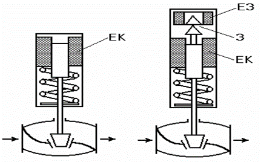
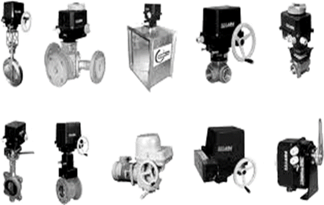
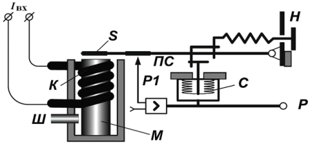
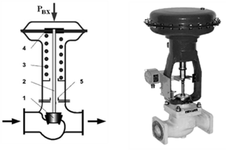
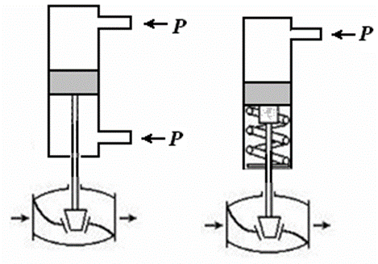
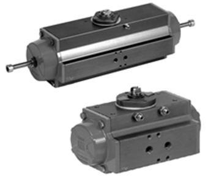
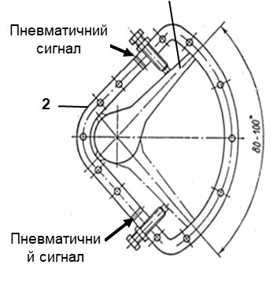
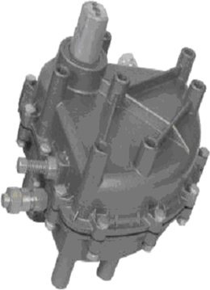
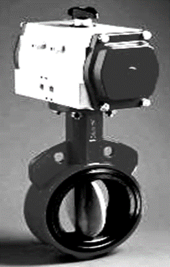

[Розділ 4](4.md). Виконавчі механізми і регулюючі органи  <--- [Зміст](README.md) --> [4.2](4_2.md). Регулюючі органи

## 4.1. Виконавчі механізми

Залежно від роду енергії, яка використовується **виконавчим механізмом**, вони поділяються на електричні, пневматичні та гідравлічні. В системах автоматизації процесів харчових виробництв використовуються в основному електричні та пневматичні виконавчі механізми.

Електричні виконавчі механізми, які використовують електричну енергію, поділяються на електромагнітні та електродвигунні.

В електромагнітних виконавчих механізмах переміщення РО відбувається за рахунок дії електромагнітної котушки. За принципом своєї дії такі виконавчі механізми можуть використовуватись у випадках, коли регулюючий орган повинен займати фіксовані положення, наприклад, «Відкрито» та «Закрито» в релейних (позиційних) системах автоматичного регулювання.

Рис. 4.1. Електромагнітні виконавчі механізми

Найпростіші електромагнітні виконавчі механізми (соленоїдні) (рис. 4.1) мають одну електромагнітну котушку (ЕК). Коли на неї подається управляючий сигнал у вигляді постійного або змінного струму, шток втягується в котушку соленоїда, і клапан повністю відкривається. Коли управляючий сигнал знімається, шток під дією зворотної пружини повертається у вихідний стан, і клапан закривається.

Недоліком такої конструкції є постійне споживання електроенергії. Тому такі виконавчі механізми доцільно використовувати у випадках короткочасного спрацьовування.

Більш економічними є електромагнітні ВМ з додатковим електромагнітом (ЕЗ), який управляє спеціальною защіпкою (З). Коли подається сигнал на головний електромагніт ЕК, шток втягується в котушку соленоїда, спрацьовує защіпка (З) і фіксує шток у цьому положенні. При цьому блокуючий контакт розриває ланцюг живлення головної котушки. Якщо необхідно закрити клапан, управляючий сигнал подається на котушку защіпки (ЕЗ), вона відкривається і звільняє шток, який під дією зворотної пружини повертає його у вихідний стан. При цьому інший блокуючий контакт розриває ланцюг живлення котушки защіпки.

Завдяки високій швидкості спрацьовування, електромагнітні виконавчі механізми часто використовують в автоматичних системах блокування. Недоліком їх використання є можливість виникнення гідравлічних ударів у трубопроводах.

Більш поширеними, ніж електромагнітні, є електродвигунні виконавчі механізми. В таких ВМ обертання валу електродвигуна перетворюється на переміщення РО. За характером руху вихідного елемента електродвигунні ВМ поділяються на однообертові, багатообертові та прямоходні. Загальний вигляд електродвигунних виконавчих механізмів показано на рис. 4.2.

Рис. 4.2. Загальний вигляд електродвигунних виконавчих механізмів

В деяких електродвигунних ВМ використовуються електродвигуни з постійною швидкістю обертання вихідного елемента. Вони можуть обертатись у той чи інший бік або знаходитись у нерухомому стані. Ці виконавчі механізми реалізують керуючу дію типових законів регулювання в імпульсній формі, тобто, коли переміщення вихідного елемента ВМ відбувається за рахунок короткочасних включень електродвигуна в той чи інший бік з певною відповідністю між тривалістю станів включення та відключення. Вони можуть мати контактне або безконтактне управління.

Пневматичні виконавчі механізми працюють на енергії стисненого повітря. Вони відзначаються високою надійністю та простотою обслуговування, а також розвивають досить великі перестановочні зусилля.

Для підключення пневматичних ВМ до керуючих пристроїв з уніфікованими електричними вихідними сигналами необхідно використовувати спеціальні електро-пневмоперетворювачі (рис. 4.3) для перетворення цих електричних сигналів в уніфікований пневматичний сигнал.

Рис. 4.3. Принципова схема електропневмоперетворювача

Перетворювачі перетворюють уніфіковані електричні сигнали 0…5, 0…20, 4…20 мА на тиск повітря 20…100 кПа. Принцип  їхньої дії ґрунтується на методі силової компенсації, при якому момент, який розвивається котушкою, розташованою в полі постійного магніту, пропорційний вхідному сигналу, компенсується моментом сили, який розвивається сильфоном зворотного зв’язку. Елементом, який установлює рівновагу моментів, є пневматична система
 «сопло–заслінка». 

Вхідний сигнал *І*в підключений до котушки *К*, до якої притягується важіль *S* із зусиллям, пропорційним сигналу *І*в. Це призводить до зміни відстані між заслінкою у перетворювачі сигналу (ПС) і відповідно до зміни тиску *Р1* на вході підсилювача і відповідно тиску на виході підсилювача *Р*. Цей тиск подається у сильфон зворотного зв’язку, який поновлює рівновагу на важелі *S*. Таким чином, кожному значенню струму на вході буде відповідати значення тиску на виході.

Найбільше розповсюдження отримали мембранні ВМ, у яких перестановочне зусилля хоча б в одному напрямку створюється тиском командного повітря, яке змінюється в межах 20…100 кПа. 

Схема мембранного ВМ показана на рис. 4.4. Переміщення вихідного штока, з’єднаного з регулюючим органом *1* через сальник *5*, в одному напрямку створюється за рахунок тиску стисненого повітря в робочій порожнині на мембрану,  в протилежному – за рахунок зусилля зворотної пружини *3*. 

Рис. 4.4. Схема і загальний вигляд мембранного виконавчого механізму

Сигнал *Р* подається в герметичну мембранну «головку», в якій знаходиться мембрана з прорезиненої тканини товщиною 2-4 мм з жорстким центром. Управляючий тиск повітря діє на мембрану *4*, яка затиснута по периметру між кришками приводу і створює зусилля, яке врівноважується пружиною *3*. Таким чином, переміщення штока пропорційне керуючому тиску. Зусилля, яке може створити мембранний ВМ, залежить від вибраного розміру мембрани.

Поршневі виконавчі механізми типу ПСП – це механізми, в яких зусилля для зміни положення регулюючого органу створюється внаслідок зміни тиску робочого середовища у поршневих порожнинах (рис. 4.5). На рис. 4.5 показано два типи поршневих виконавчих механізмів. В одному переміщення робочого штоку в різні боки відбувається під дією тиску, який подається в одну або  іншу порожнину. У другому переміщення штоку в один бік відбувається під дією тиску, а в інший – під дією зворотної пружини.

Рис. 4.5. Поршневі виконавчі механізми

Поршневі виконавчі механізми відрізняються від мембранних більшою величиною переміщення регулюючого органу та більшим зусиллям, яке він передає.

Різновидом поршневих механізмів є поршневий поворотний пневмодвигун типу ПДП, який призначений для здійснення обертального руху. У корпусі пневмодвигуна розміщена шестерня. Вона входить у зціплення зі штоком-рейкою, яка з'єднує поршні двох пневмоциліндрів. Один пневмоциліндр обертає шестерню в один бік, а другий – в інший. Кут обертання валу двигуна 180°.

Рис. 4.6. Загальний вигляд поршневих поворотних двигунів

Широке розповсюдження отримали лопатеві виконавчі механізми, до яких належать поворотні пневмодвигуни типу ППР. Принцип дії пневмоприводу базується на створенні обертового моменту на валу поворотної заслінки *1* (лопаті), яка переміщується всередині порожнистого корпуса *2* під дією стисненого повітря (рис. 4.7, рис. 4.8). 

Рис. 4.7 Схема поворотного пневмоприводу ППР

Поршневі поворотні пневматичні виконавчі механізми використовуються для поворотних регулюючих органів: заслінок і шарових кранів.

Рис. 4.8. Загальний вигляд поворотного пневмоприводу

На рис. 4.9 показана регулююча заслінка з пневматичним поворотним виконавчим механізмом.

Рис. 4.9. Регулююча заслінка з пневматичним ВМ

Для забезпечення точності встановлення вихідного елемента пневматичних ВМ та підвищення їх швидкодії при використанні їх у тяжких умовах (велика швидкість проходження середовища, підвищена в‘язкість, великі розміри ВМ, велика довжина пневматичної з'єднувальної лінії) в комплекті з ними додатково використовують позиціонери, які являють собою пневматичний або електропневматичний підсилювач потужності зі зворотним зв'язком за положенням вихідного елемента ВМ.

У сучасних системах управління як правило використовують електропневматичні позиціонери з електричним сигналом управління. У цьому випадку електричний керуючий сигнал подається безпосередньо на позиціонер, що звільняє від необхідності використання в щиті управління електропневмоперетворювачів, а отже спрощує монтаж і обслуговування системи і зменшує ймовірність відмов. Перспективним напрямом вважається використання інтелектуальних позиціонерів з підключенням їх до промислових мереж.

[Розділ 4](4.md). Виконавчі механізми і регулюючі органи  <--- [Зміст](README.md) --> [4.2](4_2.md). Регулюючі органи