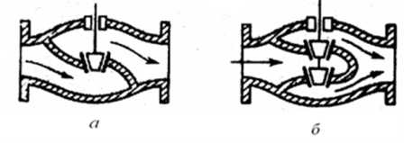
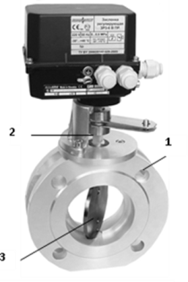
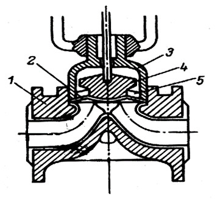
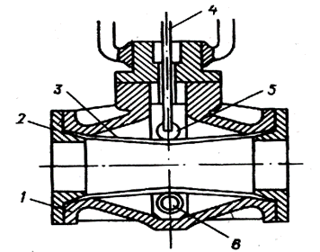

[4.1](4_1.md). Виконавчі механізми <--- [Зміст](README.md) --> [4.3](4_3.md). Перетворювачі частоти

## 4.2. Регулюючі органи

***Регулюючі органи*** призначені для зміни витрати речовини або енергії до об'єкта регулювання шляхом зміни його пропускної здатності. Регулюючий орган складається з двох основних частин: затвора – рухомої частини РО, переміщенням якої досягається зміна прохідного перерізу і, відповідно пропускної здатності; сідла – нерухомої частини РО, яка утворює разом із затвором прохідний переріз.

Під пропускною здатністю РО *Кv* розуміють витрату рідини (м3/год), густиною 1000 кг/м3, яку пропускає РО при перепаді тиску на ньому 0,1 МПа. Пропускна здатність залежить від типу та розміру РО і ходу його затвору. Величину Кv виражають у м3/год. Максимальну величину пропускної здатності, яка відповідає повністю відкритому РО, називають умовною пропускною здатністю. Її також виражають у м3/год. Умовним проходом у РО називають номінальний діаметр проходу РО у з'єднувальних фланцях та позначають Ду. Значення Ду відрізняються від розмірів усередині корпусу РО.

Залежність пропускної здатності РО від переміщення його затвора називають пропускною характеристикою; залежність прохідного перерізу від переміщення затвора – конструктивною характеристикою.

У системах автоматичного регулювання використовуються регулюючі органи таких типів: односідельні та двосідельні клапани, заслінки, шарові крани, засувки, шлангові й діафрагмові РО та ін.

В односідельних регулюючих органах (рис. 4.10, *а*) зміна пропускної здатності досягається за рахунок поступового руху затвора уздовж осі проходу одного сідла, а двосідельних – двох сідел (рис. 4.10, *б*). Перші мають неврівноважений затвор, оскільки середовище діє на нього зверху та знизу з різними силами. Це впливає на роботу виконавчого механізму, і тому ці клапани використовують для малих Ду та при низькому тиску середовища. Двосідельні клапани мають майже врівноважений затвор, тому що технологічне середовище, яке обтікає його, створює приблизно однакові сили. Тому їх використовують у виконавчих пристроях великого розміру при роботі з великими тисками середовища.

Рис. 4.10. Регулюючий клапан *а* – односідельний, *б* - двохсідельний

Регулюючі клапани випускають з лінійною та рівновідсотковою пропускною характеристикою. При лінійній характеристиці величина пропускної здатності пропорційна положенню затвора, а при рівновідсотковій – приріст пропускної здатності пропорційний поточному значенню пропускної здатності. Пропускну характеристику клапана вибирають такою, щоб забезпечити постійний коефіцієнт підсилення автоматичної системи регулювання на всьому діапазоні роботи клапана. Якщо основними збуреннями об'єкта є зовнішні, наприклад, зміна складу сировини, то бажано вибирати клапан з лінійною характеристикою. Якщо ж основним збуренням об'єкта є збурення по регулюючому каналу, наприклад, зміна тиску середовища, яке проходить через клапан, то вибирають клапан з рівновідсотковою характеристикою.

***Заслінка*** – регулюючий орган, у якому зміна пропускної спроможності досягається за рахунок повороту заслінки. Заслінки порівняно з іншими регулюючими органами мають невеликі габарити та масу, у відкритому положенні мають невеликий гідравлічний опір, не створюють застійних зон. РО являє собою кільцевий корпус *1* (рис. 4.11), у якому на валу *2*, розташованому перпендикулярно потоку, обертається заслінка *3*. Для забезпечення можливості щільного перекриття пропускного отвору при закритті заслінки з внутрішнього боку корпуса або на зовнішній поверхні (по краю) заслінки закріплюється ущільню-вальне кільце з відповідних матеріалів.

Рис. 4.11. Регулююча заслінка

Для регулювання потоків агресивних середовищ розроблено ***діафрагмовий РО*** (рис. 4.12). Зсередини чавунний корпус *1* покривається хімічно стійкими матеріалами (поліетиленом, гумою, фторопластом) або емаллю. Гнучкий затвор – еластична діафрагма *2* виготовляється з гуми або фторопласту. Вона закріплена між корпусом *1* та кришкою *3*, а у центрі прикріплена до хрестовини *4*. Для запобігання прогину діафрагми під тиском робочого середовища використовується телескопічна опора *5*.

Рис. 4.12. Діафрагмовий РО

Переміщення центра діафрагми викликає зміну прохідного перерізу РО. Ці регулюючі органи призначені для роботи при низьких тисках та нормальній температурі.   

Для зміни витрати середовищ, які мають тверді частки, використовують ***шлангові РО*** (рис. 4.13). Роль затвора виконує еластичний шланг *3*, який закріплений між корпусом *1* та фланцями *2*. 

Рис. 4.13. Шланговий РО

У середині шланг пере-давлюється роликами *5* та *6*, які рухаються в протилежних напрямках під дією переміщення штока *4*. Шланг виготовляється з гуми, фторопласту, поліетилену. Шлангові РО виключають застій продукту, забезпечують швидку зміну шланга. Але їх можна використовувати лише при температурах до 100 °С та невеликих тисках (до 980 кПа).

[4.1](4_1.md). Виконавчі механізми <--- [Зміст](README.md) --> [4.3](4_3.md). Перетворювачі частоти