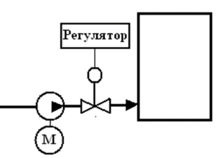
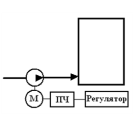
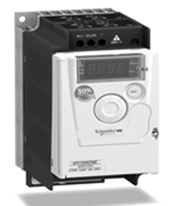

[4.2](4_2.md). Регулюючі органи <--- [Зміст](README.md) --> [Розділ 5](5.md). Мікропроцесорні засоби автоматизації 

## 4.3. Перетворювачі частоти

Часто для зміни витрат у сучасних системах управління використовують конвеєри (сипкі речовини) і насоси (рідини, суспензії, емульсії). В якості виконавчого механізму (для обох випадків) використовують електричні двигуни. Найбільш поширеними серед електричних двигунів є асинхронні та синхронні двигуни. Швидкість обертання ротора (частота) в цих двигунах залежить від потужності, яка подається на ці двигуни, і, як відомо, залежить від сили струму і напруги.

Тобто для зміни швидкості обертання ротора двигуна (лопастей насоса і приводного барабана конвеєра) потрібно збільшувати або зменшувати потужність, яка подається на двигун. 

У застарілих системах напруга подається на електричні двигуни за допомогою магнітного пускача дискретним сигналом;  вона є номінальною і не змінною для двигуна. Необхідну витрату в цих системах досягають використанням додаткових регулюючих органів,

які змінюють витрату шляхом дроселювання перерізу, через яку рухається рідина, або зменшують заповнення транспортера сипкою речовиною. Тобто насос або конвеєр працює на повну потужність, а витрату ми регулюємо регулюючим органом (рис. 4.14). Цей метод не є енергоефективним і не завжди дозволяє отримати бажаний результат.

Рис. 4.14. Регулювання витрати з використанням регулюючого органу

Останнім часом в системах автоматичного управління широко вико-ристовуються перетворю-вачі частоти.

**Перетворювач частоти** – це вторинне джерело електроживлен-ня, що виробляє змінний електричний струм з частотою і напругою, що відрізняється від частоти струму і напруги первинного джерела. 

Тобто від управляючого сигналу (від контролера або регулятора) на електричні двигуни для живлення подається відповідна потужність. При цьому забезпечується плавність регулювання швидкості обертання електродвигунів, що забезпечує плавне регулювання витрати речовини (рис. 4.15). Крім того, забезпечується захист від гідроударів, економія енергоресурсів (до 60 %) та збільшення терміну роботи електродвигунів і використання труб та матеріалів, що ущільнюють.

Рис. 4.15. Регулювання витрати з використанням перетворювача частоти

Перетворювачі частоти необхідно вибирати, враховуючи потужність (силу струму і напругу) електричного двигуна, вона не повинна бути меншою, ніж самого електричного двигуна (навпаки дозволяється). Частота після перетворювача може бути в межах від 1 Гц до 800 Гц.

Загальний вигляд перетворювача частоти подано на рис. 4.16.

Рис. 4.16. Загальний вигляд перетворювача частоти

[4.2](4_2.md). Регулюючі органи <--- [Зміст](README.md) --> [Розділ 5](5.md). Мікропроцесорні засоби автоматизації 