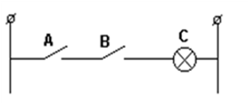

[Розділ 5](5.md). Мікропроцесорні засоби автоматизації  <--- [Зміст](README.md) --> [5.2](5_2.md). Основні напрями розвитку мікропроцесорних засобів автоматизації

## 5.1. Основи мікропроцесорної техніки.

### 5.1.1. Історія розвитку

Мікропроцесор не є відкриттям чи винаходом. Його поява зумовлена здобутками багатьох напрямів науково-технічного прогресу ХХ ст. Виникнення мікропроцесорної техніки насамперед тісно пов’язане з розвитком технологій виробництва радіоелектронної техніки та удосконаленням електронно-обчислювальних машин (ЕОМ).

І якщо за весь час розвитку ЕОМ їхні основні принципи дії та структура збереглися, то відбулися великі зміни як в елементній базі, так і в розвитку програмного забезпечення.

У 50-х роках ХХ ст. основним елементом у радіоелектроніці була радіолампа. Одна з перших ЕОМ ‘‘ЕНІАК’’, яка налічувала 18 000 ламп, важила 30 т і займала площу 600 м2 (рис. 5.1). Лампи виділяли так багато теплоти, що потребували спеціального охолоджувального пристрою. Така ЕОМ споживала таку кількість електроенергії, якої вистачило б для електропостачання селища міського типу.

Рис. 5.1. Перша лампова ЕОМ «ЕНІАК» та електронна лампа

У 60-х роках радіолампа поступилася місцем напівпровідниковому приладу – транзистору, який був більш довговічнішим, не потребував великих затрат електроенергії, мав малі розміри та масу. Технологія виготовлення транзисторів постійно удосконалювалася. За один технологічний цикл на одній кремнієвій платівці почали одержувати кілька десятків, а то й сотень транзисторів. Після виготовлення платівку розрізували на окремі транзистори та упаковували кожний у пластмасовий або металевий корпус. При виготовленні радіоелектронних пристроїв різного призначення та ЕОМ транзистори з’єднували один з одним і з іншими електронними елементами за заданою схемою. Виникло питання: для чого спочатку розрізувати платівку із транзисторами на окремі частини, а потім знову їх з’єднувати (рис.5.2)?

 Рис. 5.2. ЕОМ «БЕСМ» та транзистори ЕОМ 

Чи не можна одразу під час виготовлення транзисторів з’єднувати їх на платівці за заданою схемою? Це виявилося можливим

Так з’явились інтегральні схеми – електронні елементи, які призначались для виконання певних функцій і замінювали закінчені електронні схеми (тригери, дешифратори, генератори, лічильники та ін.). При цьому на кремнієвій платівці, яка має назву підкладка, різними методами (запилення, фотолітографічний та ін.) наносився геометричний малюнок окремих частин транзисторів, діодів, конденсаторів, резисторів та з’єднувальних провідників. Перевагами такої елементної бази є різке зменшення її розмірів, маси, вартості, підвищення надійності, а також можливість автоматизації складання схем, їх монтажу та налагодження.

Спочатку використовувались інтегральні схеми з малим ступенем інтеграції, в яких в одному корпусі, на одній підкладці розміщувалось кілька десятків, транзисторів, діодів та резисторів, з’єднаних між собою за потрібною схемою. Потім почали використовувати інтегральні схеми із середнім ступенем інтеграції, які налічували сотні й тисячі електронних елементів. Далі з’явилися великі (ВІС), надвеликі (НВІС) та ультравеликі (УВІС) інтегральні схеми, кількість елементів у яких сягала сотень тисяч і мільйонів.

Розробка та виготовлення ВІС для конкретної схеми виявилися справою трудомісткою, складною та, головне, дуже дорогою. Якщо ВІС являла собою електронну схему для приладів широкого попиту (наприклад, ВІС для годинників, телефонних апаратів і т. ін.), які виготовлялися у великій кількості екземплярів, то ціна її була помірною. Якщо ж ВІС призначалася для використання в одиничних екземплярах, її ціна ставала непомірною. У цій ситуації велику роль відіграла та обставина, що поряд розвитком технології виготовлення ВІС безперервно удосконалювалось мистецтво складання програм для ЕОМ. У середині 70-х років програмування досягло такого високого рівня, за якого стала можливою реалізація ідеї створення **мікропроцесора – уніфікованої великої інтегральної схеми, яка має властивість перепрограмування** (рис. 5.3 і 5.4).

Рис. 5.3. ЕОМ ЕС-1035

Властивість перепрограмування мікропроцесора повністю змінила підхід до створення електронних пристроїв, тому що дала можливість на базі уніфікованих апаратних засобів створювати пристрої різних функціональних призначень за рахунок зміни алгоритму оброблення даних шляхом перепрограмування. Використання у технічних засобах автоматизації мікропроцесорів дає можливість створювати пристрої з великою швидкодією та підвищеною надійністю за низької вартості та енергоємності.

Рис. 5.4. ЕОМ ДВК

**Отже, мікропроцесор (МП) – це програмно керуючий пристрій, який призначений для оброблення цифрової інформації та керування процесом цього оброблення, реалізований на одній або кількох великих інтегральних схемах.**

Поява мікропроцесора привела до істотних змін у всіх напрямах науково-технічного прогресу. В наш час не можна собі уявити якийсь технічний засіб, починаючи від найпростіших побутових приладів і закінчуючи найскладнішими пристроями в космічній техніці, без використання мікропроцесорної техніки. Поява мікропроцесора взагалі змінила наше життя в ХХІ ст., яке оголошено сторіччям інформаційних технологій. Це було б неможливим, якби персональний комп’ютер не ввійшов у всі сфери діяльності людини.

### 5.1.2. Структура мікропроцесорної системи

Центральною частиною мікропроцесора (рис. 5.5) є арифметично-логічний пристрій (АЛП), який виконує за командами пристрою керування (ПК) найпростіші арифметичні та логічні операції над даними: складання, віднімання, пересилка, зсув, логічне складання (ИЛИ), логічне множення (И), складання за модулем 2 та ін.

Рис. 5.5. Структура мікропроцесорної системи

Пристрій керування управляє роботою АЛП та блоком внутрішніх регістрів (БВР), який є внутрішньою пам’яттю мікропроцесора і призначений для тимчасового зберігання даних та команд, а також виконує деякі процедури оброблення інформації. За сигналами ПК відбувається вибирання й виконання кожної нової команди.

Окремі частини мікропроцесора з’єднуються між собою за допомогою внутрішньої шини даних. Зовнішній зв’язок мікропроцесора реалізується за допомогою зовнішніх шин: керування (ШК), даних (ШД) та адреси (ША).

Мікропроцесор, незважаючи на його універсальність, самостійно нездатний реалізувати конкретне завдання оброблення інформації або керування об’єктом. Для виконання цих функцій необхідно його з’єднати з деякими пристроями, запрограмувати та забезпечити обмін інформації мікропроцесора з цими пристроями, тобто утворити мікропроцесорну систему.

Мікропроцесорна система (МПС) – це сукупність взаємопов’язаних пристроїв, що включають у себе один або кілька мікропроцесорів, оперативний запам’ятовуючий пристрій (ОЗП), постійний запам’ятовуючий пристрій (ПЗП), пристрій введення-виведення (ПВВ) та ряд інших пристроїв, які призначені для виконання деяких чітко окреслених функцій з оброблення цифрової інформації і керування процесом цього оброблення.

У пам’яті МПС зберігається програма оброблення інформації та дані. Пристрій керування мікропроцесора постійно звертається до пам’яті й крок за кроком виконує команди, які записані в ній. Саме наявність пам’яті надає мікропроцесору універсальності, тому що апаратні засоби залишаються тими самими, а функції, виконувані МПС, залежать від заданої програми.

Якщо для виконання програми необхідні зовнішні дані, то за це відповідає пристрій введення-виведення, який забезпечує зв’язок МПС з зовнішніми чи периферійними пристроями.

Комплекс технічних засобів, який реалізує функцію пам’яті називають запам’ятовуючим пристроєм (ЗП). Основними операціями з пам’яттю є запис – занесення інформації до пам’яті й зчитування –вибирання інформації з пам’яті. Ці операції називають зверненням до пам’яті. До основних характеристик систем пам’яті належать такі: ємність пам’яті, розрядність вибірки, час звертання і споживна потужність.

Ємність пам’яті виражають порціями, які кратні 1024 словам, або байтам. Скорочено ємність такої порції позначають 1 кбайт. Розрядність вибірки визначається кількістю розрядів інформації, яка записується до ЗП чи береться з нього за одне звернення. За функціональним призначенням можна виділити основні типи пам’яті: оперативна (ОЗП), постійна (ПЗП) та зовнішня (ЗЗП).

Оперативний запам’ятовуючий пристрій є основним видом пам’яті мікропроцесора. Оперативну пам’ять називають також пам’яттю з довільним доступом, звідки й з¢явилась абревіатура RAM (Random Access Memory), в яку в довільний момент часу можливо записати інформацію та в довільний час прочитати дані з неї. Незважаючи на велику швидкість і гнучкість у роботі, ОЗП має один суттєвий недолік: при вимиканні живлення дані, які записані в ОЗП, втрачаються. У деяких випадках паралельно живленню ОЗП під’єднують батарейку (або акумулятор), яка підтримує працездатність ОЗП деякий час при вимкненні живлення. Такі ОЗП називають енергонезалежними.

Повністю уникнути втрати інформації при вимкненні живлення дає можливість постійний запам’ятовуючий пристрій. На початку розвитку мікропроцесорної техніки вважалось, що ОЗП призначене тільки для тимчасового зберігання інформації, а дані з ПЗП у процесі експлуатації можна тільки зчитувати. Дані до ПЗП записують тільки один раз або при його виготовленні у виробника ПЗП на базі маски (карти) замовника, або безпосередньо користувачем.

Останнім часом значного поширення набули такі види ПЗП, які називають перепрограмованими постійними запам’ятовуючими пристроями (ППЗП). Вони допускають багаторазовий запис даних. Найновішим досягненням у галузі напівпровідникових ППЗП є “флеш-пам’ять”, яка належить до електричних ППЗП, виготовлених за спеціальною технологією “Flash” фірмою Intel.

Ємність ОЗП та ПЗП обмежена, а для розв’язання деяких складних завдань керування необхідно забезпечити зберігання сотень тисяч, мільйонів команд. Для цього використовують ЗЗП, які мають велику ємність, але малу швидкодію.

До сучасних пристроїв зовнішньої пам’яті належать: накопичувачі на гнучких (НГМД) і жорстких (НЖМД) магнітних дисках, також компакт-диски, які мають назву CD-ROM (Compact Disk Read Only Memory). В наш час випускаються компакт-диски CD-WORM (write once – Read many) із можливістю одноразового запису користувачем, а також CD-E/CD-R – багаторазового запису.

Інформація, яка призначена для оброблення в МПС, може бути як цифрова, так і аналогова. Проте в обох випадках у МПС вона подається однаково – у вигляді двійкових чисел. Тому при створенні на базі МПС мікропроцесорної автоматичної системи (МПАС), призначеної для автоматичного збирання інформації про стан об’єкта керування, її оброблення та вироблення керуючої дії, до її складу необхідно включити пристрій зв’язку з об’єктом керування (ПЗО). Завданням ПЗО є автоматичне перетворення сигналів від датчиків, встановлених на об’єктах керування у форму, необхідну для вводу у МПС, а також перетворення керуючих сигналів, які виробляються МПС, у форму, яка може сприйматись виконавчими механізмами для керування регулюючими органами, безпосередньо встановленими на об’єкті управління. Крім того, модулі ПЗО можуть забезпечувати зв’язок із пристроями відображення інформації чи з іншими МПАС або ЕОМ.

Інформація як між окремими пристроями МПС, так і при обміні із зовнішніми (периферійними) пристроями передається по загальних інформаційних каналах – шинах.

Периферійні пристрої не мають безпосереднього контакту із системними шинами. Замість цього вони під’єднані до спеціальних регістрів, які використовуються для тимчасового зберігання бінарної інформації і називаються портами. Кожний порт має свою адресу (за аналогією з комірками пристроїв пам’яті), причому в кожний момент часу до шини даних може бути під’єднаний тільки один порт. Цим управляє спеціальний контролер введення-виведення.

У простих випадках зовнішні пристрої під’єднуються до МПС за допомогою портів. При інтенсивному обміні інформацією використовується більш складна система спряження, яка має назву інтерфейс. Інтерфейс – це комплекс апаратних та алгоритмічних засобів уніфікованого спряження компонентів мікропроцесорної системи. До складу апаратних засобів входять система уніфікованих шин, уніфікованих сигналів і електричних схем. Алгоритмічна частина – це алгоритм (чи, як його ще називають, протокол) обміну, тобто сукупність правил взаємозв’язку цих компонентів у процесі обміну інформацією. Найбільш поширені інтерфейси паралельні – ІРПР, в яких інформація передається по паралельних, і послідовні – ІРПС, в яких інформація передається послідовно по лініях зв’язку обмеженої кількості.

### 5.1.3. Способи подання інформації для МПС

Як уже зазначалося, для подання інформації в мікропроцесорних пристроях використовується двійкова система числення, тобто усі операції виконуються у двійковій системі. У двійковій системі використовуються тільки два символи – «0» та «1». Це добре співвідноситься з технічними характеристиками цифрових схем, які також мають лише два стійких стани. У двійковій системі, як у десятковій, кожна позиція числа (розряд) має визначену вагу. Але якщо в десятковій системі вага дорівнює числу 10 у деякому степені, то у двійковій системі замість числа 10 використовується число 2, тобто:

 

За аналогією з десятковою системою, значення числа, яке записане у двійковій системі, можна визначити як суму чисел, які записані у відповідних розрядах.

Наприклад, число, яке записане в десятковій системі, має значення:

$$
54_{10}=5\cdot10^1+4\cdot 10^0
$$

і відповідно у двійковій:

$$
110110_2=1\cdot 2^5+1\cdot 2^4+0\cdot 2^3 + 1\cdot 2^2 + 1\cdot 2^1 + 0\cdot 2^0=54_{10}
$$

Для того щоб розрізняти числа, які записані в різних системах числення, можна використовувати відповідний індекс.

Як можна побачити з наведеного прикладу, числа, які записані у двійковій системі, займають більше позицій, тобто більш громіздкі. Тому оперувати ними незручно. Для скорочення запису двійкових чисел використовується вісімкова та шістнадцяткова системи. Вибір цих систем числення пояснюється тим, що число 8 є числом 2 у третьому степені, а 16 – число 2 у четвертому степені. Тобто вісімкову систему можна використовувати як засіб скороченого запису двійкового числа з трьох розрядів (від 000 до 111), а шістнадцяткову для запису двійкового числа – з чотирьох розрядів (від 0000 до 1111). Причому у вісімковій системі використовується 8 символів: 0,1,2,3,4,5,6 і 7, а в шістнадцятковій – 16 символів: 0, 1, 2, 3, 4, 5, 6, 7, 8, 9, А(10), В(11), С(12), D(13), E(14) та F(15). Для того щоб записати двійкове число у вісімковій або шістнадцятковій системах, необхідно об¢єднати розряди двійкового числа (починаючи з молодшого) в першому випадку у групи по 3, а в другому – по 4 розряди та записати для цих груп їхні еквіваленти у відповідній системі числення.

Наприклад, є число у двійковій формі: $10101011111101_2$.

Необхідно записати його у вісімковій та шістнадцятковій системах числення:

 

 У першому та другому випадках у старших групах додані незначущі нулі.

Група двійкових цифр, що обробляються одночасно, мають назву **машинного слова,** а кількість двійкових цифр, із яких складається це слово, називається **довжиною слова**. Слово є базовою логічною одиницею інформації МП. Найменша одиниця інформації – двійковий розряд. Вона має спеціальну назву – **біт.** З огляду на особливе поширення, слово довжиною 8 біт має назву **байт.**

Двійкова система числення широко використовується в сучасних пристроях мікропроцесорної техніки. Це пояснюється зручностями запису, зберігання й простоти введення двійкових чисел у ці пристрої. Крім того, арифметичні дії з двійковими числами набагато простіші, ніж із десятковими, що спрощує конструювання обчислювальних пристроїв.

Інформація, що обробляється, подається у вигляді двійкових чисел та поділяється на два види: дані й команди. Як ті, так і інші можуть складатися з одного або кількох машинних слів.

Числові дані (наприклад, для 8-розрядних слів) можуть бути інтерпретовані так:

- як двійкове число зі знаком, що має значення від –127
 до +127 (знак числа розміщується в старшому розряді);

- як двійкове число без знака, що має значення від 0 до 255.

Відповідно у 12-розрядному слові можна записати число 4096, а в 16-розрядному – 65535.

Це необхідно пам’ятати при порівнянні можливостей різних аналого-цифрових перетворювачів.

Залежно від архітектури конкретного мікропроцесора побудова слова, що утворює команду, тобто структура, яку називають форматом команди, може змінюватись у широких межах.

Усі команди мікропроцесорів можна поділити на такі основні типи: переміщення даних, перетворення даних (арифметичні та логічні), керування програмою, введення-виведення, спеціальні.

Поряд із виконанням операцій над числами, не менш важливим є поняття логічних операцій, які виконує мікропроцесор.

Науку про людське мислення давньогрецький філософ і вчений Аристотель (384 – 322 до н.е.) назвав логікою. Вона пропонувала загальні правила, за якими людина повинна мислити, міркувати, робити висновки й доходити до істини.

Німецький математик Г.В. Лейбніц (1646 – 1716) зблизив логіку з обчисленням. У нього виникла думка створити нову науку – математичну логіку, в якій логічні поняття позначалися б математичними знаками. “Якщо для цих знаків, – казав Г.В. Лейбніц, – установити правили сполучення, то логічні висловлення набудуть вигляду математичних формул, і логіка стане мистецтвом обчислення, що дасть можливість вченим і філософам розв’язати свої сперечання спокійними обчисленнями”. На жаль, Лейбніцу не вдалося здійснити свою мрію. Тільки майже через 200 років англійський математик Дж. Буль (1815 – 1864) частково реалізував ідеї Лейбніца.

Дж. Буль створив для логічних обґрунтувань і міркувань незвичайну алгебру (бульову алгебру), у якій логічні висловлення позначаються особливими символами, подібно до того, як у шкільній алгебрі поняття числа або предмета позначаються літерами. Виявилося, що, оперуючи цими символами й логічними зв’язками у вигляді певних знаків, можна виконувати логічні міркування за допомогою звичайних обчислень.

У людській мові найчастіше трапляється розповідний стиль речень, якими висловлюють або описують які-небудь події. Такі речення називають висловленнями.

У бульовій алгебрі висловлення розглядаються не за змістом і не за значенням, а тільки щодо того, істинне воно чи помилкове.

Наприклад:

- “сніг холодний” – висловлення, притому істинне;

- “два по два – п'ять” – висловлення, але помилкове.

Істинність або помилковість логічного висловлення називається значенням істинності й умовно позначається символом “1”, якщо висловлення істинне, й “0”, – якщо воно помилкове. Крім того, саме висловлення формально позначають літерами латинського алфавіту (А, В, С, Х, У і т. ін.), у думках абстрагуючись від конкретного змісту висловлення, тобто не беручи його до уваги.

Наприклад, висловлення “сніг холодний” можна позначити літерою А й, беручи до уваги, що воно істинне, написати А = 1. Аналогічно, висловлення “два по два – п¢ять” можна позначити літерою В й написати В = 0 бо це висловлення помилкове.

Дж. Буль показав, що найпростіші висловлення, на зразок тих, які розглядалися раніше, можуть бути об’єднані в складні за допомогою найпростіших логічних операцій. Такими найпростішими логічними операціями є: логічне **”І”**, логічне **“АБО”** та логічне **“НЕ”**. 

Для кращого розуміння вико-нання логічних операцій предста-вимо їх у графічному вигляді, використовуючи позначення релейно-контактних схем.

Розглянемо роботу електричного кола, зображеного на схемі:

Можна сказати: «Якщо спрацює контакт А **АБО** якщо спрацює контакт В, то лампочка С засвітиться». Тобто умовно абстрагуючись від змісту висловлювання, можна записати: А **АБО** В = С.

Для зображення логічного «АБО» можна також використовувати знак «+» (не плутати з арифметичним знаком додавання). І тоді логічний вираз матиме вигляд: А + В = С.

Із наведеної таблиці істинності можна сформулювати одне з правил бульової алгебри: складне висловлення, яке складається з багатьох найпростіших висловлювань, пов’язаних між собою логічним «АБО», буде істинним (дорівнюватиме 1), якщо істинне принаймні одне з найпростіших висловлень або істинні вони всі, а також неістинне (дорівнюватиме 0) тоді і тільки тоді, коли будуть помилкові всі найпростіші висловлення.

Розглянемо роботу другого електричного кола. 

Можна сказати: «Якщо спрацює контакт А **І** спрацює контакт В, то лампочка засвітиться». У формалізованому вигляді це висловлення можна записати: А **І** В = С. Для зображення логічного «І» можна використовувати знак логічного множення «•». Тоді вираз матиме вигляд: А•В = С.

Із наведеної таблиці істинності можна записати наступне правило бульової алгебри: складне висловлення, яке складається із багатьох найпростіших висловлень, пов’язаних між собою логічним «І», буде істинне (дорівнюватиме 1) тоді і тільки тоді, коли всі найпростіші висловлення істинні, і неістинне (дорівнюватиме 0), якщо принаймні одне з найпростіших висловлень неістинне.

Розглянемо ще одну найпростішу схему.

Роботу цієї схеми можна описати висловленням: «Якщо **НЕ** спрацює контакт А (тобто контакт не розімкнеться), то лампочка С засвітиться». Тобто в цьому випадку висловлення
 А і С з’єднані логічним запереченням **НЕ.** У бульовій алгебрі це висловлення записується як: 

Знак «_» над позначенням означає логічне заперечення, або «інверсію», а таблиця істинності має вигляд:

$$
\overline{A}=C
$$

За допомогою цих найпростіших логічних операцій можна описати будь-яке складне висловлення.

Наприклад, для схеми логічний вираз має вигляд:

$$
(A+B)\cdot \overline C = D
$$

Формалізована форма запису складних висловлень називається логічною функцією. Чим складніше висловлення, тим складніша логічна функція, яка описує його. У бульовій алгебрі сформульовано ряд законів і правил перетворення та спрощення логічних функцій, а також розроблено методи мінімізації логічних виразів.

У мікропроцесорі логічні функції кодуються й обробляються також у двійковій системі числення.

[Розділ 5](5.md). Мікропроцесорні засоби автоматизації  <--- [Зміст](README.md) --> [5.2](5_2.md). Основні напрями розвитку мікропроцесорних засобів автоматизації

