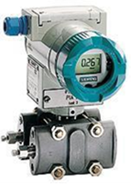
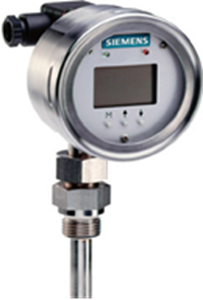
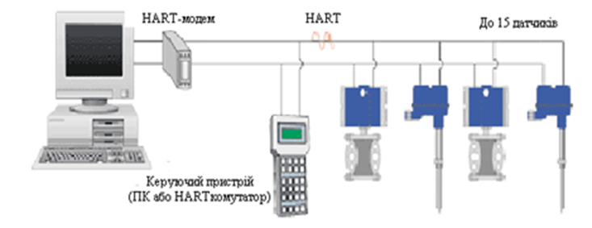
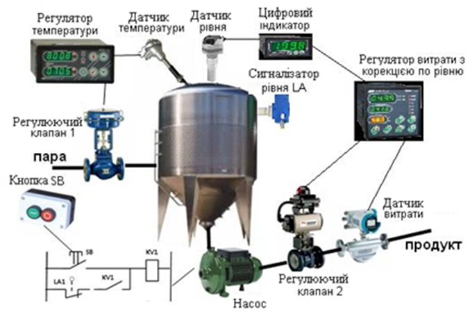
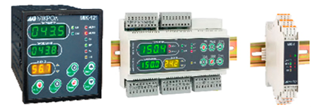
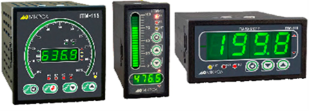
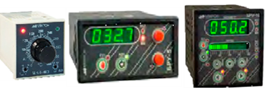
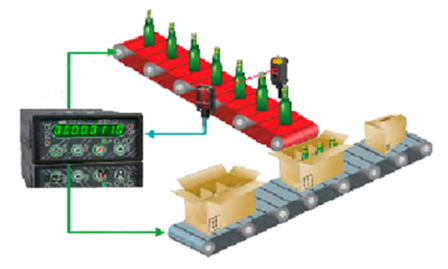
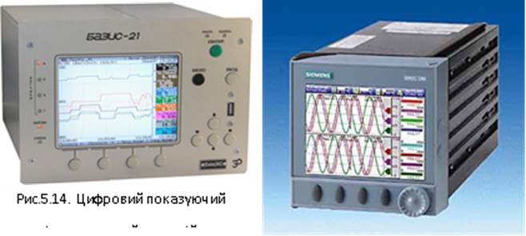
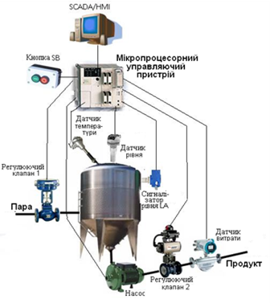

[5.1](5_1.md). Основи мікропроцесорної техніки.  <--- [Зміст](README.md) --> [5.3](5_3.md). Напрями розвитку мікропроцесорних засобів промислової автоматизації

## 5.2. Основні напрями розвитку мікропроцесорних засобів автоматизації

Бурхливий розвиток мікропроцесорної техніки обумовило її широке використання в сучасних технічних засобах автоматизації на всіх рівнях управління виробництва. Практично це стосується всіх видів технічних засобів, які використовуються в системах автоматичного контролю і управління: датчики, мікропроцесорні регулятори, функціональні блоки, перетворювачі, блоки ручного управління, показуючі і реєструючі прилади та виконавчі механізми. Це надає цим технічним засобам нові функціональні можливості. 

Зовсім недавно з’явилося і стрімко розвивається нове покоління **інтелектуальних датчиків**, в яких в одному корпусі розташований традиційний перетворювач сигналів і мікропроцесор, завдяки чому можна виконувати не тільки перетворення вимірювального сигналу, а й додаткові функції його оброблення з метою підвищення достовірності отриманої інформації (рис. 5.6).

Рис. 5.6. Інтелектуальний датчик тиску

Так, у таких датчиках можливо настроювати діапазон вимірювання, проводити корекцію систематичної похибки, попередню фільтрацію випадкових перешкод, а також контроль працездатності. Деякі датчики можуть мати вбудований цифровий індикатор (рис. 5.7).

Рис. 5.7. Цифровий термометр опору

Крім того такі інтелектуальні датчики самі стають елементом обчислювальної мережі, оскільки можуть підтримувати мережевий протокол і передавати дані в цифровій формі. Це значно поліпшує ряд характеристик приладів, дає змогу виконувати попереднє оброблення вимірювань, отримувати від них не аналоговий, а цифровий сигнал, виконувати самодіагностику приладів. Постійне здешевлення мікропроцесорів, поряд із збільшенням їхньої потужності, дає можливість навантажувати прилади більш об’ємними й складними алгоритмами оброблення вимірюваної інформації. 

Інтелектуальними (з вбудованими мікропроцесорами) в системах автоматизованого управління можуть бути і виконавчі механізми і сервоприводи. ***Інтелектуальний виконавчий механізм*** має змогу виконувати складні траєкторії руху, контролювати свій стан і адаптуватись до змін зовнішнього середовища. Одним з основних принципів, реалізованих при створенні виконавчих механізмів нового покоління, є перенесення функціонального навантаження від механічних вузлів до інтелектуальних (електронних, комп’ютерних і інформаційних) компонентів, які значно легше перепрограмувати під нові завдання. До таких завдань належать зміни й розширення діапазонів регулювання швидкостей, прискорень і моментів, які розвиваються виконавчим механізмом; координація керування просторовим переміщенням даного виконавчого механізму з керуванням іншими зовнішніми пристроями. Як і інтелектуальні датчики, інтелектуальні виконавчі механізми можуть брати участь в обміні цифровими даними як елементи обчислювальної мережі.

Досить перспективним технічно і вигідним з економічного погляду є зв’язок інтелектуальних датчиків і виконавчих механізмів через цифрову польову шину. Це виключає спотворення в лініях передачі сигналу низьковольтних аналогових сигналів, які виникають від різноманітних промислових електромагнітних перешкод; суттєво заощаджує кошти на кабельну продукцію, даючи змогу під’єднувати до однієї шини кілька приладів.

Для під’єднання таких інтелектуальних засобів автоматизації багатьма фірмами використовується HART-протокол (рис. 5.8) з основними параметрами:

-  довжина польової шини – до 1,5 км;

-  швидкість передачі даних – 1,2 кбіт/с;

-  кількість приладів, які можна підключити до однієї шини – до15.

​    HART-протокол дає можливість:

-  виконувати віддалене настроювання датчиків на необхідний діапазон вимірювання через польову шину;

-  не підводити до датчиків окремі лінії електроживлення і не мати в їхньому складі блоків живлення, а електроживлення датчиків реалізовувати від блоків живлення, наприклад контролерів, до яких підключена шина;

-  збільшувати інформаційний потік між контролерами й приладами, наприклад, для передачі повідомлень про виникнення несправностей приладу, виявлених системою самодіагностики.

Рис. 5.8. Підключення датчиків через HART-протокол

Останнім часом спостерігається також тенденція до більш повного й раціонального використання потужності сучасних мікропроцесорів, які вбудовуються в інтелектуальні прилади і блоки введення-виведення. Це привело до появи ідеології побудови стандартних польових мереж Foundation Fieldbus, які підтримуються усе більшою кількістю виробників засобів автоматизації. Остання ставить собі за мету перенесення типових алгоритмів перероблення вимірюваної інформації (фільтрація, масштабування, лінеаризація і т. ін.), регулювання (стабілізація, стеження, каскадне керування і т. ін.), логічне керування (пуск, зупинка, блокування групи механізмів і т. ін.) на найнижчий рівень керування: рівень інтелектуальних датчиків і виконавчих механізмів.

Для реалізації цієї ідеології розроблено нову за можливостями й параметрами типову польову мережу Fieldbus H1, яка постійно завойовує своє місце в продукції різних фірм. Ця мережа дає можливість реалізовувати всі функції HART-протоколу. Крім того, за допомогою спеціальних технологічних мов спілкування з приладами через цю мережу можна програмувати конкретні алгоритми контролю і керування, які використовуються в приладах. Її параметри мало відрізняються від параметрів сучасних типових промислових мереж:

-  довжина одного сегмента шини до – 1,5 км;

-  швидкість передачі інформації по мережі – 31,25 кбіт/с;

-  кількість приладів, що підключаються до мережі – 32;

-  метод доступу до мережі – ведучий-ведений.

Як вже зазначалося, в системі автоматизованого управління датчики забезпечують збирання даних про стан об’єкта управління, а регулюючі органи реалізують виконавчі дії, які виробляють управляючі пристрої відповідно до вибраного закону регулювання або алгоритму логіко-командного управління.

Сучасна технічна реалізація системи управління можлива в двох варіантах:

-  побудова систем управління за допомогою локальних мікропроцесорних засобів автоматизації;

-  використання мікропроцесорних контролерів.

Розглянемо приклад реалізації системи управління з використанням локальних засобів автоматизації яка повинна забезпечити (рис. 5.9):

-  стабілізацію температури в ємності;

-  управління витратою продукту в ємноісті з корекцією по рівню;

-  управління насосом.

Рис. 5.9. Приклад реалізації системи управління з використанням локальних технічних засобів

Для стабілізації температури в ємності сигнал від датчика температури подається на одноканальний мікропроцесорний регулятор, який керує регулюючим клапаном *1*, встановленим на трубопроводі подачі пари.

Для управління витратою на мікропроцесорний регулятор витрати подається не тільки сигнал від датчика витрати, а й сигнал від датчика рівня, що дає змогу реалізувати алгоритм регулювання витрати з корекцією по рівню в апараті. Для технічної реалізації використано мікропроцесорний регулятор, який відповідає цим вимогам. Крім того, в системі передбачено використання цифрового індикатора, на якому можна спостерігати за рівнем продукту в ємності.

Управління насосом здійснюється з використанням релейно-контактної схеми, яка передбачає включення насоса за допомогою кнопки SA. Після цього схема стає на самоблокування, тобто навіть тоді коли буде відпущена кнопка SB, реле KV1 через свій контакт продовжуватиме бути включеним.

Якщо виникає аварійна ситуація і рівень в ємності досягне критичного рівня, спрацьовує сигналізатор рівня, контакти якого відключають насос.

З наведеного дуже простого прикладу можна зробити декілька висновків:

- кількість мікропроцесорних засобів автоматизації залежить від складності системи управління і кількості контурів автоматичного управління;

- для реалізації алгоритмів логіко-командного управління необхідно використовувати спеціально розроблені релейно-контактні або безконтактні схеми управління;

- при модернізації системи автоматизації виникає необхідність змінювати кількість і типи технічних засобів, що може призвести до перемонтажу системи;

- в одній системі може бути використано різноманітні технічні засоби, що ускладнює супроводження системи.

Для підтвердження останнього твердження розглянемо номенклатуру одного із вітчизняних виробників мікропроцесорних технічних засобів автоматизації – підприємства МІКРОЛ.

Підприємство МІКРОЛ випускає серію (рис.5.10) з більш ніж 10 одно-, двоух- і восьми канальних ПІД регуляторів, які відрізняються:

- кількістю аналогових і дискретних входів-виходів;

- типами входів-виходів;

- можливістю використовувати різні закони регулювання і типи регуляторів (ПІД-аналогове, ПІД-імпульсне, ПІД-ШІМ, 2-х і 3-х позиційне), а також з різними додатковими функціями (регулювання по зовнішньому датчику, каскадне регулювання, регулювання співвідношення двох параметрів, корегування параметрів або завдання, обмеження виходу за дискретним або аналоговим сигналом, програмне регулювання та ін.).

Рис. 5.10. Мікропроцесорні контролери фірми Мікрол різних типів

Для відображення значення параметрів на щитах управління можуть використовуватись різноманітні показуючі пристрої (рис. 5.11). Можливо вибрати показуючи пристрої з різною формою представлення інформації: цифрова, шкальні індикатори, а також їхні комбінації.

Рис. 5.11. Різні типи показуючи пристроїв фірми Мікрол

Для забезпечення можливості оператору-технологу втручатись у систему автоматизованого управління використовуються блоки ручного управління і зовнішні задавачі технологічних параметрів (рис.5.12).

Рис. 5.12. Блоки ручного управління і зовнішні задавачі фірми Мікрол

Розробленої також спеціалізовані мікропроцесорні пристрої, які можуть бути використані у системах обліку (цифрові лічильники – рис.5.13) і завданнях програмованого управління (таймери).

Рис. 5.13. Використання лічильника в системах обліку продукції

Крім того, для реєстрації значень технологічних параметрів, на зміну пристроям, в яких інформація записувалась на паперову стрічку або діаграму, пропонуються цифрові мікропроцесорні реєстратори, в яких параметри записуються в цифровому вигляді на електронні носії інформації – магнітні диски, твердотільні накопичувачі і ін. У найпростішому вигляді цифровий реєстратор являє собою мікропроцесорний пристрій з аналого-цифровим перетворювачем та цифровим таймером для відліку часу отримання інформації. У більш складних випадках цифровий реєстратор – це спеціалізована ЕОМ, яка, окрім простого запису інформації по багатьох каналах надає можливість оброблювати інформацію у реальному часі і візуалізувати на екрані дисплею (рис. 5.14).

Рис.5.14. Цифровий показуючий і реєструючий пристрій

Аналогічні локальні мікропроцесорні засоби автоматизації випускають і інші фірми.

Таким чином, існують реальні можливості побудувати системи управління для вирішення завдань автоматичного регулювання на базі локальних мікропроцесорних технічних засобів автоматизації. Такий підхід доцільно використовувати в тому випадку, якщо в управлінні технологічним процесом використовується декілька параметрів.

Таким чином, існують реальні можливості побудувати системи управління для вирішення завдань автоматичного регулювання на базі локальних мікропроцесорних технічних засобів автоматизації. Такий підхід доцільно використовувати в тому випадку, якщо в управлінні технологічним процесом використовується декілька параметрів.

Для автоматизації технологічних процесів, у яких необхідно вирішувати завдання управління великою кількістю технологічних параметрів, доцільніше використовувати системи управління в яких, центральною частиною системи є центральний спеціалізований мікропроцесорний пристрій управління, до якого надходить інформація від усіх датчиків і яка використовується для управління всіма виконавчими механізмами відповідно до вибраних алгоритмів управління, реалізації яких відбувається програмним шляхом. 

На рис.5.15, для наведеного вище прикладу, показано структуру системи управління з централізованим управляючим пристроєм до якого підключені всі датчики і виконавчі механізми. На основі інформації, отриманої від датчиків та інших вхідних пристроїв (кнопочка станція), відповідно до розробленої програми управління, відбувається керування виконавчими механізмами і іншими вихідними пристроями (включенням насоса). Крім задач автоматичного регулювання, в програмі реалізовані й алгоритми логіко-командного управління, які в попередньому прикладі були реалізовані з використанням релейно-контактної схеми. 

Рис. 5.15. Реалізація системи управління з використанням центрального мікропроцесорного управляючого пристрою

Розглянемо принципи будови таких систем  детальніше в наступному параграфі.

[5.1](5_1.md). Основи мікропроцесорної техніки.  <--- [Зміст](README.md) --> [5.3](5_3.md). Напрями розвитку мікропроцесорних засобів промислової автоматизації