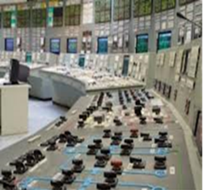

[5.2](5_2.md). Основні напрями розвитку мікропроцесорних засобів автоматизації <--- [Зміст](README.md) --> [Розділ 6](6.md). Помислові мікропроцесорні контролери

## 5.3. Напрями розвитку мікропроцесорних засобів промислової автоматизації

Існує кілька головних напрямів у галузі автоматизації технологічних процесів, які базуються на мікропроцесорних засобах промислової автоматики. Це – **розподілені системи керування** (Distributes Control System – DCS), **програмовані логічні контролери** (Programmable Logic Controller – PLC) та РС-сумісні промислові контролери, які отримали назву **PC based control**.

Історія виникнення і розвитку DCS і PLC належить до кінця
 70-х – початку 80-х років ХХ ст. і безпосередньо пов’язана з появою мікропроцесорів, що спричинило революційні зміни в галузі комп’ютерної техніки та технологіях розвитку засобів промислової автоматики.

Із самого початку напрями DCS і PLC розвивалися окремо, оскільки мали чітко виражені відмінності, насамперед в об’єкті автоматизації.

Напрям DCS (рис. 5.16) аміни в автоматизовані системи управління технологічними процесами (АСУТП), які впроваджувались на порозі 80-х років ХХ ст. і будувались на базі потужних (для тих часів) промислових ЕОМ – менфреймів, які централізовано керували складними неперервними технологічними процесами. Їх завданням було збирання й оброблення сигналів від датчиків, підготовка й подання інформації оператору, накопичення і документування архівних даних, вироблення рекомендацій та реалізація керуючих дій та ін. Спочатку ці системи були широко впроваджені в системах військового призначення, але дуже швидко мікропроцесорні розподілені системи управління почали впроваджуватись у промисловій сфері і поступово витіснили менфрейми, які на той час уже застаріли. Перші DCS були впроваджені на виробництвах із складними неперервними технологічними циклами в хімічній і нафтопереробній промисловості, де й була потреба у використанні великих інтегрованих систем. Провідними фірмами в галузі розроблення й впровадження DCS є фірми Honeywel, Fisher-Rosemount, Westinghouse. В Україні прикладом створення таких систем є система автоматизації Рокитнянського цукрового заводу на базі технічних засобів фірми Honeywel.

Рис. 5.16. Distributes Control System

Основним недоліком таких систем була їх надмірна централізація і надлишковість, що стримувало їх впровадження. Саме цим пояснюється той факт, що процеси, які були пов’язані із впровадженням АСУТП і активно розпочались на початку 70-х років, поступово стали уповільнювати свій розвиток.

Поява PLC пов’язана насамперед з автоматизацією дискретних процесів і потребою заміни традиційних систем керування, побудованих на базі релейно-контактних або безконтактних логічних схем керування, які працювали за жорсткою логікою. На першому етапі PLC практично один до одного замінили ці схеми, але із суттєвою перевагою – можливістю зміни алгоритму керування шляхом перепрограмування. Звідси й назва – програмований логічний контролер. Перший PLC, який мав назву MoDiCon (Modular Digital Controller), був застосований у 1968 р. в автомобільній промисловості США саме для заміни шаф із релейною логікою. Але дуже швидко, побачивши й зрозумівши переваги, які мають системи автоматизації, що побудовані на базі PLC, розробники цієї техніки почали розширювати функціональні й технічні можливості PLC. Сучасні PLC мають велику різноманітність модулів входів-виходів, у тому числі дискретних, аналогових, керування кроковими двигунами, вимірювання ваги та ін. Вони мають у складі свого програмного забезпечення алгоритми аналогового оброблення сигналів і завдання неперервного регулювання. Використання різноманітних мереж і польових шин, архітектури клієнт-сервер, нових технологій Microsoft (OPC, COM, DCOM, Active-X, Web-client), сучасних SCADA-програм перетворили системи, які побудовані на базі PLC, на потужні розподілені системи, які конкурують із системами DCS у галузі автоматизації неперервних технологічних процесів.

Але при цьому PLC вдалося зберегти особливості, які на початку їх розвитку зумовили їх величезну популярність серед кінцевих користувачів. Це насамперед зручності програмування та обслуговування. Наявність так званих “технологічних” мов програмування значно спростили процедуру реалізації і оперативної зміни алгоритму керування програмним шляхом. Наявність простих для вивчення технологічних мов програмування створює можливість модернізувати алгоритми керування системою безпосередньо кінцевому користувачеві. Якщо аналізувати галузі застосування напрямів DCS і PLC, то необхідно враховувати, що нині вони суттєво наблизилися і тому провести чітку межу в пріоритетах досить складно. Це стосується насамперед розробки АСУТП неперервними процесами. Однак є кілька факторів, які можна рекомендувати враховувати при прийнятті рішення. Якщо об’єкт автоматизації являє собою складний технологічний процес із великою кількістю (кілька тисяч) вхідних-вихідних сигналів (переважно аналогових) і має характер територіально зосередженого, то доцільно використовувати DCS. При цьому необхідно враховувати, що впровадження DCS потребує на першому етапі великих капітальних витрат. На кінцевому етані ці витрати можуть виявитися меншими, якщо цей самий проект реалізувати з використанням PLC. Але побудова системи на базі PLC дає більші можливості для поетапного впровадження системи керування.

Останнім часом на ринку промислової автоматики в країнах СНД великою популярністю користується продукція таких фірм, як Octagon Systems, Advantech, Analog Devise та інших, відомих як напрям PC-based control, або як РС сумісні контролери. Основною ідеєю розробників цього напряму було показати можливості використання звичного стандартного програмного забезпечення РС і поширених мов програмування у створенні прикладних програм для керування різноманітними процесами. Тисячі користувачів персональних ПЕОМ раптом отримали можливість використати свої знання і досвід роботи в новій для них галузі, і десятки фірм почали пропонувати підприємствам цю продукцію як базову для побудови АСУТП. По суті, це промислові комп’ютери з вбудованими модулями зв’язку з об’єктом, які виконуються в різноманітних конструктивах, або окремі модулі, які можуть бути досить просто встановлені в звичайні РС. Враховуючи, що ці пристрої призначені для розв’язання досить визначених задач керування, їхня архітектура і програмне забезпечення адаптовані для вирішення завдань управління технологічними процесами і промисловим обладнанням. Пропонуючи досить низькі ціни, повну відкритість інтерфейсів, програмного забезпечення і широку номенклатуру модулів зв’язку з об’єктом, ці контролери намагаються скласти конкуренцію класичним PLC.

Але, намагаючись конкурувати з PLC у напрямі промислової автоматики, розробники PC based control повинні звернути увагу на деякі протиріччя, які закладені в головній ідеї їх створення. Залучення користувачів РС до розробок у галузі АСУТП – напрям перспективний, але не треба забувати, що основними розробниками АСУТП є все-таки спеціалісти не в галузі комп’ютерних технологій, а в галузі автоматизації, які повинні користуватися спеціалізованим програмним забезпеченням, орієнтованим на вирішення завдань автоматичного керування. Саме тому в сучасних PLC, коли розробляється прикладне програмне забезпечення, багато завдань розв’язується навіть не на рівні програмування, а на рівні простого конфігурування. Не треба також забувати негативний досвід впровадження перших АСУТП на базі управляючих ЕОМ, коли розроблення прикладного програмного забезпечення потребувало залучення спеціалістів насамперед у галузі програмування. Це ускладнило як розроблення, так і супроводження й модернізацію таких систем. Крім того, сучасні PLC мають досить потужні програмні засоби самодіагностики і налагодження, вони мають можливість вносити зміни в прикладну програму під час її виконання. Тому, намагаючись конкурувати з PLC в галузі АСУТП, розробники PC based control повинні вирішувати ці завдання, тобто повторювати шлях, який уже пройшли розробники PLC.

Безумовно, що вони не мають конкуренції при автоматизації наукових досліджень або автоматизації унікального обладнання, алгоритми керування якими потребують використання нестандартних або складних алгоритмів оброблення даних. Крім того, вони можуть бути ефективними у бортових системах керування, в медицині, космічній і військовій промисловості, засобах комунікації.

У зв’язку з тим, що в сучасних системах автоматизованого управління технологічними процесами харчових виробництв в основному використовуються промислові логічні контролери, в подальшому детальніше розглянемо самі ці управляючі мікропроцесорні засоби автоматизації.

[5.2](5_2.md). Основні напрями розвитку мікропроцесорних засобів автоматизації <--- [Зміст](README.md) --> [Розділ 6](6.md). Помислові мікропроцесорні контролери