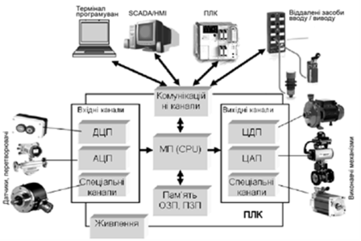
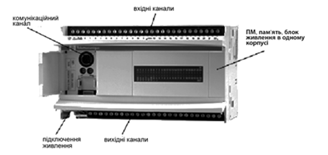
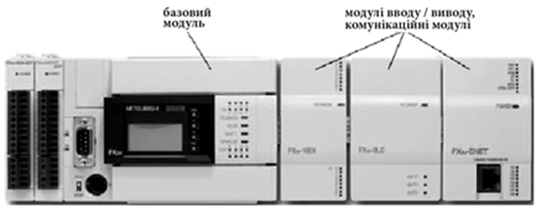
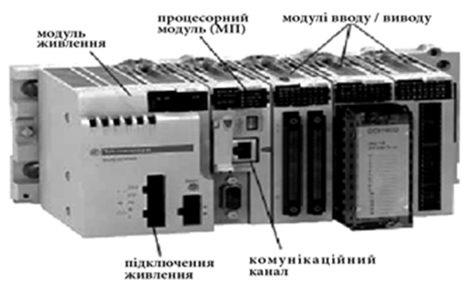
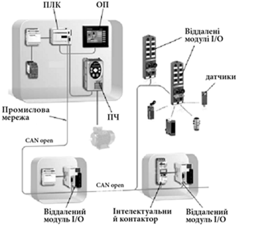

[Розділ 6](6.md). Помислові мікропроцесорні контролери <--- [Зміст](README.md) --> [6.2](6_2.md). Розроблення програми користувача для ПЛК.

## 6.1. Основні принципи побудови мікропроцесорних контролерів.

### 6.1.1. Структура мікропроцесорних контролерів

Технічне та програмне забезпечення промислових мікропроцесорних контролерів оптимізовані для створення на їх базі систем керування обладнанням і технологічними процесами.

Як уже згадувалося, поява промислових мікропроцесорних контролерів пов’язана насамперед з автоматизацією дискретних процесів і необхідністю заміни традиційних систем керування, які будувались на базі релейно-контактних або безконтактних логічних схем керування, що працювали за жорсткою логікою. Це й зумовило їхню загальну назву – програмований логічний контролер, який у міжнародних документах позначається як PLC (Programmable Logic Controller), а у вітчизняній літературі – ПЛК. І хоча функціональні можливості сучасних ПЛК давно вже вийшли за рамки вирішення цих завдань, така назва закріпилася за промисловими мікропроцесорними контролерами всіх типів, стала офіційною і знайшла своє відображення у відповідних стандартах.

Можна дати таке визначення ПЛК: **програмований логічний контролер –** це спеціалізований мікропроцесорний пристрій, призначений для керування виробничими процесами в умовах промислового середовища в реальному масштабі часу, для програмування яких використовуються мови програмування, добре зрозумілі неспеціалісту в галузі інформатики.

Можна виділити декілька основних рис ПЛК:

1. **Наявність ‘‘технологічних’’ мов програмування,** які максимально наближені до потреб кінцевого користувача і значно спростили програмування, налагодження та модифікацію прикладних програм. Це дало змогу підтримати основну властивість ПЛК – можливість оперативної зміни алгоритму керування програмним шляхом. Нині існує міжнародний стандарт МЕК 61131, згідно з яким рекомендовано п’ять мов програмування ПЛК: релейно-контактних схем, списку інструкцій, структурованого тексту, функціональних блоків і структурованих функціональних схем.

2. **Блочно-модульний принцип побудови ПЛК** (крім моноблочних контролерів) дає можливість за рахунок використання різноманітних модулів входу-виходу оптимізувати технічну структуру ПЛК для керування конкретним об’єктом. Тобто конфігурація ПЛК (перелік модулів, які входять до складу контролера) залежить від конкретного об’єкта управління і алгоритму управління ним. Це не тільки зменшує витрати на впровадження систем автоматизації, а й підвищує ремонтоздатність ПЛК.

3. Призначення ПЛК для використання в промислових умовах ставить досить жорсткі вимоги до надійності ПЛК та захищеності його від впливу різноманітних електромагнітних, вібраційних, кліматичних та інших перешкод. Це досягається за рахунок **використання надійної елементної бази,** стійких і надійних схемних рішень, спеціальних гальванічних розподільників, резервування, дублювання та інших заходів, а також високого технологічного рівня виробництва ПЛК.

4. Наявність широко розвинутої **системи самодіагностики та тестування**, за допомогою яких можна швидко визначити несправність та усунути її. Це є дуже важливою функцією, оскільки ПЛК - досить складний технічний засіб і визначення причини відмови ПЛК потребує досить високої кваліфікації обслуговуючого персоналу. Тому в разі виникнення технічної несправності ПЛК система діагностики допомагає швидко визначити модуль, у якому виникла несправність. Цей модуль повинен бути швидко замінений технічним персоналом і працездатність системи управління буде поновлена. А несправний модуль повинен бути переданий на ремонт у сервісну службу виробника ПЛК.

5. Для забезпечення роботи ПЛК у складі розподіленої АСУТП передбачена можливість організації обміну інформацією між окремими ПЛК та передачі технологічної інформації в системи  використання **промислових мереж**.

На рис. 6.1 показано узагальнену структуру програмованого логічного контролера. Центральною частиною ПЛК є мікропроцесорний пристрій (МП, CPU), який керує операціями збору і оброблення даних від зовнішніх пристроїв і вироблення керуючих дій відповідно до розробленої програми користувача.

Рис. 6.1. Фізична структура промислового контролера

Мікропроцесорні модулі сучасних контролерів являють собою, як правило, мультипроцесорну систему, в якій задачі, які повинен виконувати мікропроцесорний модуль, розподіляються між окремими процесорами, робота яких взаємоузгоджена. Це викликано тим, що ПЛК повинен працювати в режимі реального часу, адекватно реагуючи на зміну стану об’єкта керування.

Частина ресурсів пам’яті контролера використовується для зберігання операційної системи, якою керується мікропроцесорний модуль, а також для зберігання системної інформації про оперативний стан апаратного і програмного забезпечення. Саме ця інформація використовується для функціонування системи самодіагностики і тестування контролера.

Друга частина ресурсів пам’яті використовується для зберігання розробленої **програми користувача,** яка й визначає виконання алгоритму керування об’єктом. Ємність пам’яті, яка використовується для зберігання програми користувача, визначає можливості даного ПЛК для створення прикладного програмного забезпечення.

Функціональні і технічні можливості мікропроцесорного модуля і модулів пам’яті визначають одну з основних характеристик ПЛК – його швидкодію, яка, як правило, вимірюється в швидкості оброблення 1 кілобайта (або кілослова) програми користувача або як час одноразового обслуговування всіх входів-виходів контролера, тобто робочого циклу ПЛК.

У ПЛК використовуються всі види пам’яті – ОЗП, ПЗП і ППЗП. Вони можуть або вбудовуватись у процесорний модуль або входити до складу контролера у вигляді окремих модулів або карт пам’яті. Це дає можливість сформувати пам’ять контролера, яка за характеристиками і ємністю найбільш відповідає прикладному завданню керування.

Як уже зазначалося, ПЛК призначений для управління об’єктом автоматизації, для чого він повинен отримувати інформацію від різноманітних датчиків і, згідно із заданим алгоритмом управління, виробляти сигнали для управління виконавчими механізмами. Для реалізації цього завдання до складу ПЛК входять різноманітні канали (часто в складі модулів або блоків), які забезпечують його зв’язок з датчиками і виконавчими механізмами. Основним завданням цих каналів є перетворення фізичних сигналів від датчиків на цифрову форму і навпаки - перетворення цифрової форми управляючих сигналів, вироблених мікропроцесорним модулем, на фізичні сигнали, які можуть керувати виконавчими механізмами.

Як уже зазначалося, ПЛК будується за блоково-модульним принципом (крім моноблочних контролерів) і сам ПЛК є проектно-компонованим виробом. Тобто типи модулів і їхня кількість залежать від об’єкта автоматизації і алгоритму керування ним.

До складу сучасних ПЛК входить велика кількість різноманітних каналів, як правило, в складі модулів (блоків), які умовно можна поділити на декілька основних груп відповідно до існуючих типів датчиків і виконавчих механізмів.

Вхідні модулі:

- **канали (модулі) дискретно-цифрового перетворення (ДЦП),** до яких підключаються датчики з дискретним виходом (сигналізатори рівня, електроконтактні манометри та ін.) та управляючі технічні засоби (кнопки, перемикачі, датчики положення та ін.);

- **канали (модулі) аналогового-цифрового перетворення (АЦП),** до яких підключаються датчики з аналоговим уніфікованим електричним виходом, а також термометри опору і термопари;

- **спеціалізовані канали (модулі),** до яких підключаються специфічні вхідні сигнали, наприклад, модулі для підключення тензометричних датчиків вимірювання ваги; модулі лічильників; модулі безпеки; кодери і енкодери тощо.

Вихідні канали (модулі):

- **канали (модулі) цифро-дискретного перетворення (ЦДП),** до яких підключаються дискретні виконавчі механізми і технічні засоби (магнітні пускачі, сигнальні лампи та ін.), а також електричні виконавчі механізми з постійною швидкістю обертання (типу МЕО, МЕК та ін.);

- **канали (модулі) цифро-аналогового перетворення (ЦАП),** до яких підключаються аналогові виконавчі механізми, для управління якими використовуються уніфіковані електричні сигнали.

- **спеціалізовані канали (модулі),** до яких підключаються специфічні вихідні сигнали, наприклад, модулі для керування кроковими двигунами, модулі безпеки та ін.

Останнім часом особливу увагу розробники приділяють розробленню **комунікаційних модулів,** які забезпечують підключення ПЛК до різноманітних промислових мереж. Комунікаційні канали також використовуються для підключення до ПЛК терміналів програмування. На сьогоднішній день в якості терміналів програмування використовуються комп’ютери зі встановленим спеціальним програмним забезпеченням – ***середовищем програмування ПЛК.***

### 6.1.2. Огляд промислових мікропроцесорних контролерів

Випускається велика кількість промислових мікропроцесорних контролерів серед яких особливої популярності в системах автоматизації харчових виробництв набули ПЛК фірм Siemens, Schneider Electric, Mitsubishi Electric, VIPA та ін.

За конструктивним виконанням всі ПЛК можна поділити на декілька груп. 

Для завдань автоматичного управління з невеликою кількістю входів-виходів випускаються моноблочні ПЛК, які також називають компактними. Вони являють собою функціонально закінчений технічний засіб, у якому розташовані всі функціональні модулі: мікропроцесор, усі види пам’яті, блок живлення, комунікаційні, вхідні та вихідні канали. Основна перевага таких контролерів – їхня низька ціна. Основний недолік – неможливість розширювати кількість каналів входів-виходів. Для забезпечення можливості вибору оптимальної структури такого типу контролерів випускається серія таких контролерів, які мають різну кількість і співвідношення типів каналів входів виходів. На рис. 6.2 показано моноблочний контролер TSX Twido Compact фірми Schneider Electric (Франція).

Рис. 6.2. Приклад ПЛК у моноблочному виконанні

Для систем із середньою кількістю каналів (десятки) можливою альтернативою моноблочним контролерам можуть бути компактні контролери з можливістю нарощення додатковими модулями (рис. 6.3). У такому конструктиві основу ПЛК становить базовий модуль, який функціонально являє собою повністю закінчений контролер, подібно до компактного. Такий контролер вміщує мікропроцесор, усі види пам’яті, блок живлення, комунікаційні, вхідні та вихідні канали. Перевагою цього виконання є можливість його нарощення додатковими модулями. На рис. 6.3 показано компактний контролер типу FX фірми Mitsubishi Electric (Японія) з установленими додатковими модулями входів/виходів та комунікаційними.

Рис. 6.3. Приклад компактного ПЛК з можливістю нарощення додатковими модулями

Для систем автоматизації технологічними процесами частіше використовуються модульні ПЛК, кількість і типи модулів у яких вибираються залежно від кількості і типів вхідних-вихідних сигналів. Це і є основною перевагою модульних контролерів перед компактними. Такі контролери призначені для побудови систем управління, кількість датчиків та виконавчих механізмів у яких вимірюється десятками та сотнями. Для ПЛК такого типу базовими складовими для забезпечення їхньої працездатності є модуль живлення та процесорний модуль (їх інколи суміщають в єдиному корпусі). Всі інші модулі набираються залежно від поставленого завдання. На рис. 6.4 показано модульний контролер M340 фірми Schneider Electric (Франція).

 Рис. 6.4. Приклад ПЛК модульного типу

До складу модульного ПЛК може входити велика кількість модулів (порядку ста), з одним процесорним модулем у якості керуючого пристрою. Такий багатоканальний контролер може керувати технологічними процесами всього виробництва. Але недоліком такої системи є те, що в разі виходу з ладу мікропроцесорного модуля втрачається управління всім виробництвом. Більш доцільним є створення розподіленої системи, в якій на кожній технологічній ділянці (відділенні) встановлюється свій окремий ПЛК для управління технологічними процесами цієї частини виробництва. Для координації роботи цих ПЛК їх об’єднують промисловими мережами в єдину інтегровану систему управління. Використання розподіленого принципу управління та модульної структури дає змогу вибрати і конфігурувати контролери, для якого буде мінімізований показник функціональні можливості/вартість ПЛК.

Останнім часом великої популярності набули структури систем управління на базі контролерів з розподіленими (віддаленими) засобами вводу/виводу (рис. 6.5). У таких системах до промислової мережі ПЛК підключаються віддалені модулі вводу/виводу та інші засоби польового рівня, такі як:

- віддалені модулі вводу/виводу (модулі I/O);

- перетворювачі частоти (ПЧ), які призначені для управління частотою обертів асинхронного двигуна;

- сервоприводи;

- інтелектуальні контактори (магнітні пускачі);

- інтелектуальні датчики та виконавчі механізми. 

Рис. 6.5. Структура ПЛК з віддаленими модулями входів-виходів

З точки зору ПЛК, всі засоби польового рівня, які підключені до його промислової мережі, являються його модулями вводу/виводу. На відміну від локальних модулів вводу/виводу модульного ПЛК (тобто які розміщені на його шасі), віддалені модулі I/O можуть знаходитись у місці розташування датчиків, на великій відстані від базового ПЛК, що значно зменшує кількість кабелів і монтаж обладнання. Крім того, застосування стандартних промислових мереж дає можливість використовувати віддалені модулі вводу/виводу та периферії різних виробників. На рис. 6.5 показано структуру розподіленої системи управління, в якій до ПЛК за допомогою промислової мережі (CANopen) під’єднуються віддалені модулі входів-виходів (I/O), до яких підключаються датчики і виконавчі механізми, перетворювачі частоти (ПЧ) та інтелектуальні контактори. Ці віддалені модулі I/O можуть знаходитись на відстані в декілька сот метрів від ПЛК, до якого вони підключені.

### 6.1.3. Вибір і конфігурування ПЛК

Контролер забезпечує оброблення вхідної інформації з об’єкта управління та формування управляючих дій відповідно до алгоритму управління розробленого для конкретного об’єкта автоматизації. Вибір і конфігурування ПЛК виконується після розроблення схеми автоматизації об’єкта, визначення типів і кількості датчиків та виконавчих механізмів, коли вже розроблено алгоритми логіко-командного управління, коли визначено структуру системи управління, а також відомо про необхідність використання промислових мереж.

Першочерговим завданням розроблення системи управління на базі мікропроцесорного промислового контролера є вибір його типу і конфігурації, тобто вибір переліку модулів входів-виходів, які повинні бути використані для системи управління конкретним об’єктом. Як правило, пропонується велика номенклатура модулів-входів виходів, які розрізняються такими технічними характеристиками.

***Модулі дискретних входів:***

- кількість каналів (від 8 до 64);

- типи вхідних сигналів: 

  - 24, 48 В постійного струму (VDC); 

  - 48, 110, 220 В змінного струму.

***Модулі дискретних виходів:***

- кількість каналів (від 8 до 64);

- типи вхідних каналів: 

  - транзисторні з можливістю комутувати сигнали 24 В постійного струму (VDC) із струмом комутації до 0,5 А;

  - релейні з можливістю комутувати сигнали 24 В постійного струму (VDC) або 24-220 В змінного струму (АDC) із струмом комутації до 3 А.

***Модулі аналогових входів:***

- кількість каналів (від 8 до 16);

- типи вхідних сигналів:

  - уніфіковані сигнали з напругою 0-5 В, 0-10 В, -10/+10 та ін.;

  - уніфіковані сигнали зі струмом 0-20 мА, 4-20 мА та ін.;

  - сигнали від термометрів опору;

  - сигнали від термопар;

  - універсальний.

Крім того, при виборі модулів аналогових входів враховують наявність чи відсутність гальванічного розподілу вхідних каналів, а також розрядність АЦП: 8-, 10, і 16-розрядні АЦП, від якої залежить точність аналогово-цифрового та цифро-аналогового перетворення.

***Модулі аналогових виходів:***

- кількість каналів (від 2 до 16);

- типи вихідних сигналів:

  - уніфіковані сигнали з напругою 0-5 В, 0-10 В, -10/+10 та ін.;

  - уніфіковані сигнали зі струмом 0-20 мА, 4-20 мА та ін. 

При виборі модулів аналогових виходів також враховують наявність чи відсутність гальванічного розподілу вихідних каналів, а також розрядність ЦАП: 8-, 10, і 16-розрядні ЦАП.

***Спеціальні модулі.*** Якщо алгоритм управління об’єктом передбачає необхідність використання модулів, які використовують не уніфіковані електричні сигнали розглядається доцільність і типи цих модулів з урахуванням кількості каналів і технічних характеристик.

Велика кількість номенклатури модулів входів-виходів пояснюється бажанням виробника надати розробнику системи можливість вибрати оптимальну структуру ПЛК, яка мала б найкращу характеристику: функціональні можливості/вартість ПЛК.

Крім виконання своєї основної функції по перетворенню сигналів, вхідні і вихідні модулі виконують ряд функцій, які дають можливість адаптувати функціональні можливості модулів до властивостей зовнішніх пристроїв і умов виконання алгоритму керування об’єктом. Ці функції, як правило, встановлюються в процесі конфігурування контролера та окремих його модулів або шляхом зміни фізичних настроювань модуля. Наприклад, для окремих каналів вхідних модулів можна вибирати і встановлювати різні діапазони вимірювання, або для модулів дискретних і цифрових виходів задавати значення або стан вихідних сигналів, які будуть установлюватися в разі зупинки контролера.

Особливу увагу розробники ПЛК приділяють захисту інформації від впливу різноманітних перешкод, які можуть виникати під час експлуатації контролера в промислових умовах. Насамперед це схемотехнічні рішення, які дають змогу реалізувати надійне гальванічне розділення внутрішніх (низьковольтних і слабкострумових) електричних ланок контролера від зовнішніх (високовольтних та сильно струмових) електричних ланок об’єкта керування, які одночасно є джерелом потужних електричних та електромагнітних перешкод, в умовах яких без гальванічного розділення контролер надійно працювати не може.

Після визначення кількості і номенклатури модулів входів-виходів, з урахуванням складності завдань, вибирається тип і модель ПЛК, а також тип процесорного модуля і модуля живлення.

[Розділ 6](6.md). Помислові мікропроцесорні контролери <--- [Зміст](README.md) --> [6.2](6_2.md). Розроблення програми користувача для ПЛК.