[6.1](6_1.md). Основні принципи побудови мікропроцесорних контролерів. <--- [Зміст](README.md) --> [Розділ 7](7.md). Людино-машинний інтерфейс автоматизованого робочого місця оператора-технолога 

## 6.2. Розроблення програми користувача для ПЛК.

### 6.2.1. Змінні ПЛК та їхні типи

Як було показано вище, при використанні ПЛК, алгоритм управління об’єктом реалізується програмним шляхом. Кожна програма має дані і тіло програми, яка на основі цих даних виконує розрахунки або виробляє управляючі дії, визначені програмою.

Основною відмінністю програм користувача для ПЛК від комп’ютерних програм є те, що комп’ютерні програми використовують дані, які вводяться в програму, а програма користувача для ПЛК отримує інформацію від фізичних пристроїв – датчиків, а також виробляє фізичні сигнали для управління виконавчими механізмами. 

Дані, якими оперує програма користувача, називаються змінними, тому що в процесі виконання програми вони постійно змінюють свої значення. Змінні, які пов’язані із сигналами від датчиків, прийнято називати ***вхідними змінними*** (Input Variables), вихідних каналів – ***вихідними змінними*** (Output Variables).

Для того щоб програма користувача могла оперувати цими змінними, вони повинні мати адресу або ім’я, яке однозначно пов’язане з конкретним фізичним сигналом, який подається на ПЛК або виробляється ним як управляючий сигнал. Ця адреса або ім’я, пов’язане з місцем реального підключення датчиків або виконавчих механізмів до модулів ПЛК. У зв’язку з цим на першому етапі програмування ПЛК з використанням спеціальних графічних і інших редакторів створюється віртуальний образ контролера, який відповідає фізичній конфігурації ПЛК, тобто розміщенню у контролері модулів входів-виходів. При цьому в пам’яті ПЛК створюється область комірок пам’яті, куди буде записуватись інформація про стан фізичних каналів входів-виходів. При цьому будуть генеруватись адреси цих комірок пам’яті, за якими програма користувача буде звертатись до них для оброблення інформації про стан фізичних входів-виходів. 

Існують декілька варіантів адресації каналів входів-виходів. Один з них, так званий «географічний», або «топографічний», показано на рис. 6.6. Такий варіант адресації використовується в модульних контролерах фірми Schnеider Electric.

В основу цієї системи покладено те, що для деяких типів ПЛК кожне місце для встановлення модуля має свій номер. Адреса змінної складається з позначень (рис. 6.6).

Рис. 6.6. Принцип адресації вхідних і вихідних змінних ПЛК

На рис. 6.7 показано варіант підключення до каналів умовного ПЛК датчиків і виконавчих механізмів для прикладу, наведеного на рис. 5.14. До складу ПЛК входять:

- модуль живлення, встановлений на спеціальному місці, яке позначено PS; процесорний модуль, який встановлений на місці за номером 00;

- модулі дискретних входів, дискретних виходів, аналогових входів і аналогових виходів, які встановлені відповідно на місцях за номерами 01, 02, 03 і 04.

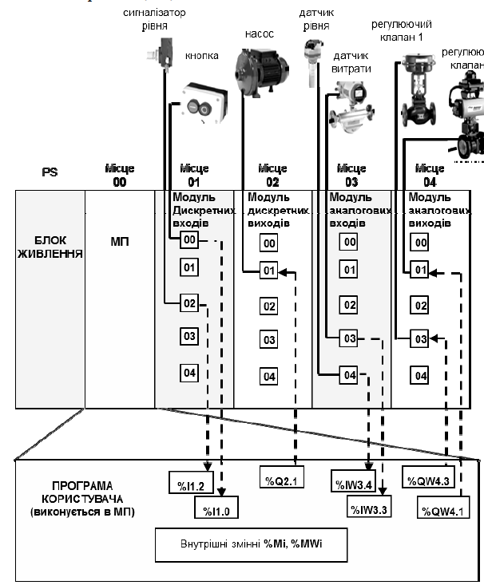

Рис. 6.7. Схема підключення датчиків і виконавчих механізмів до каналів ПЛК

На кожному модулі для прикладу показано по 5 каналів, кожен із яких також має свій номер.

Нижче наведено детальний опис підключення засобів автоматизації до ПЛК і визначення їх адрес.

1) На рис. 6.8 показано приклад, де сигнали від кнопочної станції SB і сигналізатора рівня LA відповідно підключаються до каналів 00 (через контакти «0+» та «0-») і 02 (через контакти «2+» та «2-») модуля дискретних входів розташованого на місці 01 у ПЛК. Згідно з розглянутими вище правилами «географічної» адресації, вони мають адреси: *%I1.0* i *%I1.2*. Символ «Х» для дискретних змінних можна не вказувати.

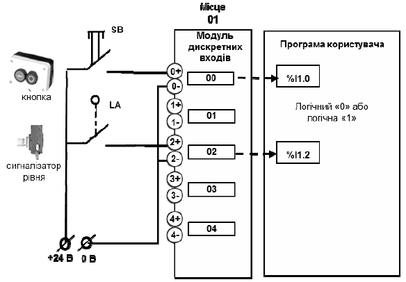

Рис. 6.8. Підключення дискретних вхідних сигналів

Фізично це означає, що якщо буде натиснута кнопка SB або спрацює сигналізатор рівня LA (коли рівень стане більше допустимого значення), на вхід відповідного каналу буде поданий електричний сигнал + 24 В. У цьому випадку вхідна зовнішня змінна з відповідною адресою перейде в стан логічної «1»

2) На рис. 6.9 показано приклад, де до 1-го каналу модуля дискретних виходів, розташованого на місці 02 у ПЛК, підключене реле KV1, контакти якого включають і відключають насос. Цей дискретний вихід пов'язаний зі змінною, яка, згідно з правилами, має адресу *%Q2.1*.

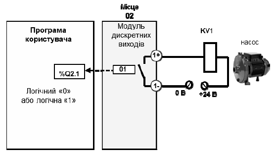

 Рис. 6.9. Підключення дискретних вихідних сигналів

Фізично це означає, що якщо в процесі виконання програми користувача вихідна змінна *%Q2.1* прийме значення логічної «1», на виході цього каналу замкнеться контакт реле або спрацює транзисторний ключ, через які на обмотку реле KV1 буде подана відповідна напруга, і реле KV1 спрацює й через його контакти буде включений насос.

3)  На рис. 6.10 показано приклад підключення до модуля аналогових входів ПЛК, розташованого на місці 03 аналогових вхідних сигналів. До каналу 03 підключений датчик витрати, а до каналу 04 – датчик рівня. Відповідно адреси цих сигналів будуть мати вигляд: *%IW3.3* i *%IW3.4*. Необхідно звернути увагу на наступне:

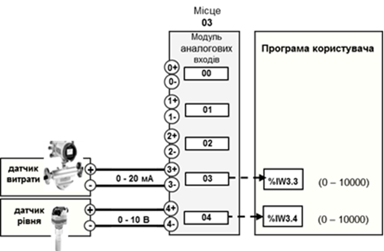

Рис. 6.10. Підключення аналогових вхідних сигналів

а) у цьому прикладі датчики мають різні уніфіковані електричні сигнали: струмовий 0 – 20 мА і по напрузі – 0 – 10 В. Тобто вибрано такий модуль аналогових входів, у якому можливо настроювати кожний аналоговий канал модуля на вибір того чи іншого уніфікованого електричного сигналу. 

б) кожний датчик має діапазон вимірювання, який вибирається залежно від робочого значення вимірювального параметра. Вибраному діапазону вимірювання відповідає повний діапазон вихідного аналогового уніфікованого сигналу. У модулі аналого-цифрового перетворення ПЛК фізичний сигнал від датчика перетворюється на числове значення. На прикладі показано, що це значення становить від 0 до 10000. Тобто відбувається перетворення:

 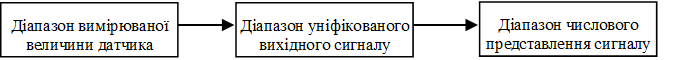

Це необхідно пам’ятати, щоб вміти знаходити співвідношення між значенням вимірюваної величини і числовим значенням представлення цієї величини в ПЛК

У загальному вигляді ці розрахунки можна проводити з використанням такої пропорції:

$$
\frac{Ш_К-Ш_П}{ЧЗ_К-ЧЗ_П}=\frac{Х-Ш_П}{ЧЗ_і-ЧЗ_П}
$$

де $Ш_п$ і $Ш_к$ – відповідно початкове і кінцеве значення вимірюваного діапазону; $ЧЗ_п$ і $ЧЗ_к$ – відповідно початкове і кінцеве значення числового представлення сигналу в ПЛК (рис. 6.11).

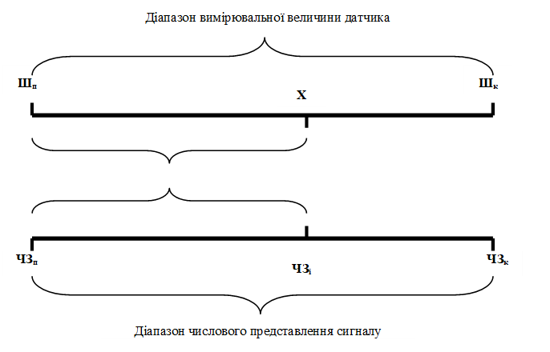

 Рис. 6.11. Числове представлення аналогового вхідного сигналу

Із наведеного співвідношення, знаючи діапазон вимірювання і числовий діапазон представлення цього діапазону в ПЛК, можна для будь-якої точки діапазону розрахувати його числове значення в ПЛК, і навпаки.

Наприклад, для розглянутого вище діапазону від 0 0С до 120 0С числове значення для точки 80 0С, для діапазону представлення аналогової змінної в ПЛК діапазоні від 0 до 10000, становитиме:

 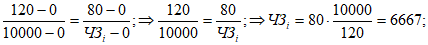

Розрахуємо числове значення для тієї ж точки 80 0С, але для діапазону вимірювання від -30 0С до 120 0С.

4) На 04-му місці ПЛК розташований модуль аналогових виходів, до 01-го каналу якого підключений регулюючий клапан 1, а до каналу 03 – регулюючий клапан 2 (рис. 6.12.). На регулюючі клапани з модуля ЦАП ПЛК подається реальний фізичний управляючий сигнал 0 – 20 мА (може бути інший уніфікований електричний сигнал). Величина цього сигналу змінюється пропорційно значенню зовнішніх аналогових змінних *%QW4.1* i *%QW4.3*, які розраховуються програмою користувача в діапазоні від 0 до 10000 одиниць.

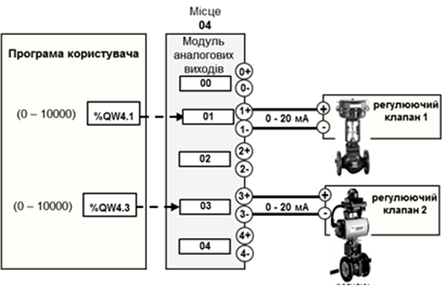 

Рис. 6.12. Підключення аналогових вихідних сигналів

Програма користувача може зберігати проміжні значення. Так, для підрахунку імпульсів з лічильника-витратоміра необхідно зберігати його плинне значення. Інший приклад, коли оператор з операторської панелі задає задане значення певного параметра. Ці проміжні значення не приходять з вхідних каналів і не використовуються для вихідних. Тому їх записують у ***внутрішні змінні*** (Internal Variables або Memory Variables). Внутрішні змінні не пов’язані ні з входами ні з виходами ПЛК, тому можуть бути використані довільно.

Внутрішні змінні дискретного типу мають адресу *%Мі*, де і – номер змінної. Аналогові внутрішні змінні позначаються *%MWi*, де і – номер аналогової змінної. Максимальна кількість внутрішніх змінних залежить від моделі ПЛК.

До того ж, крім зовнішніх і внутрішніх змінних, у програмі користувача можуть використовуватися змінні, пов’язані з різноманітними функціональними блоками: таймерами, лічильниками, регістрами тощо.

У більшості сучасних ПЛК є можливість присвоювати змінним контролера «технологічні імена», які можуть бути використані в процесі розроблення прикладної програми користувача. 

### 6.2.2. Робочий цикл виконання програми користувача 

У зв’язку з тим, що основним завданням управляючої програми мікропроцесорного контролера є керування виконавчими механізмами залежно від значення сигналів, які характеризують стан об’єкта керування, контролер повинен весь час стежити за станом та значеннями вхідних сигналів і виробляти керуючі дії відповідно до реалізованого алгоритму керування. Тому процес роботи ПЛК складається в циклічній послідовності виконання кількох етапів, що становлять робочий цикл контролера (рис. 6.13). До них належать:

- **опитування входів,** у процесі якого в оперативну пам’ять контролера записується інформація про стан усіх фізичних входів, підключених до ПЛК, тобто на початку робочого циклу формується так званий образ процесу;

- **виконання прикладної програми,** підготовленої користувачем згідно із заданим алгоритмом керування. Програма користувача виконується для комбінації вхідних сигналів, які були отримані на стадії опитування входів. В результаті виконання програми будуть розраховані значення вихідних змінних, які будуть передані на вихідні модулі тільки після закінчення етапу виконання прикладної програми;

- **встановлення виходів,** у процесі якого каналам вихідних модулів встановлюються значення, які отримані в результаті виконання прикладної програми.

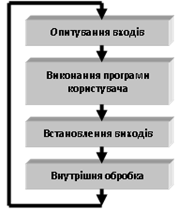

Рис.6.13. Робочий цикл роботи ПЛК

Крім того, в процесі кожного робочого циклу виконуються процедури, пов’язані не стільки з обробленням прикладної програми, як із задачами аналізу стану апаратних засобів, самодіагностики, оброблення запитів, які прийшли з пульта ПЛК або по мережі тощо. Тобто відбувається **внутрішня обробка**, яка виконується на системному рівні контролера. Після виконання цього етапу починається новий робочий цикл знову з опитування входів.

Циклічність виконання програми користувача ПЛК є дуже важливою особливістю роботи мікропроцесорного контролера, яка повинна бути врахована при розробленні прикладної програми користувача. Розглянемо декілька можливих варіантів.

1) Програма перебуває на етапі «виконання програми» і в цей момент змінилося значення якогось зі входів. У цьому випадку програма зреагує на цю зміну тільки в наступному робочому циклі.

2) Гіршим є варіант, коли зміна входу буде дуже короткою, тобто, наприклад на етапі виконання програми якийсь дискретний вхід встигне включитись і відключитись. У цьому випадку ця зміна залишиться непоміченою ПЛК.

3) На етапі виконання програми, на її початку, сформується команда «включити дискретний вихід», а наприкінці – «відключити дискретний вихід». У цьому випадку виконається остання команда. Тобто включення виходу не відбудеться.

Найбільш вживані дві форми організації робочого циклу: циклічне та періодичне виконання.

Для **циклічного** виконання характерне послідовне, одне за одним, виконання етапів прикладної програми. Сумарне виконання окремих етапів програми визначає час робочого циклу (рис. 6.14).

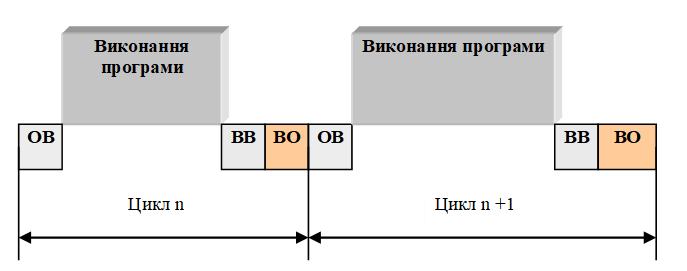

У зв’язку з тим, що в процесі виконання прикладної програми час виконання окремих її етапів може змінюватись, буде змінюватись і тривалість робочого циклу ПЛК.

За **періодичного** режиму виконання робочого циклу його тривалість задається при програмуванні контролера. У цьому разі при виконанні програми ПЛК також послідовно виконує всі етапи оброблення програми. Проте, якщо останній етап робочого циклу  виконався, а заданий час періоду ще не вичерпався, то процесор заповнює час операційного циклу, що залишився, системними чи фоновими задачами доти, поки не закінчиться період, і тільки після цього почнеться новий робочий цикл (рис. 6.15).

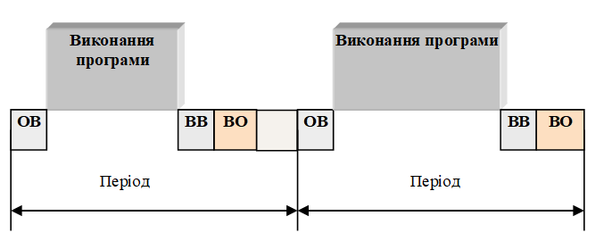 

Різні контролери можуть мати різні режими виконання робочого циклу.

### 6.2.3. Розроблення програми користувача ПЛК

Розроблення прикладного програмного забезпечення для мікропроцесорної системи управління на базі ПЛК – головний етап проектування такої системи. Перелік етапів, які при цьому виконуються, залежить від вибраної структури системи управління, складності алгоритмів управління в складі системи, вимог до надійності та інших факторів, які повинні бути враховані при проектуванні системи. У загальному вигляді порядок розроблення мікропроцесорної системи автоматизації з використанням промислових логічних контролерів включає в себе декілька етапів:

1) формування переліку функцій та задач ПЛК в складі системи управління; в основу такого рішення може бути покладена розроблена напередодні схема автоматизації для об’єкта, який автоматизується;

2) вибір апаратного забезпечення мікропроцесорного контролера, тобто визначення кількості і типів каналів і модулів входів-виходів, які повинні забезпечити підключення до контролера різноманітних датчиків і виконавчих механізмів;

3) розроблення алгоритму та програми користувача для реалізації заданого алгоритму управління, а також його налагодження.

Послідовність розроблення прикладного програмного забезпечення залежить від правил і процедур програмування, які передбачені в тому програмному середовищі, який використовується для програмування конкретних моделей ПЛК різних виробників.

Усі функції та задачі які покладені на ПЛК, умовно можна віднести до одного з двох типів: задачі логіко-командного управління і задачі неперервного регулювання. Для кожного з цих типів можна вибрати більш зручну для програмування мову. Основною особливістю програмованих логічних контролів є наявність "технологічних" мов програмування, добре зрозумілих спеціалістам у галузі автоматизації, електроніки, електротехніки та технології виробництв. Ці мови розроблялися з урахуванням особливостей різних типів задач та кваліфікації спеціалістів. На сьогоднішній день 5 найбільш популярних мов програмування промислових контролерів закріплені в міжнародному стандарті МЕК 61131-3 (IEC 61131-3); це:

- LD (Ladder Diagram);

- FBD (Function Block Diagram);

- ST (Structured Text);

- SFC (Sequential Function Chart);

- IL (Instruction List);

Мова ***IL*** (Instruction List) являє собою список інструкцій, подібних до мови Асемблера, які виконуються послідовно. Це мова низького рівня, тому нею користуються в основному програмісти, які залучаються для розроблення програми користувача для ПЛК.

Мова ***LD*** (Ladder Diagram) – це графічна мова програмування, яка використовує графічні елементи, подібні до тих, які використовуються в релейно-контактних схемах. Саме тому у вітчизняній практиці ця мова носить назву “Мова релейно-контактних схем” (РКС). Ця мова програмування використовувалась у перших ПЛК для заміни релейно-контактних схем. 

Мова ***FBD*** (Function Block Diagram) – графічна мова програмування, яка дає змогу створювати програми у вигляді взаємопов’язаних функціональних блоків, які виконують стандартні для систем автоматизації функції. Вони нагадують графічну схему, на якій були б показані стандартні фізичні функціональні блоки, які використовуються в системах автоматизації (регулятори, задавачі, таймери, лічильники, суматори, блоки вилучення кореня, різноманітні логічні елементи та ін.) і ланцюги підключення між ними, так, якщо б це були реальні фізичні пристрої.

Мова ***ST*** (Structured Text, структурований текст) – це текстова мова, подібна до PASCAL, C, BASIC і т.п. Ця мова програмування найбільш зручна для спеціалістів у сфері автоматизації та програмістів. 

Мова ***SFC*** (Sequential Function Charts) – графічна мова програмування, в якій поведінка системи задається послідовністю кроків, де вказуються необхідні дії, та переходами між кроками, які задаються умовами, при яких ці переходи виконуються. Ця мова програмування найбільш зручна для об’єктів, які мають чітко визначену послідовність дій. У деяких ПЛК є також дуже схожа на неї мова, яка має назву Grafcet.

У багатьох ПЛК ці мови програмування мають однакові функціональні можливості. Їх вибір залежить від уподобання розробників програмного забезпечення. У деяких ПЛК дозволяється в одній прикладній програмі, в різних її блоках, використовувати різні мови програмування. 

Розглянемо приклади розроблення програми користувача на різних мовах програмування. При цьому будемо розглядати окремо приклади програмування для реалізації алгоритмів логіко-командного управління і задач автоматичного регулювання.

#### 6.2.3.1. Програмування алгоритмів логіко-командного управління

Розробимо програму користувача для управління об’єктом, зображеним на рис. 6.16, з наступним алгоритмом функціонування.

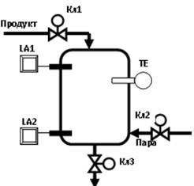

Рис. 6.16. Функціональна структура об’єкта автоматизації

Після натискування кнопки «Пуск» і за умови, що апарат пустий, відкривається клапан Кл1 і продукт поступає в нього. Коли рівень в апараті досягне верхнього значення (при цьому спрацює сигналізатор верхнього рівня LA1), клапан Кл1 закривається і відкривається клапан Кл2. В апарат поступає пара, і продукт починає розігріватись. Коли температура в апараті досягне заданого значення (про що свідчать показання термометра ТЕ), клапан Кл2 закривається і включається таймер. Коли встановлений час вичерпався, відкривається клапан Кл3 і рідина виливається з апарата. В момент, коли рівень в апараті досягне нижнього значення (при цьому спрацює сигналізатор нижнього рівня LA2), клапан Кл3 закривається, відкривається Кл1 і цикл повторюється.

На рис. 6.17 зображено алгоритм управління для описаного вище алгоритму функціонування об’єкта управління. Як видно, алгоритм управління для задачі логіко-командного управління являє собою послідовність умов і дій, які повинні виконуватись при виконанні відповідної умови. 

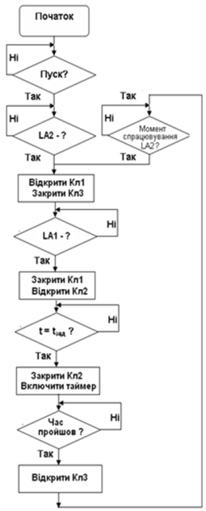

Рис. 6.17. Алгоритм управління

Так, на початку програми система управління повинна очікувати, поки одночасно не будуть виконані дві умови – апарат буде пустий (тобто спрацьовує датчик нижнього рівня LA2) і не буде натиснута кнопка «Пуск». Як тільки одночасно будуть виконані ці дві умови – буде сформована команда на відкриття клапана Кл1 і закриття клапана Кл3. Після цього система переходить на стадію очікування виконання наступної умови – наповнення апарата продуктом до верхнього рівня і спрацьовування сигналізатора верхнього рівня LA1. При виконанні цієї умови подається команда на закриття клапана Кл1 і відкриття клапана Кл2 подачі пари. Далі система очікує виконання умови досягнення заданої температури. У цей момент закривається клапан Кл2 і включається таймер. Після спрацьовування реле часу відкривається клапан 3 і система переходить у стан очікування виконання умови спрацьовування сигналізатора нижнього рівня LA2. В момент її виконання система повертається на початок нового циклу роботи, тобто клапан Кл3 закривається і відкривається клапан Кл1.

Розглянемо варіант програми користувача для наведеного алгоритму управління з використанням різних технологічних мов програмування.

#### 6.2.3.2. Програма користувача на мові Ladder Diagram

Для прикладу, розроблення програми користувача покажемо в середовищі програмування PL7, яке використовується для програмування ряду контролерів фірми Schneider Electric.

Для програмування на технологічній мові LD у середовищі PL7 використовується спеціальний графічний редактор, у якому за допомогою графічних елементів розробляється програма користувача. При вході в режим програмування на екран дисплею виводиться розбита на клітинки сторінка програми. Програма складається з окремих сторінок із написаною програмою, які послідовно виконуються одна за одною. Кожна сторінка має зони для мітки і коментаря, а також робочу зону (рис. 6.18).

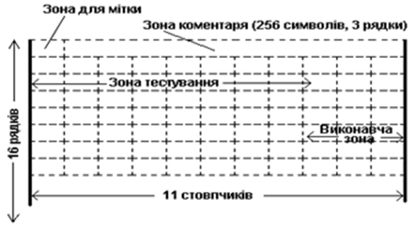

Рис. 6.18. Сторінка графічного редактора Ladder Diagram

У зоні мітки може бути записана мітка сторінки у вигляді *%Li*, де i – номер мітки. Сторінка не обов’язково повинна мати мітку. За її наявності можна у програмі організувати умовний або безумовний перехід на сторінку з відповідною міткою.

Робоча зона редактора умовно ділиться на дві зони: тестування і виконавчу. Зона тестування прилягає до лівої умовної шини живлення і в цій зоні розміщуються елементи, стан і значення яких зумовлює логіку виконання програми користувача. У виконавчій зоні, яка прилягає до правої умовної шини, розміщуються елементи, які призначені для виконання керуючих дій. Робоча зона сторінки має сітку, в клітинках якої розміщуються елементи. 

У табл. 6.1 наведено графічні зображення елементів, які використовуються в мові Ladder Diagram, а також інтерпретація цього елемента в алгоритмі управління.

*Таблиця 6.1.*Зображення графічних елементів

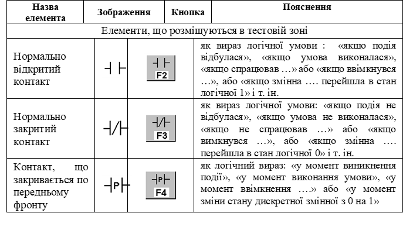

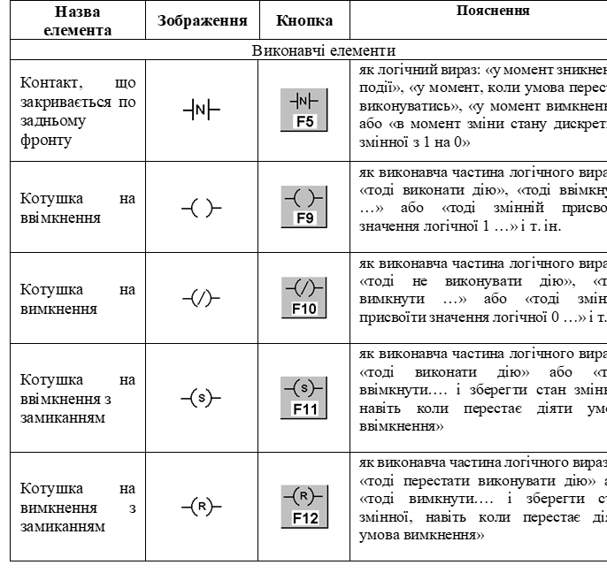

 Програмування полягає у виборі графічних елементів, що відповідають тим чи іншим логічним елементам або функціональним блокам, розміщенні їх у робочих зонах сторінок і показі зв’язків між ними у вигляді традиційних електричних ланцюгів (рис. 6.19). Вибір і нанесення графічних елементів у полі графічного редактора відбувається за допомогою активних кнопок, на яких нанесено графічне зображення вибраного елемента, розташованих у нижній частині вікна редактора. Наприклад, для того щоб розмістити графічне зображення того чи іншого елемента в полі графічного редактора в середовищі PL7 необхідно:

- підвести курсор миші до відповідної кнопки в нижній частині екрана редактора і клацнути правою клавішею миші;

- підвести курсор до того місця, де ми бажаємо розмістити вибраний елемент у полі графічного редактора і знову клацнути правою кнопкою миші і зображення елемента з’явиться в полі графічного редактора;

- над зображенням елемента відкриється вікно, в якому треба ввести адресу або ім’я змінної, з якою воно пов’язане.

 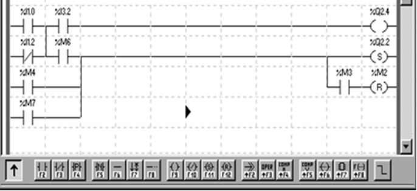

Рис. 6.19. Фрагмент програми на мові Ladder Diagram

Крім простих елементів, у програмі використовуються блоки, які виконують різноманітні функції. До них належать блоки порівняння, операційні блоки, таймери, лічильники та ін. Розглянемо деякі з них.

Блоки порівняння (компаратори) призначені для перевірки виконання умови порівняння числових (аналогових) значень. Блок порівняння (рис. 6.20) має вигляд горизонтального прямокутника, в середині якого записується умова порівняння двох операторів. Порівняння перевіряється з використанням умов: <, >, =, <=, >=,<>. Блок порівняння розміщується в тестовій зоні. Функціонально, на мові релейно-контактних схем, блок порівняння можна порівняти з нормально відкритим контактом, який замикається, коли умова, яка записана в блоку порівняння, виконується, і розмикається, коли умова не виконується.

Рис. 6.20. Компаратор

На рис. 6.21 показано графічне зображення функціонального блока таймера. Зображення наведено для таймера типу TON. Якщо на вхід IN подається логічна «1» -- таймер починає відлік часу. Якщо час у таймері досягне заданого значення – на виході Q з’явиться логічна «1». Настроювання таймера, тобто вибору режиму роботи таймера (TON, TOF або TP), завдання заданого значення TM.P (від 0 до 9999) і вибору одиниць відліку часу ТВ (10ms, 100ms, 1s, 1min) задається в режимі настроювання таймера. Час, який буде витримувати таймер, розраховується як **TMi.P ∙ ТB**.

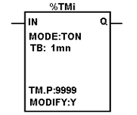

Рис. 6.21. Блок таймера

Для виконання операцій над числовими (аналоговими) змінними використовується операційний блок (рис. 6.22), у якому записуються необхідні дії над цими змінними.

Рис. 6.22. Операційний блок

Розробимо програму користувача на мові LD для наведеного алгоритму управління. Першочергово необхідно визначитися з адресами зовнішніх змінних, які пов’язані з датчиками і виконавчими механізмами. У табл. 6.2 наведено адреси зовнішніх змінних для умовного ПЛК та їх технологічні імена.

*Таблиця 6.2.* Таблиця змінних

| **Змінна**                                 | **Адреса  змінної** | **Технологічне  ім’я** |
| ------------------------------------------ | ------------------- | ---------------------- |
| Кнопка «Пуск»                              | %I1.0               | Pusk                   |
| Датчик сигналізатора верхнього рівня (LA1) | %I1.1               | LA1                    |
| Датчик сигналізатора нижнього рівня (LA2)  | %I1.2               | LF2                    |
| Датчик температури (TE)                    | %IW3.1              | Temp                   |
| Дискретний клапан 1 (Кл1)                  | %Q2.1               | KL1                    |
| Дискретний клапан 2 (Кл2)                  | %Q2.2               | KL2                    |
| Дискретний клапан 3 (Кл3)                  | %Q2.3               | KL3                    |

На рис. 6.23 наведена програма на мові LD. 

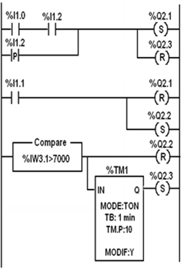

Рис. 6.23. Програма користувача на мові LD

Програма управління працює так. Якщо апарат порожній (тобто спрацював датчик нижнього рівня LA2, зовнішня змінна %I1.2 переходить у стан логічної «1») і натискається кнопка «Пуск» (зовнішня змінна %I1.0 також переходить у стан логічної «1»), умовно замикається ланцюг, який підключений до зовнішніх виходів %Q2.1 і %Q2.3. При цьому клапан Кл1, підключений до виходу %Q2.1 відкривається і фіксується, оскільки використаний вихід з командою S (включити і зафіксувати), а клапан Кл3, підключений до виходу %Q2.3, закривається і фіксується, оскільки використаний вихід з командою R (включити і зафіксувати). Тобто, якщо навіть кнопка «Пуск» відпуститься, клапан Кл1 буде залишатись у включеному стані.

Коли спрацює датчик верхнього рівня LA1, вхідний сигнал %I1.1 перейде в стан «логічної 1», що призведе до закриття клапана Кл1 (%Q2.1) і відкриття клапана подачі пари Кл2 (%Q2.2). Блок COMPARE виконує порівняння сигналу від датчика температури ТЕ (%IW3.1) і його заданого значення (на схемі показано значення 7000, що відповідає 70% від діапазону шкали). У разі виконання умови, записаної в ньому, відключається і фіксується вихід %Q2.2 (Кл2) і включається таймер %TM1. Після того, як сплине час, заданий у таймері (10 хвилин), його вихід %TM1.Q включить і зафіксує вихід %Q2.3 (Кл3). *У момент* досягнення рівня в апараті нижнього значення подається короткий імпульс, від спрацьовування входу %I1.2 (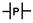), який приводить до закриття клапана Кл3 і відкриття клапана Кл1. Цикл роботи розпочнеться знову.

На рис. 6.24 показано ту ж саму програму, але замість адрес змінних використано їхні технологічні імена.

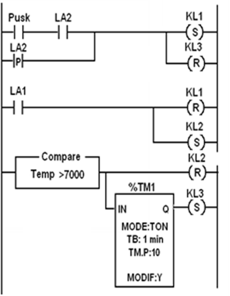

Рис. 6.24. Програма користувача на мові LD з використанням технологічних імен

Як видно, основною перевагою цієї програми є її наглядність. Наприклад, з програми можна сказати, що якщо натиснута кнопка Pusk і спрацював датчик верхнього рівня LA1, то включається клапан KL1 і відключається KL3. Якщо спрацьовує датчик верхнього рівня LA2, то клапан KL1 закривається і відкривається KL2. Коли значення температури в апараті Temp досягне заданого значення (70% від діапазону, клапан KL2 закриється, а через 10 хвилин спрацьовує таймер, вихід якого включить KL3. В момент досягнення рівня в апараті нижнього значення (верхня ланка на схемі) знов спрацьовує клапан KL1 і відключиться клапан KL3. Розпочнеться новий цикл роботи.

Тобто опис роботи програми з використанням технологічних імен стає зрозумілішим. Крім того, виникає можливість спочатку розробити програму, а потім прив’язати її до конкретного ПЛК, задаючи відповідність адрес зовнішніх змінних і їх технологічних імен.

#### 6.2.3.3. Мова структурованого тексту (Structured Text)

Програма на мові структурованого тексту подібна до програм на відомих алгоритмічних мовах, таких як PASCAL, C, BASIC і т.ін., і складається з програмних рядків, написаних із використанням відповідних правил побудови, інструкцій, стандартних процедур, зарезервованих слів і мнемонічних позначень, які визначають алгоритм оброблення змінних різних типів. Мову ST розглянемо на прикладі її реалізації в PL7.

Текст програми на мові структурованого тексту організовано в послідовності рядків, що починаються зі знака оклику, і складається з послідовності інструкцій, що розділяються одна від одної знаком “**;**” (рис. 6.25).

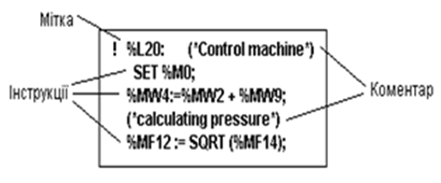

Рис. 6.25. Фрагмент програми на мові Structured Text

У структурованому тексті використовуються такі основні інструкції:

- операції над бітами;

- арифметичні й логічні операції над числовими значеннями;

- операції порівняння числових змінних;

- операції управління програмою;

- управляючі;

- зі стандартними функціональними блоками;

- спеціальні (зв’язку, ПІД-регулятори і т.ін.).

Для роботи з логічними операціями використовуються інструкції (таб. 6.3)

*Таблиця 6.3* Деякі інструкції мови Structured Text

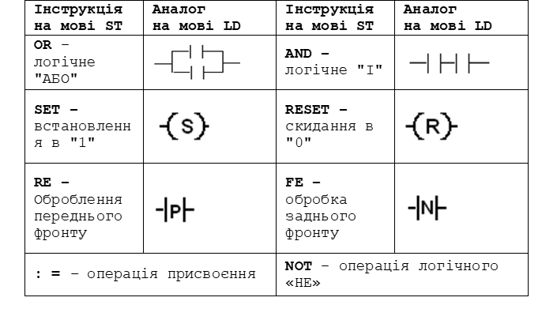 

В інструкціях порівняння значень числових змінних у різних форматах використовуються такі знаки порівняння: >, <, =, <=, =>, <>.

Для арифметичних операцій з числовими змінними використовуються арифметичні знаки: “+” – додавання, “ – “ – віднімання, “ * ” – множення, “/” – ділення, SQRT – цілочисловий корінь квадратний, ABS – абсолютне значення тощо.

У процесі програмування використовуються використовують три керуючі структури:

- умовне виконання дії **IF**;

- умовний вираз повторних дій **WHILE** та **REPEAT**;

- повторювальні дії **FOR**.

Кожна керуюча структура включена між ключовими словами на початку і в кінці інструкції. Це дає можливість відрізнити одну команду від іншої незалежно від типу. Керуюча структура може передувати або слідувати за іншою командою. Найбільш поширена в програмі користувача керуюча структура з умовним виразом «**IF ... THEN**». У такому разі **Дії** виконуються лише за виконання **Умови** (рис. 6.26)

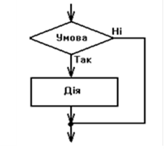

Рис. 6.26. Умовний вираз IF ... THEN

На мові структурованого тексту вираз має такий синтаксис:

**IF** *Умова* **THEN**

*Дії*;

**END_IF**; 

У всіх умовних виразах **IF** в якості *Умови* можуть використовуватись:

- прості або складні логічні вирази;

- результати порівняння числових значень (компаратори);

- результати спрацьовування функціональних блоків (таймерів, лічильників та ін.)

У якості *Дій*:

- включення і відключення дискретних змінних;

- присвоєння і оброблення результатів над числовими змінними:

- включення функціональних блоків.

Нижче наведена програма управління на технологічній мові Structured Text для розглянутого вище прикладу. 

Програма складається з чотирьох умовних виразів «**IF ... THEN**», які відповідають певному етапу функціонування об’єкта управління.

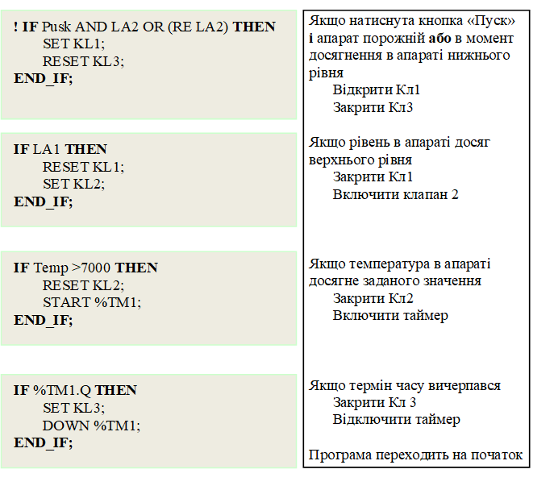

#### 6.2.3.4 Програмування на мові Grafcet

Однією з найзручніших мов програмування для вирішення задач логіко-командного управління є мова **SFC** і її модифікації, які широко застосовуються в різних типах програмованих логічних контролерів. Схожа до неї є мова ***Grafcet***, яка дещо простіша у використанні, тому розглянемо саме її.

Теоретичною основою мови “Графсет” є мережі Петрі. Назва цієї мови походить від французької “Grafcet”, тобто від перших літер виразу “de Graphe de Commande des Etapes et Transitions”, що перекладається як “граф команд з етапами й переходами”.

Основними перевагами цієї мови є можливість описувати паралельно-послідовні процеси в наглядній і компактній формі й автоматичне отримання по цьому опису (за наявності транслятора) управляючих програм.

Мова Grafcet являє собою функціональні діаграми за допомогою яких у графічній формі описується виконання алгоритму управління об’єктом у вигляді набору **послідовних кроків**. Кожний крок програми включає фрагмент програми користувача, яка виконується протягом часу, в який даний крок є активним. Перехід з одного кроку на інший відбувається при виконанні відповідних **умов**, які також програмуються. Крім послідовного виконання кроків, передбачається їхнє паралельне виконання, за умови об’єднання їх за допомогою логічних виразів ‘‘І‘‘ або ‘‘АБО‘‘.

Якщо уважно подивитись на зображення алгоритму управління задачі логіко-командного управління (наприклад, на рис. 6.17) то можна помітити, що алгоритм складається з послідовності умов і дій, які виконуються в разі виконання цієї умови. Мова Grafcet практично повторює алгоритм управління, але для його зображення використовуються інші графічні зображення (табл. 6.4). 

*Таблиця 6.4* Графічні елементи мови “Графсет”

 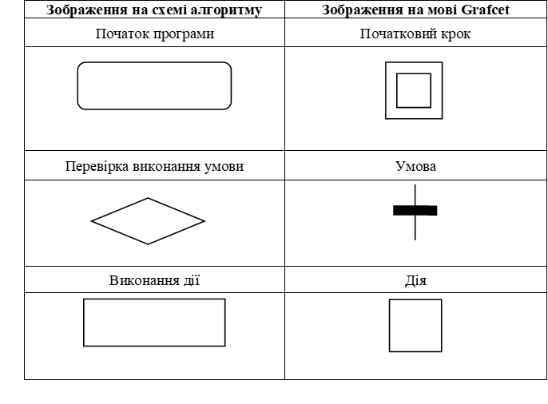

Практично програмування на мові Grafcet складається з двох етапів. Спочатку зображується алгоритм управління, а потім у графічні зображення записуються вирази «умов» і «дій». При цьому для їх запису можна використовувати різні технологічні мови програмування.

Розглянемо приклад реалізації програми користувача, для описаного раніше алгоритму управління, на мові Grafcet (рис. 6.27).

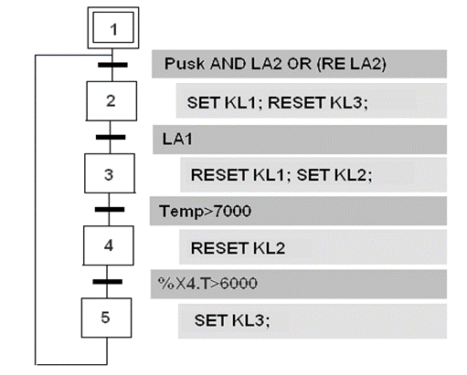

Рис. 6.27. Програма на мові Grafcet

Не вдаючись у подробиці програмування на мові Grafcet, можна виділити два етапи розроблення програми користувача. Спочатку в спеціальному графічному редакторі створюється загальний алгоритм управління, який практично повторює звичний для нас алгоритм управління, але з використанням специфічних графічних позначень (див. табл. 6.4). Після цього для кожного графічного елемента записуються вирази **умов** і **дій**. Для їх запису можна використовувати, різні технологічні мови програмування: Ladder Diagram, Instruction List, Structured Text. 

Програма працює так. При запуску програми стає активним початковий крок 1. Як тільки виконається умова «Pusk AND LA2 OR (RE LA2)», програма перейде до виконання дії, записаної в кроці 1 (SET KL1; RESET KL3;). Після виконання цієї дії програма переходить у стан очікування, поки не виконається умова, записана перед кроком 2. Якщо ця умова виконається, тобто спрацює датчик верхнього рівня LA1, то програма перейде до виконання дій, записаних у другому кроці (RESET KL1; SET KL2;). Програма знову переходить у стан очікування до виконання наступної умови, а саме – досягнення заданої температури (Temp >7000). Після цього стає активним третій крок і виконуються дії, які записані в ньому (RESET KL2; START %TM1;). Після цього повинна бути перевірена умова досягнення заданого часу. На відміну від програм на мовах LD i ST, у програмі на мові Grafcet немає необхідності включати таймер, так на кожному кроці автоматично запускається відлік часу поки крок буде активним. Тому при перевірці цієї умови можна скористатися змінною %XT.4, в якій записується час активності четвертого блока. Коли числове значення в цій змінній стане дорівнювати заданому значенню, умова %XT.4>6000 виконається і стане активним крок 5, виконається дія SET KL3; і програма переходить на перший крок, тобто на початок нового технологічного циклу.

#### 6.2.3.5. Програмування з використанням мови функціональних блоків FBD

Мова ***FBD*** (Function Block Diagram) – графічна мова програмування, яка дає змогу створювати програми у вигляді взаємопов’язаних функціональних блоків, які виконують стандартні для систем автоматизації функції. Вони нагадують графічну схему на якій були б показані стандартні фізичні функціональні блоки, які використовуються в системах автоматизації (регулятори, задавачі, таймери, лічильники, суматори, різноманітні логічні елементи та ін.) і ланцюги підключення між ними, так якщо б це були реальні фізичні пристрої.

На рис. 6.28 показана реалізація розглянутого вище алгоритму управління на мові функціональних блоків, яка використовується в контролері Zelio (Schneider Electric). У програмі використані функціональні блоки, які виконують такі функції: 

- блок AND (логічне «И») на 4 входи;

- блок OR ((логічне «ИЛИ») на 4 входи;

- блок COMPARE (компаратор), який налаштований на порівняння двох входів. Якщо значення сигналу на другому вході стане більше, ніж на третьому, то на виході формується логічна «1»;

- блок TIMER (таймер), який налаштований на заданий час затримки на включення. Тобто якщо на перший вхід (запуск) подається сигнал «1», то таймер запускається і через заданий час на першому виході з’являється логічна «1». Якщо на другий вхід (скидання) подається сигнал «1», то таймер скидається (обнуляється) і його вихід знову стає рівним «0»;

- блоки SET-RESET (включити-відключити), які при подачі лог. «1» на перший вхід (ВКЛ) включає вихід блоку і залишає його в такому стані до тих пір, поки не прийде «1» на другий вхід (ОТКЛ). 

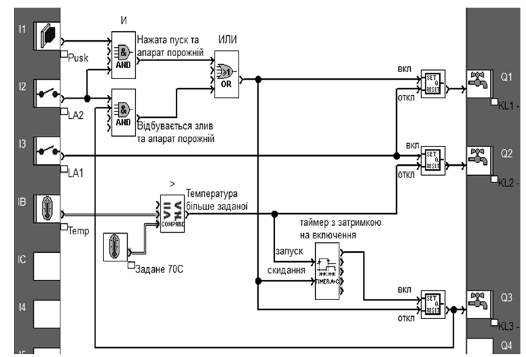

Рис.6.28. Програма користувача на мові функціональних блоків 

Якщо уважно проаналізувати програми користувача для розглянутого алгоритму управління, які написані на мовах Ladder Diagram i Structured Text, то можна переконатися, що в програмі на мові FBD використовуються функціональні блоки, оператори яких описані в програмах на мовах LD i ST.

У програмі використані такі входи і виходи контролера Zelio, який є моноблочним контролером, у якому адресація зовнішніх змінних є простішою і включає тільки позначення змінної (вхід – І та вихід – Q) і її номер: 

- I1 – дискретний вхід, кнопка «Пуск» (Pusk);

- I2 – дискретний вхід, датчик-сигналізатор нижнього рівня (LA2);

- I3 – дискретний вхід, датчик-сигналізатор верхнього рівня (LA3);

- IB – аналоговий вхід, датчик температури (Temp);

- Q1 – дискретний вихід, клапан набору (KL1);

- Q2 – дискретний вихід, клапан пари (KL2);

- Q3 – дискретний вихід, клапан зливу (KL3).

Програма працює так. Коли буде натиснута кнопка «Пуск» (I1=1) за умови, що апарат порожній, про що свідчить сигнал (I2=1) від сигналізатора нижнього рівня, на виході блока AND формується логічна «1», яка через відповідні виходи блоків SET-RESET: включить клапан набору (Q1=1), виключить клапан зливу (Q3=0) та скине таймер TIMER. Апарат починає заповнюватися продуктом.

Повторне виконання цих команд відбудеться в кінці технологічного циклу, коли рідина буде виливатися з апарата в момент спрацьовування датчика нижнього рівня. Для цього використано другий блок AND. Свідченням того, що команда наповнення апарата буде виконуватися за однією з умов, є те, що вихідні сигнали блоків AND підключені до входів блока OR (ИЛИ), вихід якого й включить клапан набору (Q1=1), виключить клапан зливу (Q3=0) та скине таймер TIMER.

Коли спрацює датчик верхнього рівня (I3=1), відключається клапан набору, тому що приходить «1» на вхід «откл» блока SET-RESET, та включається клапан пари (Q2=1). Відключається клапан пари в той час, коли температура буде більша від заданої, тобто коли значення 2-го входу компаратора COMPARE буде більшим від 3-го. Крім того, вихід компаратора запустить таймер TIMER, який через заданий час виставить «1» на першому виході. Вихід таймера включає клапан зливу (Q3=1). Після спрацювання сигналізатора нижнього рівня клапан зливу закриється, відкриється клапан набору, скинеться таймер і цикл повториться.

Наведена програма ілюструє використання невеликої кількості функціональних блоків, хоча в кожному ПЛК їх значно більше – різноманітних за призначенням і складністю. Крім того, в більшості ПЛК існує можливість створення користувачем своїх власних функціональних блоків.

#### 6.2.3.6. Програмування систем автоматичного регулювання

У сучасних ПЛК, крім можливості логіко-командного управління, також доступні функції контурів регулювання. Є два підходи до реалізації таких функцій: застосування вбудованих в ПЛК апаратних (системних) регуляторів або використання бібліотечних функцій регулювання. Деякі ПЛК надають обидва способи. І в тому й іншому випадку йдеться про звертання до підпрограми, яка реалізує функцію автоматичного регулятора. При цьому розробнику програми користувача не потрібно розробляти цю підпрограму, оскільки вона знаходиться в пам’яті контролера, а необхідно підключити до неї відповідні вхідні і вихідні змінні, а також ввести значення параметрів регулятора.

Для програмної реалізації контурів управління найбільш підходить мова FBD.

Розглянемо приклад програми ПЛК для контуру стабілізації температури води на виході теплообмінника (рис. 6.29).

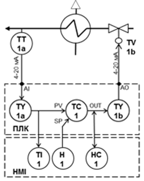

Рис. 6.29.До постановки завдання

Програма в ПЛК повинна забезпечити стабілізацію температури води на виході теплообмінника шляхом зміни подачі пари регулюючим клапаном з електричним виконавчим механізмом. Регулятор повинен реалізовувати ПІ-закон регулювання.

У системі управління передбачено підключення до ПЛК операторської панелі, за допомогою якої оператор може:

- контролювати температуру на виході теплообмінника (регульована змінна);

- змінювати задане значення (SP –*Set Point*) температури води;

- змінювати параметри налаштування регулятора Kp та Ti;

- мати можливість переходу на ручний режим управління положенням регулюючого клапана.

Система управління включає в себе датчик температури ТТ-1а, регулюючий TV-1b, ПЛК та операторську панель (HMI).

Датчик температури води має вбудований перетворювач 4..20 мА та налаштований на діапазон 0..150**°**С. Електричний аналоговий виконавчий механізм управляється сигналом 4..20 мА. Регулятор повинен реалізовувати ПІ-закон регулювання і налаштовуватися засобами HMI. Завдання регулятору (SP) повинен формувати оператор засобами HMI (H-1). З боку HMI регулятор повинен мати можливість переводу в ручний режим, з можливістю зміни оператором положення клапана (HC-1).

Програму для наведеного контуру показано в складі системи управління на рис. 6.30. У центрі контуру знаходиться функціональний блок регулятора (TC1 типу PI_B), який реалізує ПІ-закон регулювання. На вхід PV (Process Value) регулятору подається дійсне значення температури, а на вхід SP (Set Point) – задане значення. OUT – вихід на виконавчий механізм з регулятора. Налаштування регулятора Kp та Ti виконується через однойменні вхідні параметри, а управління режимом роботи (ручний / автоматичний режим) – через вхід AUTO.

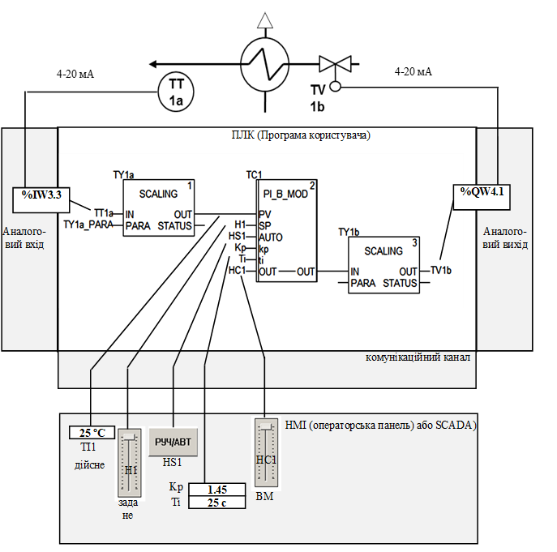

Рис. 6.30. Приклад контуру регулювання з використанням бібліотечних блоків та мови FBD

Регулятор працює з фізичними величинами, тому значення з датчика 4..20 мА, яке записується у вхідну змінну TT1a (адреса %IW3.3), необхідно перетворити на діапазон *0..150* *°*С, що проводиться в блоці масштабування TY1a (типу SCALING). Налаштування параметрів масштабування (вхідний та вихідний діапазони перетворення) задається через вхід блоку PARA. Тому значення з датчика спочатку записується в TT1a (так визначено конфігурацією), а потім перетворюється (масштабується) блоком TY1a типу SCALING у діапазон значень від 0..150* *°*С. Потім це значення подається на вхід PV (дійсне значення) регулятора TC1. Задане значення регулятору задається змінною H1, яка змінюється з панелі оператора. Також з панелі налаштовуються параметри настроювання регулятора через змінні Kp та Ti. Для управління режимом роботи регулятора (ручний/автоматичний) оператор з панелі перемикає змінну HS1 в логічний «0» (ручний режим) або логічну «1» (автоматичний режим). У ручному режимі вихід OUT регулятора підмінюється сигналом, який змінює оператор з панелі через змінну HC1. Вихід OUT подається на виконавчий механізм через блок масштабування TY1b (SCALING) та вихідну змінну TV1b (адреса %QW4.1).

[6.1](6_1.md). Основні принципи побудови мікропроцесорних контролерів. <--- [Зміст](README.md) --> [Розділ 7](7.md). Людино-машинний інтерфейс автоматизованого робочого місця оператора-технолога 