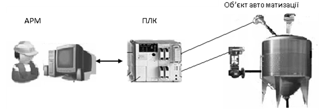
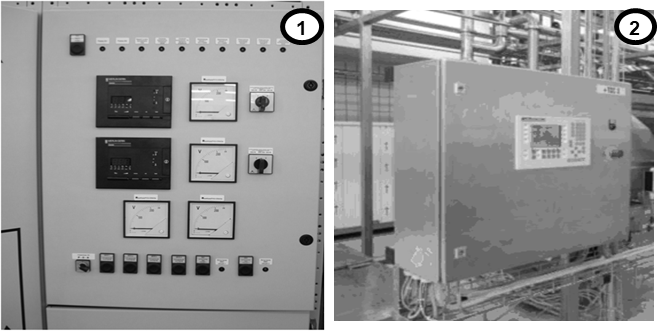
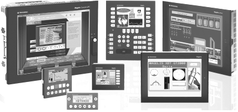
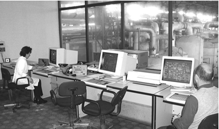
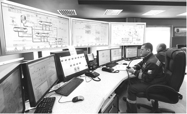

[Розділ 7](7.md). Людино-машинний інтерфейс автоматизованого робочого місця оператора-технолога  <--- [Зміст](README.md) --> [7.2](7_2.md). Засоби розроблення автоматизованих робочих місць

## 7.1. Загальні положення

Більшість систем управління технологічними процесами є автоматизованими, тобто такими, що потребують участі людини в процесі керування. Це зумовлено рядом факторів. Насамперед, це те, що не завжди можна розробити алгоритм управління, за допомогою якого можна було б реалізувати повністю автоматичну систему управління. Для цього або недостатньо інформації про стан об’єкта управління, або в процесі управління можуть виникати непередбачувані ситуації, з якими не може впоратись існуюча система автоматизації. Крім того, навіть для традиційних і добре вивчених і відпрацьованих завдань автоматичного регулювання (стабілізуюче, програмне і слідкуюче) та задач дискретного управління періодичними процесами, для яких існують надійні алгоритми і програми управління, виникає необхідність коригування їх роботи. Нижче наведемо декілька прикладів.

У будь-якій переробній промисловості використовується сировина, якісні показники якої суттєво впливають на виконання технологічного процесу. Завдання технологів, залежно від показань вимірювальних приладів та результатів лабораторних аналізів, *–* визначити умови подальшого проходження технологічного процесу. Це робиться шляхом зміни заданих значень регульованих змінних. Тобто в системі управління процесом час від часу персонал (оператори) повинен змінювати уставки регуляторам.

У багатоасортиментному виробництві необхідно забезпечити випуск різної продукції на одному технологічному обладнанні. Необхідність зміни умов приготування потребує внесення корекцій у рецептуру (заданих значень параметрів, часових інтервалів, умов дозування тощо) та додавання нових рецептів. Це може зробити тільки людина.

Навіть у найдосконаліших системах час від часу виходить з ладу обладнання, потрапляють у технологічний потік сторонні предмети та відбуваються інші непередбачувані технологічним процесом події, які прийнято називати **нештатними ситуаціями**. Система управління може вчасно зреагувати на це шляхом сигналізації або блокування устаткування (задля усунення небезпеки), однак далі рішення повинна приймати людина. Для контролю за процесом вона повинна бути інформована і мати можливість ручного дистанційного керування виконавчими механізмами.

Виробництво із сезонним циклом роботи (наприклад, цукрові заводи) потребує періодичних пусконалагоджувальних робіт, при виконанні яких необхідне ручне керування виконавчими механізмами.

Налаштування регуляторів з часом перестають бути оптимальними у зв’язку зі старінням і заміною устаткування, зміною умов проходження технологічного процесу та ін. Обслуговуючий персонал, наприклад служба КВПіА, повинен мати можливість змінювати їх.

Це неповний перелік тих можливих ситуацій, де участь людини обов’язкова. У будь-якому випадку необхідно налагодити зв'язок, який би, з одного боку, давав можливість контролювати людині стан процесу та системи, а з іншого – забезпечував можливість втрутитися в процес управління. Тобто необхідно в системі управління передбачити **людино-машинний інтерфейс** (**HMI** – Human-Machine Interface). Під "машиною" в цьому випадку розуміється система з усіх технічних засобів, що бере участь у процесі вимірювання, контролю, сигналізації та управлінні, а під «людиною» *–* оператор-технолог, який бере безпосередню участь в процесі управління. Враховуючи, що людина, задіяна у процесі управління, *є частиною даної системи*, яка, в свою чергу, зветься автоматизованою системою управління технологічними процесами (АСУТП), вона займає відповідальну роль, оскільки саме вона приймає найвідповідальніші рішення в процесі управління. Людино-машинний інтерфейс є частиною автоматизованого робочого місця (**АРМ**) оператора. 

На відміну від прямого візуального контролю та безпосереднього керування регулюючими органами, в АСУТП процес отримання людиною інформації та ручне управління проходить опосередковано через засоби людино-машинного інтерфейсу, контролери (ПЛК), виконавчі механізми та датчики (рис.7.1). Такий процес отримав назву **супервізорного управління**.

Рис. 7.1. Супервізорне управління об’єктом

Для невеликих процесів людино-машинний інтерфейс може бути реалізований з використанням кнопок, перемикачів, різного типу індикаторів. Приклад такого щита управління показано на рис. 7.2 (1).

Рис. 7.2. Приклад щитів управління: з використанням локальних засобів людино-машинного інтерфейсу (1) та панелей оператора (2)

Однак більшість технологічних процесів потребує значної кількості елементів відображення та ручного управління, а також різного типу самописців та елементів сигналізації. У цьому випадку для реалізації людино-машинного інтерфейсу використовують **операторські панелі,** які ще називаються **панелі оператора** (рис.7.3). Це невеликі мікропроцесорні засоби з текстовим або графічним дисплеєм для відображення інформації та елементами управління – кнопками або/та сенсорним екраном. Передня частина таких панелей захищена від пилу, бруду, вологи, що дає змогу оператору управляти процесом безпосередньо біля об’єкта. Для захисту іншої частини панелі її розміщують у спеціальному щиті.

Рис. 7.3. Вигляд операторських панелей

Для великих АСУТП панель оператора не забезпечує можливості контролю за всім процесом, архівування великої кількості параметрів, зв’язку з іншими системами управління процесами та виробництвом у цілому. Ці функції можуть бути реалізовані засобами людино-машинного інтерфейсу, побудованим на базі комп’ютерів зі спеціалізованим програмним забезпеченням. На виробництві такі автоматизовані робочі місця оператора-технолога розташовуються, як правило, в спеціально обладнаних диспетчерських, які захищають комп’ютери від пагубного впливу виробничих умов та надають можливість для нормальної роботи операторів (рис.7.4).

Рис.7.4. Диспетчерський пункт на цукровому заводі

У диспетчерських приміщеннях для управління об’єктами з великим обсягом інформації застосовують також настінні екрани (рис.7.5).

Рис.7.5. Диспетчерський пункт з великим обсягом інформації

Для реалізації нормальної роботи людино-машинного інтерфейсу необхідно забезпечити для нього двосторонній обмін даними:

- збирати інформацію про стан технологічного обладнання і значень технологічних параметрів;

- передавати команди оператора в зворотному напрямку

*При* побудові АСУТП на базі програмованих контролерів, цими процесами займаються **SCADA** (Supervisory Control And Data Acquisition – супервізорне управління і збирання даних). Тобто організація роботи АРМ складається, як мінімум, з двох складових: SCADA – для збирання даних та управління; HMI – для реалізації людино-машинного інтерфейсу. 

У АСУТП, побудованих на базі **DCS** (Distributed control system – системи розподіленого управління), база даних процесу єдина як для управління процесом у реальному часі так і для візуалізації. Тому окремо функція SCADA не виділяється, але процес створення людино-машинного інтерфейсу практично не відрізняється. Надалі будемо розглядати тільки системи, побудовані за принципом: контролери+SCADA+HMI.

[Розділ 7](7.md). Людино-машинний інтерфейс автоматизованого робочого місця оператора-технолога  <--- [Зміст](README.md) --> [7.2](7_2.md). Засоби розроблення автоматизованих робочих місць