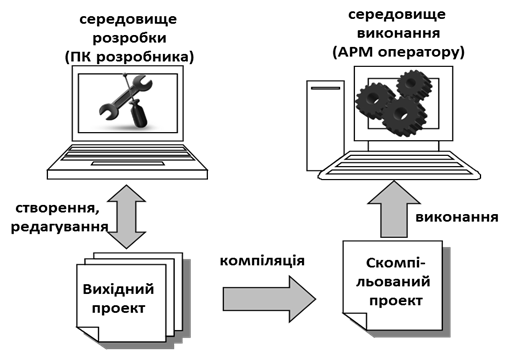

[7.1](7_1.md). Загальні положення <--- [Зміст](README.md) --> [7.3](7_3.md).Функціональні можливості середовищ виконання SCADA/HMI.

## 7.2. Засоби розроблення автоматизованих робочих місць

Програмне забезпечення для комп’ютерів АРМ можна створити на базі універсальних середовищ та мов програмування. Такий підхід дає змогу створити систему з будь-яким функціоналом за бажанням замовника, однак має ряд недоліків. По-перше, розроблення проектів займає багато часу і потребує залучення спеціалістів з комп’ютерного програмування. По-друге, відлагодження такого проекту триває досить довго, а помилки в роботі програм нерідко проявляють себе протягом усього життєвого циклу системи. По-третє, такі програми важко супроводжувати і вносити туди зміни, оскільки це потребує постійного контакту з людиною-розробником. 

Альтернативою наведеному вище підходу є використання спеціального програмного забезпечення, яке значно спрощує розроблення прикладного програмного забезпечення для реалізації АРМів різного призначення. Таке інструментальне програмне забезпечення належить до класу **SCADA/HMI**. Основний принцип розроблення з використанням цих інструментів – "Конфігурування замість програмування", що різко зменшує витрачений час та вірогідність помилок, адже функціональність АРМів у своїй базовій частині мало залежить від особливостей виробництва. Програмні пакети для розроблення АРМів на базі комп'ютерів прийнято називати "**SCADA-програмами**", або просто "SCADA", а для панелей оператора – "**HMI-програмами**", або просто "HMI". Надалі ми будемо використовувати загальний термін, який об’єднує ці поняття – програми **SCADA/HMI**.

У світі налічуються сотні компаній, що активно займаються розробленням і розповсюдженням програм SCADA/HMI. Деякі популярні SCADA в Україні:

|              |                                               |
| ------------ | --------------------------------------------- |
| InTouch      | (Wonderware в складі Schneider Electric, США) |
| Genesis      | (Iconics, США)                                |
| WinCC        | (Siemens, Німеччина)                          |
| Vijeo Citect | (Schneider Electric, Франція)                 |
| Zenon        | (Copa Data, Австрія)                          |

Серед розробників SCADA/HMI-програм в Україні, можна назвати відому фірму "Мікрол", яка постачає свою програму Visual Intellect.

Необхідно розрізняти програмне забезпечення SCADA/HMI, яке функціонує на автоматизованому робочому місці оператора і набір інструментальних програмних засобів, призначених для розроблення такого прикладного програмного забезпечення (рис.7.6). **Середовище розроблення** (Design-Time) використовується на стадії створення системи і містить набір різних редакторів. Як правило, ця програма виконується тільки на комп’ютері розробника. Результат розроблення – набір пов’язаних файлів, які називають **проектом**. 

**Середовище виконання** (Run-Time) містить усі виконавчі підсистеми для реалізації функцій, розроблених виробником SCADA/HMI. Воно слугує для запуску і виконання створеного проекту на комп’ютері автоматизованого робочого місця в режимі м’якого реального часу.

На самому підприємстві обов’язковим є наявність середовища виконання проекту. У більшості SCADA/HMI проект може бути в 2-х варіантах (див. рис.7.6):

- **вихідний проект**, де зберігаються проектні дані з можливістю їх редагування;
- **скомпільований проект**, який потрібен тільки для середовища виконання і недоступний для редагування.

Рис. 7.6. Порядок створення, компіляції та виконання проекту

Для функціонування системи в режимі операційної роботи необхідне тільки середовище виконання та скомпільований проект. Однак, якщо в майбутньому планується вводити зміни в проект, підприємство повинно домовитися з розробниками про передачу також вихідного проекту. 

Слід зазначити, що середовище виконання для комп’ютерів є платним і ліцензується залежно від функціональних можливостей та кількості змінних процесу, які задіяні в контролі та управлінні. Середовище виконання для панелей оператора вже вбудоване в неї і входить у вартість обладнання. Середовище розробки може бути як платним так і безкоштовним, залежно від особливості фінансової політики виробника SCADA/HMI.

 

[7.1](7_1.md). Загальні положення <--- [Зміст](README.md) --> [7.3](7_3.md).Функціональні можливості середовищ виконання SCADA/HMI.