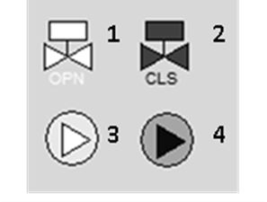
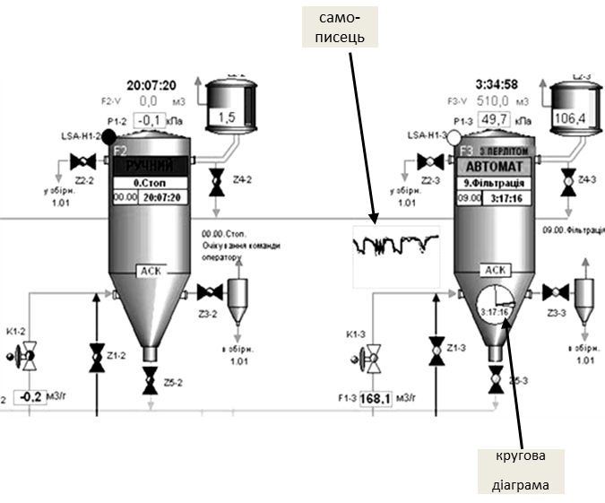
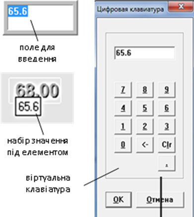
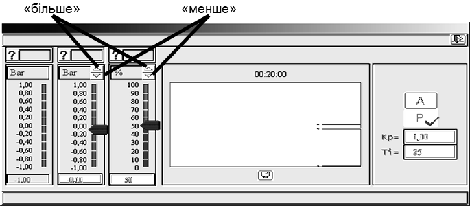
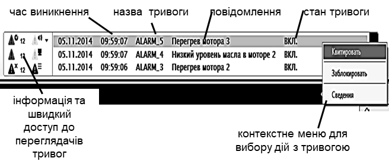
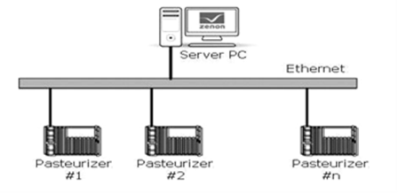

[7.2](7_2.md). Засоби розроблення автоматизованих робочих місць <--- [Зміст](README.md) --> [7.4](7_4.md). Основні принципи розроблення АРМ оператора на базі SCADA/HMI

## 7.3.Функціональні можливості середовищ виконання SCADA/HMI

### 7.3.1. Перелік функцій SCADA/HMІ 

Більшість програм SCADA/HMI має типовий набір функціональних можливостей для реалізації завдань АРМів:

- збирання інформації про контрольовані технологічні параметри (даних реального часу) з контролерів та засобів віддаленого вводу/виводу;

- графічне представлення стану технологічного процесу і обладнання в зручній для сприйняття формі у вигляді мнемосхем;

- вторинна обробка інформації (масштабування, обмеження вводу, перевірка коректності тощо); 

- приймання команд оператора і передача їх на контролер або засіб віддаленого виводу;

- збереження даних реального часу в архівах даних і графічне представлення історичної інформації в зручній для сприйняття формі у вигляді графіків, гістограм тощо;

- сповіщення експлуатаційного і обслуговуючого персоналу про виявлені аварійні події в технологічному процесі і програмно-апаратних засобах;

- фіксація в електронних журналах виникнення аварійних подій у контрольованому технологічному процесі та дій експлуатаційного персоналу; 

- формування звітів на основі архівної інформації, тривог та даних реального часу;

- обмін інформацією з автоматизованими системами управління виробництвом та підприємством у складі інтегрованих систем управління; 

- підтримка мов програмування високого рівня, наприклад, VBA;

- захист від несанкціонованого доступу до компонент і файлів.

Нижче розглянемо детальніше ці функції.

### 7.3.2. Загальний вигляд графічного ЛМІ

Загальний вигляд графічного людино-машинного інтерфейсу (ЛМІ) суттєво залежить від типу технологічного процесу, прийнятих стандартів (корпоративних, галузевих) на побудову автоматизованих систем та індивідуальних потреб замовника (наприклад, технологів, інженерного персоналу). Тим не менше, найбільш типовим є побудова графічного інтерфейсу АРМа таким, що ґрунтується на наведених нижче підходах. 

**Графічна підсистема** (людино-машинного інтерфейсу) АРМа оператора має багатовіконний інтерфейс з можливістю відображення у вікнах сторінок процесу, трендів, тривог та іншої службової інформації. Враховуючи, що вся доступна інформація не може вміститися в одному вікні, в один момент відображається тільки одна сторінка процесу. Такі сторінки можуть називатися по-різному, залежно від термінології прийнятої для вибраної SCADA/HMI. Сторінки, які призначені для відображення технологічного процесу або його частини, часто називають **мнемосхемами**.

На рис.7.7 і 7.8 показано приклади загального вигляду екрана, де мнемосхема процесу займає більшу його частину. 

Рис. 7.7. Приклад загального вигляду екрана людино-машинного інтерфейсу (SCADA Vijeo Citect): 1 – сторінка (мнемосхема) процесу; 2 – панель(меню) доступу до інших сторінок та команд; 3 – вікно відображення активних тривог та подій

Рис. 7.8. Приклад загального вигляда екрану людино-машинного інтерфейсу (SCADA Zenon): 1 – сторінка (мнемосхема) процесу; 2 – панель доступу до інших сторінок та команд; 3 – вікно відображення активних тривог та подій

Такий спрощений вигляд установки з відображенням значень технологічних параметрів у плинний момент часу дає оператору інформацію про стан цієї частини процесу. Однак для перегляду інших частин процесу оператор повинен відкрити іншу сторінку, наприклад за допомогою панелі керування, меню (див. рис.7.7 і 7.8) або інших елементів управління. Таким чином, використовуючи меню або панель навігації, оператор може переглянути детально будь-яку частину процесу.

Для введення дій, перегляду уточнюючої інформації чи тимчасового відображення ряду параметрів також використовують **спливаючі вікна**. Вони відкриваються поверх основного вікна і не заважають перегляду його вмісту. 

Хоча кількість сторінок процесу, як правило, не обмежується системою, оператор не може вчасно зреагувати на зміни в системі, постійно їх перемикаючи. Тому в більшості випадків в графічній підсистемі є **головна мнемосхема**, де відображається найбільш загальна інформація про весь процес. Крім того, всі технологічні параметри, що потребують підвищеного контролю з боку оператора, повинні відслідковуватися підсистемою тривог (наприклад, вихід значення змінної за аварійні межі). Графічна підсистема повинна бути розроблена таким чином, щоб тривоги, які з’явилися, відразу привертали увагу оператора. Останні тривоги, як правило, показуються у вигляді постійно видимого **вікна тривог** (див. рис.7.7 і 7.8) або окремого підсвічуваного елемента, що вказує на наявність нештатної ситуації в системі. 
 Графічний людино-машинний інтерфейс реалізується через:

- елементи відображення, які надають оператору інформацію про стан змінних процесу;

- елементи введення, що надають можливість впливати на процес, шляхом зміни значень змінних або відправки команд.

Часто функції відображення та введення комбінуються в одному елементі. Нижче розглянемо більш детально способи відображення та введення, а також типові елементи, які використовуються для цього.

### 7.3.3. Способи та елементи відображення стану процесу

Інформація про значення технологічних параметрів повинна бути надана в такому вигляді, щоб оператор швидко визначив загальний стан процесу. Для цього окрім відображення значення величини у вигляді тексту, можна використовувати різного типу зміни властивостей графічного об’єкта, зокрема:

- кольору;

- тексту;

- видимості;

- вигляду зображення;

- геометричних розмірів;

- заповнення;

- позиції на екрані;

- кута повороту. 

Зміна якоїсь властивості графічного елемента залежно від значення змінної часто називають **анімацією**.

Анімація кольору використовується для показу стану змінної процесу або обладнання чи агрегату. Яскраві червоні та жовті кольори прийнято використовувати для сигналізації відповідно аварійного та передаварійного стану, а всі інші - для уточнення діапазону нормального стану. Останнім часом передові організації-розробники рекомендують використовувати в якості кольорів білі, чорні та відтінки сірого. Інші кольори рекомендуються використовувати для виділення станів елементів, на які особливо треба звернути увагу, або для розрізнення елементів між собою (трубопроводи з різною рідиною, графіки на трендах тощо) 

Для відображення стану дискретної змінної (типу включено/ відключено) можна використати два кольори. Наприклад, зелений може вказувати на стан "включений", а сірий - для стану "виключений". Можна також використовувати пару білий/темно-сірий, як показано на рис.7.9. У будь-якому випадку призначення кольорів необхідно заздалегідь узгодити між розробниками та замовниками.

Рис. 7.9. Приклад зображення стану дискретної змінної: 1- клапан відкритий, 2 – клапан закритий, 3 – насос увімкнений, 4 – насос вимкнений

Стан аналогової змінної теж можна показати у вигляді зміни кольору елемента або його частини. У цьому випадку колір може вказувати на діапазон, у якому знаходиться значення змінної (рис.7.10). У такий спосіб оператор швидко може зорієнтуватися, чи знаходиться змінна в нормі, або в якому технологічному режимі знаходиться установка. Зміна кольору елемента часто використовується для сигналізації. 

Рис. 7.10. Приклад зображення різного стану аналогової змінної шляхом зміни кольору фону та тексту

Стан періодичного процесу також може відображатися у вигляді різних кольорів. Так, стани "ПУСК", "СТОП", "БЛОКУВАННЯ", "ПАУЗА" можуть відображатися на одному й тому самому елементі у вигляді однойменних написів з різним кольоровим підсвічуванням. Крім того, активний крок (етап) процесу можна показати на діаграмі станів у вигляді яскравого елемента. Так, на рис. 7.11 показано діаграму стану 4-х танків, один погляд на яку відразу вказує на активні кроки.

Рис. 7.11. Приклад зображення активних кроків (етапів) для періодичних процесів

Поряд з кольором та текстом нерідко використовується миготіння. Цей тип анімації в основному призначений для привертання уваги оператора до події, що виникла та потребує його реакції. Найчастіше миготіння використовується в підсистемі тривог, де оператор повинен підтвердити факт, що він побачив тривогу, шляхом її квитування (див. 7.3.5). Таким чином, миготіння може тривати доти, поки оператор не зверне уваги і не підтвердить тривогу.

Зміна видимості елементів може використовуватися для різних функцій. Наприклад, на рис.7.12(2) поява зображення руки вказує на ручний (дистанційний) режим роботи клапана, а на рис.7.12(4) поява трикутника із символом "W" - на наявність попереджувальної тривоги, пов’язаної з даним насосом. Крім того, властивість видимості може бути використана для виведення на екран оператору тільки тих елементів, які використовуються в даний момент.

Рис. 7.12. Приклад зображення стану обладнання шляхом зміни видимості

Одним із найбільш наглядних способів представлення аналогової величини є показ ступеня наповненості фігури у відсотковому відношенні (заливки). На рис.7.13 показано декілька прикладів заливки в якості відображення рівня в збірниках та наповнення трубопроводу.

Рис. 7.13. Приклади використання вертикальної заливки

Хоч інтуїтивно заливка підходить для відображення рівня (ступеня заповнення), анімацію заповнення використовують для будь-яких аналогових змінних процесу. Як правило, для цього в засобах SCADA/HMI доступні стандартні елементи, які прийнято називати **стовпчикові діаграми,** або **гістограми**. На рис.7.14 показано приклади стовпчикових діаграм, на яких, окрім самого стовпчика, показано вимірювальну шкалу, а також відображено аварійні та попереджувальні межі, щоб оператор бачив, у якому діапазоні зараз знаходиться величина. Стовпчикові діаграми також можуть змінювати колір заповнення стовпчика залежно від значення та показувати бажане значення величини.

Рис. 7.14. Стовпчикові діаграми (гістограми): ліворуч – вертикальні; праворуч – горизонтальні

Крім стовпчикових діаграм, для відображення значення аналогових величин можна використовувати **кругові діаграми**. Так, на рис.7.15 кругова діаграма показує плинну витрату речовини. Так само можна показувати ступінь відкриття регулюючого органу. На рис.7.18 у нижній частині фільтра F3 за допомогою кругової діаграми показано, скільки часу пройшло з початку етапу фільтрації відносно заданого.

Рис. 7.15. Фрагмент мнемосхеми з різними типами діаграм

За допомогою анімації руху по вертикалі чи по горизонталі можна показувати як значення вимірюваної величини, так і значення уставки (заданого або бажаного значення). Так, на рис.7.15 (праворуч) показано стовпчикові діаграми з відміткою заданих значень (вказані трикутними стрілками). 

Анімація обертання (зміна кута повороту), як правило, використовується в **стрілочних індикаторах** (рис.7.16). Цей тип графічних елементів інтуїтивно зрозумілий оператору, а інформація з нього швидко сприймається. Комбінація з анімацією кольору поліпшує процес сприйняття.

Рис. 7.16. Стрілочні індикатори

Крім цього, анімацію руху застосовують, щоб показати залежність однієї змінної від іншої або розподіл (градієнт) параметрів у просторі. Наприклад, на рис.7.17 показано значення температур на контрольних тарілках колони у вигляді точок, розміщених на горизонтальних лініях. Поєднавши ці точки, можна показати градієнт розподілу температур по висоті колони. Застосувавши такий підхід разом з анімацією кольору, можна одним поглядом оцінити стан роботи колони.

Рис. 7.17. Приклад відображення градієнту температур по висоті колон

Для відображення тенденції зміни значення технологічних змінних використовуються **самописці,** які також називають **трендами реального часу**.

Наприклад, у мнемосхемі на рис.7.18 самописець дає оператору уявлення про поведінку тиску, оскільки різке його підвищення може вказувати на забитість фільтраційного матеріалу. Слід зазначити, що в даному випадку абсолютна величина тиску не має такого значення, як його зміна в часі. А на рис.7.15 самописець показує тенденцію відхилення дійсного значення витрати від заданого, що значно інформативніше, аніж бачити тільки їхні плинні значення.

Крім того, на мнемосхемі рис.7.18 задіяно функцію видимості, оскільки самописець і кругова діаграма показана тільки для працюючого фільтра, тому що в іншому випадку вони не мають ніякого значення і тільки заплутують оператора надлишковою непотрібною інформацією.

Рис.7.18. Приклад мнемосхеми з використанням самописців і кругової діаграми

Як видно з рис.7.19, самописець часто використовується у вікнах налаштування регулятора, оскільки саме вигляд перехідного процесу дає наладчику інформацію про вдалий підбір його настройок. 

Рис. 7.19. Приклад використання самописця

Сучасні програми SCADA/HMI дають можливість залежно від значення змінних включати або відключати мультимедійний контент, наприклад фільми, аудіо або різного типу анімацію GIF, Flash і т. д. Однак не слід зловживати цими засобами, тому що їхнє надмірне використання тільки погіршує процес сприйняття інформації та адекватну оцінку стану процесу.            

### 7.3.4. Способи та елементи введення (зміни значення змінних)

Графічні елементи, які використовуються для зміни значення змінних або відправки команд, називають **елементами управління**. Впливати на ці елементи можна використовуючи один з доступних елементів введення:

- маніпулятор "миша";

- сенсорний екран;

- клавіатура. 

Для виконання команд для зміни значення дискретних змінних типу "включити"/"відключити" використовуються **кнопки**, **перемикачі** або графічні елементи з цими функціями. Графічний вигляд таких елементів може бути дуже різним (рис.7.20). Тим не менше можна виділити два типи команд для таких елементів:

- перемикання, яке приводить до зміни значення ВКЛ на ОТКЛ та навпаки;

- запис константи, яка відповідає одному зі станів: «ВКЛ» або « ВИКЛ».

Можна здогадатися, що на рис.7.20 показано перемикачі, оскільки команди (наприклад по кліку миші) приводять до зміни значення на обернене. Однак слід зазначити, що функціональність таких елементів не обов’язково збігається з зображенням, тому слід заздалегідь обговорювати їх з розробником.

Рис. 7.20. Приклади зображення перемикачів.

На рис. 7.21 показано приклади використання кнопок з командами запису константи. В обох прикладах для включення та виключення установки/двигуна необхідно використати різні кнопки: "Начать" та "ВКЛ" для включення і "СТОП" та "ОТКЛ" для відключення.

Рис. 7.21. Приклади використання кнопок запису константи

Аналогічним способом можна записати значення константи для аналогової або текстової змінної. Однак цей спосіб не такий вживаний, тому що є необхідність в запису будь-яких значень з дозволеного діапазону введення. Один з найбільш універсальних способів - це ввести значення з клавіатури в полі для введення. Для цього елемент введення отримує курсор введення, який називають **фокусом**. У більшості засобах SCADA/HMI по отриманні фокуса значення вводиться безпосередньо в поле для введення (див. рис.7.22). Однак бувають і інші способи введення значення, як, наприклад, набір значення під елементом, що отримав фокус.

Рис. 7.22. Різні способи введення значення аналогової змінної.

Враховуючи, що у зв’язку з виробничими умовами чи наявністю сенсорного екрана клавіатури на АРМі може не бути, для введення значення можна використати віртуальну клавіатуру (див. рис.7.22).

Слід зазначити, що більшість SCADA/HMI обмежують введене значення в дозволених межах, що зменшує ймовірність помилкової дії оператора. 

*Введення* з клавіатури дозволяє записати вказане значення з дозволеного діапазону, однак часто оператору необхідно *змінити* його відносно плинного стану. Крім того, оператор при управлінні користується нечіткими більш інтуїтивними поняттями, на кшталт "трохи збільшити" чи "сильно зменшити", або "відкрити десь наполовину". Для такого типу управління більш підходять "аналогові" засоби управління типу повзунка чи кнопки «більше/ менше».

**Повзунки** призначені для зміни значення змінної шляхом пересування повзунка по шкалі від мінімального до максимального значення. Повзунки можуть бути вертикальними, горизонтальними та круговими (рис.7.23).

Рис. 7.23. Приклади повзунків

Приклад використання вертикального повзунка показано на рис. 7.24 для завдання заданого значення та ручного виходу на виконавчий механізм. Серед усіх елементів введення повзунок виділяється найшвидшим способом зміни значення змінної. 

Для зміни значення змінної на кшталт "трохи більше" чи "трохи менше" найкраще використовувати кнопки ступеневої зміни. На рис.7.24 кнопки "більше" та "менше" поряд з повзунками відповідно збільшують та зменшують значення на 1%. Іноді крок зміни параметра залежить від тривалості натиснення відповідної кнопки. Чим більша тривалість натиснення кнопки - тим більша величина кроку і з більшою швидкістю змінюється параметр.

 Рис.7.24. Приклади    використання кнопок «більше» та «менше» .                

### 7.3.5. Тривоги та події

Кількість параметрів, які контролює один оператор, може вимірюватися сотнями, при цьому кількість мнемосхем може перевищувати десяток. При таких обставинах навіть найуважніший і досвідчений оператор не зможе вчасно зреагувати на вихід за регламентні межі значення однієї з контрольованих величин. Тому для кращого моніторингу процесу в SCADA/HMI використовуються підсистеми **контролю** **тривог** (**Alarms Management**). Основна ідея її функціонування - відслідковування виходу змінної процесу за нормовані межі. Тобто, коли всі технологічні параметри процесу знаходяться в регламентних межах, оператор може не слідкувати за всіма значеннями контрольованих параметрів, оскільки за ними слідкує підсистема тривог. Як тільки значення хоча б однієї зі змінних переходить у ненормований стан (за межі нормованих значень), то підсистема сповіщає про це оператора, щоб той звернув на це увагу і по можливості усунув причину тривоги. Факт появи тривоги може сигналізуватися зміною кольору елемента (наприклад, яскраво-червоним чи жовтим), миготінням, звуковим сигналом, спливаючим вікном та іншими способами, які привертають увагу оператора. Тобто перша функція підсистеми тривог - ***виявити тривожну подію та сповістити про неї оператора\***. Сама нештатна подія називається **тривогою**.

Як уже зазначалося, тривога повинна сигналізуватися таким чином, щоб привертати увагу оператора незалежно від відкритої мнемосхеми на даний момент часу. Як тільки оператор виявив факт появи тривоги, такі засоби сигналізації як звук чи миготіння вже можуть навпаки заважати адекватній роботі оператора внаслідок їх додаткового психологічного тиску. Тому оператор може дати команду **підтвердження**, що він помітив тривогу (**квитування**, acknowledge alarm). Після цього тривога переходить у стан активної (оскільки умова тривоги продовжує виконуватись), але підтвердженої (заквітованої), а отже, і по-іншому буде відображатися (наприклад, без звуку та миготіння). При створенні системи розробники повинні узгодити з технологами, які саме тривоги повинні бути з підтвердженням, а які - без, а також яким чином будуть себе вести при цьому елементи ЛМІ.

У будь-якому випадку тривога зникає (відключається), коли перестає виконуватись умова її появи та було зроблене її підтвердження (якщо таке вимагалось). Елементи сигналізації тривог відповідно до станів також можуть мати чотири варіанти кольорів, миготінь, звуків тощо. 

У ряді ситуацій, наприклад, коли частина обладнання вийшла з ладу або тимчасово відсутні деякі датчики, тривоги пов’язані з цими процесами варто перевести в стан **заборонених** (suppress), щоб вони не виводилися на сигналізацію. У іншому випаду, до постійно включеної сигналізації оператори поступово звикають і тому далі підсистема тривог втрачає своє функціональне призначення, тому що людина не реагує на чергову сигналізацію, яка з’являється на фоні постійно діючої. Це ще одна з причин, чому до розроблення системи тривог необхідно підходити скрупульозно.

Для підвищення якості виробництва та запобігання аваріям у майбутньому всі тривожні події, що виникли в технологічному процесі, повинні аналізуватися. Для цього вони заносяться в **журнал тривог**, який зберігається в постійно-запам’ятовуючій пам’яті (наприклад, на жорсткому диску) протягом указаного часу (наприклад, одного місяця). Таким чином друга функція підсистеми тривог - ***ведення архівного журналу тривог з можливістю його подальшого перегляду\***. У журнал автоматично заносяться: відмітка часу появи тривоги, її підтвердження та зникнення, а також **повідомлення тривоги** (alarm message або текст тривоги - alarm text). Крім того, в журнал може також вноситися інша додаткова інформація про тривогу. Переглядаючи журнал тривог, можна отримати всю послідовність проходження тривоги через усі стани. Так, за відмітками часу можна визначити, коли виникла тривога, наскільки швидко зреагував на неї оператор (час підтвердження) та в який термін тривога була усунена (час зникнення тривоги).

Для перегляду включених (активних) та непідтверджених тривог, а також архівного журналу засоби SCADA/HMI надають спеціальні інструменти, які називають «**переглядачами тривог»** (alarm viewer). Функціональні можливості таких переглядачів відрізняються залежно від середовища, але в більшості випадків вони надають такі можливості:

- перегляду станів включених (активних) на даний момент тривог;

- перегляду архівного журналу тривог за вказаний проміжок часу;

- перегляду відміток часу появи, підтвердження, зникнення тривог;

- перегляду повідомлення та додаткових властивостей тривоги;

- налаштування різних способів відображення, наприклад, у вигляді списку тривог;

- налаштування фільтрів для виведення в переглядач тільки тих тривог, які відповідають заданим критеріям (наприклад, по імені змінної чи пріоритету)

Як правило, переглядач останніх трьох-чотирьох тривог завжди видимий на екрані (див. поз. 3 на рис.7.7 і 7.8). Приклад такого переглядача показано на рис.7.25. В ідеальному варіанті, коли немає тривог, список повинен бути пустим. Нове повідомлення появляється в ньому на вершині списку, повідомляючи оператору про наявність нової тривоги. 

Рис.7.25. Приклад переглядача останніх тривог

Крім найважливішої інформації про тривогу (назва, повідомлення, час виникнення та стан тривоги), оператору можуть бути доступні такі дії, як підтвердження тривоги, заборона (блокування) тривоги та доступ до інших властивостей. У наведеному прикладі на рис.7.25 переглядач дає можливість перейти до повного списку тривог різної категорії. Число біля піктограми вказує на кількість тривог у списку.

Тривоги можуть мати властивість **пріоритетності**. У цьому випадку найбільш пріоритетні тривоги будуть розміщені в переглядачі на першому місці (на вершині списку). У випадку великої кількості активних тривог (у даному випадку - більше 3-х) повний перелік доступний через переглядач усіх тривог, який відкривається на окремій сторінці. Переглядач може показувати список усіх тривог з їх активним станом (рис.7.26), аналогічно до того, який показаний на рис.7.25. Повідомлення про тривоги можуть підсвічуватися та/або миготіти відповідно до їхнього стану.

Рис. 7.26. Приклад переглядача тривог у вигляді списку

Для аналізу історії тривог переглядачі можуть відображати інформацію з журналу тривог (історичний режим). Оператору може бути зручно переглядати історію у **вигляді списку**, де кожна дія відображається окремим повідомленням, або у **вигляді** **зведення**, де окремий рядок представляє повну історію появи, підтвердження і зникнення тривоги. Так, на рис.7.27(1) показано як змінювався стан тривоги з дескриптором (назвою) ALARM_6, яка відповідає за зниження рівня масла у двигуні 3. Кожна нова зміна стану показана в списку у вигляді окремого запису:

9:54:25 - тривога включилась;

9:55:18 - оператор її підтвердив (квитував);

9:59:03 - тривога відключилась. 

На рис.7.27(2) овалами виділено відмітки часу зміни стану ALARM_6 на переглядачі журналу у вигляді зведення тривог. 

Рис. 7.27. Приклад переглядача журналу тривог у вигляді:1 – списку; 2 – зведення 

Переглядачі тривог, як правило, надають можливість сортувати повідомлення за різними полями, наприклад, за ім’ям (дескриптора), часу виникнення тривоги тощо. Для відображення тільки необхідних записів можна налаштувати фільтри; приклади:

- відображати тільки непідтверджені записи за вказаний період часу;

- відображати тільки тривоги з указаною категорією;

- відображати всі тривоги з указаним дескриптором (назвою). 

Тривоги можуть виникати за різних причин. Більшість засобів SCADA/HMI надають можливості генерувати тривоги за такими подіями:

- зміна значення дискретної змінної (**дискретні тривоги**);

- зміна значення аналогової змінної (**аналогові тривоги**);

- збій роботи зв’язку середовища виконання SCADA/HMI з джерелом даних (наприклад, контролером) або неполадки в роботі самої системи (**системні тривоги**).

Умову виникнення дискретних тривог можна налаштувати як на ВКЛючення (ON, 1), так і на ВИКЛючення (OFF, 0). Яке саме значення є тривогою, визначається залежно від завдання. 

Для аналогових тривог умовою спрацювання може бути:

- вихід значення за верхні межі (високо - англійською позначається як HI; дуже високо - англійською позначається як HIHI); 

- вихід значення за нижні межі (низько - англійською позначається як LO; дуже низько - англійською позначається як LOLO).

- відхилення величини від заданого значення (англійською позначається як deviation).

Для зручності фільтрації повідомлень у переглядачі тривог, а також групового налаштування можуть використовуватись додаткові властивості тривог, такі як номер групи, зона дії (наприклад, вказаний цех, відділення), категорія (наприклад, критичні, некритичні, системні) та ін. 

Подібно до фіксування тривог, засоби SCADA/HMI мають можливість вести **журнал подій**. На відміну від тривоги, **подія** - це штатна зміна значення змінної або виконання команди. Так, може бути необхідність у фіксуванні таких подій:

- включення насоса, установки, відкриття клапана;

- запуск програми приготування продукту, перехід до етапу, закінчення її;

- запуск та зупинка SCADA системи чи її частини;

- реєстрація користувача в системі (оператор зайшов під своїм іменем та паролем);

- введення оператором значення змінної.

З наведених прикладів видно, що ці ситуації є штатними і в більшості випадків не потребують підтвердження. Тим не менш, вони можуть бути зафіксовані в журналі подій для подальшого аналізу або звітності. Однак деякі події потребують реакції оператора і повинні при активації відображатися на екрані. Для виведення списку та журналу подій використовуються **переглядачі подій**, функції яких дуже схожі до переглядачів тривог. На рис.7.28 показано приклад зовнішнього вигляду переглядача журналу, де видно події останнього запуску та зупинки системи, модифікацію значення змінних оператором ("Модификация спонтанного значения") з іменем “SYSTEM” на конкретному комп’ютері системи.

Рис. 7.28. Приклад переглядача журналу подій

Враховуючи схожість функцій оброблення подій та тривог, у деяких засобах SCADA/HMI вони поєднуються в єдиній підсистемі (Alarms and Events), яка також може бути реалізована як окремий **сервер тривог та подій** (Alarms and Events Server). Слід зауважити що архівні журнали подій та тривог можуть використовуватися при формуванні звітів. 

### 7.3.6. Реєстрація та відображення даних у вигляді трендів

У параграфі 7.3.3 ми показали, які можливості для аналізу динаміки надають самописці. Кожна точка на самописці - це значення змінної в конкретний момент часу в минулому, а їх взаємне поєднання показує тенденцію її зміни в часі. Таке представлення прийнято називати **трендом**. Самописці представляють **тренди реального часу** (Real-Time Trend), оскільки зміна змінної показується, починаючи з плинного часу (див. рис.7.19) в крайній правій точці графіка, за певний невеликий відрізок часу (як правило, до однієї години). Причому це зображення постійно оновлюється новими значеннями, а крайні ліві значення (найстаріші) зникають.

Тренди реального часу призначені тільки для перегляду тенденції змінної в даний момент часу, для кращого оцінювання поведінки процесу саме зараз. Тим не менше, для таких трендів все одно необхідно зберігати (буферизувати) попередні значення. Буфер тренду розрахований тільки на певний час, а отже, старі значення завжди будуть зникати. Для можливості аналізу тенденції зміни значень змінних, що відбувалися в минулому, їх треба зберігати на постійному запам’ятовуючому пристрої (наприклад, жорсткому диску). Такі тренди прийнято називати **історичними** (Historical Trend). На відміну від трендів реального часу, **підсистема управління історичними трендами** займається двома окремими задачами:

- запис даних в історію;

- вибірка даних з історії для відображення на елементах людино-машинного інтерфейсу або у звітах.

На відміну від трендів реального часу, в яких значення на самописці оновлюється разом з оновленням змінної, запис даних в історію, як правило, проводиться рідше, ніж їх зчитування з джерела даних (контролера). Слід розуміти, що надмірно часте записування даних призводить до значних затрат ресурсів комп’ютера. Тому разом з **періодичністю запису** визначаються з **глибиною історії (тренду)** - діапазоном часу, протягом якого зберігаються архівні дані. Таким чином, чим частіше проводиться запис і чим глибше зберігається історія, тим більше дискового простору буде виділятися під файли архіву і тим довше доведеться системі відшукувати потрібні значення. Продемонструємо це на прикладі.

Припустимо, кожний запис в архіві займає 100 байт. Якщо змінну записувати з періодичністю один раз за секунду, за місяць архів для даної змінної буде займати:

100*60 секунд *60 хвилин *24 години *30 діб = 259200000 байт ≈ 247 Мбайт.

Якщо кількість змінних буде декілька сотень, то архів займатиме десятки, а то і сотні Гігабайт. Якщо ж змінну записувати один раз за 10 секунд, то об’єм архіву буде вже в 10 разів менший. Навіть при великих об’ємах дискового простору залишається проблема швидкого доступу до архівних даних для читання. Тому при проектуванні SCADA/HMI розробникам разом з технологами необхідно визначитися з глибиною та періодичністю запису. При виборі періодичності запису треба враховувати швидкість зміни параметра, а при виборі глибини - необхідність аналізу історичних даних у майбутньому. Для детального аналізу одну й ту саму змінну можуть записувати в архівні тренди різної глибини. Наприклад, у добові тренди (глибиною 24 години) можуть писати змінну один раз за секунду, а в місячні (глибина один місяць) - один раз за хвилину.

Більшість SCADA/HMI, окрім періодичного способу запису, підтримують **запис по зміні значення**, тобто запис відбувається тільки тоді, коли параметр починає змінюватися. Цей спосіб дає можливість економити дисковий простір, оскільки в більшості часу технологічні параметри не змінюється. При цьому для аналогових змінних також треба визначити зону (поріг) нечутливості, переходячи через який буде відбуватися запис.

Деякі SCADA/HMI підтримують запис **по тригеру.** Це дає можливість записувати дані в архів тільки при спрацюванні певних умов. Комбінація запису по тригеру з іншими типами дає можливість вести **пакетні архіви** (batch archive), коли дані пишуться тільки на певних етапах процесу. Так, для періодичного процесу приготування продукту в танках запис значень параметрів (температур, тисків, рівнів і т.п.) необхідно робити тільки на стадіях участі танка в процесі.

Вибірка даних з історичного тренду, як правило, проводиться спеціальними елементами відображення або підсистемою звітів. Для відображення трендів можна використати табличний вигляд, однак частіше для цього використовуються самописці, які також називають **переглядачами трендів** (Trend Viewer), а ще частіше - просто трендами. Ці елементи відображення, як правило, можуть працювати як у режимі перегляду трендів реального часу, так і історичних. Розглянемо найбільш вживані можливості переглядачів трендів на прикладах з рис. 7.29 та 7.30.

рис.7.29

рис.7.30

Сукупність взаємопов’язаних точок на тренді для однієї змінної прийнято називати **кривими** (curves), або **перами** (pens). Для того щоб відрізняти пера на тренді, їм назначають свій колір або/та тип лінії, що пов’язують точки (суцільна, пунктирна, штрихова тощо). Крім того, самі точки можна показувати різними геометричними фігурами (див. рис.7.30).

Криві показуються у вибраному діапазоні часу (**інтервалі**), який може налаштовуватися спеціальними кнопками типу "розтягування"(“<>”), "звуження"(“><”) або вибору з ряду заданих (див. рис.7.29). Початкове значення дати та часу перегляду вибирається за допомогою календаря або вказується шляхом введення. Швидка навігація доступна через кнопки:

“ < ” - на половину інтервалу назад; 

“ << ” - на один інтервал назад;

“ > ” - на половину інтервалу вперед; 

“ >> ” - на один інтервал вперед.

За допомогою **легенди** оператор може подивитися призначення кожної кривої тренду відповідно до кольору, налаштувати масштаб відображення, показувати чи ховати пера на графіку. Крім того, більшість переглядачів мають можливість показати **курсор часу**, що дає можливість відобразити числове значення трендів у потрібній точці часу. Так, на рис.7.30 видно, що 05.11.2014 о 15:17:06 значення тиску внизу колони К1 було 76,7 Па.

Наведені вище можливості - це не повний перелік тих, які надаються переглядачами трендів. Наприклад, за допомогою панелі керування Process Analyst (див. рис.7.30) можна добавляти/видаляти пера, налаштовувати особливості відображення, створювати незалежні панелі зі своїми осями і багато чого іншого. 

Підсистема трендів може бути реалізована у вигляді окремого програмного забезпечення, яке, як правило, називають **сервером трендів** (Trend Server).

### 7.3.7. Формування звітів

Для аналізу подій та тривог, тенденції зміни технологічних параметрів протягом певного часу можна скористатися відповідними переглядачами. Крім виведення на екран, вони дають змогу виводити тренди та журнали на принтер. Не дивлячись на те, що в цей спосіб можна вивести багато потрібної і детальної інформації, вона не достатньо оброблена для отримання загальних показників ефективності роботи процесу чи установки. Для виведення загальних показників використовують звіти. 

**Звіт** (Report) - це документ, сформований на основі визначеної для нього форми та статистично оброблених активних чи історичних даних. У **формі звіту** визначається розміщення та призначення полів, а при генеруванні звіту ці поля заповнюються конкретними значеннями. Крім полів, вміст яких залежить від даних, форма звіту може вміщувати статичну графічну та текстову інформацію. 

На рис.7.31 показано приклад звіту, в якому, починаючи з початку місяця вказуються сумарні добові та місячні величини споживання теплоенергії, середньодобові значення температур та кількість годин напрацювання за добу. Слід звернути увагу, що у звітах, як правило, використовуються не миттєві значення параметрів (які дають тренди чи журнали), а статистично оброблені за певний звітний період часу дані (наприклад, за добу, місяць, рік). Тому для звіту необхідна серйозне статистичне оброблення історичних даних, що потребує від розробника високої кваліфікації програміста, а від середовища розробки - додаткових функціональних можливостей. Як правило, засоби SCADA/HMI мають досить обмежені можливості для роботи зі звітами, тому для складних звітів необхідно додаткове спеціалізоване програмне забезпечення або модулі класу MES. 

Рис. 7.31. Приклад звіту

Звіти можуть генеруватися автоматично (в разі виникнення події чи тривоги, або періодично в указаний астрономічний час) або за запитом оператора. Це може бути віддрукований документ, файл формату PDF, RTF, TXT, CSV, HTML сторінка, або таблиця Excel чи якоїсь бази даних. Звіти у вигляді текстових документів насамперед цікавлять керівний персонал, якому вони потрібні для аналізу технологічного процесу. Електронні таблиці потрібні для ведення автоматизованого загальновиробничого обліку (наприклад, передача на рівень управління виробництвом та підприємством). Наприклад, кількість спожитої теплоенергії може бути використано для розрахунку собівартості продукції. 

### 7.3.8. Управління рецептами

**Рецепт** (recipe) - це сукупність технологічних параметрів, які зчитуються, записуються, зберігаються як єдине ціле. Рецепти дають можливість оператору зберегти в системі задані значення певних технологічних параметрів для приготування конкретного продукту. Враховуючи, що одне й те саме обладнання може використовуватись для приготування різного виду продукту, **підсистема управління рецептами** може значно допомогти в цьому.

Так, технолог може змінити значення уставок температур у програмі варіння пива і зберегти його в системі під новим іменем рецепта (рис.7.32). Якщо виникає необхідність зварити пиво за даним рецептом, то оператор просто вибирає його і відправляє на запис у контролер. Іншими словами, в контролер будуть записані всі значення змінних, які вказані у вибраному рецепті. 

Рис. 7.32. Приклад сторінки управління рецептами (SCADA Zenon)

Підсистема управління рецептами, як правило, надає такі можливості:

- створювати нові рецепти, добавляти в них технологічні параметри (змінні), вказувати їх значення;

- редагувати існуючі рецепти;

- відправляти рецепт на запис у контролер;

- зчитувати значення параметрів рецепта з контролера;

- зберігати рецепти на диску.

Рецепти можуть також використовуватися для збереження конфігураційних параметрів механізмів, налаштувань регуляторів, тощо. Слід зауважити, що підсистема управління рецептами не є обов’язковою складовою SCADA/HMI, що треба мати на увазі при виборі середовища розробки та виконання.

### 7.3.9. Планувальники

Для ряду об’єктів повинно бути передбачене управління установками згідно з календарним графіком та астрономічним часом. Наприклад, у ряді систем управління водо- та теплопостачання необхідно забезпечити вмикання та вимикання насосів згідно з встановленим графіком. У цьому випадку можна скористатися спеціальними підсистемами SCADA/HMI, які називаються **планувальниками** (Scheduler). На рис.7.33 показано приклад сторінки налаштування планувальника, де оператор може створювати нові плани (процес-плани). У цих процес-планах на заданий час кожного дня тижня можна добавляти дії над дискретними змінними (включення/відключення), аналоговими змінними (запис вказаного значення), додаткові функції (наприклад, запуск скрипту). 

Рис.7.33. Приклад сторінки налаштування планувальника (SCADA Zenon)

Слід розуміти, що логіка управління процесом, у тому числі включення та відключення обладнання, формування завдань залежно від часу тощо, як правило, реалізується в контролері. Однак, коли необхідна гнучкість в таких налаштуваннях, як зміна часу, добавка нового обладнання в план управління, створення нового плану, реалізувати це без планувальника можливо тільки через ручне управління. Крім того, функції планувальника доступні не в усіх системах SCADA/HMI, а отже, потребує додаткових фінансових затрат, більше часу та вищої компетенції розробника.  

### 7.3.10. Система розмежування доступу

Доступ до автоматизованої системи управління технологічним процесом можуть мати:

- оператори процесу, до функцій яких входить контроль за процесом, зміна уставок, внесення керуючих дій у ручному режимі;

- технологи, до функцій яких входить визначення технологічних параметрів процесу, аналіз; 

- працівники служб експлуатації, до функцій яких входить контроль за правильністю роботи обладнання, налаштування контурів управління, діагностування та конфігурування пристроїв;

- інші працівники підприємства, яким потрібна певна інформація про стан процесу.

Це означає, що автоматизованим робочим місцем можуть користуватися декілька операторів для виконання різних функцій. Треба чітко розуміти, що, згідно з організаційною структурою, працівник служби КВПіА, як правило, не має права змінювати уставку чи закривати клапани, оскільки за це відповідає оператор. З іншого боку, оператор не має права змінювати налаштування регуляторів, бо це не в його компетенції. Таким чином, виникає завдання розмежування доступу до сторінок та елементів SCADA/HMI. У більшості випадків для цього використовуються механізми, що ґрунтуються на системі **аутентифікації**. Для кожного користувача створюється **ім’я входу** (login) та **пароль** (password) і визначаються права доступу до сторінок та елементів. Якщо користувач хоче доступитися до елементів з обмеженим доступом, то система потребує від нього зайти під своїм ім’ям. 

При проектуванні системи управління технологи разом з розробниками повинні визначитися з кількістю користувачів та їх правами доступу.

### 7.3.11. Мережні архітектури

У найбільш простому випадку системи на базі SCADA/HMI мають **одиночну архітектуру**, де на одному комп’ютері суміщені підсистема збирання даних з контролерів і АРМ оператора. Наприклад, на рис.7.34 Server PC, який збирає дані з контролерів Pasteurizer#1..n, є також робочою станцією оператора, тобто виконує функції людино-машинного інтерфейсу (HMI клієнта). 

Рис. 7.34. Одиночна архітектура

У цьому випадку системою не передбачається інтеграція з зовнішніми по відношенню до неї підсистемами інших станцій SCADA/HMI. Такі системи порівняно прості в побудові, однак мають ряд недоліків:

- передбачається тільки одне робоче місце оператора, тобто весь персонал, що бере участь в управлінні чи експлуатації, може працювати тільки через один термінал;

- відсутність резервування робить систему нестійкою до збоїв різного типу, тобто при неполадках у мережі чи в складових робочої станції, втрачається зв’язок з процесом (однак система управління на рівні контролерів надалі функціонує);

- значне навантаження на один комп’ютер не дає можливості побудувати великі системи;

- відсутність інтеграції з рівнем управління виробництвом не дає можливості повністю оцінити ефективність роботи процесу.

Для можливості доступу до управління або тільки для контролю з декількох робочих місць багато засобів SCADA/HMI пропонують **клієнт-серверну архітектуру** (рис.7.35), в якій на сервер покладається задача збирання даних (а також архівування, контроль за тривогами та ін.), а клієнтська частина (тобто людино-машинний інтерфейс) реалізується на окремих комп’ютерах.

Рис. 7.35. Клієнт-серверна архітектура.

**Клієнт** (**HMI клієнт, Client**) - це програма, яка реалізує людино-машинний інтерфейс доступу до даних на сервері (зокрема через мережу). **Сервер** (**SCADA сервер**, **Server**) - це програма, яка надає доступ до своїх даних клієнтам (зокрема через мережу) та реалізує одну або всі функції: збирання даних, їх оброблення, архівування, формування алармів та ін. Іншими словами, сервери реалізують функції SCADA, однак без людино-машинного інтерфейсу, а клієнти - тільки функції людино-машинного інтерфейсу (графічної підсистеми). Як правило, на комп’ютерах з програмою сервера виконуються і програми клієнтів. Слід розуміти, що клієнти і сервери у більшості випадків спілкуються між собою з використанням спеціалізованих протоколів, тобто поєднання складових від різних програм SCADA можливе тільки за певних обставин, наприклад використовуючи технології ОРС. 

При великій кількості джерел даних (контролерів) може використовуватись мультисерверна архітектура (рис.7.36). У таких системах кожний сервер збирає дані в окремої групи пристроїв, а клієнт (клієнти) мають доступ до всіх даних серверів. У деяких програмах SCADA можна виділити окремі комп’ютери для серверів збирання даних, серверів трендів, серверів тривог, серверів звітів, що дає змогу розподіляти ресурси між декількома апаратними засобами.

Рис. 7.36. Мультисерверна архітектура

Якщо технологічний процес функціонально небезпечний або втрата даних може призвести до створення аварійних ситуацій, необхідно використовувати архітектури з резервуванням (рис.7.37). У таких системах **основний сервер** (Server PC) дублюється **резервним** (RServer PC), який виконує всі ті самі функції, окрім запису даних на контролери. Резервний сервер контролює працездатність основного, і у випадку виходу його з ладу починає виконувати всі його функції, в тому числі й спілкування з клієнтами та запис даних на контролер.

Рис. 7.37. Архітектура з резервуванням

Сучасні SCADA/HMI надають можливість доступу до системи через Internet або локальну мережу, використовуючи WEB-браузер. На відміну від HMI клієнтів, які використовують для зв’язку з серверами SCADA спеціалізовані протоколи, **WEB клієнти** з’єднуються з технологічним процесом через WEB-сервіси. Тобто вони використовують ті самі технології, що й при доступі звичайного браузера (наприклад, Internet Explorer) до якогось сайту в мережі Інтернет. Це має ряд переваг, зокрема:

- на відміну від протоколів обміну між HMI та SCADA, WEB-технології прозорі для комунікаційного обладнання (маршрутизатори, брандмауери, шлюзи та ін.), що дає змогу з’єднуватися через Інтернет;

- у багатьох випадках можуть використовуватися будь-які браузери, в тому числі на планшетах та мобільних телефонах;

- підвищена мобільність клієнтів, оскільки Інтернет доступний на великій території.

На рис.7.38 показано приклад архітектури з доступом через WEB. Для роботи такої системи необхідний запуск служб WEB-сервера, які потребують окремого комп’ютера. WEB-сервер конвертує дані, які зчитує/записує зі SCADA-серверів та передає їх WEB-клієнтам через локальну мережу підприємства або через Інтернет.

Рис. 7.38. Архітектура з доступом через WEB

Не дивлячись на привабливість WEB-доступу, слід розуміти деякі обмеження та передбачити потенційну небезпеку несанкціонованого доступу, зокрема:

- функція WEB-доступу, як правило, ліцензується окремо, тобто потребує додаткової оплати;

- як правило, через WEB-клієнт доступні не всі функції, які доступні через HMI клієнт;

- ряд систем працюють тільки через обмежений перелік браузерів і потребують інсталювання додаткових програм на комп’ютер WEB клієнта;

- перед організацією доступу через Інтернет слід подбати про неможливість несанкціонованого доступу (кібербезпеку), щоб зловмисник не зміг втрутитися в процес управління;

- бажано не надавати доступу до управління, а тільки для перегляду.

### 7.3.12. Інтеграція з іншими рівнями управління

Вище ми навели різні архітектури систем на базі SCADA/HMI, де робочі станції (клієнти) і сервери взаємодіють між собою, обмінюючись даними процесу для відображення, диспетчерського управління, архівування та формування алармів. Такий обмін відбувається на одному рівні диспетчерського управління (SCADA), тому його прийнято називати **горизонтальною інтеграцією**. Однак засоби SCADA/HMI не функціонують самі по собі і повинні взаємодіяти з іншими рівнями управління. Архітектуру управління підприємством прийнято показувати у вигляді піраміди (рис.7.39), де засоби SCADA/HMI займають 3-й рівень. Вони взаємодіють з процесом через контролери (PLC), які в свою чергу можуть бути поєднані між собою **промисловими мережами**. Обмін SCADA/HMI з контролерами проходить у **м’якому реальному часі**, тобто коли запізнення оновлення даних не критичне, а між контролерами - в **жорсткому реальному часі**, коли дані повинні надходити в чітко визначені проміжки часу. У свою чергу, промислові контролери взаємодіють з технологічним процесом через датчики та виконавчі механізми, які можуть підключатися з використанням уніфікованих сигналів або промислових мереж рівня датчиків. 

Рис. 7.39. Типова архітектура управління підприємством

Як видно з рис.7.39, у сучасних системах управління підприємством рівень SCADA/HMI не є найвищим. Для ефективного управління всім виробництвом на сучасних підприємствах використовують системи **MES** (Manufacturing Execution System), де збираються і обробляються дані всього виробництва, проводиться їх аналітичний аналіз з використанням статистичних методів, проводиться аналіз якості продуктів та напівпродуктів відповідно до лабораторних показників, готуються виробничі звіти, виконується оперативне планування виробництва, відповідно до чого формуються завдання для технологічних процесів. Грамотна побудова таких систем дає колосальні економічні ефекти. На сьогоднішній день MES розробляються з використанням спеціальних програм, наприклад:

- Wonderware MES Software 2012 (Wonderware, США); 

- Proficy Plant Applications (GE, США); 

- SAP ME (SAP, Німеччина); 

- Simatic IT Production Suite (Siemens, Німеччина); 

- Ampla (Schneider Electric, Франція);

- PI System (OSIsoft, США);

- Collaborative Production Management - CPM (ABB, Швеція/Швейцарія).

У свою чергу, системи MES взаємодіють з ERP (Enterprise Resource Planning), призначення яких - автоматизація бізнес-процесів, організаційно-економічної діяльності, документообігу. З рівня MES в ERP-системи передаються узагальнені виробничі показники, наприклад, сумарні/середні витрати за певний період часу, питомі значення, інтегровані показники ефективності, які стосуються саме виробничої діяльності підприємства.

 

[7.2](7_2.md). Засоби розроблення автоматизованих робочих місць <--- [Зміст](README.md) --> [7.4](7_4.md). Основні принципи розроблення АРМ оператора на базі SCADA/HMI