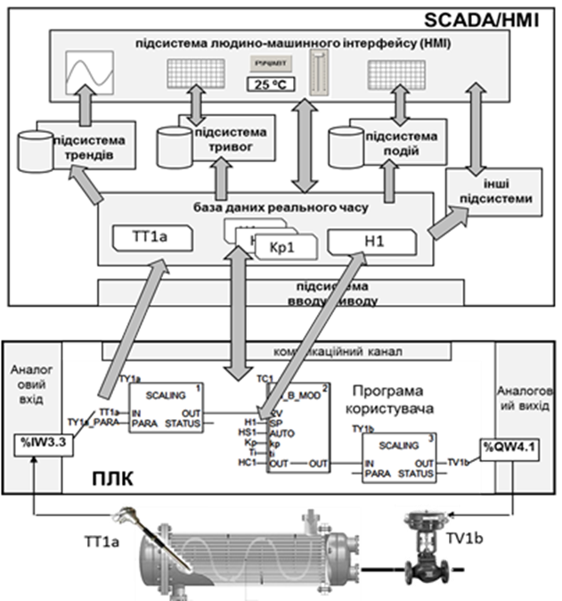
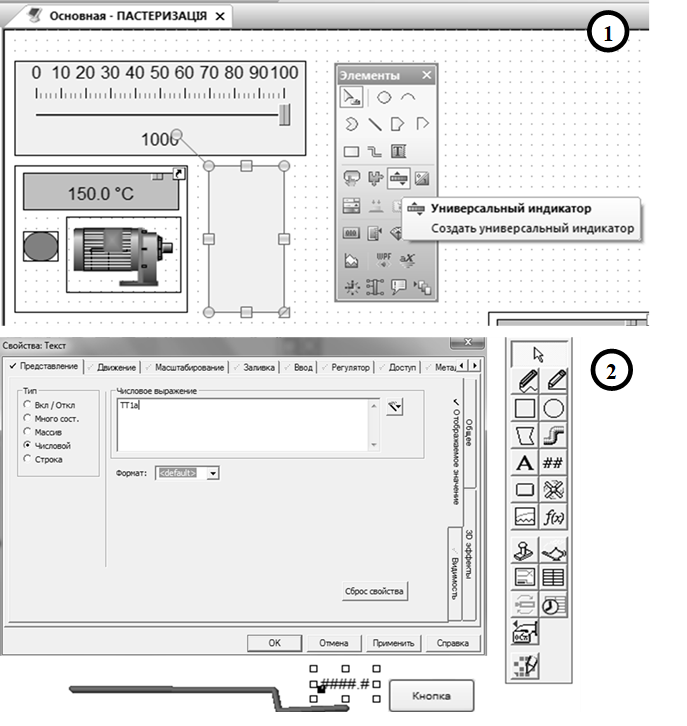

[7.3](7_3.md).Функціональні можливості середовищ виконання SCADA/HMI. <--- [Зміст](README.md) --> [Розділ 8](8.md). Основи проектування систем автоматизації 

## 7.4. Основні принципи розроблення АРМ оператора на базі SCADA/HMI

Розроблення та введення в дію проекту для SCADA/HMI – це комплекс робіт, що включає:

- попередню підготовку вихідних даних до проекту;

- створення проекту, його відлагодження;

- запуск та налагодження на об’єкті.

Попередня підготовка вихідних даних – це дуже важливий етап робіт, у якому задіяний не тільки розробник, а й замовник, яким у даному випадку нерідко виступає технолог. У ці роботи входять:

- підготовка переліку мнемосхем процесу;

- визначення особливостей побудови людино-машинного інтерфейсу;

- підготовка переліку технологічних параметрів для відображення, сигналізації, трендового архіву та вимог до них;

- визначення форми звітів;

- визначення додаткових функцій SCADA;

- інші.

Процес створення проекту проходить у трьох площинах: конфігурування проектних даних, створення графічної частини проекту (HMI) і написання невеликих програм (скриптів), якщо такі потребуються.

Програмна структура та процес розроблення проектів у різних програмах SCADA/HMI мають свої особливості. Слід розуміти, що, на відміну від функціонального призначення, реалізація середовищ розробки сильно відрізняються один від одного. Тим не менше, можна виділити деякі загальні концепції розроблення проектів, які спільні для більшості SCADA/HMI; в цій главі розглянемо деякі з них.

Як вже зазначалося, загальна концепція розроблення на базі програм SCADA/HMI – конфігурування замість програмування. Тобто вся або більша частина проекту розробляється шляхом заповнення полів, таблиць, розміщення готових елементів. Тільки в деяких випадках, коли немає готового рішення, використовують вбудовані в SCADA/HMI мови програмування. Спрощена модель функціонування SCADA системи наведена на рис.7.40.

 Рис. 7.40. Спрощена модель функціонування SCADA системи

Центральне місце в системі збирання та диспетчерського керування займає **база даних реального часу** – сукупність змінних процесу, на базі значень яких функціонують інші підсистеми. Ці змінні часто називають **тегами** (Tag), і завдання SCADA – слідкувати за їхнім оновленням. З одного боку, теги зв’язуються з джерелом даних, а з іншого – з іншими підсистемами SCADA/HMI. Джерелом даних для тегів можуть бути:

- зовнішні пристрої (наприклад контролери), такі теги називаються **зовнішніми**, або **тегами вводу/виводу**;

- системна інформація (наприклад, плинна дата та час, або ім’я оператора, що ввійшов в систему);

- внутрішня або дискова пам’ять, без прив’язки до будь-якого обладнання (контролера), тобто змінюється тільки самою SCADA.

При створенні та конфігуруванні тегу вказується його унікальне ім’я, тип, джерело даних, періодичність оновлення (зчитування), межі зміни та інші настройки. Наприклад, на рис.7.40 показано, що зовнішній тег з ім’ям “TT1a” через підсистему вводу/виводу зв’язується з однойменною змінною на ПЛК, яка має за джерело даних датчик температури, що підключений до вхідного аналогового каналу (%IW3.3).

Періодичне оновлення тегів проводиться для того, щоб отримати свіжу інформацію. Ці значення потрібні іншим підсистемам, наприклад, людино-машинному інтерфейсу. З іншого боку, деякі підсистеми SCADA теж можуть змінювати значення тегів, і при цьому воно повинно записуватися в контролер. Таким чином, реалізується двосторонній обмін. Наприклад, на рис.7.41 за допомогою повзунка в підсистемі HMI змінюється значення тегу "H1", який прив’язаний до нього. При зміні "H1" підсистема вводу/виводу змінює значення однойменної змінної в контролері, яка формує завдання для регулятора "TC1".

Рис. 7.41. Приклади інструментів для створення людино-машинного інтерфейсу в різних SCADA: 1 – Zenon (COPA-DATA, Австрія); 2 – Vijeo Citect (Schneider Electric, Франція)

Одні й ті самі теги з бази даних реального часу можуть використовуватись одночасно в декількох підсистемах (див. рис.7.40): для відображення та диспетчерського управління (в підсистемі HMI), ведення трендового архіву (підсистема трендів), контролю за значенням (підсистема тривог) та ін.

Заповнення бази даних відбувається у спеціалізованих редакторах шляхом заповнення відповідних значень полів (властивостей об’єкта).

Створення графічної частини проекту проводиться у вбудованих в SCADA/HMI редакторах. Цей процес полягає у виборі елемента з палітри доступних (див. рис.7.41) та конфігурування його властивостей. Властивості елементів, які повинні анімуватися, просто вказують на той тег, який використовується в анімації. Так, на рис.7.41 властивість "Числовое выражение" елемента "Текст" вказує на тег "ТТ1а", що в режимі виконання приведе до показу значення даного тегу в цьому елементі.

Більшість середовищ розроблення SCADA/HMI мають у своєму складі значну кількість бібліотек готових графічних елементів, що дає змогу значно прискорити процес створення проекту. 

Використання готових програмних інструментів SCADA/HMI значно прискорює процес розроблення, зменшує кількість проектних помилок та дає можливість внести зміни в проект у будь-який момент часу, навіть без зупинки технологічного процесу. Однак треба розуміти, що ціна будь-якої функціональності – це додаткова затрата фінансових та часових ресурсів, які, тим не менше, окупляться сторицею під час експлуатації.

***Для розроблення ефективних повнофункціональних проектів повинна бути тісна співпраця розробників, якими є спеціалісти з автоматизації, та технологів.***

[7.3](7_3.md).Функціональні можливості середовищ виконання SCADA/HMI. <--- [Зміст](README.md) --> [Розділ 8](8.md). Основи проектування систем автоматизації 