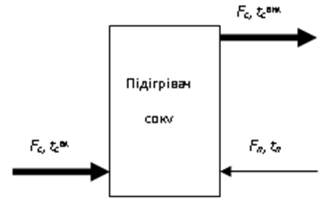

[8.1](8_1.md). Загальні положення <--- [Зміст](README.md) --> [8.3](8_3.md). Виконання схем автоматизації.

## 8.2. Призначення схем автоматизації та загальні принципи їх виконання

Одним з основних документів у проектній документації є схема автоматизації. Це технологічна машино-апаратурна схема виробничого об'єкта, на якій за допомогою умовних позначень зображують елементи системи автоматизації та зв'язки між ними, що в цілому визначає функції та принцип побудови системи автоматизації.

На схемах автоматизації зображують:

1) технологічне та інженерне обладнання і комунікації (трубопроводи, газоходи, повітропроводи) об’єкта, що автоматизується;

2) технічні засоби автоматизації, що утворюють контури контролю, регулювання, управління та сигналізації;

3) лінії зв’язку між окремими технічними засобами автоматизації або контурами. 

Об’єктом керування в системах автоматизації технологічних процесів є сукупність основного та допоміжного устаткування, а також потоки енергії, сировини й інших матеріалів, що визначають особливості технологічного процесу.

Можна виділити таку послідовність вирішення основних інженерних завдань, які виникають при розробленні схем автоматизації.

**1. Аналіз технологічного процесу.** Розроблення ефективної СА можливе тільки на засадах глибоких знань технології виробництва, що автоматизується, його технологічного регламенту, конструктивних особливостей технологічного устаткування та режимів його роботи.

**2. Визначення інформації, необхідної для оцінювання стану об’єкта.** Аналіз технологічного процесу повинен визначити ті величини, інформація про які необхідна для оцінювання стану об’єкта автоматизації. Цей вибір має велике значення для подальшої побудови СА, тому що надлишкова інформація суттєво збільшує вартість системи, а недостатня може призвести до помилок у реалізації технологічного процесу. При цьому, враховуючи, що більшість об’єктів, які автоматизуються, є об’єктами з розподіленими параметрами, велика увага приділяється вибору точок для отримання інформації. 

**3. Вибір каналів регулюючих дій.** Це завдання вирішують на підставі аналізу умов роботи технологічного устаткування, технологічного регламенту, сформованої мети керування, статичних і динамічних характеристик можливих каналів регулювання, виявлених законів та критеріїв керування об’єктом, а також вимог до точності стабілізації технологічних параметрів, показників якості регулювання і надійності.

На стадії вирішення цих завдань велика роль відводиться технологам, які мають більш ґрунтовні знання технології і можуть сформувати вимоги до системи автоматизації. Це може бути реалізовано у вигляді таблиці (табл. 8.1), в якій можна сформулювати завдання на розроблення системи автоматизації, яке може бути покладено в основу розроблення технічного завдання. 

Інформація, яка знаходиться в цій таблиці, крім визначення параметрів автоматичного контролю і управління для конкретного об’єкта автоматизації, містить вимоги до характеру контролю і управління, а також до точності вимірювання параметрів і показників якості процесу управління. 

Для кожного параметра, який, на думку технолога, повинен бути включений до системи автоматизації, вказується місце відбору сигналу та його припустиме значення. Після цього визначається вид автоматизації, який пропонується застосовувати до нього. Це може бути: автоматичний контроль, автоматичне регулювання і завдання управління. Якщо оператор повинен мати можливість спостерігати за зміною параметра, то вибирається вид автоматизації – «контроль». При цьому можуть бути вибрані функції: «відображення», «реєстрація» і «сигналізація». У графі «засоби контролю і управління» бажано вказати, за допомогою яких засобів вони будуть реалізовані. Це можуть бути локальні засоби автоматизації (показуючі, реєструючі і сигналізуючі прилади), які можуть бути розташовані на щитах автоматизації, або ці функції будуть виконуватись на АРМі оператора.

*Таблиця 8.1* **Завдання на розроблення системи автоматизації**

Важливим також є вибір регулюючих дій у системі управління. Це можна проілюструвати дуже простим прикладом.

Припустимо ми повинні вибрати систему регулювання температури на виході теплообмінника наведеного на рис. 8.1. На вхід підігрівача поступає сік з витратою *F*c і температурою *t*cвх. На виході з підігрівача необхідно отримати сік із заданою температурою *t*cвих. Для підігрівання соку в підігрівач подається пара з витратою *Fп* і температурою *tп*.

Рис. 8.1. Схема підігрівача соку

Підтримати температуру на виході можна або зміною витрати соку *F*c, або зміною витрати пари *Fп*. З точки зору створення системи автоматизації ці рішення є наближено однаковими. Але в першому варіанті ми змінюватимемо витрату соку, що впливатиме на роботу наступних апаратів і порушуватиме ритмічність роботи. Тому більш доцільно, з точки зору технологів, змінювати витрату пари. Це відображено у п.2 таб. 8.1. Саме тому для функції «регулювання» для кожного параметра важливо вказати, на що саме треба впливати при регулюванні. Функція управління вибирається при виконанні завдань дискретного управління: включення/відключення насосів, транспортерів, електроприводів та ін.

Після формування вимог до системи автоматизації переходять до розроблення самої системи, в процесі виконання якої вирішуються наступні завдання.

**4. Аналіз існуючих систем автоматизації.** Створюваний варіант СА повинен враховувати досвід розроблення аналогічних систем і повинен забезпечити досягнення найкращих техніко-економічних показників серед існуючих СА подібних об'єктів. При цьому він повинен враховувати можливі перспективи модернізації систем автоматизації в разі удосконалення технологічних процесів, розвитку технічних засобів автоматизації і необхідності вирішувати більш складні алгоритми управління.

**5. Вибір технічних засобів.** Це одне з найважливіших та складних завдань розроблення системи автоматизації. При цьому можна сформулювати деякі *загальні принципи*, якими слід керуватися в процесі розроблення схеми автоматизації:

1) рівень автоматизації технологічного процесу в кожен проміжок часу має визначатися не лише доцільністю впровадження певного комплексу технічних засобів та досягнутим рівнем науково-технічних розробок, а й перспективою модернізації та розвитку цих засобів;

2) під час розроблення схем автоматизації, а також вибираючи технічні засоби, слід враховувати: вид і характер технологічного процесу, умови пожежо- та вибухобезпеки, агресивність і токсичність навколишнього та робочого середовищ; параметри та фізико-хімічні властивості вимірюваного середовища; відстань від місця встановлення датчиків, допоміжних пристроїв, виконавчих механізмів, приводів машин та запірних органів до пунктів керування та контролю; потрібну точність та швидкодію засобів автоматизації;

3) систему автоматизації технологічних процесів потрібно будувати на базі засобів автоматизації та обчислювальної техніки, що виробляються серійно. Намагатися застосовувати однотипні засоби автоматизації і віддавати перевагу уніфікованим системам, які характеризуються простотою поєднання, взаємозамінністю та зручністю компонування на щитах керування. Використання однотипної апаратури дає значні переваги під час монтажу, налагодження, експлуатації, забезпечення запасними частинами тощо;

4) добираючи локальні засоби збирання та накопичення первинної інформації (автоматичні датчики), вторинні прилади, регулюючі та виконавчі пристрої використовувати переважно прилади та засоби автоматизації Державної системи промислових приладів і засобів автоматизації;

5) вибираючи засоби автоматизації, що використовують допоміжну енергію (електричну, пневматичну, гідравлічну), керуватися умовами пожежо- та вибухобезпеки об’єкта, що автоматизується, агресивністю навколишнього природного середовища, вимогами до швидкодії, дальності передачі сигналів інформації та команд керування тощо;

6) обмежувати кількість приладів, апаратури керування і сигналізації, які монтуються на оперативних щитах і пультах. Надлишок апаратури ускладнює експлуатацію, відвертає увагу обслуговуючого персоналу від спостереження за основними параметрами, що визначають хід технологічного процесу, збільшує вартість установки, терміни монтажних та налагоджувальних робіт. Прилади і засоби автоматизації допоміжного призначення доцільніше розміщувати на окремих щитах поблизу технологічного устаткування.

Наведені принципи є загальними, але не вичерпними для всіх випадків, які можуть траплятися в практиці проектування систем автоматизації технологічних процесів. Однак для кожного конкретного випадку їх треба враховувати в технічному завданні на автоматизацію проектованого об’єкта.

При побудові таких систем на базі промислових мікропроцесорних контролерів (МПК) додатково необхідно: вибрати тип МПК, його конфігурацію, а також засоби відображення інформації. У разі побудови автоматизованого робочого місця оператора технолога на базі ПЕОМ необхідно розробити відповідне програмне забезпечення та інтерфейс автоматизованого робочого місця (АРМ) оператора.

**6. Вибір місця розташування технічних засобів**. Певне місце розташування в будь-якій СА мають дві групи технічних засобів (ТЗА). Це ТЗА за допомогою яких безпосередньо отримують інформацію та формують управляючі дії і які розташовані на технологічному устаткуванні та трубопроводах: первинні вимірювальні перетворювачі, відбірні пристрої, регулюючі органи, виконавчі пристрої тощо. Група ТЗА, до якої входять перетворювачі та підсилювачі сигналів, розміщується «по місцю», тобто між технологічним обладнанням та пунктами управління об’єктом (ПУО). Розташування інших ТЗА виконується на спеціальних щитових конструкціях і пунктах управління і залежить від обраної структури системи автоматизації. 

[8.1](8_1.md). Загальні положення <--- [Зміст](README.md) --> [8.3](8_3.md). Виконання схем автоматизації.