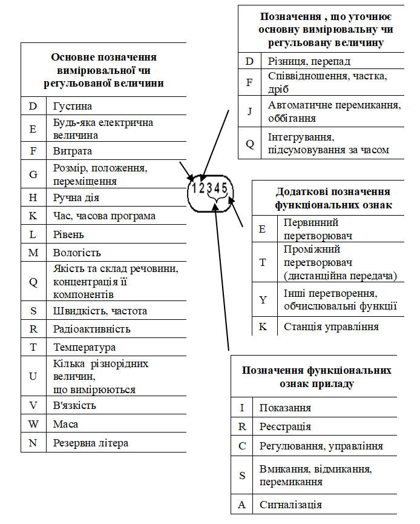

[8.2](8_2.md). Призначення схем автоматизації та загальні принципи їх виконання <--- [Зміст](README.md) --> [8.4](8_4.md). Розміщення зображень приладів та засобів автоматизації на схемі автоматизації

## 8.3. Виконання схем автоматизації.

### 8.3.1. Графічне зображення технологічного устаткування та комунікацій на схемі автоматизації

Схема автоматизації графічно поділена на дві нерівні зони. 

У верхній зоні схеми, приблизно 2/3 за висотою, зображують машино-апаратурну технологічну схему з необхідними комунікаціями, електрообладнанням та елементами системи автоматизації, що вбудовані в технологічне устаткування або механічно пов'язані з вбудованими засобами. У нижній зоні схеми (приблизно 1/3 за висотою), з деяким розривом від технологічної частини, в прямокутниках розташовують зображення решти технічних засобів системи автоматизації.

Схема автоматизації виконується відповідно до стандартів:  ДСТУ Б А.2.4-3:2009 (Правила виконання робочої документації автоматизації технологічних процесів), ДСТУ Б А.2.4-4:2009 СПДС. Основні вимоги до проектної та робочої документації, ДСТУ Б А.2.4-16:2008 СПДС. Автоматизація технологічних процесів. Зображення приладів і засобів автоматизації в схемах.

Технологічне, інженерне обладнання та трубопроводи на схемах автоматизації зображають відповідно до ДСТУ Б А.2.4-22:2008 СПДС. (Технологія виробництва. Основні вимоги до робочих креслень), ДСТУ Б А.2.4-1:2009 СПДС. Умовні позначення трубопроводів та їх елементів.

Технологічна частина схеми повинна бути складена досить докладно із зображенням усіх машин, апаратів і комунікацій, які беруть участь у здійсненні технологічних процесів. Зображувані на схемі технологічні об’єкти за своїм виглядом, конфігурацією і відносним масштабом походять на реальний об’єкт, але без масштабу і деталізації конструкції. Переважне застосування мають зображення, прийняті у технологічній робочій документації. Якщо такої схеми немає, то, за узгодженням із замовником, технологічне устаткування можна зображати згідно зі стандартом ЄСКД. 

Усе технологічне устаткування повинно мати підписи, які розшифровують його призначення.

Технологічні апарати і трубопроводи допоміжного призначення показують лише у випадках, коли вони механічно з’єднані чи взаємодіють із засобами автоматизації. В окремих випадках деякі елементи технологічного устаткування допускається зображувати на схемах автоматизації у вигляді прямокутників із зазначенням назв цих елементів або не показувати зовсім. Однак зображена таким чином технологічна схема має давати чітке уявлення про принцип її роботи та взаємодію із засобами автоматизації.

Технологічні комунікації і трубопроводи рідин та газів зображують умовними позначеннями (нумерують) відповідно до ДСТУ Б А.2.4-1:2009 (Умовні зображення і познаки трубопроводів та їх елементів), наведеними в табл. 8.2. Для більш детального розкриття характеру середовища до цифрового позначення може додаватися літерний індекс, наприклад: вода чиста - 1ч, пара перегріта - 2п, пара насичена - 2н тощо.

*Таблиця 8.2* **Умовні цифрові позначення трубопроводів для рідин та газів**

| **Назва середовища,**  **транспортованого трубопроводом** | **Позначення**  **трубопроводу** | **Назва середовища,**  **транспортованого трубопроводом** | **Позначення**  **трубопроводу** |
| --------------------------------------------------------- | -------------------------------- | --------------------------------------------------------- | -------------------------------- |
| Вода                                                      | 1                                | Рідке паливо                                              | 15                               |
| Пара                                                      | 2                                | Вибухонебезпечні гази: Водень                             | 16                               |
| Повітря                                                   | 3                                | Ацетилен                                                  | 17                               |
| Азот                                                      | 4                                | Фреон                                                     | 18                               |
| Кисень                                                    | 5                                | Етан                                                      | 19                               |
| Інертні гази: Аргон                                       | 6                                | Метан                                                     | 20                               |
| Неон                                                      | 7                                | Етилен                                                    | 21                               |
| Гелій                                                     | 8                                | Пропан                                                    | 22                               |
| Криптон                                                   | 9                                | Пропілен                                                  | 23                               |
| Ксенон                                                    | 10                               | Бутан                                                     | 24                               |
| Аміак                                                     | 11                               | Бутилен                                                   | 25                               |
| Кислота (окиснювач)                                       | 12                               | Протипожежний трубопровід                                 | 26                               |
| Луг                                                       | 13                               | Вакуум                                                    | 27                               |
| Мастило                                                   | 14                               |                                                           |                                  |

Для рідин і газів, позначення яких не передбачено в табл. 8.2, дозволяється використовувати інші цифри (починаючи з 28), але обов’язково з необхідними поясненнями введених умовних позначень.

Умовні числові позначення трубопроводів слід проставляти в розривах ліній, що зображають трубопроводи, на відстані, не меншій ніж 50 мм один від одного.

При обриванні лінії, що зображує комунікації, біля місця обривання повинен бути напис, що пояснює, звідки або куди йде трубопровід, наприклад: «до дифузії», «від фільтру» тощо. На лініях перетину трубопроводів, у місці їх з’єднання, ставиться крапка. Відсутність крапки означає відсутність з’єднання. Знак обводу можна застосовувати або не застосовувати. Напрям потоку показують стрілками з кутом 60°:

 

У цілому технологічна частина СА має бути виконана без зайвих ускладнень графічного характеру з тим, щоб вона була досить наочною, легко читалася і давала чітке уявлення про композицію даної машино-апаратурної системи і взаємодії її елементів. 

Контури устаткування рекомендується зображувати тонкими лініями (до 0,5 мм), комунікації - ширшими (1-2 мм), причому лінії, що зображують основний потік, мають товщину у два рази більшу, ніж зображення інших трубопроводів.

### 8.3.2. Графічне зображення технічних засобів автоматизації

Прилади, засоби автоматизації, електричні пристрої та елементи обчислювальної техніки на схемах автоматизації зображають відповідно до ДСТУ Б А.2.4-16:2008 Автоматизація технологічних процесів, зображення умовних приладів і засобів автоматизації в схемах та галузевих нормативних документів. Названі стандарти визначають систему побудови графічних (табл. 8.3) та літерних (рис. 8.2) умовних позначень за функціональними ознаками приладів.

Технічні засоби автоматизації (за винятком електроапаратури, виконавчих механізмів та регулюючих органів) зображуються за допомогою кола або еліпса. У разі розташування ТЗА на щитах (пунктах керування) коло (еліпс) має посередині риску (див. табл. 8.3), а в разі розташування ТЗА «по місцю» ця риска відсутня. У верхню частину кола вписують літерні позначення вимірюваної величини та функціональної ознаки приладу. В нижню частину кола вписують позиційне позначення (цифрове чи літерно-цифрове), що слугує для нумерації контуру контролю чи регулювання. Умовні графічні позначення виконуються лініями товщиною 0,5…0,6 мм, а горизонтальна розподільна риска всередині позначення технічного засобу та лінії зв’язку - товщиною 0,2…0,3 мм.

Послідовність розміщення літерних позначень (згідно з ДСТУ Б А.2.4-16:2008) у верхній частині (зліва направо) має бути такою (див. рис.8.2):

- позначення основної вимірюваної чи регульованої величини;

- позначення, що уточнює (в разі потреби) основну вимірювану чи регульовану величину;

- позначення функціональних ознак приладу;

- додаткові позначення функціональних ознак.

*Таблиця 8.3* Розміри графічних умовних позначень приладів, засобів автоматизації та електроапаратури

 

Як видно з рис. 8.2. одна й та сама літера може мати різне змістовне навантаження, в залежно від її розташування в позначенні приладу. Наприклад, літера **D** в позначенні приладу **DI** означає, що це прилад для вимірювання густини, показуючий, бо літера **D –** на першому місці. А прилад, позначений як **PDI,** належить до приладу для вимірювання різниці тисків, показуючий,оскільки літера **D** знаходиться на другому місці, після літери **Р**. 

Рис. 8.2. Літерні позначення вимірювальних чи регульованих величин та функціональних ознак технічного засобу

Послідовність побудови умовних позначень із застосуванням додаткових літер така: спочатку ставиться літера, якою позначають вимірювану величину, а на другому - одна з додаткових літер: *E*, *T*, *K* чи *Y.*

Літера *Е* застосовується для позначення чутливих елементів, тобто пристроїв, які виконують первинне перетворення, наприклад, первинних термоелектричних перетворювачів (термопар), термоперетворювачів опору (термометрів опору), звужувальних пристроїв витратомірів, датчиків акустичних рівнемірів тощо.

Літера *Т* означає проміжне перетворення - дистанційне передавання сигналу. Її рекомендується застосовувати для позначення приладів з дистанційним передаванням показань, наприклад, безшкальних манометрів (дифманометрів), ротаметрів з дистанційним передаванням сигналів тощо. 

Літеру *Y* рекомендується застосовувати для позначення перетворювачів сигналів та обчислювальних пристроїв.

Для позначення величин, не передбачених стандартом, можна використати резервні літери, позначення яких мають бути розшифровані на схемі. Не допускається в одній і тій самій документації однією резервною літерою позначати різні величини.

Крім того, для більш повного розкриття функцій, які виконує технічний засіб, використовуються додаткові літерні позначення, які наносяться поза графічним позначенням приладу, праворуч від нього (табл. 8.4).

Рекомендується їх використовувати в таких випадках:

1) При позначенні приладів, які виконують функції сигналізації, вказуються граничні межі величин, що сигналізуються. У разі сигналізації досягнення вимірювальною величиною верхнього рівня використовується літера *Н*, яка проставляється праворуч у верхній частині зображення приладу, а літера *L* - у разі сигналізації досягнення вимірювальною величиною нижнього рівня і проставляється праворуч у нижній частині зображення приладу (п.15 табл. 8.5).

2) Для конкретизації вимірюваної величини, позначеної літерами *Q* (якість та склад речовини, концентрація її компонентів) або *Е* (будь-яка електрична величина) праворуч від зображення приладу, рекомендується вказувати найменування або символ вимірюваної величини. Наприклад, СО2 (концентрація СО2), рН, U (напруга), I (струм) (п.п.19, 20, 21, 22, 28, 29 табл. 8.4). У разі необхідності поруч із зображенням приладу допускається вказувати вид радіоактивності, наприклад α- чи β-випромінювання (п. 22 табл. 8.5).

3) Якщо використовуються літери для позначення приладу, що вимірює кілька різнорідних величин. Докладне розшифрування цих величин має бути наведено поруч із зображенням приладу або на полі креслення (п.26 табл. 8.4). 

4) Для розшифровування виду перетворення сигналів у перетворювачах, наприклад Е/Р (електропневматичний перетворювач), A/D (аналого-дискретний перетворювач). Літерні позначення наведені в табл. 8.5 п.п. 31, 32, 33. 

5) Для розшифрування операцій, які виконуються обчислювальним пристроєм, основні літерні позначення яких також наведені у табл.8.4.

Приклади побудови умовних позначень відповідно до ДСТУ Б А.2.4-16:2008 (ГОСТ 21.408–93), наведено в табл. 8.5. Використовуючи літерні умовні позначення згідно з ДСТУ Б А.2.4-16:2008, слід керуватись такими правилами.

У разі побудови позначень комплектів засобів автоматизації перша літера в позначенні кожного приладу, що входить у комплект, є назвою вимірюваної комплектом величини. Наприклад, у комплекті для вимірювання та регулювання температури первинний вимірювальний перетворювач треба позначати через *TE*, вторинний реєструючий прилад - *TR*, регулюючий блок - *TC* тощо.

У побудові умовних позначень передбачаються такі винятки:

- у всіх пристроях, що виконані як окремі блоки і призначені для ручних операцій, на першому місці в позначенні ставлять літеру *Н* незалежно від того, до складу якого вимірювального комплекту вони входять, наприклад, перемикачі електричних кіл вимірювання (керування), перемикачі газових (повітряних) ліній позначають через *HS*, панелі дистанційного керування - *HC*, кнопки (ключі) для дистанційного керування, ручні задатчики - *H*, кнопки (ключі) для дистанційного керування з підсвічуванням - *HА* тощо;

- для комплекту, призначеного для вимірювання декількох різнорідних величин, первинні вимірювальні перетворювачі (датчики) позначають відповідно до вимірюваної величини, а вторинний прилад - *UR* (з відповідним доповненням, як це показано в п. 26 табл. 8.5);

*Таблиця 8.4.* **Додаткові літерні позначення, що відображають функціональні ознаки перетворювачів сигналів та обчислювальних пристроїв**

 

Умовні позначення сучасних приладів і засобів автоматизації можна умовно поділити на декілька груп.

1) Прилади, які встановлюються на технологічному обладнанні, трубопроводах і щитах перетворювачів, розташованих по місцю. До групи цих приладів належать:

- первинні перетворювачі (датчики), вторинні перетворювачі, які перетворюють фізичний сигнал від датчика в уніфікований сигнал; 

- перетворювачі сигналів із однієї форми в інші для забезпечення можливості підключення датчиків і виконавчих механізмів до мікропроцесорних засобів автоматизації, які працюють з уніфікованими електричними сигналами;

- виконавчі електричні елементи системи автоматизації (магнітні пускачі, реле та ін.)

2) Прилади, які використовуються в разі побудови системи автоматизації з використанням локальних засобів автоматизації, розташованих на щитах оператора. До цієї групи належать:

- показуючі та реєструючі прилади;

- мікропроцесорні управляючі засоби;

- блоки ручного управління;

- управляючі електричні елементи системи автоматизації (кнопки, перемикачі, елементи сигналізації тощо).

3) У разі побудови системи автоматизації з використанням промислових мікропроцесорних контролерів на схемі автоматизації зображуються прилади тільки першої групи, а в разі побудови СА на базі локальних технічних засобів автоматизації зображуються прилади першої і другої груп.

Позначення показуючих і реєструючих приладів умовно розподіляють на дві групи:

- вторинні прилади, які входять до вимірювального комплекту того чи іншого технологічного параметра;

- вторинні прилади, які працюють з уніфікованим електричним або пневматичним сигналом.

В обох випадках на першому місці показується літера технологічного параметра, в контурі якого використовується показуючий прилад 

У табл. 8.5 наведено приклади позначень технічних засобів автоматизації.

*Таблиця 8.5.* **Приклади позначень технічних засобів автоматизації**

*Продовження таблиці 8.5.*

*Продовження таблиці 8.5.*

*Продовження таблиці 8.5.*

*Продовження таблиці 8.5.*

 

 

[8.2](8_2.md). Призначення схем автоматизації та загальні принципи їх виконання <--- [Зміст](README.md) --> [8.4](8_4.md). Розміщення зображень приладів та засобів автоматизації на схемі автоматизації