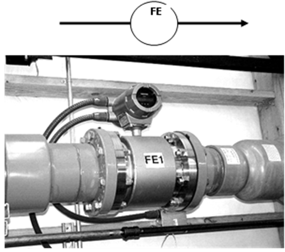

[8.3](8_3.md). Виконання схем автоматизації. <--- [Зміст](README.md) --> [8.5](8_5.md). Позиційні позначення на схемах автоматизації

## 8.4. Розміщення зображень приладів та засобів автоматизації на схемі автоматизації

На схемі автоматизації прилади та засоби автоматизації показують на зображенні технологічного обладнання, трубопроводів та в прямокутниках, розміщених під технологічною схемою.

На технологічному обладнанні та трубопроводах зображують усі первинні перетворювачі, які необхідні для вимірювання технологічних параметрів.

Особливістю зображення цих елементів полягає в тому, що первинні перетворювачі зображують поза контуром відповідного технологічного устаткування, де відбувається вимірювання. Якщо необхідно акцентувати увагу на конкретному місці вимірювання, його зображення з’єднується з точкою вимірювання (всередині контуру технологічного апарата) тонкою лінією, на кінці якої зображують коло діаметром 2 мм. Якщо вимір відбувається в трубопроводі, то зображення первинного перетворювача розміщують поряд із зображенням комунікації і з’єднують його зображення з місцем виміру тонкою лінією без кола на кінці. Винятком є зображення первинного перетворювача витратоміра, яке вбудовують у зображення трубопроводу (рис. 8.3).

Рис. 8.3. Датчик витратоміра, вбудованого в трубопровід

Винятком із цих правил є зображення приладів вимірювання тиску, відбірні пристрої яких **не мають позначення** **РЕ.** Тому на технологічній схемі зображується тільки місце вимірювання тиску (коло діаметром 2 мм), яке з’єднується з приладом для вимірювання тиску, наприклад, перетворювачем **РТ,** позначення якого показується або на технологічній схемі, або в прямокутнику «Прилади місцеві».

Крім того, на технологічних та енергетичних комунікаціях показують також регулюючі органи та виконавчі механізми, що механічно з’єднані між собою.

Уся інша апаратура системи автоматизації групується за принципом її розташування та зображується в прямокутниках, що відповідають цьому розташуванню: «Прилади місцеві», «Щит перетворювачів», «Щит управління», «Диспетчерський пункт» тощо. Комплектні пристрої (машини централізованого контролю, керувальні машини, комплекти телемеханіки, промислові мікропроцесорні контролери тощо) також позначають на схемах автоматизації у вигляді прямокутників.

У прямокутнику «Прилади місцеві» зображують усі засоби системи автоматизації, що розташовані в місцевих щитах, а також на панелях, розміщених у безпосередній близькості від технологічного обладнання на стінах, колонах тощо. Зазвичай це магнітні пускачі, кнопочні станції, позиціонери, сигнальна арматура та ін.

Кількість та найменування прямокутників залежать від структури системи автоматизації та вибраної організаційної структури.

Щити, пульти керування на схемах автоматизації зображують умовно у вигляді прямокутників довільних розмірів (40 – 80 мм), достатніх для нанесення графічних умовних позначень приладів, що на них установлюються, засобів автоматизації, апаратури управління та сигналізації. З лівого боку всіх прямокутників на полі 15 мм проставляють відповідні написи: «Прилади місцеві», «Щит управління», «Диспетчерський пункт» тощо. 

Функціональні зв’язки між первинними перетворювачами і засобами автоматизації, установленими на щитах та пультах, на схемах показують тонкими суцільними лініями. Кожен зв’язок позначають однією лінією незалежно від фактичної кількості проводів чи труб, якими здійснюється цей зв’язок. До умовних позначень приладів і засобів автоматизації лінії зв’язку допускається підводити з будь-якого боку, зокрема і під кутом. Лінії зв’язку мають бути найкоротшими, з мінімальною кількістю перетинань. Допускається перетинання лініями зв’язку зображень технологічного устаткування і комунікацій, однак перетинання умовних позначень приладів і засобів автоматизації є неприпустимим. У разі необхідності для позначення напряму руху сигналу на лініях зв’язку дозволяється наносити стрілки.

На функціональних лініях зв’язку, які йдуть від вимірювальних перетворювачів, вказуються гранично припустимі робочі значення вимірюваних і регульованих параметрів.

У процесі виконання схем автоматизації складних технологічних об’єктів для запобігання великої кількості перетинів дозволяється робити обрив лінії зв’язку. Кінці ліній зв’язку нумеруються однією й тією самою арабською цифрою, що називається адресою. Цифра, що позначає адресу, не має відношення до цифри, що позначає номер контуру. Кінці ліній зв’язку біля прямокутників і на технологічній схемі рекомендується розташовувати на одній лінії. Лінії зв’язку на технологічному обладнанні дозволяється обривати і виводити зверху, знизу чи збоку на одному рівні. Кінці ліній зв’язку біля прямокутників слід нумерувати цифрами в порядку зростання, зліва направо.

 

[8.3](8_3.md). Виконання схем автоматизації. <--- [Зміст](README.md) --> [8.5](8_5.md). Позиційні позначення на схемах автоматизації