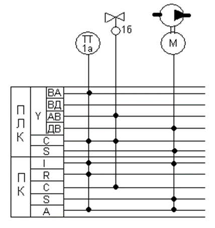

[8.5](8_5.md). Позиційні позначення на схемах автоматизації <--- [Зміст](README.md) --> [8.7](8_7.md). Приклади оформлення контурів контролю і управління на схемах автоматизації

## 8.6. Вимоги до оформлення та приклади виконання схем автоматизації технологічних процесів

Схему автоматизації виконують у вигляді креслення, на якому схематично умовними зображеннями показують: технологічне устаткування, комунікації, органи керування і засоби автоматизації із зазначенням зв’язків між технологічним устаткуванням і засобами автоматизації, а також зв’язків між окремими функціональними блоками та елементами автоматики. 

Умовні зображення слід виконувати лініями такої товщини:

1) технологічного устаткування:

- у вигляді прямокутників довільних розмірів - 0,5…1 мм;

- з відображенням характерних ознак устаткування - 0,2…0,5 мм;

2) трубопроводів - 0,5…1,5 мм;

3) умовні зображення засобів автоматизації (крім горизонтальної лінії на зображенні приладів, розміщених на щитах і пультах) - 0,5…0,6 мм;

4) лінії зв’язку між засобами автоматизації та горизонтальні лінії на зображенні приладів, розміщених на щитах і пультах, - 0,2…0,3 мм;

5) щити та пульти (прямокутники внизу схеми) - 0,5…1 мм.

Схеми автоматизації можна розробляти з більшим чи меншим ступенем деталізації. Однак обсяг інформації, поданий на схемі, має давати повне уявлення про прийняті основні рішення з автоматизації певного технологічного процесу, а також забезпечувати можливість складання на стадії проекту заявочних відомостей на прилади і засоби автоматизації, трубопровідну арматуру, щити й пульти, основні монтажні матеріали та вироби. Схему автоматизації виконують зазвичай на одному аркуші, на якому зображують засоби автоматизації і апаратуру всіх систем контролю, регулювання, керування та сигналізації, що належать до певної технологічної установки. Допоміжні пристрої (редуктори і фільтри для повітря, джерела живлення, реле, автомати, вимикачі та запобіжники в ланцюгах живлення, з’єднувальні коробки, інші пристрої та монтажні елементи) на схемах автоматизації не показують.

Складні технологічні схеми рекомендується розбивати на окремі технологічні вузли і виконувати схеми автоматизації цих вузлів у вигляді окремих креслень. Для технологічних процесів з великим обсягом автоматизації схеми автоматизації можуть бути виконані окремо за видами технологічного контролю та керування. Наприклад, окремо виконують схеми автоматичного керування, контролю та сигналізації тощо. 

Допускаються два способи виконання СА: розгорнутий (традиційний) і спрощений. При розгорнутому способі на схемі показують весь склад ТЗА для кожного контуру, при спрощеному - відображають лише кількість контурів контролю й регулювання, їх призначення і виконувані функції. Приклад спрощеного варіанта виконання СА системи автоматизації наведений на рис.8.4.

Рис. 8.4. Спрощена схема автоматизації

На наведеній схемі показано, що в збірнику виконуються функції управління рівнем із сигналізацією досягнення верхнього рівня (контур 1). У технологічному апараті: регулюється рівень в апараті шляхом зміни подачі основного технологічного потоку в апарат (контур 2); регулюється температура шляхом зміни подачі пари в апарат (контур 4), а також контролюється тиск в апараті (контур 3). 

У технологічному апараті 2 регулюється витрата технологічного потоку в апарат (контур 5), а також регулюється рН в апараті, шляхом подачі лугу в апарат (контур 6). 

На схемі автоматизації, виконаній розгорнутим способом, показують всі пристрої і засоби автоматизації, що входять до складу функціонального блока чи групи, та місце їх установлення. Перевага цього способу - більша наочність, що значно полегшує читання схеми і опрацювання проектних матеріалів, а також дає змогу складати замовні специфікації на потрібні для реалізації розробленої схеми автоматизації устаткування, вироби та матеріали.

При цьому вигляд схеми автоматизації залежить від вибору базових технічних засобів, які вибрані для її реалізації. Як показано в розділі 5 на рис. 5.9 - рис. 5.13, схему автоматизації можливо побудувати на базі локальних технічних засобів і з використанням мікропроцесорних логічних контролерів.

Приклад виконання схеми автоматизації розгорнутим способом з використанням локальних мікропроцесорних засобів автоматизації показано на рис. 8.5. Зображення технічних засобів на схемі автоматизації залежить від вибору конкретних технічних засобів автоматизації.

Рис.8.5. Приклад розгорнутої схеми автоматизації з локальними технічними засобами автоматизації

На схемі двома прямокутниками позначено «Прилади місцеві» та «Щит оператора». Лінії зв’язку між датчиками та відбірними пристроями, встановленими на технологічному обладнанні, приладами та засобами автоматизації, встановленими на місцях і на щиті колони, виконано з розривами. На відміну від безперервного з’єднування технічних засобів автоматизації, що входять до конкретного контуру контролю чи регулювання, лініями зв’язку, цей метод з’єднання називають адресним.

Враховуючи сучасні тенденції розвитку систем автоматизації, які будуються на базі використання промислових мікропроцесорних контролерів, розглянемо більш детально розробку схем автоматизації в якій у якості основного управляючого пристрою використовується промисловий мікропроцесорний контролер (ПЛК), а автоматизоване робоче місце (АРМ) оператора технолога розробляється на базі персонального комп’ютера (ПК), звичайного або промислового виконання, зі спеціально встановленим програмним забезпеченням для створення людино-машинного інтерфейсу. Такий принцип побудови системи автоматизації називають «безщитовою автоматизацією», маючи на увазі, що вся інформація про стан об’єкта управління і можливість ручного управління об’єктом виконується з АРМа оператора.

Для такої системи автоматизації на СА зображують два послідовно розташованих прямокутники (зверху вниз) - один для мікропроцесорного контролера (ПЛК), а інший для комп’ютера з установленим АРМом оператора-технолога. У кожному прямокутнику проводять горизонтальні лінії, кожна з яких відповідає певній функції цих пристроїв: *Y* - оброблення інформації, *I* - індикація, *R* - реєстрація, *C* - автоматичне регулювання, *S* - управління (наприклад, схеми управління електродвигунами), *A* - сигналізація. каналами). Якщо яка із функцій не використовується, то її можна не показувати.

На рис.8.6 показано один із варіантів зображення фрагмента схеми автоматизації для двох контурів: регулювання температури і управління двигуном, на якій показані всі перелічені вище функції ПЛК і ПК. У прямокутнику «ПЛК» показано тільки три функції, які притаманні більшості варіантів функцій, які виконує ПЛК: *Y* - оброблення інформації, *C* - автоматичне регулювання і *S* - управління (наприклад, схеми управління електродвигунами). Враховуючи, що на схемі підключення до ПЛК дуже важливо розуміти, які типи датчиків і виконавчих механізмів (аналогові чи дискретні) використано в схемі автоматизації (оскільки від цього залежить вибір конфігурації ПЛК), пропонується для функції *Y* (оброблення інформації) показувати 4 лінії, кожна з яких показує тип сигналу: ВА - вхід аналоговий, ВД - вхід дискретний, АВ - аналоговий вихід, ДВ - дискретний вихід.

Рис. 8.6. Приклад фрагментів СА побудованих з використанням ПЛК

Кожна функціональна лінія, що входить (виходить) в прямокутники, повинна мати точки на перетині з тими лініями, функції яких виконуються.

Саме для цього варіанта наведено приклади розгорнутої схеми автоматизації з мікропроцесорним промисловим контролером (рис .8.7).

Рис 8.7. Приклад розгорнутої схеми автоматизації 

[8.5](8_5.md). Позиційні позначення на схемах автоматизації <--- [Зміст](README.md) --> [8.7](8_7.md). Приклади оформлення контурів контролю і управління на схемах автоматизації