[8.6](8_6.md). Вимоги до оформлення та приклади виконання схем автоматизації технологічних процесів <--- [Зміст](README.md) --> [8.8](8_8.md). Приклад розроблення схеми автоматизації технологічних процесів та формування вимог до АРМу оператора

## 8.7. Приклади оформлення контурів контролю і управління на схемах автоматизації

Розглянуті нижче контури автоматичного контролю і управління наведені для структури системи автоматизації, які побудовані на принципах без щитової автоматизації, в яких інформація від датчиків надходить на промислові логічні контролери, до яких підключене автоматизоване робоче місце (АРМ) оператора-технолога. 

Можна виділи декілька структур технічних засобів автоматизації.

### 1. Прилади, встановлені на технологічному обладнані і призначені до візуального контролю на місці встановлення

Ці прилади не підключаються до ПЛК і їхнє зображення показується на технологічній схемі або в прямокутнику – «Прилади місцеві».

Приклади реалізації розглянутих контурів контролю показані в табл. 8.11, типи й характеристики відповідних технічних засобів автоматизації наведені в табл. 8.12

*Таблиця 8.7* **Приклади зображення на схемах автоматизації приладів для візуального контролю «по місцю»**

| **№ прикладу** | **Призначення контуру**                                      |
| -------------- | ------------------------------------------------------------ |
| 1              | Контроль температури  приладами, встановленими «по місцю»    |
| 2              | Контроль температури  манометричним термометром, встановленим «по місцю» |
| 3              | Контроль тиску  приладами, встановленими «по місцю»          |
| 4              | Контроль кількості  рідин/газів приладами, встановленими «по місцю» |
| 5              | Контроль витрат  рідин/газів приладами, встановленими «по місцю» |
| 6              | Контроль напруги  живлення електрообладнання приладами встановленими «по місцю» |
| 7              | Контроль сили  струму, що подається на електрообладнання приладами, встановленими «по місцю» |

### 2. Комплект приладів, які призначені тільки для контролю за технологічними параметрами.

До складу цих комплектів входять:

- датчики з уніфікованим електричним вихідним сигналом, які з’єднуються лінією зв’язку з аналоговим входом (ВА) ПЛК;

- датчики, які не мають уніфікованого електричного вихідного сигналу (наприклад термометри опору); нормувальні перетворювачі для перетворення сигналу від датчиків в уніфікований електричний сигнал, які з’єднуються лінією зв’язку з аналоговим входом (ВА) ПЛК;

- датчики з уніфікованим пневматичним вихідним сигналом; пнемоелектроперетворювач в уніфікований електричний вихідний сигнал, які з’єднуються лінією зв’язку з аналоговим входом (ВА) ПЛК;

- вимірювальні комплекти, до складу яких входять датчики і вторинні перетворювачі або блоки відображення параметра.

У всіх приладах, які входять до складу вимірювального комплекту, на першому місці показується літерне позначення вимірювального параметра (рис. 8.2).

Ознакою того, що сигнал від датчика або вторинного перетворювача підключається до аналогового входу ПЛК, є точка, яка показується на лінії пересічення лінії зв’язку і лінії ВА (ПЛК). Якщо цей сигнал використовується в завданнях регулювання або управління, які вирішуються на ПЛК, на відповідних місцях перетину ставиться точка.

Якщо інформація про значення технологічного параметра передається з ПЛК на АРМ оператора технолога на перетині ліній зв’язку з відповідними функціями, ставиться точка: *I* – показ значень технологічного параметра на мнемосхемах; *R* – реєстрація (запис у архів з можливістю перегляду історії змін параметру); *C* – можність ручного управління регулюючими органами з клавіатури АРМа; 
 *S* – реалізація з пульта АРМа команд на переключення виконавчих механізмів; *А* – сигналізація на мнемосхемі АРМа про відхилення параметра за припустимі межі. 

Приклади реалізації розглянутих контурів контролю показані в табл. 8.11, типи і характеристики відповідних технічних засобів автоматизації - в табл. 8.12.

*Таблиця 8.8* Приклади зображення на схемах автоматизації контурів автоматичного контролю технологічних параметрів

| № прикладу | Призначення контуру                                          |
| ---------- | ------------------------------------------------------------ |
| 8          | Контроль температури термометром опору/термопарою,  підключених безпосередньо до входів ПЛК (без додаткових перетворювачів) |
| 9          | Контроль температури термометром опору/термопарою з  вбудованим нормуючим перетворювачем (уніфікований електричний вихідний  сигнал) |
| 10         | Контроль температури термометром опору/термопарою з  подальшим перетворенням сигналу нормуючим перетворювачем, установленим на  щиті (уніфікований електричний вихідний сигнал) |
| 11         | Контроль температури манометричним термометром,  установленим на щиті управління |
| 12         | Контроль високої температури безконтактним методом (пірометром) |
| 13         | Контроль надлишкового тиску/ вакуумметричного тиску  (манометром) |
| 14         | Контроль різниці тисків (диференційним манометром)           |
| 15         | Контроль рівня рідин і сипучих речовин ємнісним  методом     |
| 16         | Контроль рівня рідин, що не кристалізуються,  буйковими/поплавковими рівнемірами |
| 17         | Контроль рівня рідин (без обмежень) гідростатичним  методом  |
| 18         | Контроль рівня речовин (рідин/сипучих речовин)  низької запиленості безконтактним методом (ультразвуковим) |
| 19         | Контроль кількості речовин (газ, рідина) за допомогою  лічильників |
| 20         | Контроль кількості поштучних виробів                         |
| 21         | Контроль кількості речовин за допомогою вимірювання ваги  в ємності |
| 22         | Контроль кількості/витрат речовин (сипучих) за  допомогою вимірювання ваги на транспортері (стрічкові ваги) |
| 23         | Контроль витрати рідин у відкритих ємностях  безконтактним методом (ультразвуковий витратомір) |
| 24         | Контроль витрат рідин, що не кристалізуються, турбінним  витратоміром |
| 25         | Контроль витрат струмопровідних рідин індукційним  витратоміром |
| 26         | Контроль витрати рідин високої в’язкості                     |
| 27         | Контроль витрати рідин/газів витратомірами змінного і  постійного перепаду тиску |
| 28         | Контроль концентрації (електропровідності) в рідинах         |
| 29         | Контроль кількості сухих речовин у рідких  середовищах: низької і високої в’язкості та пастоподібних рефрактометром |
| 30         | Контроль рН рідин                                            |
| 31         | Контроль в’язкості рідин                                     |
| 32         | Контроль мутності рідин                                      |
| 33         | Контроль вологості газів                                     |
| 34         | Контроль напруги живлення електрообладнання                  |
| 35         | Контроль сили струму, що подається на  електрообладнання     |
| 36         | Контроль вмісту газів у газових сумішах                      |

### 3. Комплект приладів для сигналізації відхилення параметрів за встановлені межі

У цьому розділі розглядаються тільки прилади, до яких входять спеціалізовані блоки-сигналізатори, які мають апаратуру сигналізації (сигнальні лампи), і групу вихідних контактів, які переключаються в разі спрацьовування сигналізатора.

Інформація про переключення цих контактів саме й подається на дискретні входи ПЛК. Про це свідчить точка на перетині лінії зв’язку від сигналізатора до ПЛК і лінії входів дискретних (ВД).

Приклади реалізації контурів сигналізації показані в табл.8.11, типи і характеристики відповідних технічних засобів автоматизації наведені в табл. 8.12.

*Таблиця 8.9* Приклади зображення на схемах автоматизації контурів сигналі-зації відхилення технологічних параметрів від установлених меж

| № прикладу | Призначення контуру                                          |
| ---------- | ------------------------------------------------------------ |
| 37         | Сигналізація відхилення температури                          |
| 38         | Сигналізація відхилення тиску                                |
| 39         | Сигналізація відхилення рівня рідин, що не  кристалізуються  |
| 40         | Сигналізація відхилення рівня струмопровідних рідин          |
| 41         | Сигналізація відхилення рівня сипучих речовин                |
| 42         | Сигналізація відхилення рівня рідин/сипучих речовин (без  обмежень) |
| 43         | Сигналізація відхилень витрати рідин/газів                   |

При цьому треба пам’ятати, що сигналізацію відхилення параметрів від установлених меж можна реалізувати у ПЛК або на АРМі оператора технолога програмним шляхом.

Якщо контакти сигналізаторів використовуються для управління дискретними виконавчими механізмами з ПЛК і АРМа оператора- технолога, то, крім лінії зв’язку від сигналізатора, необхідно показувати лінію, яка йде від ПКЛ і АРМа до дискретного виконавчого механізму, або для включення-відключення двигунів, насосів, транспортерів та ін.. У цьому випадку контур буде складатися з двох ліній зв’язку: інформаційного і управляючого. 
 Для побудови загального контуру сигналізації і управління інформаційну лінію контуру необхідно вибрати з прикладів, наведених у табл. 8.9, а управляючу - з прикладів контурів управління, наведених у табл. 8.10. При цьому в усіх приладах цих контурів на першому місці повинна використовуватися літера, яка відповідає технологічному параметру, а позиційне позначення має включати всі прилади - від датчиків до виконавчих механізмів. 

### 4. Комплект приладів для реалізації функцій управління в СА

У разі реалізації систем автоматичного регулювання і управління команди на виконавчі механізми і регулюючі органи надходять з контролера, а в разі переходу на ручне управління - з АРМа оператора-технолога.

Зображення цієї частини контуру управління залежить тільки від типу виконавчого механізму, тому що з ПЛК надходить або уніфікований вихідний електричний сигнал, або дискретний вихідний сигнал (для комутації команди на дискретні виконавчі механізми), а також від вибраного режиму ручного (дистанційного) управління виконавчим механізмом і регулюючим органом.

*Таблиця 8.10* Приклади зображення на схемах автоматизації управляючої частини контуру управління

| № прикладу | Призначення контуру                                          |
| ---------- | ------------------------------------------------------------ |
| 44         | Керування дискретним (двопозиційним) електричним  виконавчим механізмом з дискретних виходів ПЛК через додаткове реле |
| 44а        | Керування дискретним (двопозиційним) електричним  виконавчим механізмом безпосередньо з дискретних виходів ПЛК |
| 45         | Керування дискретним (двопозиційним) пневматичним  виконавчим механізмом |
| 46         | Керування двигунами (дискретне – включити/виключити)         |
| 47         | Керування двигунами за допомогою частотних  перетворювачів   |
| 48         | Керування аналоговим електричним виконавчим механізмом  безпосередньо з аналогового виходу ПЛК з можливістю ручного управління з щита  управління через блок ручного управління |
| 48а        | Керування аналоговим електричним виконавчим  механізмом безпосередньо з аналогового виходу ПЛК з можливістю ручного управління  з АРМа оператора-технолога |
| 49         | Керування аналоговим пневматичним виконавчим  механізмом безпосередньо з аналогового виходу ПЛК з можливістю ручного  управління з щита управління через блок ручного управління |
| 49а        | Керування аналоговим пневматичним виконавчим механізмом  безпосередньо з аналогового виходу ПЛК з можливістю ручного управління з щита  управління через блок ручного управління з АРМа оператора-технолога |
| 50         | Керування виконавчим механізмом з постійною швидкістю  обертання (МЕК, МЕО) для імпульсних регуляторів |

*Таблиця 8.11* Приклади реалізації контурів контролю, управління та сигналізації

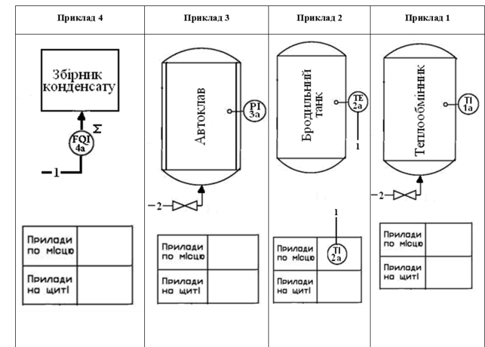

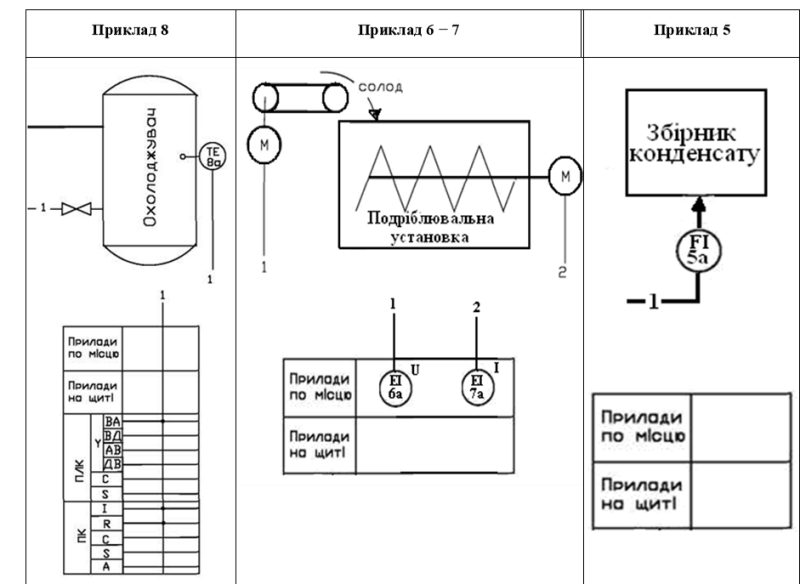

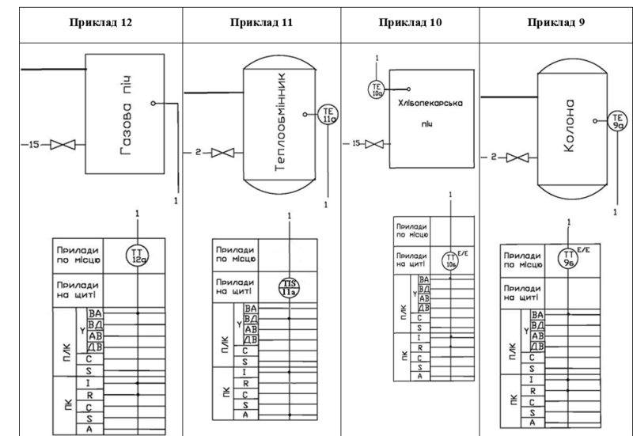

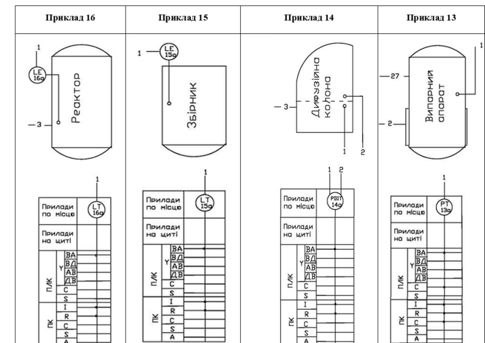

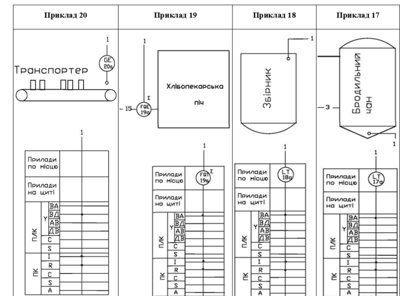

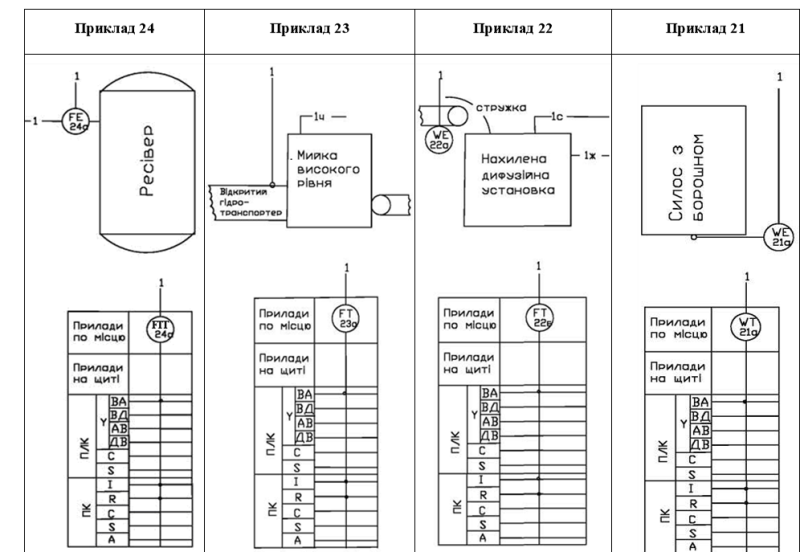

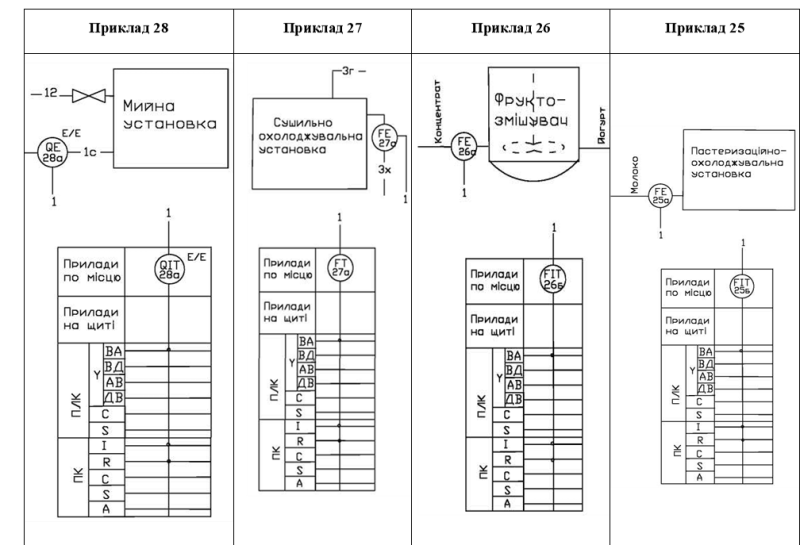

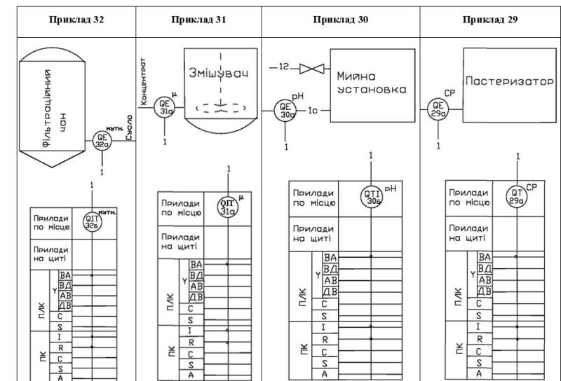

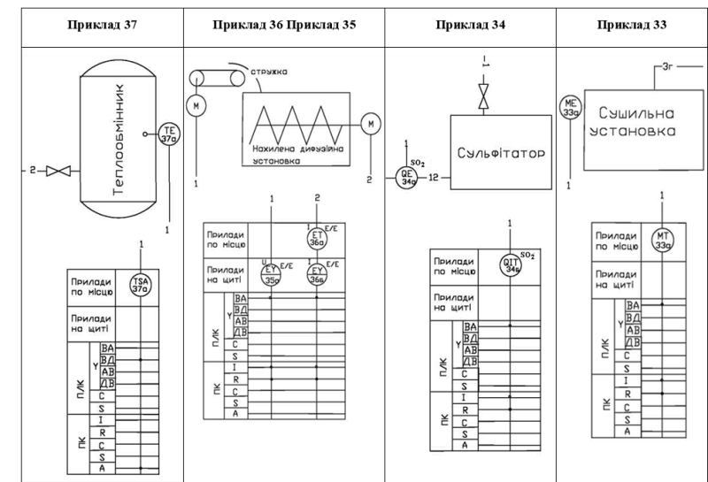

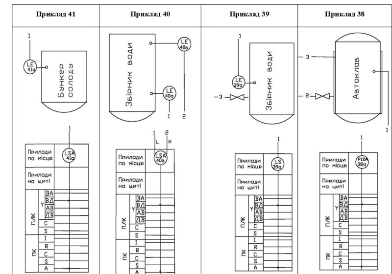

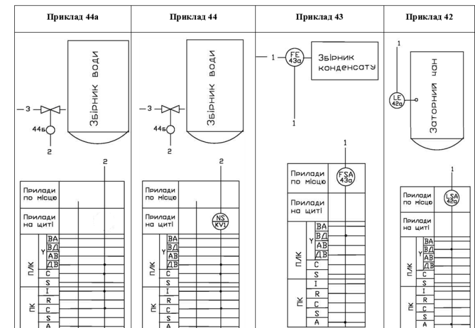

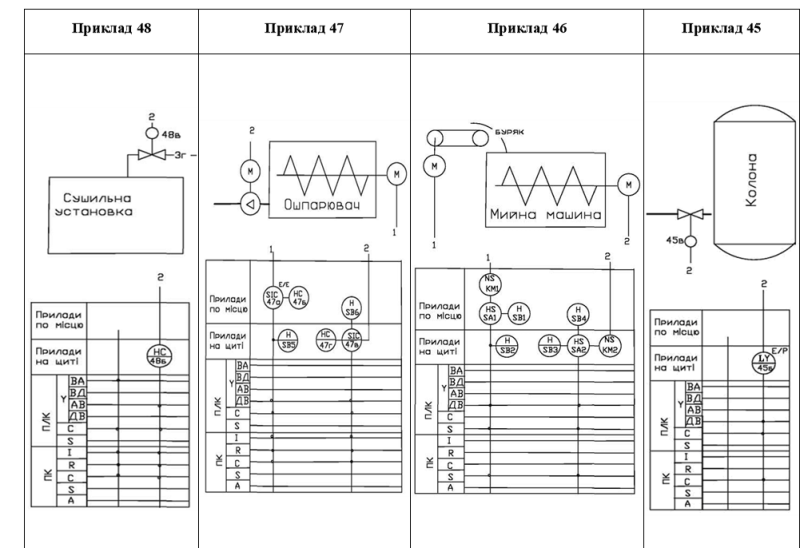

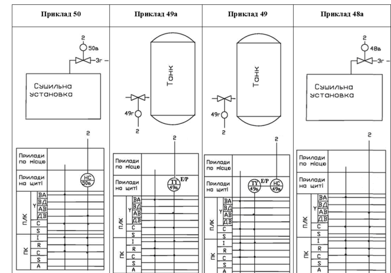

*Таблиця 8.12* Специфікація приладів, наведених у прикладах таблиці 11

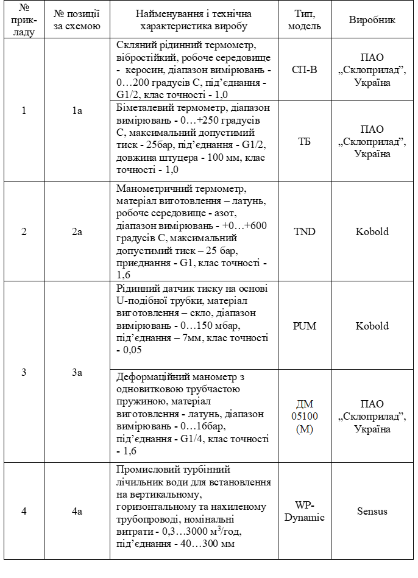

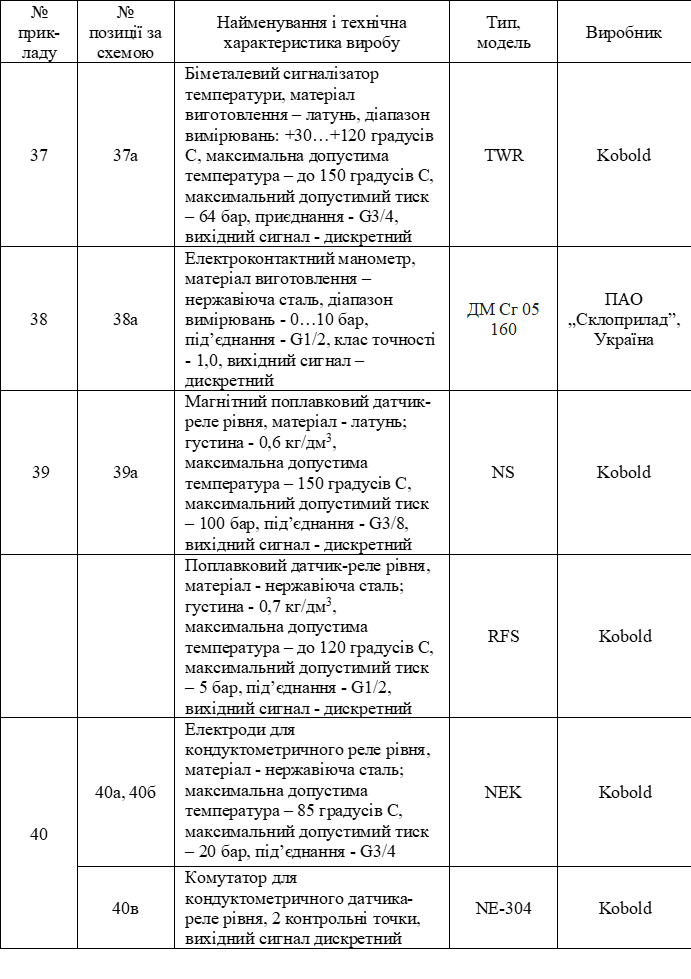

[8.6](8_6.md). Вимоги до оформлення та приклади виконання схем автоматизації технологічних процесів <--- [Зміст](README.md) --> [8.8](8_8.md). Приклад розроблення схеми автоматизації технологічних процесів та формування вимог до АРМу оператора