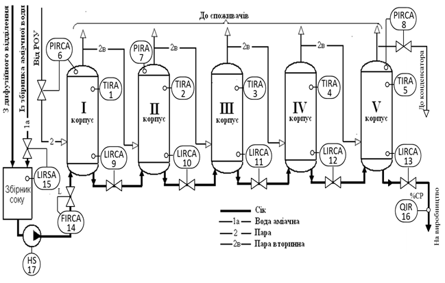

[8.7](8_7.md). Приклади оформлення контурів контролю і управління на схемах автоматизації <--- [Зміст](README.md) --> [Література](lit.md)

## 8.8. Приклад розроблення схеми автоматизації технологічних процесів та формування вимог до АРМу оператора

Розглянемо окремі етапи розроблення системи автоматизації на прикладі розроблення схеми автоматизації і формування основних вимог до АРМу оператора-технолога для багатокорпусної випарної станції (ВС) цукрового заводу.

### Опис технологічного процесу та технологічна схема 

Крім свого основного призначення - випаровування дифузійного соку до заданого значення вмісту сухих речовин при визначеній продуктивності цукрового заводу – випарна станція забезпечує вторинними соковими парами теплообмінну апаратуру цукрового заводу та котельну установку конденсатом для живлення котлів, а завод - аміачною водою для технологічних потреб. 

 Для випаровування соку використовується 5- корпусна випарна установка, яка дає змогу послідовно багаторазово використовувати пару, яка надходить на перший корпус (рис. 8.8).

Рис. 8.8. Технологічна схема 5- корпусної випарної установки

На випарній станції сік концентрується від 15-16 % до 65-70 % вмісту сухих речовин, який у подальшому переробляється у сироп на вакуум-апаратах. На випарну станцію сік надходить у перший корпус і послідовно переходить з корпуса в корпус. Другий корпус обігрівається соковою парою першого корпусу, третій - соковою парою другого і т. д. Для багаторазового використання гріючої пари, яка надходить у перший корпус, у наступних корпусах температура знижується завдяки поступово спадаючому тиску в надсоковому просторі апаратів.

Робота такої ВС має ряд переваг: зниження чутливості до змін витрати та концентрації соку, який надходить на випаровування; зменшення часу перебування соку в зонах високих температур внаслідок перенесення відборів пари з перших корпусів у останні, що зменшує приріст кольоровості соку при випаровуванні; зменшення тривалості варіння утфелю у вакуум-апаратах шляхом підвищення температури гріючої пари.

Оскільки процес випаровування неперервний, а кількість соку, який надходить та відбір сокової пари змінюється в часі, то підтримання оптимального режиму роботи ВС можливий тільки за умови автоматичного управління процесом випаровування. Оптимальним можна вважати режим, який забезпечує задану продуктивність ВС за умови стабілізації рівнів соку в корпусах випарних апаратів, що гарантує найкращі умови випаровування та безперебійне постачання споживачів соковою парою необхідного потенціалу.

### Формування загальних вимог до технологічного процесу.

Схема автоматизації повинна забезпечувати:

- контроль температури по корпусах;

- стабілізацію тиску сокової пари першого та другого корпусів випарної станції;

- стабілізацію розрідження в п’ятому корпусі;

- стабілізацію рівнів соку у випарних апаратах;

- стабілізацію витрати соку на ВС;

- подачу аміачної води в збірник соку перед ВС у разі критичного падіння в ньому рівня;

- контроль сухих речовин у сиропі, який передається на подальше перероблення.

Детальніше ці вимоги сформуємо у вигляді таблиці за формою, наведеною в табл. 8.1 (табл. 8.13).

*Таблиця 8.13.* Завдання на розроблення системи автоматизації

*Продовження табл. 8.13.*

 

### Розроблення спрощеної схеми автоматизації випарної станції

Контури контролю, регулювання та дискретного управління, які перелічені в завданні на автоматизацію, показано на спрощеній схемі автоматизації (рис. 8.9). Номери контурів збігаються з номером рядка в табл. 8.13. Контури 1-5 (позначені як TIRA1 – TIRA5), забезпечують контроль температури (*Т*) за корпусами з функціями: відображення (*I*), реєстрації (*R*) та сигналізації (A). Контур 6 (PIRCA6) крім функцій контролю тиску в першому корпусі, реалізує функцію регулювання тиску за рахунок зміни витрати ретурної пари на перший корпус. Контроль тиску в другому корпусі забезпечується контуром 7 (PIRA7), а розрідження в 5-му корпусі контролюється та стабілізується контуром 8 (PIRCA8) за рахунок зміни відбору пари на барометричний конденсатор, внаслідок чого створюється розрідження в корпусах випарної установки. Стабілізація рівнів за корпусами реалізується шляхом зміни витрати соку на стоці ("після себе") в контурах 9-13 (LIRCA9-LIRCA13). 14-й контур (FIRCA14) забезпечує контроль та стабілізацію витрату соку на перший корпус. 

Рис. 8.9. Спрощена схема автоматизації випарної станції

При низькому рівні соку в збірнику перед випарюванням, відкривається клапан подачі аміачної води. Ця функція дискретного управління позначена в контурі 15 через функціональну літеру *S* (включення/відключення). Те, що це відбувається при низькому рівні вказано уточнюючою літерою *L*, внизу і праворуч від позначення контуру LIRSA15.

На виході з установки контролюється густина сиропу (контур QIR16). Враховуючи, що літерою *Q* позначається будь-який якісний показник речовини, праворуч від позначення, у верхній частині вказано уточнюючу інформацію %CP (вміст сухих речовин).

Ручне управління насосом показано як контур дискретного управління HS17 (*H*-ручне, *S*- включення/відключення).

### Розроблення розгорнутої схеми автоматизації випарної станції

На базі завдання на розроблення схеми автоматизації, в якості яких можна розглядати інформацію, наведену в табл. 8.13, і спрощену схему автоматизації (див. рис. 8.9), можна розробити розгорнуту схему автоматизації, на якій будуть показані вже конкретні технічні засоби та їхній взаємний зв’язок.

На рис. 8.10 показано розгорнуту схему автоматизації, при створенні якої використовувалися приклади і специфікації, наведені в табл. 8.11 і 8.12.

Рис. 8.10. Розгорнута схема автоматизації 5- корпусної випарної станції

Контури контролю температури (1, 2, 3, 4, 5) реалізовані за аналогією з прикладом 9. У контурі використовується термометр опору (*ТЕ*) з вбудованим перетворювачем в уніфікований електричний сигнал (*ТТ*), який підключається до аналогового сигналу мікропроцесорного контролера (точка на лінії входу аналогового ВА на ПЛК). З ПЛК ця інформація передається на АРМ оператора-технолога, а саме - на екран мнемосхеми (перетин з лінією *I* - відображення), записується в пам'ять (перетин з лінією *R* – реєстрація) з подальшою можливістю перегляду трендів її зміни в часі, а також на підсистему тривог (перетин з лінією *А* – сигналізація) для виведення на АРМі оператора повідомлення тривоги, якщо значення температури вийде за встановлені межі.

Контури автоматичного контрою і регулювання рівнів у корпусах випарної установки (контури 9, 10, 11, 12 і 13) реалізуються за аналогією з прикладом 16 для зображення буйкового рівнеміра і прикладу 49а для керування аналоговим пневматичним виконавчим механізмом. Для вимірювання рівня в контурі використовується буйковий рівнемір (*LE*) з вбудованим перетворювачем в уніфікований електричний сигнал (*LT*), який подається на аналогові входи контролера (*ВА*). Ця інформація надходить у блок автоматичного регулятора контролера (перетин з *С* – автоматичне регулювання), а також на АРМ оператора-технолога, в якому значення рівнів виводяться на екран комп’ютера (перетин з *I*) у вигляді стовпчикових діаграм і записується в пам'ять (*R* - реєструються з подальшою можливістю перегляду трендів). Крім того, формується сигнал тривоги (перетин з *А*) у випадку, якщо значення рівнів виходить за встановлені межі. Управляючий сигнал, який виробляється контролером, виводиться з відповідних аналогових виходів контролера (*АВ*) у вигляді уніфікованого електричного сигналу. Пропонується вибрати пневматичні виконавчі механізми. Сигнал від контролера подається на електро-пневмоперетворювач (наприклад *LY* 9б), який перетворює аналоговий уніфікований електричний сигнал на пневматичний уніфікований сигнал. Той, у свою чергу, через виконавчий механізм (наприклад 9в) змінює положення регулюючих клапанів. Оператор може управляти положенням регулюючого органу в дистанційному (ручному) режимі (перетин з *С* – дистанційне управління з АРМа оператора). 

Контур контролю і регулювання подачі соку на випарну станцію (контур 14) реалізований за аналогією з прикладом 25, де використовується індукційний витратомір.

Реалізація контуру 15 (контроль та управління рівнем у збірнику соку), виконана за аналогією з прикладами 17 і 44а, де використовуються гідростатичний рівнемір (15а) і електричний дискретний клапан (15б). Для зображення контуру 16 – контроль сухих речовин, вибраний приклад 31, у якому використано автоматичний рефрактометр.

Контур управління насосом подачі соку реалізований за аналогією з прикладом 46, у якому показано, що для включення-відключення насоса використовується магнітний пускач (*NS*), яким можна керувати автоматично з контролера (перетин з *S* на ПЛК), дистанційно з АРМа оператора технолога (перетин з *S* на АРМ) і зі щита оператора (*HS* – перемикач режиму, *H* – кнопки на щиті).

### Розроблення вимог до структури системи управління та АРМа оператора 

Для розроблення системи управління та АРМів оператора повинні бути сформовані функціональні вимоги щодо функціонування. Нижче наведено приклад вимог до структури АСУТП випарної станції та АРМів операторів. 

Структура системи управління повинна базуватися на ПЛК, при виборі якого враховується наявність контролерів такого ж типу на даному підприємстві. АРМ оператора повинен бути розроблений з використанням програм SCADA, які використовуються на даному заводі з передачею вихідного проекту на підприємство. 

SCADA-система повинна базуватися на клієнт-серверній структурі, з можливістю підключення 2-х клієнтів: одне робоче місце в операторській (АРМ оператора випарної установки), друге – в кабінеті головного теплотехніка (АРМ теплотехніка). АРМ теплотехніка повинен мати можливість тільки перегляду, тобто без можливості втручання в процес управління. SCADA-система повинна бути реалізована з використанням резервування – при виході основного сервера, його функції повинен взяти на себе резервний. 

Людино-машинний інтерфейс повинен забезпечити перегляд дисплейних мнемосхем процесу та інших сторінок для аналізу, налаштування та діагностики процесу й системи. Орієнтовний перелік сторінок наведений у табл. 8.14.

На всіх сторінках повинні бути передбачені:

-    кнопки меню для швидкого переходу на всі інші сторінки;

-    вікно з останніми активними або непідтвердженими тривогами.

*Таблиця 8.14* Перелік сторінок АРМа оператора-технолога

 

До головної мнемосхеми можна сформулювати такі вимоги:

-    вигляд мнемосхеми повинен відображати спрощену технологічну схему випарної станції з указаними на ній значеннями вимірювальних параметрів та регулюючих органів;

-    фон сторінки повинен бути світло-сірим;

-    на мнемосхемі повинні бути відображені всі змінні позначені літерою *I* на схемі автоматизації (див. рис. 8.10);

-    рівні в корпусах випарної станції необхідно відобразити у вигляді стовпчикових діаграм з обов’язковим зображенням на них заданого та числового значення рівня; 

-    колір стовпчикової діаграми в нормальному стані – білий, у попереджувальному значенні – жовтий, в аварійному – червоний;

-    усі інші аналогові параметри показуються у вигляді цифрових приладів, колір фону в яких змінюється. Якщо значення параметрів перебуває у встановлених межах, то фон вибирається з темних гам кольору (для різних технологічних параметрів він повинен відрізнятися). У попереджувальному значенні фон – жовтий, в аварійному – червоний;

- біля зображення аналогових регулюючих органів (РО) повинно бути показано:

  - положення РО у відсотках;

  - відображення режиму управління ним: ручний (дистанційний) або автоматичний. Біля зображення РО, що знаходяться в ручному (дистанційному) режимі повинен бути напис «РУЧ»;

  - для РО типу відкрито/закрито положення «відкрито» повинно показуватися білим кольором, «закрито» – темно-сірим;

  - у випадку аварійного відключення двигуна насоса його колір змінюється на червоний; 

-    доступ до сторінок налагодження контурів регулювання повинен відбуватися шляхом натискання на зображення РО, який реалізує керуючу дію.

Один із варіантів основної мнемосхеми для 5- корпусної випарної установки, яка відповідає сформованим вище вимогам наведено на рис. 8.11.

Рис. 8.11. Основна мнемосхема 5- корпусної випарної установки

На сторінках переглядачів трендів повинні бути доступні:

-       перегляд тренду для всіх змінних процесу, що позначені на схемі автоматизації з функцією реєстрації (функція *R* на рис.8.10);

-       перегляд значень усіх уставок регуляторів;

-       перегляд значення режиму ручний/автомат усіх контурів управління;

-       відображення тренда іншим кольором або типом лінії, якщо дані в цей момент були недоступні (з ознакою недостовірності);

-       можливість переключення в режим реального часу та історичний режим з можливістю вибору початкової дати перегляду;

-       можливість добавлення в переглядач нових кривих та збереження набору кривих для швидкого їх виклику;

-       друкування тренду на принтері АРМу.

На сторінках переглядачів повідомлень тривог та подій для відображення аналогових та дискретних тривог, для змінних позначених літерою *А* на схемі автоматизації (див. рис. 8.10) повинні бути передбачені:

-       можливість підтвердження вибраної тривоги – квитування;

-       перегляд тривог у вигляді зведення;

-       непідтверджені тривоги повинні миготіти і супроводжуватися звуковим сигналом динаміка ПК до моменту їх квитування;

-       кольорова гама тривог різного класу повинна відрізнятися: аварійні – червоно-жовті кольори, попереджувальні – жовто-помаранчеві, системні – фіолетово-рожеві.

**Формування вимог до системи автоматизації в цілому, в тому числі до схеми автоматизації і АРМу оператора-технолога, перебувають у колі професійних інтересів як спеціалістів у галузі автоматизації, так і технологів, які повинні працювати сумісно. Саме тому до компетенції сучасного інженера-технолога входить уміння працювати з цими документами, хоча б на рівні наведеного вище прикладу.**

[8.7](8_7.md). Приклади оформлення контурів контролю і управління на схемах автоматизації <--- [Зміст](README.md) --> [Література](lit.md)